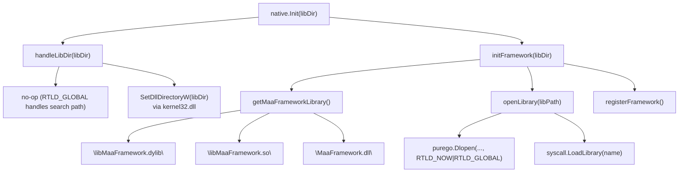
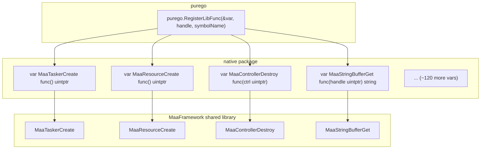
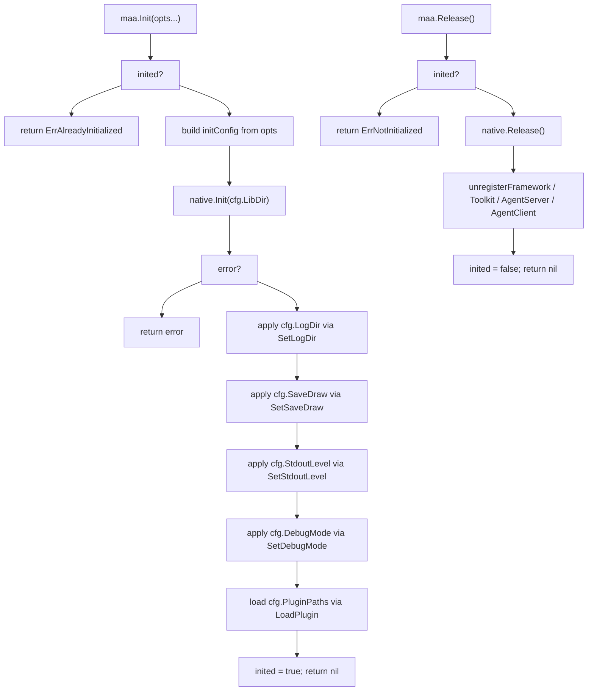

# Native FFI Integration

Relevant source files

* [README.md](https://github.com/MaaXYZ/maa-framework-go/blob/5f9c965c/README.md?plain=1)
* [README\_zh.md](https://github.com/MaaXYZ/maa-framework-go/blob/5f9c965c/README_zh.md?plain=1)
* [controller.go](https://github.com/MaaXYZ/maa-framework-go/blob/5f9c965c/controller.go)
* [examples/custom-action/main.go](https://github.com/MaaXYZ/maa-framework-go/blob/5f9c965c/examples/custom-action/main.go)
* [examples/quick-start/main.go](https://github.com/MaaXYZ/maa-framework-go/blob/5f9c965c/examples/quick-start/main.go)
* [internal/native/framework.go](https://github.com/MaaXYZ/maa-framework-go/blob/5f9c965c/internal/native/framework.go)
* [version.go](https://github.com/MaaXYZ/maa-framework-go/blob/5f9c965c/version.go)
* [version\_test.go](https://github.com/MaaXYZ/maa-framework-go/blob/5f9c965c/version_test.go)

This page covers the internal mechanics by which `maa-framework-go` loads the MaaFramework shared library at runtime and binds all native C functions to Go function variables using `purego` — with **no Cgo**. The scope is the `internal/native` package and the public `maa.Init` / `maa.Release` lifecycle that drives it.

For details on how Go callback functions are marshalled back across the FFI boundary (e.g. custom actions and recognition callbacks), see [Callback and FFI Bridge Architecture](/MaaXYZ/maa-framework-go/7.3-callback-and-ffi-bridge-architecture). For buffer types that use these native functions internally, see [Buffer and Data Exchange](/MaaXYZ/maa-framework-go/7.2-buffer-and-data-exchange).

---

## Overview

MaaFramework is distributed as a platform-native shared library (`.so` / `.dylib` / `.dll`). Rather than linking at compile time with Cgo, this binding uses [`purego`](https://github.com/MaaXYZ/maa-framework-go/blob/5f9c965c/`purego`) to:

1. **Open** the shared library handle at runtime (`dlopen` / `LoadLibrary`).
2. **Bind** each native symbol to a Go function variable via `purego.RegisterLibFunc`.
3. **Call** those Go variables as if they were ordinary Go functions.

All binding logic lives in the `internal/native` package. The public surface is `maa.Init()` and `maa.Release()` in `maa.go`.

---

## Platform-Specific Library Loading

The `internal/native` package uses build tags to provide platform-specific implementations of three functions: `handleLibDir`, `openLibrary`, and `unloadLibrary`.

**Library loading — platform dispatch diagram**



Sources: [internal/native/native\_unix.go1-18](https://github.com/MaaXYZ/maa-framework-go/blob/5f9c965c/internal/native/native_unix.go#L1-L18) [internal/native/native\_windows.go1-38](https://github.com/MaaXYZ/maa-framework-go/blob/5f9c965c/internal/native/native_windows.go#L1-L38) [internal/native/framework.go336-368](https://github.com/MaaXYZ/maa-framework-go/blob/5f9c965c/internal/native/framework.go#L336-L368)

### Platform Behavior

| Platform | `handleLibDir` | `openLibrary` | `unloadLibrary` |
| --- | --- | --- | --- |
| Linux / macOS | no-op | `purego.Dlopen` with `RTLD_NOW | RTLD_GLOBAL` | `purego.Dlclose` |
| Windows | `SetDllDirectoryW(libDir)` via `kernel32.dll` | `syscall.LoadLibrary` | `syscall.FreeLibrary` |

On Windows, `handleLibDir` is called first so that the OS DLL search path is updated before `LoadLibrary` is called. On Unix, `RTLD_GLOBAL` makes symbols available to subsequently loaded libraries without needing a directory tweak.

Sources: [internal/native/native\_unix.go7-18](https://github.com/MaaXYZ/maa-framework-go/blob/5f9c965c/internal/native/native_unix.go#L7-L18) [internal/native/native\_windows.go11-38](https://github.com/MaaXYZ/maa-framework-go/blob/5f9c965c/internal/native/native_windows.go#L11-L38)

---

## Library Initialization Sequence

Four libraries are loaded in sequence inside `native.Init`:

```mermaid
sequenceDiagram
  participant maa.Init()
  participant native.Init()
  participant handleLibDir()
  participant initFramework()
  participant initToolkit()
  participant initAgentServer()
  participant initAgentClient()

  maa.Init()->>native.Init(): "Init(libDir)"
  native.Init()->>handleLibDir(): "handleLibDir(libDir)"
  handleLibDir()-->>native.Init(): "ok"
  native.Init()->>initFramework(): "initFramework(libDir)"
  initFramework()-->>native.Init(): "handle stored in maaFramework"
  native.Init()->>initToolkit(): "initToolkit(libDir)"
  initToolkit()-->>native.Init(): "ok"
  native.Init()->>initAgentServer(): "initAgentServer(libDir)"
  initAgentServer()-->>native.Init(): "ok"
  native.Init()->>initAgentClient(): "initAgentClient(libDir)"
  initAgentClient()-->>native.Init(): "ok"
  native.Init()-->>maa.Init(): "nil or error"
```

Sources: [internal/native/native.go5-26](https://github.com/MaaXYZ/maa-framework-go/blob/5f9c965c/internal/native/native.go#L5-L26)

Each `initXxx` function follows the same pattern as `initFramework`:

1. Resolve the platform-specific library filename.
2. Call `openLibrary(libPath)` to get a handle.
3. Store the handle in a package-level `uintptr` variable.
4. Call the corresponding `registerXxx()` function.

---

## `initFramework` and `registerFramework`

`initFramework` in [internal/native/framework.go336-354](https://github.com/MaaXYZ/maa-framework-go/blob/5f9c965c/internal/native/framework.go#L336-L354) is the entry point for the core MaaFramework library. After a successful `openLibrary`, the handle is saved to the package-level variable `maaFramework` and `registerFramework()` is called.

`registerFramework` [internal/native/framework.go369-531](https://github.com/MaaXYZ/maa-framework-go/blob/5f9c965c/internal/native/framework.go#L369-L531) calls `purego.RegisterLibFunc` for every native symbol. Each call binds a named export from the loaded library handle to a Go function-pointer variable:

```
purego.RegisterLibFunc(&MaaTaskerCreate, maaFramework, "MaaTaskerCreate")
```

This overwrites the function variable so that subsequent calls to `native.MaaTaskerCreate()` dispatch through the FFI to the native function.

**Symbol registration diagram**



Sources: [internal/native/framework.go369-531](https://github.com/MaaXYZ/maa-framework-go/blob/5f9c965c/internal/native/framework.go#L369-L531)

---

## Declared Function Variables by Category

All native bindings are declared as package-level `var` blocks in `internal/native/framework.go`. The following table summarises the groupings:

| Category | Representative Variables | Count (approx.) |
| --- | --- | --- |
| **Global** | `MaaVersion`, `MaaGlobalSetOption`, `MaaGlobalLoadPlugin` | 3 |
| **Tasker** | `MaaTaskerCreate`, `MaaTaskerPostTask`, `MaaTaskerGetRecognitionDetail`, … | 30 |
| **Resource** | `MaaResourceCreate`, `MaaResourcePostBundle`, `MaaResourceRegisterCustomAction`, … | 28 |
| **Controller** | `MaaAdbControllerCreate`, `MaaControllerPostClick`, `MaaControllerGetResolution`, … | 34 |
| **Context** | `MaaContextRunTask`, `MaaContextOverridePipeline`, `MaaContextGetHitCount`, … | 14 |
| **StringBuffer** | `MaaStringBufferCreate`, `MaaStringBufferGet`, `MaaStringBufferSet`, … | 8 |
| **StringListBuffer** | `MaaStringListBufferCreate`, `MaaStringListBufferAt`, … | 8 |
| **ImageBuffer** | `MaaImageBufferCreate`, `MaaImageBufferGetRawData`, `MaaImageBufferSetRawData`, … | 12 |
| **ImageListBuffer** | `MaaImageListBufferCreate`, `MaaImageListBufferAt`, … | 8 |
| **RectBuffer** | `MaaRectCreate`, `MaaRectGetX`, `MaaRectSet`, … | 7 |

Sources: [internal/native/framework.go14-285](https://github.com/MaaXYZ/maa-framework-go/blob/5f9c965c/internal/native/framework.go#L14-L285)

---

## Callback Type Declarations

Beyond plain function variables, the package also declares Go `func` types that mirror the C callback signatures expected by the framework. These are used when registering event sinks and custom handlers:

| Type | Signature | Used for |
| --- | --- | --- |
| `MaaEventCallback` | `func(handle uintptr, message, detailsJson *byte, transArg uintptr) uintptr` | Event sinks (Tasker, Resource, Controller) |
| `MaaCustomRecognitionCallback` | `func(context uintptr, taskId int64, ..., outBox, outDetail uintptr) uintptr` | Custom recognition dispatch |
| `MaaCustomActionCallback` | `func(context uintptr, taskId int64, ..., box, transArg uintptr) uintptr` | Custom action dispatch |

Sources: [internal/native/framework.go18](https://github.com/MaaXYZ/maa-framework-go/blob/5f9c965c/internal/native/framework.go#L18-L18) [internal/native/framework.go54-56](https://github.com/MaaXYZ/maa-framework-go/blob/5f9c965c/internal/native/framework.go#L54-L56)

These types are passed to `purego.NewCallback` in the callback bridge layer. See [Callback and FFI Bridge Architecture](/MaaXYZ/maa-framework-go/7.3-callback-and-ffi-bridge-architecture) for details.

---

## Constant and Enum Types

The `internal/native` package also declares the integer constant types that map directly to the C enumerations in MaaFramework:

| Go Type | C Equivalent | Values |
| --- | --- | --- |
| `MaaGlobalOption` | `MaaGlobalOption` | `_LogDir`, `_SaveDraw`, `_StdoutLevel`, `_DebugMode`, `_SaveOnError`, `_DrawQuality`, `_RecoImageCacheLimit` |
| `MaaTaskerOption` | `MaaTaskerOption` | (opaque `int32`) |
| `MaaResOption` | `MaaResOption` | `_Invalid`, `_InferenceDevice`, `_InferenceExecutionProvider` |
| `MaaCtrlOption` | `MaaCtrlOption` | `_Invalid`, `_ScreenshotTargetLongSide`, `_ScreenshotTargetShortSide`, `_ScreenshotUseRawSize` |
| `MaaInferenceDevice` | `MaaInferenceDevice` | `_CPU (-2)`, `_Auto (-1)`, `_0`, `_1`, … |
| `MaaInferenceExecutionProvider` | `MaaInferenceExecutionProvider` | `_Auto`, `_CPU`, `_DirectML`, `_CoreML`, `_CUDA` |
| `MaaGamepadType` | `MaaGamepadType` | `_Xbox360`, `_DualShock4` |

Sources: [internal/native/framework.go58-112](https://github.com/MaaXYZ/maa-framework-go/blob/5f9c965c/internal/native/framework.go#L58-L112) [internal/native/framework.go147-170](https://github.com/MaaXYZ/maa-framework-go/blob/5f9c965c/internal/native/framework.go#L147-L170) [internal/native/framework.go287-329](https://github.com/MaaXYZ/maa-framework-go/blob/5f9c965c/internal/native/framework.go#L287-L329)

---

## Public Lifecycle: `maa.Init` and `maa.Release`

The `internal/native` package is internal; all external consumers use `maa.Init()` and `maa.Release()` from `maa.go`.

**Init/Release flow**



Sources: [maa.go118-196](https://github.com/MaaXYZ/maa-framework-go/blob/5f9c965c/maa.go#L118-L196)

### `InitOption` Functional Options

`maa.Init` accepts variadic `InitOption` values that populate an `initConfig` struct before `native.Init` is called:

| Option function | Field set | Effect |
| --- | --- | --- |
| `WithLibDir(libDir)` | `cfg.LibDir` | Directory containing the shared libraries |
| `WithLogDir(logDir)` | `cfg.LogDir` | Calls `MaaGlobalSetOption(MaaGlobalOption_LogDir, ...)` |
| `WithSaveDraw(enabled)` | `cfg.SaveDraw` | Calls `MaaGlobalSetOption(MaaGlobalOption_SaveDraw, ...)` |
| `WithStdoutLevel(level)` | `cfg.StdoutLevel` | Calls `MaaGlobalSetOption(MaaGlobalOption_StdoutLevel, ...)` |
| `WithDebugMode(enabled)` | `cfg.DebugMode` | Calls `MaaGlobalSetOption(MaaGlobalOption_DebugMode, ...)` |
| `WithPluginPaths(paths...)` | `cfg.PluginPaths` | Calls `MaaGlobalLoadPlugin` for each path |

Sources: [maa.go64-113](https://github.com/MaaXYZ/maa-framework-go/blob/5f9c965c/maa.go#L64-L113)

### `inited` Guard

The package-level `inited bool` variable in `maa.go` [maa.go11](https://github.com/MaaXYZ/maa-framework-go/blob/5f9c965c/maa.go#L11-L11) enforces a singleton constraint. Calling `maa.Init` when already initialized returns `ErrAlreadyInitialized`; calling `maa.Release` before `Init` returns `ErrNotInitialized`. If any post-library-load option application fails, a deferred cleanup calls `native.Release()` before returning the error, ensuring no partially-initialized state is left behind [maa.go134-139](https://github.com/MaaXYZ/maa-framework-go/blob/5f9c965c/maa.go#L134-L139)

---

## Error Handling on Load Failure

If `openLibrary` fails, `initFramework` wraps the OS error in a `LibraryLoadError` struct [internal/native/framework.go342-347](https://github.com/MaaXYZ/maa-framework-go/blob/5f9c965c/internal/native/framework.go#L342-L347) This struct (re-exported at the `maa` package level as `LibraryLoadError`) carries:

* `LibraryName` — human-readable name (e.g. `"MaaFramework"`)
* `LibraryPath` — full filesystem path that was attempted
* `Err` — the underlying OS error

Sources: [maa.go29](https://github.com/MaaXYZ/maa-framework-go/blob/5f9c965c/maa.go#L29-L29) [internal/native/framework.go336-354](https://github.com/MaaXYZ/maa-framework-go/blob/5f9c965c/internal/native/framework.go#L336-L354)

---

## Intentionally Omitted Bindings

Two categories of native functions are deliberately not bound:

| Omitted symbol(s) | Reason |
| --- | --- |
| `MaaDbgControllerCreate`, `MaaDbgControllerType` | Go binding provides `CarouselImageController` and `BlankController` instead (see [Custom Controllers](/MaaXYZ/maa-framework-go/5.3-custom-controllers)) |
| `MaaImageBufferGetEncoded`, `MaaImageBufferGetEncodedSize`, `MaaImageBufferSetEncoded` | Go handles image encoding natively via `image/png`, `image/jpeg`, etc. (see [Buffer and Data Exchange](/MaaXYZ/maa-framework-go/7.2-buffer-and-data-exchange)) |

Sources: [internal/native/framework.go172-174](https://github.com/MaaXYZ/maa-framework-go/blob/5f9c965c/internal/native/framework.go#L172-L174) [internal/native/framework.go265-267](https://github.com/MaaXYZ/maa-framework-go/blob/5f9c965c/internal/native/framework.go#L265-L267)