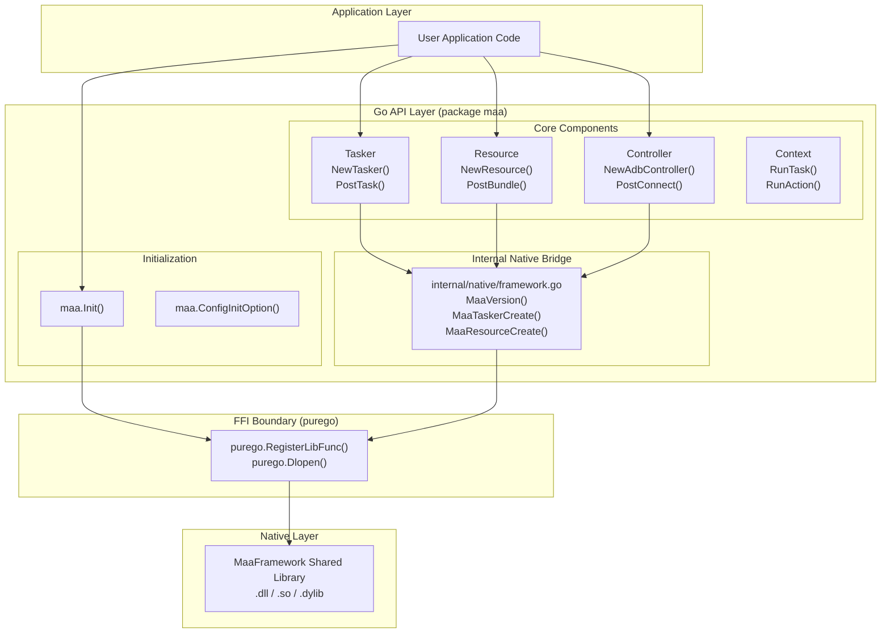
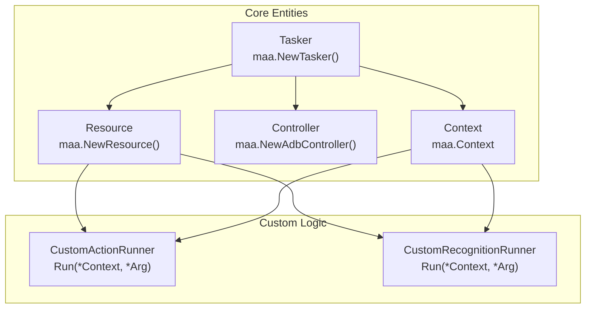

# Overview

Relevant source files

* [README.md](https://github.com/MaaXYZ/maa-framework-go/blob/7a918a74/README.md?plain=1)
* [README\_zh.md](https://github.com/MaaXYZ/maa-framework-go/blob/7a918a74/README_zh.md?plain=1)
* [examples/custom-action/main.go](https://github.com/MaaXYZ/maa-framework-go/blob/7a918a74/examples/custom-action/main.go)
* [examples/quick-start/main.go](https://github.com/MaaXYZ/maa-framework-go/blob/7a918a74/examples/quick-start/main.go)
* [go.mod](https://github.com/MaaXYZ/maa-framework-go/blob/7a918a74/go.mod)
* [go.sum](https://github.com/MaaXYZ/maa-framework-go/blob/7a918a74/go.sum)
* [internal/jsoncodec/jsoncodec.go](https://github.com/MaaXYZ/maa-framework-go/blob/7a918a74/internal/jsoncodec/jsoncodec.go)
* [internal/target/target.go](https://github.com/MaaXYZ/maa-framework-go/blob/7a918a74/internal/target/target.go)
* [json\_codec.go](https://github.com/MaaXYZ/maa-framework-go/blob/7a918a74/json_codec.go)
* [json\_codec\_test.go](https://github.com/MaaXYZ/maa-framework-go/blob/7a918a74/json_codec_test.go)
* [maa.go](https://github.com/MaaXYZ/maa-framework-go/blob/7a918a74/maa.go)
* [pipeline.go](https://github.com/MaaXYZ/maa-framework-go/blob/7a918a74/pipeline.go)

## Purpose and Scope

This document introduces **maa-framework-go**, a Go binding for the [MaaFramework](https://github.com/MaaXYZ/maa-framework-go/blob/7a918a74/MaaFramework) automation testing library. It covers the library's purpose, key features, high-level architecture, and core component relationships. This page serves as a technical entry point for developers looking to integrate MaaFramework's image recognition and automation capabilities into Go applications.

**Sources**: [README.md1-191](https://github.com/MaaXYZ/maa-framework-go/blob/7a918a74/README.md?plain=1#L1-L191) [go.mod1-15](https://github.com/MaaXYZ/maa-framework-go/blob/7a918a74/go.mod#L1-L15)

## What is maa-framework-go?

`maa-framework-go` is a cross-platform automation testing framework binding based on image recognition. It provides idiomatic Go interfaces to MaaFramework's capabilities, enabling developers to build automation solutions for Android, Windows, macOS, and Linux platforms.

The binding implements a **No CGO** architecture using the [purego](https://github.com/MaaXYZ/maa-framework-go/blob/7a918a74/purego) library for foreign function interface (FFI) integration [README.md38](https://github.com/MaaXYZ/maa-framework-go/blob/7a918a74/README.md?plain=1#L38-L38) This design eliminates CGO's cross-compilation complexity and runtime dependencies while maintaining full access to native MaaFramework capabilities.

**Target Platforms**:

* **Android**: Devices via ADB.
* **Windows**: Desktop applications via Win32 API.
* **macOS**: Applications, including iOS apps via PlayCover.
* **Linux**: Wayland compositors via WlRoots.

**Sources**: [README.md36-51](https://github.com/MaaXYZ/maa-framework-go/blob/7a918a74/README.md?plain=1#L36-L51) [README\_zh.md36-51](https://github.com/MaaXYZ/maa-framework-go/blob/7a918a74/README_zh.md?plain=1#L36-L51) [go.mod6](https://github.com/MaaXYZ/maa-framework-go/blob/7a918a74/go.mod#L6-L6)

## Key Features

| Feature Category | Capabilities |
| --- | --- |
| **Device Control** | `NewAdbController`, `NewWin32Controller`, `NewPlayCoverController`, `NewWlRootsController`, `NewGamepadController` |
| **Image Recognition** | Template matching, OCR, feature detection, color matching, neural networks |
| **Custom Logic** | `CustomActionRunner` interface, `CustomRecognitionRunner` interface, `CustomController` interface |
| **Task Definition** | Pipeline-based workflow with JSON/JSONC configuration |
| **Extensibility** | `AgentClient` and `AgentServer` for mounting custom logic from external processes |
| **No CGO** | Pure Go implementation via `purego` FFI library |

**Sources**: [README.md40-50](https://github.com/MaaXYZ/maa-framework-go/blob/7a918a74/README.md?plain=1#L40-L50) [examples/custom-action/main.go71-75](https://github.com/MaaXYZ/maa-framework-go/blob/7a918a74/examples/custom-action/main.go#L71-L75)

## System Architecture

The following diagram illustrates the layered architecture of maa-framework-go, bridging high-level Go code to the native binary layer.

**Architecture: From Go to Native**

**Architecture Layers**:

1. **Application Layer**: User code that consumes the `maa` package API.
2. **Go API Layer**: Pure Go interfaces organized into core components (`Tasker`, `Resource`, `Controller`, `Context`).
3. **Internal Native Bridge**: Located in `internal/native`, this layer defines the Go signatures for native C functions.
4. **FFI Boundary**: Uses `purego` to dynamically load MaaFramework and map Go function variables to native symbols at runtime.
5. **Native Layer**: The pre-compiled MaaFramework C++ library.

**Sources**: [README.md36-38](https://github.com/MaaXYZ/maa-framework-go/blob/7a918a74/README.md?plain=1#L36-L38) [go.mod6](https://github.com/MaaXYZ/maa-framework-go/blob/7a918a74/go.mod#L6-L6) [examples/quick-start/main.go10-64](https://github.com/MaaXYZ/maa-framework-go/blob/7a918a74/examples/quick-start/main.go#L10-L64) [maa.go158-160](https://github.com/MaaXYZ/maa-framework-go/blob/7a918a74/maa.go#L158-L160)

## Core Components (Controller-Resource-Tasker Pattern)

The library is built around four primary components that orchestrate the automation lifecycle:

**Entity Relationship: Tasker Orchestration**

### Component Descriptions

| Component | Purpose | Key Operations |
| --- | --- | --- |
| **Tasker** | The central orchestrator. It holds the connection between a device (Controller) and assets (Resource) [examples/quick-start/main.go16-56](https://github.com/MaaXYZ/maa-framework-go/blob/7a918a74/examples/quick-start/main.go#L16-L56) | `BindController`, `BindResource`, `PostTask` |
| **Resource** | Manages pipelines, images, and OCR models. Handles registration of custom algorithms [examples/custom-action/main.go45-61](https://github.com/MaaXYZ/maa-framework-go/blob/7a918a74/examples/custom-action/main.go#L45-L61) | `PostBundle`, `RegisterCustomAction`, `RegisterCustomRecognition` |
| **Controller** | Handles device interaction (screencaps and inputs). Supports ADB, Win32, etc [examples/quick-start/main.go29-43](https://github.com/MaaXYZ/maa-framework-go/blob/7a918a74/examples/quick-start/main.go#L29-L43) | `PostConnect`, `PostClick`, `PostSwipe` |
| **Context** | Provided to custom actions/recognitions at runtime to allow them to interact with the framework [examples/custom-action/main.go73-75](https://github.com/MaaXYZ/maa-framework-go/blob/7a918a74/examples/custom-action/main.go#L73-L75) | `RunTask`, `RunAction`, `GetTasker` |

**Sources**: [README.md107-155](https://github.com/MaaXYZ/maa-framework-go/blob/7a918a74/README.md?plain=1#L107-L155) [examples/quick-start/main.go16-64](https://github.com/MaaXYZ/maa-framework-go/blob/7a918a74/examples/quick-start/main.go#L16-L64) [examples/custom-action/main.go58-75](https://github.com/MaaXYZ/maa-framework-go/blob/7a918a74/examples/custom-action/main.go#L58-L75)

## FFI Architecture (Pure Go Approach)

A key differentiator of `maa-framework-go` is its **No CGO** requirement [README.md38](https://github.com/MaaXYZ/maa-framework-go/blob/7a918a74/README.md?plain=1#L38-L38) It uses `purego` to load the MaaFramework dynamic library at runtime.

1. **Library Loading**: The user calls `maa.Init()` [maa.go146](https://github.com/MaaXYZ/maa-framework-go/blob/7a918a74/maa.go#L146-L146) This triggers `native.Init` which uses `purego.Dlopen` on the platform-specific library [maa.go158](https://github.com/MaaXYZ/maa-framework-go/blob/7a918a74/maa.go#L158-L158)
2. **Function Mapping**: Native symbols are mapped to Go variables within the `internal/native` package.
3. **Initialization Options**: Users can specify the library path using `maa.WithLibDir` [maa.go77-81](https://github.com/MaaXYZ/maa-framework-go/blob/7a918a74/maa.go#L77-L81) or configure global options like `WithLogDir` [maa.go85-89](https://github.com/MaaXYZ/maa-framework-go/blob/7a918a74/maa.go#L85-L89) and `WithDebugMode` [maa.go108-114](https://github.com/MaaXYZ/maa-framework-go/blob/7a918a74/maa.go#L108-L114)
4. **JSON Codec**: The framework allows overriding the default JSON encoder and decoder via `SetJSONEncoder` and `SetJSONDecoder` [json\_codec.go12-19](https://github.com/MaaXYZ/maa-framework-go/blob/7a918a74/json_codec.go#L12-L19) which is used for serializing pipeline data and task details [pipeline.go29-31](https://github.com/MaaXYZ/maa-framework-go/blob/7a918a74/pipeline.go#L29-L31)

**Sources**: [README.md38-39](https://github.com/MaaXYZ/maa-framework-go/blob/7a918a74/README.md?plain=1#L38-L39) [README.md73-88](https://github.com/MaaXYZ/maa-framework-go/blob/7a918a74/README.md?plain=1#L73-L88) [maa.go146-209](https://github.com/MaaXYZ/maa-framework-go/blob/7a918a74/maa.go#L146-L209) [json\_codec.go1-43](https://github.com/MaaXYZ/maa-framework-go/blob/7a918a74/json_codec.go#L1-L43)

## Typical Workflow

A standard implementation follows these steps:

1. **Initialize**: Call `maa.Init()` and `maa.ConfigInitOption()` [examples/quick-start/main.go11-15](https://github.com/MaaXYZ/maa-framework-go/blob/7a918a74/examples/quick-start/main.go#L11-L15)
2. **Create Tasker**: Initialize a new `Tasker` instance [examples/quick-start/main.go16-21](https://github.com/MaaXYZ/maa-framework-go/blob/7a918a74/examples/quick-start/main.go#L16-L21)
3. **Connect Controller**: Find a device (e.g., via `maa.FindAdbDevices`) and create a controller [examples/quick-start/main.go23-43](https://github.com/MaaXYZ/maa-framework-go/blob/7a918a74/examples/quick-start/main.go#L23-L43)
4. **Load Resources**: Create a `Resource` instance and load a bundle via `PostBundle` [examples/quick-start/main.go45-52](https://github.com/MaaXYZ/maa-framework-go/blob/7a918a74/examples/quick-start/main.go#L45-L52)
5. **Execute**: Use `tasker.PostTask("TaskName")` and `Wait()` for completion [examples/quick-start/main.go58-63](https://github.com/MaaXYZ/maa-framework-go/blob/7a918a74/examples/quick-start/main.go#L58-L63)

**Sources**: [examples/quick-start/main.go10-64](https://github.com/MaaXYZ/maa-framework-go/blob/7a918a74/examples/quick-start/main.go#L10-L64) [README.md91-156](https://github.com/MaaXYZ/maa-framework-go/blob/7a918a74/README.md?plain=1#L91-L156)