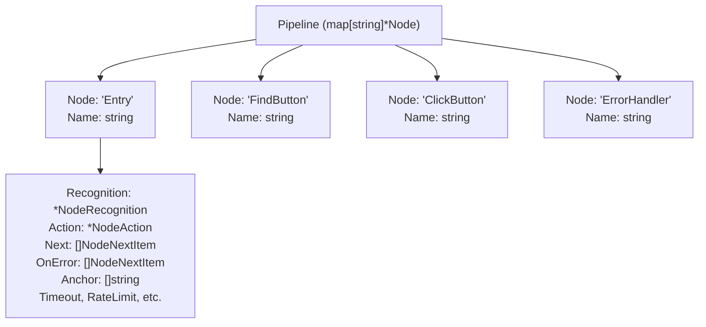
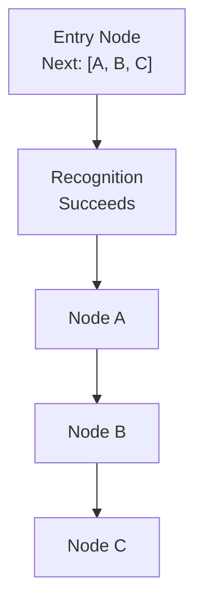
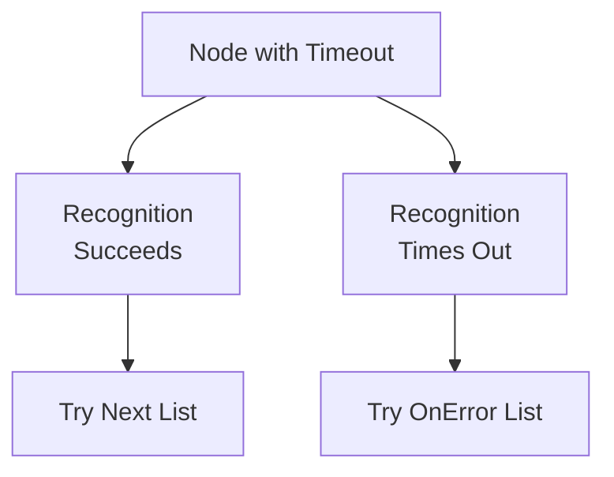
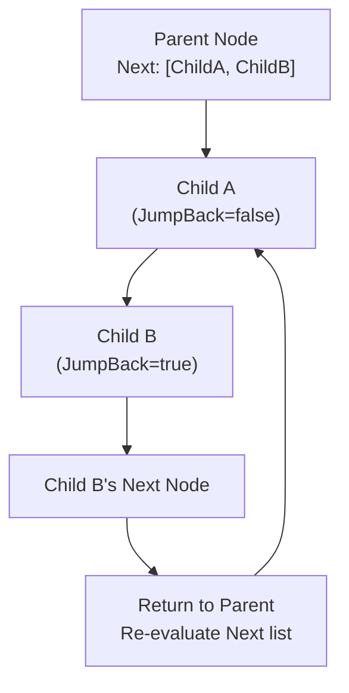
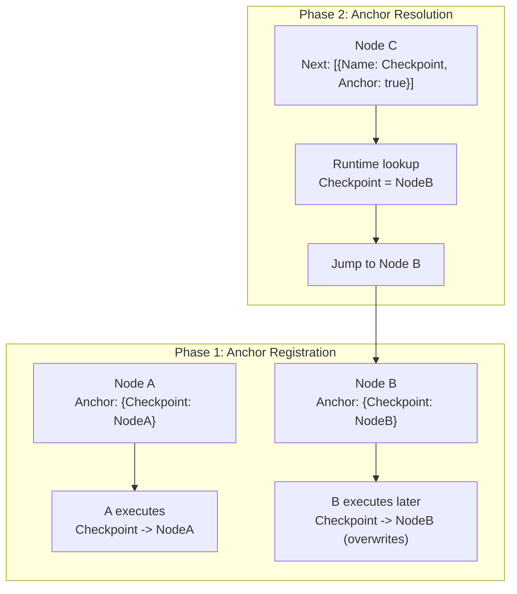
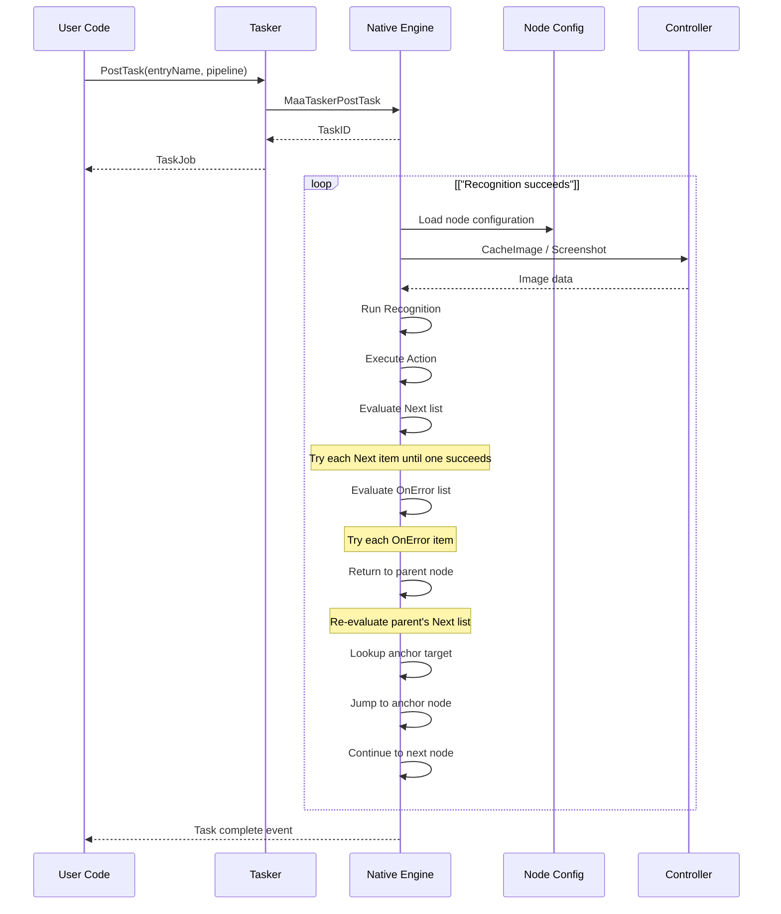
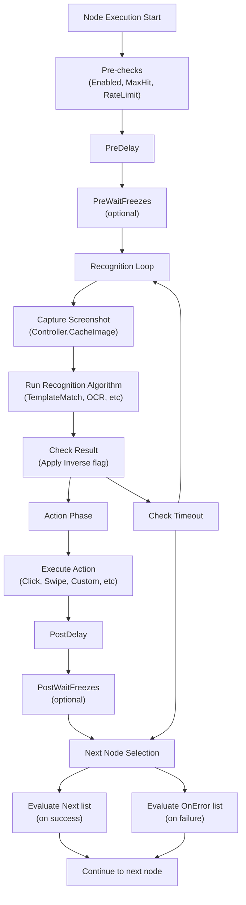

# Pipeline Architecture

Relevant source files

* [CHANGELOG.md](https://github.com/MaaXYZ/maa-framework-go/blob/5f9c965c/CHANGELOG.md?plain=1)
* [context\_test.go](https://github.com/MaaXYZ/maa-framework-go/blob/5f9c965c/context_test.go)
* [internal/jsoncodec/jsoncodec.go](https://github.com/MaaXYZ/maa-framework-go/blob/5f9c965c/internal/jsoncodec/jsoncodec.go)
* [internal/target/target.go](https://github.com/MaaXYZ/maa-framework-go/blob/5f9c965c/internal/target/target.go)
* [json\_codec.go](https://github.com/MaaXYZ/maa-framework-go/blob/5f9c965c/json_codec.go)
* [json\_codec\_test.go](https://github.com/MaaXYZ/maa-framework-go/blob/5f9c965c/json_codec_test.go)
* [maa.go](https://github.com/MaaXYZ/maa-framework-go/blob/5f9c965c/maa.go)
* [pipeline.go](https://github.com/MaaXYZ/maa-framework-go/blob/5f9c965c/pipeline.go)
* [recognition\_result\_test.go](https://github.com/MaaXYZ/maa-framework-go/blob/5f9c965c/recognition_result_test.go)
* [resource\_test.go](https://github.com/MaaXYZ/maa-framework-go/blob/5f9c965c/resource_test.go)
* [tasker\_test.go](https://github.com/MaaXYZ/maa-framework-go/blob/5f9c965c/tasker_test.go)

## Purpose and Scope

This document explains how the MaaFramework Go bindings execute automation tasks through a pipeline-based architecture. A pipeline is a collection of interconnected nodes that define recognition targets, actions to perform, and the control flow between them. This page covers:

* Pipeline and node structure
* Node chaining mechanisms (`Next`, `OnError`)
* Flow control attributes (`JumpBack`, `Anchor`)
* Pipeline execution model and traversal logic
* Runtime pipeline modification

For information about individual recognition algorithms, see [Recognition Types](/MaaXYZ/maa-framework-go/4.2-recognition-types). For action types, see [Action Types](/MaaXYZ/maa-framework-go/4.3-action-types). For timing and control attributes, see [Flow Control and Timing](/MaaXYZ/maa-framework-go/4.4-flow-control-and-timing).

## Pipeline Structure

A **Pipeline** is a map-like collection of named nodes where each node represents a discrete step in an automation workflow. Nodes are identified by unique string names and contain:

* **Recognition configuration**: How to identify targets on screen
* **Action configuration**: What to do when recognition succeeds
* **Flow control**: Which nodes to execute next



**Sources:** [pipeline.go20-70](https://github.com/MaaXYZ/maa-framework-go/blob/5f9c965c/pipeline.go#L20-L70) [node.go9-52](https://github.com/MaaXYZ/maa-framework-go/blob/5f9c965c/node.go#L9-L52)

### Node Structure

The `Node` struct ([node.go9-52](https://github.com/MaaXYZ/maa-framework-go/blob/5f9c965c/node.go#L9-L52)) defines all properties of a pipeline node:

| Field | Type | Purpose |
| --- | --- | --- |
| `Name` | `string` | Unique identifier for this node |
| `Recognition` | `*NodeRecognition` | Recognition algorithm configuration |
| `Action` | `*NodeAction` | Action to perform on success |
| `Next` | `[]NodeNextItem` | Nodes to try on successful recognition |
| `OnError` | `[]NodeNextItem` | Nodes to execute on failure/timeout |
| `Anchor` | `map[string]string` | Maps anchor names to target node names |
| `RateLimit` | `*int64` | Minimum interval between recognition attempts (ms) |
| `Timeout` | `*int64` | Maximum wait time for recognition (ms) |
| `Inverse` | `bool` | Invert recognition result |
| `Enabled` | `*bool` | Whether this node is active |
| `MaxHit` | `*uint64` | Maximum number of times this node can match |
| `PreDelay`, `PostDelay` | `*int64` | Delays before/after action execution |
| `PreWaitFreezes`, `PostWaitFreezes` | `*NodeWaitFreezes` | Wait for screen stabilization |
| `Repeat`, `RepeatDelay` | `*uint64`, `*int64` | Repetition configuration |
| `Focus` | `any` | Custom focus data |
| `Attach` | `map[string]any` | Additional custom metadata |

**Sources:** [node.go9-52](https://github.com/MaaXYZ/maa-framework-go/blob/5f9c965c/node.go#L9-L52)

### Creating Pipelines

Pipelines can be created programmatically using `NewPipeline()` and `NewNode()` ([pipeline.go25-30](https://github.com/MaaXYZ/maa-framework-go/blob/5f9c965c/pipeline.go#L25-L30) [node.go188-199](https://github.com/MaaXYZ/maa-framework-go/blob/5f9c965c/node.go#L188-L199)), or loaded from JSON via `Resource.PostBundle()`:

```
```
// Programmatic creation


pipeline := maa.NewPipeline()


entryNode := maa.NewNode("Entry",


maa.WithRecognition(maa.RecDirectHit()),


maa.WithAction(maa.ActClick(


maa.WithClickTarget(maa.NewTargetRect(maa.Rect{100, 200, 50, 50})),


)),


)


pipeline.AddNode(entryNode)


// JSON-based (via Resource.PostBundle or Context.OverridePipeline)


rawPipeline := map[string]any{


"Entry": map[string]any{


"recognition": map[string]any{"type": "DirectHit"},


"action": map[string]any{"type": "Click"},


"next": []string{"NextNode"},


},


}
```
```

The `Pipeline` struct ([pipeline.go20-23](https://github.com/MaaXYZ/maa-framework-go/blob/5f9c965c/pipeline.go#L20-L23)) internally maintains a `map[string]*Node` where keys are node names and values are node configurations.

**Sources:** [pipeline.go20-30](https://github.com/MaaXYZ/maa-framework-go/blob/5f9c965c/pipeline.go#L20-L30) [node.go188-199](https://github.com/MaaXYZ/maa-framework-go/blob/5f9c965c/node.go#L188-L199) [context\_test.go14-25](https://github.com/MaaXYZ/maa-framework-go/blob/5f9c965c/context_test.go#L14-L25)

## Node Chaining: The Next List

The `Next` field ([node.go19](https://github.com/MaaXYZ/maa-framework-go/blob/5f9c965c/node.go#L19-L19)) defines the execution flow when a node's recognition succeeds. It is a list of `NodeNextItem` entries, each specifying a target node name and optional attributes.



### NodeNextItem Structure

Each item in the `Next` or `OnError` list is a `NodeNextItem` ([node.go319-327](https://github.com/MaaXYZ/maa-framework-go/blob/5f9c965c/node.go#L319-L327)):

| Field | Type | Purpose |
| --- | --- | --- |
| `Name` | `string` | Target node name |
| `JumpBack` | `bool` | Return to parent node after this chain completes |
| `Anchor` | `bool` | Resolve name as anchor reference at runtime |

**Sources:** [node.go319-327](https://github.com/MaaXYZ/maa-framework-go/blob/5f9c965c/node.go#L319-L327)

### Next List Execution Order

When a node's recognition succeeds, the framework attempts each node in the `Next` list sequentially:

1. Try first node in `Next` list
2. If that node's recognition fails, try the second node
3. Continue until a node succeeds or the list is exhausted
4. If all nodes in `Next` fail, the current node is considered to have failed

**Example:**

```
```
node := maa.NewNode("FindTarget")


node.AddNext("PrimaryAction")     // Try first


node.AddNext("FallbackAction")    // Try if primary fails


node.AddNext("LastResortAction")  // Try if fallback fails
```
```

**Sources:** [node.go388-414](https://github.com/MaaXYZ/maa-framework-go/blob/5f9c965c/node.go#L388-L414) [context\_test.go95-98](https://github.com/MaaXYZ/maa-framework-go/blob/5f9c965c/context_test.go#L95-L98)

## Error Handling: The OnError List

The `OnError` field ([node.go26](https://github.com/MaaXYZ/maa-framework-go/blob/5f9c965c/node.go#L26-L26)) defines fallback nodes when:

* Recognition times out (exceeds `Timeout`)
* Action execution fails
* All nodes in the `Next` list fail



**Example:**

```
```
node := maa.NewNode("CriticalAction",


maa.WithTimeout(10 * time.Second),


)


node.AddNext("SuccessHandler")


node.AddOnError("RetryNode")


node.AddOnError("FallbackNode")
```
```

**Sources:** [node.go26](https://github.com/MaaXYZ/maa-framework-go/blob/5f9c965c/node.go#L26-L26) [node.go429-455](https://github.com/MaaXYZ/maa-framework-go/blob/5f9c965c/node.go#L429-L455) [context\_test.go1127-1142](https://github.com/MaaXYZ/maa-framework-go/blob/5f9c965c/context_test.go#L1127-L1142)

## Flow Control: JumpBack Mechanism

The `JumpBack` attribute ([node.go323-324](https://github.com/MaaXYZ/maa-framework-go/blob/5f9c965c/node.go#L323-L324)) creates loops in the pipeline. When a node marked with `JumpBack` completes its chain:

1. Execution returns to the **parent node** (the node that invoked this chain)
2. The parent node's `Next` list is re-evaluated from the beginning
3. This allows retry logic and cyclic patterns



**Example:**

```
```
mainNode := maa.NewNode("MainLoop")


mainNode.AddNext("CheckCondition")


mainNode.AddNext("ProcessItem", maa.WithJumpBack()) // Loop back after processing


pipeline.AddNode(mainNode)
```
```

**Usage:** [node.go345-350](https://github.com/MaaXYZ/maa-framework-go/blob/5f9c965c/node.go#L345-L350) [context\_test.go1127-1142](https://github.com/MaaXYZ/maa-framework-go/blob/5f9c965c/context_test.go#L1127-L1142) [resource\_test.go269-303](https://github.com/MaaXYZ/maa-framework-go/blob/5f9c965c/resource_test.go#L269-L303)

## Flow Control: Anchor Mechanism

The `Anchor` attribute enables **dynamic branching** where the target node is resolved at runtime rather than statically defined.

### Setting Anchors

Nodes declare anchors in their `Anchor` field ([node.go13-14](https://github.com/MaaXYZ/maa-framework-go/blob/5f9c965c/node.go#L13-L14)), which is a `map[string]string` mapping anchor names to target node names.

**Anchor API:**

1. **`SetAnchor(map[string]string)`** ([node.go202-205](https://github.com/MaaXYZ/maa-framework-go/blob/5f9c965c/node.go#L202-L205)): Set multiple anchor mappings at once
2. **`SetAnchorTarget(anchor, nodeName)`** ([node.go208-217](https://github.com/MaaXYZ/maa-framework-go/blob/5f9c965c/node.go#L208-L217)): Set a specific anchor to point to a target node
3. **`AddAnchor(anchor)`** ([node.go374-376](https://github.com/MaaXYZ/maa-framework-go/blob/5f9c965c/node.go#L374-L376)): Shorthand to set anchor pointing to current node (`anchor -> node.Name`)
4. **`ClearAnchor(anchor)`** ([node.go378-381](https://github.com/MaaXYZ/maa-framework-go/blob/5f9c965c/node.go#L378-L381)): Set anchor to empty string (explicit clear)
5. **`RemoveAnchor(anchor)`** ([node.go383-392](https://github.com/MaaXYZ/maa-framework-go/blob/5f9c965c/node.go#L383-L392)): Delete the anchor key entirely

```
```
// Set anchor to current node (most common pattern)


node := maa.NewNode("DynamicTarget")


node.AddAnchor("SavePoint")  // SavePoint -> "DynamicTarget"


node.AddAnchor("ReturnPoint") // ReturnPoint -> "DynamicTarget"


// Set anchor to specific target node


node.SetAnchorTarget("ForwardJump", "TargetNode")


// Set multiple anchors at once


node.SetAnchor(map[string]string{


"AnchorA": "NodeA",


"AnchorB": "NodeB",


})


// Clear anchor (sets to empty string)


node.ClearAnchor("SavePoint") // SavePoint -> ""


// Remove anchor completely


node.RemoveAnchor("ReturnPoint") // Deletes the key
```
```

When a node with anchors executes successfully, it registers these anchor mappings. The most recent node to set an anchor becomes the anchor's target.

**Sources:** [node.go13-14](https://github.com/MaaXYZ/maa-framework-go/blob/5f9c965c/node.go#L13-L14) [node.go202-217](https://github.com/MaaXYZ/maa-framework-go/blob/5f9c965c/node.go#L202-L217) [node.go374-392](https://github.com/MaaXYZ/maa-framework-go/blob/5f9c965c/node.go#L374-L392) [node\_test.go9-82](https://github.com/MaaXYZ/maa-framework-go/blob/5f9c965c/node_test.go#L9-L82)

### Referencing Anchors

To reference an anchor in a `Next` or `OnError` list, use `NodeNextItem` with `Anchor=true` ([node.go325-326](https://github.com/MaaXYZ/maa-framework-go/blob/5f9c965c/node.go#L325-L326)):

```
```
node.AddNext("SavePoint", maa.WithAnchor()) // Resolves to last node that set "SavePoint" anchor
```
```

At runtime, the framework looks up the current anchor value and redirects execution to that node.

**Diagram: Anchor Registration and Resolution**



**Example:**

```
```
// Define anchor points


checkpoint1 := maa.NewNode("Checkpoint1")


checkpoint1.AddAnchor("ReturnPoint") // ReturnPoint -> "Checkpoint1"


checkpoint2 := maa.NewNode("Checkpoint2")


checkpoint2.AddAnchor("ReturnPoint") // ReturnPoint -> "Checkpoint2" (overwrites)


// Reference anchor dynamically


returnNode := maa.NewNode("Return")


returnNode.AddNext("ReturnPoint", maa.WithAnchor()) // Jumps to Checkpoint2
```
```

**Sources:** [node.go332-340](https://github.com/MaaXYZ/maa-framework-go/blob/5f9c965c/node.go#L332-L340) [node.go354-371](https://github.com/MaaXYZ/maa-framework-go/blob/5f9c965c/node.go#L354-L371) [context\_test.go1127-1198](https://github.com/MaaXYZ/maa-framework-go/blob/5f9c965c/context_test.go#L1127-L1198) [resource\_test.go262-303](https://github.com/MaaXYZ/maa-framework-go/blob/5f9c965c/resource_test.go#L262-L303)

## Pipeline Execution Model

The framework executes pipelines through the `Tasker.PostTask()` method ([tasker\_test.go79-89](https://github.com/MaaXYZ/maa-framework-go/blob/5f9c965c/tasker_test.go#L79-L89)), which posts an entry node name and optional pipeline configuration. The native execution engine traverses nodes according to the flow control rules defined in the pipeline.

### Execution Lifecycle

**Diagram: Task Execution Sequence**



**Sources:** [context\_test.go13-53](https://github.com/MaaXYZ/maa-framework-go/blob/5f9c965c/context_test.go#L13-L53) [tasker\_test.go79-89](https://github.com/MaaXYZ/maa-framework-go/blob/5f9c965c/tasker_test.go#L79-L89)

### Recognition-Action Phases

Each node execution consists of two distinct phases:

**Diagram: Node Execution Phases**



**Sources:** [node.go9-52](https://github.com/MaaXYZ/maa-framework-go/blob/5f9c965c/node.go#L9-L52) [context\_test.go13-53](https://github.com/MaaXYZ/maa-framework-go/blob/5f9c965c/context_test.go#L13-L53)

### Node Evaluation Process

For each node, the native execution engine follows this sequence:

#### Phase 1: Recognition

1. **Pre-checks**: Verify `Enabled` flag ([node.go31](https://github.com/MaaXYZ/maa-framework-go/blob/5f9c965c/node.go#L31-L31)), check `MaxHit` counter ([node.go33](https://github.com/MaaXYZ/maa-framework-go/blob/5f9c965c/node.go#L33-L33))
2. **Rate limiting**: Wait for `RateLimit` interval since last attempt ([node.go23](https://github.com/MaaXYZ/maa-framework-go/blob/5f9c965c/node.go#L23-L23))
3. **Pre-delay**: Wait for `PreDelay` milliseconds ([node.go35](https://github.com/MaaXYZ/maa-framework-go/blob/5f9c965c/node.go#L35-L35))
4. **Pre-wait-freezes**: Wait for screen stabilization if configured ([node.go39](https://github.com/MaaXYZ/maa-framework-go/blob/5f9c965c/node.go#L39-L39))
5. **Recognition loop**:
   * Capture screenshot via `Controller.CacheImage()`
   * Run recognition algorithm (see [Recognition Types](/MaaXYZ/maa-framework-go/4.2-recognition-types))
   * Check against `Timeout` ([node.go25](https://github.com/MaaXYZ/maa-framework-go/blob/5f9c965c/node.go#L25-L25))
   * Apply `Inverse` flag if set ([node.go29](https://github.com/MaaXYZ/maa-framework-go/blob/5f9c965c/node.go#L29-L29))
   * Repeat until success or timeout

#### Phase 2: Action

6. **Action execution**: If recognition succeeds, execute the action (see [Action Types](/MaaXYZ/maa-framework-go/4.3-action-types))
7. **Post-delay**: Wait for `PostDelay` milliseconds ([node.go37](https://github.com/MaaXYZ/maa-framework-go/blob/5f9c965c/node.go#L37-L37))
8. **Post-wait-freezes**: Wait for screen stabilization if configured ([node.go41](https://github.com/MaaXYZ/maa-framework-go/blob/5f9c965c/node.go#L41-L41))
9. **Repetition**: If `Repeat` is set, repeat the action phase ([node.go43](https://github.com/MaaXYZ/maa-framework-go/blob/5f9c965c/node.go#L43-L43))
10. **Next node selection**: Evaluate `Next` list (success) or `OnError` list (failure)

**Node Configuration Fields:**

| Field | Default | Purpose | Code Reference |
| --- | --- | --- | --- |
| `RateLimit` | 1000 ms | Minimum interval between recognition attempts | [node.go23](https://github.com/MaaXYZ/maa-framework-go/blob/5f9c965c/node.go#L23-L23) |
| `Timeout` | 20000 ms | Maximum wait time for recognition | [node.go25](https://github.com/MaaXYZ/maa-framework-go/blob/5f9c965c/node.go#L25-L25) |
| `PreDelay` | 200 ms | Delay before action execution | [node.go35](https://github.com/MaaXYZ/maa-framework-go/blob/5f9c965c/node.go#L35-L35) |
| `PostDelay` | 200 ms | Delay after action execution | [node.go37](https://github.com/MaaXYZ/maa-framework-go/blob/5f9c965c/node.go#L37-L37) |
| `Repeat` | 1 | Number of times to repeat action phase | [node.go43](https://github.com/MaaXYZ/maa-framework-go/blob/5f9c965c/node.go#L43-L43) |
| `MaxHit` | Unlimited | Maximum number of times this node can match | [node.go33](https://github.com/MaaXYZ/maa-framework-go/blob/5f9c965c/node.go#L33-L33) |

**Sources:** [node.go9-52](https://github.com/MaaXYZ/maa-framework-go/blob/5f9c965c/node.go#L9-L52) [context\_test.go411-434](https://github.com/MaaXYZ/maa-framework-go/blob/5f9c965c/context_test.go#L411-L434)

### Example: Complex Flow

```
```
pipeline := maa.NewPipeline()


// Entry point


entry := maa.NewNode("Entry")


entry.AddNext("FindLoginButton")


entry.AddOnError("Restart")


pipeline.AddNode(entry)


// Login flow


findLogin := maa.NewNode("FindLoginButton",


maa.WithRecognition(maa.RecTemplateMatch([]string{"login_button.png"})),


maa.WithTimeout(5 * time.Second),


)


findLogin.AddNext("ClickLogin")


findLogin.AddOnError("Restart")


pipeline.AddNode(findLogin)


clickLogin := maa.NewNode("ClickLogin",


maa.WithAction(maa.ActClick()),


)


clickLogin.AddNext("CheckSuccess")


clickLogin.AddOnError("Restart")


pipeline.AddNode(clickLogin)


// Success anchor


checkSuccess := maa.NewNode("CheckSuccess",


maa.WithRecognition(maa.RecOCR(maa.WithOCRExpected([]string{"Success"}))),


)


checkSuccess.SetAnchor([]string{"LoginComplete"})


pipeline.AddNode(checkSuccess)


// Error handler with JumpBack


restart := maa.NewNode("Restart",


maa.WithAction(maa.ActClick()),


)


restart.AddNext("Entry", maa.WithJumpBack()) // Loop back to Entry


pipeline.AddNode(restart)


// Execute


tasker.PostTask("Entry", pipeline)
```
```

**Sources:** [context\_test.go44-53](https://github.com/MaaXYZ/maa-framework-go/blob/5f9c965c/context_test.go#L44-L53) [tasker\_test.go79-89](https://github.com/MaaXYZ/maa-framework-go/blob/5f9c965c/tasker_test.go#L79-L89)

## Runtime Pipeline Modification

The framework supports modifying pipeline configuration during execution through `Context` methods. This enables dynamic workflows that adapt based on runtime conditions.

### OverridePipeline

`Context.OverridePipeline` ([context\_test.go157-189](https://github.com/MaaXYZ/maa-framework-go/blob/5f9c965c/context_test.go#L157-L189)) replaces the entire pipeline configuration:

```
```
func (action *MyAction) Run(ctx *maa.Context, arg *maa.CustomActionArg) bool {


newPipeline := maa.NewPipeline()


newNode := maa.NewNode("DynamicNode",


maa.WithAction(maa.ActClick(


maa.WithClickTarget(maa.NewTargetRect(maa.Rect{200, 200, 10, 10})),


)),


)


newPipeline.AddNode(newNode)


err := ctx.OverridePipeline(newPipeline)


if err != nil {


return false


}


// Subsequent RunTask calls use the new pipeline


detail, err := ctx.RunTask("DynamicNode")


return err == nil


}
```
```

**Use cases:**

* Switching between different automation strategies
* Loading different task sets based on game state
* Hot-swapping pipeline definitions

**Sources:** [context\_test.go157-189](https://github.com/MaaXYZ/maa-framework-go/blob/5f9c965c/context_test.go#L157-L189)

### OverrideNext

`Context.OverrideNext` ([context\_test.go218-245](https://github.com/MaaXYZ/maa-framework-go/blob/5f9c965c/context_test.go#L218-L245)) and `Resource.OverrideNext` ([resource\_test.go262-303](https://github.com/MaaXYZ/maa-framework-go/blob/5f9c965c/resource_test.go#L262-L303)) modify the `Next` list of a specific node:

```
```
// Override next nodes dynamically


newNextList := []maa.NodeNextItem{


{Name: "TaskB"},


{Name: "TaskC", JumpBack: true},


{Name: "AnchorX", Anchor: true},


}


err := ctx.OverrideNext("Entry", newNextList)
```
```

**Use cases:**

* Conditional branching based on runtime data
* A/B testing different task sequences
* User-configurable automation paths

**Sources:** [context\_test.go218-245](https://github.com/MaaXYZ/maa-framework-go/blob/5f9c965c/context_test.go#L218-L245) [resource\_test.go262-303](https://github.com/MaaXYZ/maa-framework-go/blob/5f9c965c/resource_test.go#L262-L303)

### Reading Node Configuration

`Context.GetNode` and `Resource.GetNode` retrieve the current configuration of a node:

```
```
nodeData, err := ctx.GetNode("MyNode")


if err != nil {


return false


}


// Inspect recognition type


if nodeData.Recognition.Type == maa.NodeRecognitionTypeOCR {


ocrParam := nodeData.Recognition.Param.(*maa.NodeOCRParam)


fmt.Println("Expected text:", ocrParam.Expected)


}


// Inspect next list


for _, item := range nodeData.Next {


fmt.Printf("Next node: %s, JumpBack: %v, Anchor: %v\n",


item.Name, item.JumpBack, item.Anchor)


}
```
```

**Sources:** [context\_test.go274-1232](https://github.com/MaaXYZ/maa-framework-go/blob/5f9c965c/context_test.go#L274-L1232) [resource\_test.go347-359](https://github.com/MaaXYZ/maa-framework-go/blob/5f9c965c/resource_test.go#L347-L359)

## Integration with Tasker and Resource

### Tasker Role

The `Tasker` component ([tasker\_test.go17-22](https://github.com/MaaXYZ/maa-framework-go/blob/5f9c965c/tasker_test.go#L17-L22)) orchestrates pipeline execution:

* `PostTask(entry string, pipeline Pipeline) *TaskJob`: Start pipeline execution
* `BindResource(res *Resource)`: Attach resource containing node definitions
* `BindController(ctrl *Controller)`: Attach controller for device interaction
* `OverridePipeline(pipeline Pipeline)`: Replace pipeline for current execution

**Sources:** [tasker\_test.go10-22](https://github.com/MaaXYZ/maa-framework-go/blob/5f9c965c/tasker_test.go#L10-L22) [tasker\_test.go66-93](https://github.com/MaaXYZ/maa-framework-go/blob/5f9c965c/tasker_test.go#L66-L93)

### Resource Role

The `Resource` component ([resource\_test.go10-20](https://github.com/MaaXYZ/maa-framework-go/blob/5f9c965c/resource_test.go#L10-L20)) manages pipeline definitions:

* `PostBundle(path string) *Job`: Load pipeline definitions from directory
* `GetNode(name string) (*Node, error)`: Retrieve node configuration
* `OverrideNext(name string, next []NodeNextItem) error`: Modify node flow
* `GetNodeList() ([]string, error)`: List all available nodes

Pipeline definitions can be:

1. **Loaded from JSON** via `Resource.PostBundle`
2. **Created programmatically** and passed to `Tasker.PostTask`
3. **Modified at runtime** via `Context.OverridePipeline` or `Context.OverrideNext`

**Sources:** [resource\_test.go10-20](https://github.com/MaaXYZ/maa-framework-go/blob/5f9c965c/resource_test.go#L10-L20) [resource\_test.go254-260](https://github.com/MaaXYZ/maa-framework-go/blob/5f9c965c/resource_test.go#L254-L260) [resource\_test.go262-303](https://github.com/MaaXYZ/maa-framework-go/blob/5f9c965c/resource_test.go#L262-L303)

## Best Practices

### Design Principles

1. **Keep nodes focused**: Each node should have a single recognition target and action
2. **Use error handling**: Always define `OnError` lists for critical nodes
3. **Leverage anchors**: Use anchors for state-dependent navigation
4. **Timeout appropriately**: Set `Timeout` values based on expected recognition time
5. **Test loops carefully**: Ensure `JumpBack` loops have termination conditions

### Common Patterns

**Retry with backoff:**

```
```
node := maa.NewNode("RetryableAction",


maa.WithTimeout(5 * time.Second),


maa.WithMaxHit(3), // Limit retry count


)


node.AddNext("Success")


node.AddOnError("BackoffDelay")


backoff := maa.NewNode("BackoffDelay",


maa.WithPreDelay(2 * time.Second),


)


backoff.AddNext("RetryableAction", maa.WithJumpBack())
```
```

**State machine with anchors:**

```
```
stateA := maa.NewNode("StateA")


stateA.AddAnchor("CurrentState") // CurrentState -> "StateA"


stateA.AddNext("TransitionToB")


stateB := maa.NewNode("StateB")


stateB.AddAnchor("CurrentState") // CurrentState -> "StateB" (overwrites)


stateB.AddNext("TransitionToA")


// Jump to current state


returnToState := maa.NewNode("Return")


returnToState.AddNext("CurrentState", maa.WithAnchor())
```
```

**Conditional branching:**

```
```
type BranchingAction struct{}


func (a *BranchingAction) Run(ctx *maa.Context, arg *maa.CustomActionArg) bool {


if someCondition {


ctx.OverrideNext("Entry", []maa.NodeNextItem{{Name: "PathA"}})


} else {


ctx.OverrideNext("Entry", []maa.NodeNextItem{{Name: "PathB"}})


}


return true


}
```
```

**Sources:** [context\_test.go157-272](https://github.com/MaaXYZ/maa-framework-go/blob/5f9c965c/context_test.go#L157-L272) [node.go21-47](https://github.com/MaaXYZ/maa-framework-go/blob/5f9c965c/node.go#L21-L47)