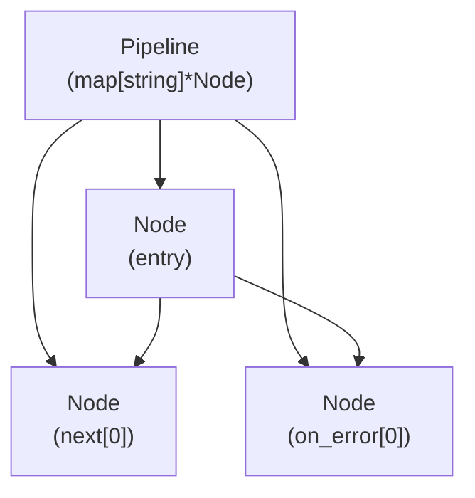
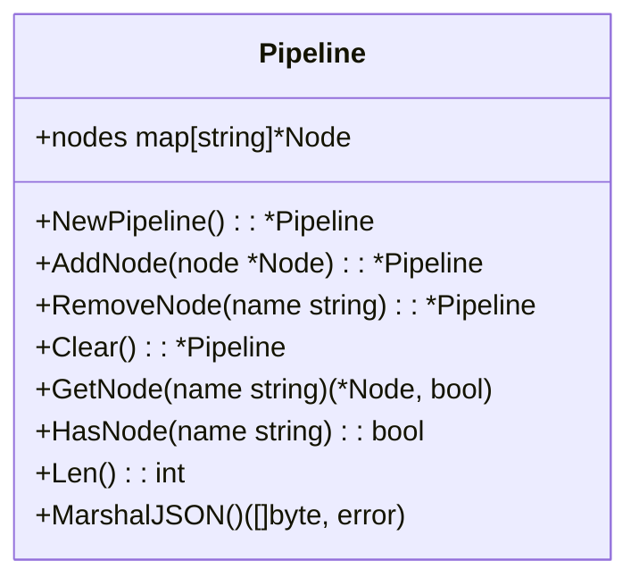
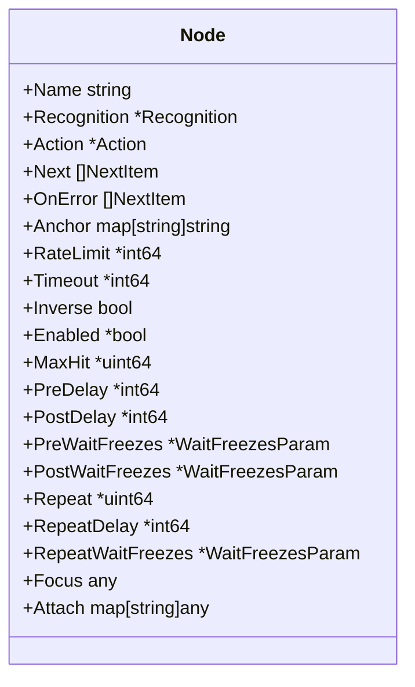
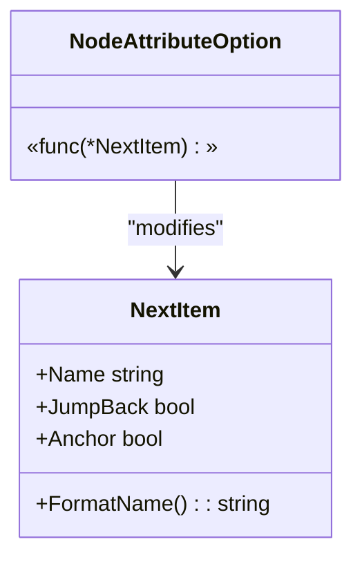
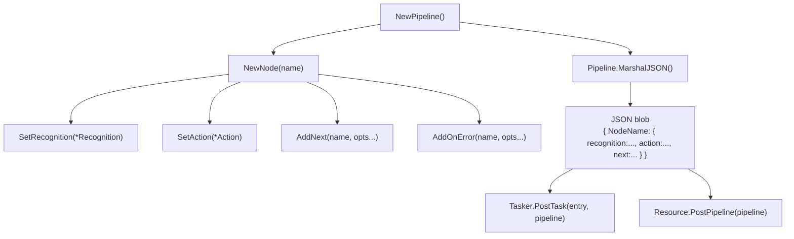
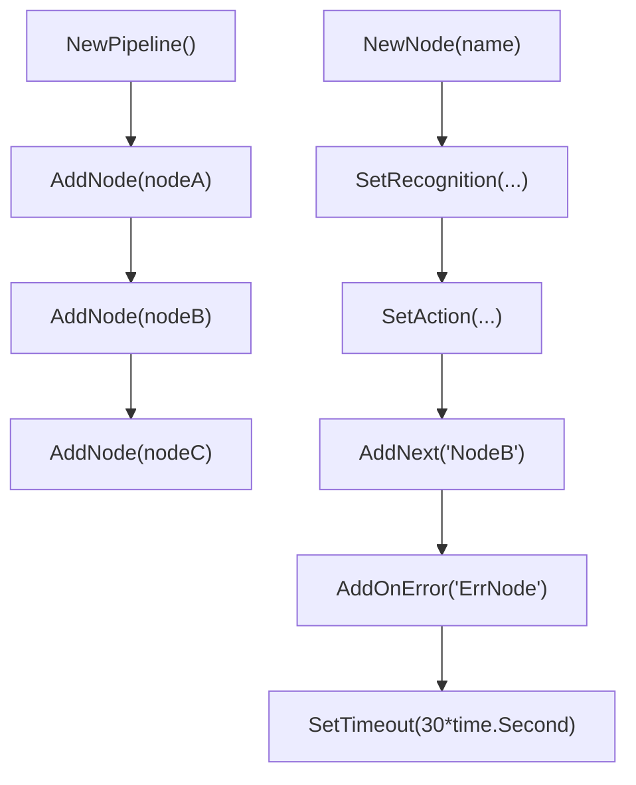

# Pipeline and Nodes

Relevant source files

* [CHANGELOG.md](https://github.com/MaaXYZ/maa-framework-go/blob/5f9c965c/CHANGELOG.md?plain=1)
* [context\_test.go](https://github.com/MaaXYZ/maa-framework-go/blob/5f9c965c/context_test.go)
* [internal/jsoncodec/jsoncodec.go](https://github.com/MaaXYZ/maa-framework-go/blob/5f9c965c/internal/jsoncodec/jsoncodec.go)
* [internal/target/target.go](https://github.com/MaaXYZ/maa-framework-go/blob/5f9c965c/internal/target/target.go)
* [json\_codec.go](https://github.com/MaaXYZ/maa-framework-go/blob/5f9c965c/json_codec.go)
* [json\_codec\_test.go](https://github.com/MaaXYZ/maa-framework-go/blob/5f9c965c/json_codec_test.go)
* [maa.go](https://github.com/MaaXYZ/maa-framework-go/blob/5f9c965c/maa.go)
* [pipeline.go](https://github.com/MaaXYZ/maa-framework-go/blob/5f9c965c/pipeline.go)
* [recognition\_result\_test.go](https://github.com/MaaXYZ/maa-framework-go/blob/5f9c965c/recognition_result_test.go)
* [resource\_test.go](https://github.com/MaaXYZ/maa-framework-go/blob/5f9c965c/resource_test.go)
* [tasker\_test.go](https://github.com/MaaXYZ/maa-framework-go/blob/5f9c965c/tasker_test.go)

This page documents the `Pipeline` and `Node` types defined in [pipeline.go](https://github.com/MaaXYZ/maa-framework-go/blob/5f9c965c/pipeline.go) and [node.go](https://github.com/MaaXYZ/maa-framework-go/blob/5f9c965c/node.go) which are used to construct task definitions programmatically in Go. These types produce JSON that MaaFramework consumes when executing tasks.

For how `Pipeline` is passed to `Tasker.PostTask` or `Resource.PostPipeline`, see [Tasker](/MaaXYZ/maa-framework-go/3.1-tasker) and [Resource](/MaaXYZ/maa-framework-go/3.3-resource). For the execution model and how nodes are sequenced at runtime, see [Pipeline Architecture](/MaaXYZ/maa-framework-go/4.1-pipeline-architecture). For flow control semantics (timeouts, delays, anchors, jump-back), see [Flow Control and Timing](/MaaXYZ/maa-framework-go/4.4-flow-control-and-timing).

---

## Overview

A `Pipeline` is a named map of `Node` objects. Each `Node` describes one unit of work: what to recognize on screen, what action to perform on a hit, and where to go next. The `Pipeline` type serializes this map to JSON via `MarshalJSON`, which is the format MaaFramework expects.

**Execution model (abbreviated):**



Sources: [pipeline.go21-71](https://github.com/MaaXYZ/maa-framework-go/blob/5f9c965c/pipeline.go#L21-L71) [node.go10-52](https://github.com/MaaXYZ/maa-framework-go/blob/5f9c965c/node.go#L10-L52)

---

## Pipeline

**Struct and key methods:**



Sources: [pipeline.go20-71](https://github.com/MaaXYZ/maa-framework-go/blob/5f9c965c/pipeline.go#L20-L71)

### Construction

`NewPipeline` returns an empty `Pipeline` with an initialized internal `nodes` map.

```
pipeline := maa.NewPipeline()
```

[pipeline.go26-30](https://github.com/MaaXYZ/maa-framework-go/blob/5f9c965c/pipeline.go#L26-L30)

### Adding and Removing Nodes

All mutating methods return `*Pipeline` to allow method chaining.

| Method | Description |
| --- | --- |
| `AddNode(node *Node) *Pipeline` | Inserts or replaces a node keyed by `node.Name`. |
| `RemoveNode(name string) *Pipeline` | Deletes the node with the given name. No-op if not present. |
| `Clear() *Pipeline` | Replaces the internal map with a new empty map. |

[pipeline.go38-53](https://github.com/MaaXYZ/maa-framework-go/blob/5f9c965c/pipeline.go#L38-L53)

### Querying Nodes

| Method | Returns |
| --- | --- |
| `GetNode(name string)` | `(*Node, bool)` — the node and an existence flag |
| `HasNode(name string)` | `bool` |
| `Len()` | `int` — count of nodes |

[pipeline.go56-70](https://github.com/MaaXYZ/maa-framework-go/blob/5f9c965c/pipeline.go#L56-L70)

### JSON Serialization

`MarshalJSON` delegates directly to `json.Marshal(p.nodes)`, producing a flat JSON object where each key is a node name and each value is the serialized `Node`. This is the format MaaFramework's pipeline protocol expects.

[pipeline.go33-35](https://github.com/MaaXYZ/maa-framework-go/blob/5f9c965c/pipeline.go#L33-L35)

---

## Node

`Node` represents a single named step within a pipeline. Its `Name` field is excluded from JSON output (tagged `json:"-"`) because the name becomes the JSON key at the `Pipeline` level.

**Full field reference:**



Sources: [node.go10-52](https://github.com/MaaXYZ/maa-framework-go/blob/5f9c965c/node.go#L10-L52)

### Construction

`NewNode(name string)` creates a `Node` with the given name and an initialized (non-nil) `Attach` map. All other fields are zero/nil and are omitted from JSON output when not set.

[node.go54-60](https://github.com/MaaXYZ/maa-framework-go/blob/5f9c965c/node.go#L54-L60)

### Setter Methods

All setters return `*Node` for chaining. Timing setters accept `time.Duration` and convert to milliseconds internally.

**Recognition and Action**

| Method | Field set |
| --- | --- |
| `SetRecognition(rec *Recognition) *Node` | `Recognition` |
| `SetAction(act *Action) *Node` | `Action` |

[node.go81-90](https://github.com/MaaXYZ/maa-framework-go/blob/5f9c965c/node.go#L81-L90)

**Transition Lists**

| Method | Field set | Notes |
| --- | --- | --- |
| `SetNext(next []NextItem) *Node` | `Next` | Clones the slice |
| `AddNext(name string, opts ...NodeAttributeOption) *Node` | `Next` | Appends or replaces by name |
| `RemoveNext(name string) *Node` | `Next` | Removes by name |
| `SetOnError(onError []NextItem) *Node` | `OnError` | Clones the slice |
| `AddOnError(name string, opts ...NodeAttributeOption) *Node` | `OnError` | Appends or replaces by name |
| `RemoveOnError(name string) *Node` | `OnError` | Removes by name |

[node.go93-96](https://github.com/MaaXYZ/maa-framework-go/blob/5f9c965c/node.go#L93-L96) [node.go112-116](https://github.com/MaaXYZ/maa-framework-go/blob/5f9c965c/node.go#L112-L116) [node.go263-342](https://github.com/MaaXYZ/maa-framework-go/blob/5f9c965c/node.go#L263-L342)

**Timing**

| Method | Default (MaaFramework) | Field set |
| --- | --- | --- |
| `SetRateLimit(d time.Duration)` | 1000 ms | `RateLimit` |
| `SetTimeout(d time.Duration)` | 20000 ms | `Timeout` |
| `SetPreDelay(d time.Duration)` | 200 ms | `PreDelay` |
| `SetPostDelay(d time.Duration)` | 200 ms | `PostDelay` |
| `SetRepeatDelay(d time.Duration)` | 0 ms | `RepeatDelay` |

[node.go99-173](https://github.com/MaaXYZ/maa-framework-go/blob/5f9c965c/node.go#L99-L173)

**Wait-for-freeze hooks**

These fields pause execution until the screen stabilizes:

| Method | Field set |
| --- | --- |
| `SetPreWaitFreezes(p *WaitFreezesParam)` | `PreWaitFreezes` |
| `SetPostWaitFreezes(p *WaitFreezesParam)` | `PostWaitFreezes` |
| `SetRepeatWaitFreezes(p *WaitFreezesParam)` | `RepeatWaitFreezes` |

[node.go151-179](https://github.com/MaaXYZ/maa-framework-go/blob/5f9c965c/node.go#L151-L179)

**Flow control**

| Method | Field set | Notes |
| --- | --- | --- |
| `SetInverse(b bool)` | `Inverse` | Inverts recognition result |
| `SetEnabled(b bool)` | `Enabled` | Disables node when false |
| `SetMaxHit(n uint64)` | `MaxHit` | Stops after n successful hits |
| `SetRepeat(n uint64)` | `Repeat` | Repeats the node n times per visit |

[node.go119-134](https://github.com/MaaXYZ/maa-framework-go/blob/5f9c965c/node.go#L119-L134) [node.go163-166](https://github.com/MaaXYZ/maa-framework-go/blob/5f9c965c/node.go#L163-L166)

**Custom data**

| Method | Field set | Notes |
| --- | --- | --- |
| `SetFocus(v any)` | `Focus` | Arbitrary focus data |
| `SetAttach(m map[string]any)` | `Attach` | Cloned; never nil |

[node.go182-197](https://github.com/MaaXYZ/maa-framework-go/blob/5f9c965c/node.go#L182-L197)

### Anchor Methods

Anchors are named references that let `NextItem` entries resolve to a node at runtime rather than statically.

| Method | Effect |
| --- | --- |
| `SetAnchor(map[string]string)` | Replaces entire anchor map (cloned) |
| `SetAnchorTarget(anchor, nodeName string)` | Sets one anchor name → node name mapping |
| `AddAnchor(anchor string)` | Sets anchor → this node's own name |
| `ClearAnchor(anchor string)` | Sets anchor → `""` (explicit clear signal) |
| `RemoveAnchor(anchor string)` | Deletes the anchor key entirely |

[node.go62-260](https://github.com/MaaXYZ/maa-framework-go/blob/5f9c965c/node.go#L62-L260)

---

## NextItem and NodeAttributeOption

`NextItem` is a single entry in a node's `Next` or `OnError` list. It carries additional attributes that control execution behavior.



Sources: [node.go199-239](https://github.com/MaaXYZ/maa-framework-go/blob/5f9c965c/node.go#L199-L239)

### Fields

| Field | JSON key | Description |
| --- | --- | --- |
| `Name` | `"name"` | Target node name, or anchor name if `Anchor` is true |
| `JumpBack` | `"jump_back"` | After this node's chain completes, return to the parent node and continue its `Next` list |
| `Anchor` | `"anchor"` | Treat `Name` as an anchor reference; resolved to the last node that set this anchor |

### NodeAttributeOption Functions

`NodeAttributeOption` is a `func(*NextItem)`. The two built-in options are:

| Function | Effect |
| --- | --- |
| `WithJumpBack()` | Sets `JumpBack = true` on the item |
| `WithAnchor()` | Sets `Anchor = true` on the item |

Pass these as variadic arguments to `AddNext` or `AddOnError`:

```
node.AddNext("SomeNode", maa.WithJumpBack())
node.AddOnError("ErrorHandler", maa.WithAnchor())
```

[node.go222-239](https://github.com/MaaXYZ/maa-framework-go/blob/5f9c965c/node.go#L222-L239)

### FormatName

`FormatName()` returns the name with prefix tokens for debug output: `[JumpBack]NodeA`, `[Anchor]NodeA`, or `[JumpBack][Anchor]NodeA`.

[node.go211-220](https://github.com/MaaXYZ/maa-framework-go/blob/5f9c965c/node.go#L211-L220)

---

## Data Flow: Pipeline to MaaFramework

The diagram below maps Go types to the JSON structure MaaFramework consumes.



Sources: [pipeline.go33-35](https://github.com/MaaXYZ/maa-framework-go/blob/5f9c965c/pipeline.go#L33-L35) [node.go10-52](https://github.com/MaaXYZ/maa-framework-go/blob/5f9c965c/node.go#L10-L52) [test/run\_without\_file\_test.go37-46](https://github.com/MaaXYZ/maa-framework-go/blob/5f9c965c/test/run_without_file_test.go#L37-L46)

---

## Usage Example

The following pattern from [test/run\_without\_file\_test.go37-46](https://github.com/MaaXYZ/maa-framework-go/blob/5f9c965c/test/run_without_file_test.go#L37-L46) shows a complete inline pipeline construction:

```
// Build a pipeline with one node using a custom action
pipeline := maa.NewPipeline()
myTaskNode := maa.NewNode("MyTask").
    SetAction(maa.ActCustom(maa.CustomActionParam{
        CustomAction:      "MyAct",
        CustomActionParam: "abcdefg",
    }))
pipeline.AddNode(myTaskNode)

// Pass the pipeline override to PostTask
got := tasker.PostTask("MyTask", pipeline).Wait().Success()
```

And from inside a custom action callback, a second pipeline is built for an ad-hoc recognition [test/run\_without\_file\_test.go62-70](https://github.com/MaaXYZ/maa-framework-go/blob/5f9c965c/test/run_without_file_test.go#L62-L70):

```
pipeline := maa.NewPipeline()
myColorMatchingNode := maa.NewNode("MyColorMatching").
    SetRecognition(maa.RecColorMatch(maa.ColorMatchParam{
        Lower: [][]int{{100, 100, 100}},
        Upper: [][]int{{255, 255, 255}},
    }))
pipeline.AddNode(myColorMatchingNode)

detail, err := ctx.RunRecognition("MyColorMatching", img, pipeline)
```

Sources: [test/run\_without\_file\_test.go37-75](https://github.com/MaaXYZ/maa-framework-go/blob/5f9c965c/test/run_without_file_test.go#L37-L75)

---

## Method Chaining Summary

Both `Pipeline` and `Node` are designed for fluent chaining. All mutating methods return their receiver.



Sources: [pipeline.go38-53](https://github.com/MaaXYZ/maa-framework-go/blob/5f9c965c/pipeline.go#L38-L53) [node.go81-197](https://github.com/MaaXYZ/maa-framework-go/blob/5f9c965c/node.go#L81-L197)