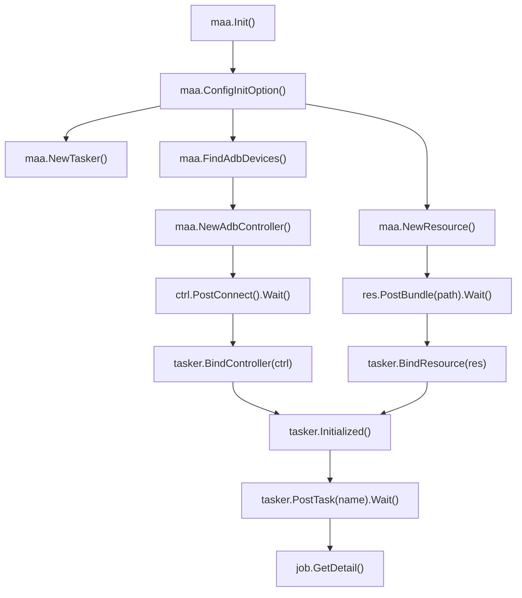
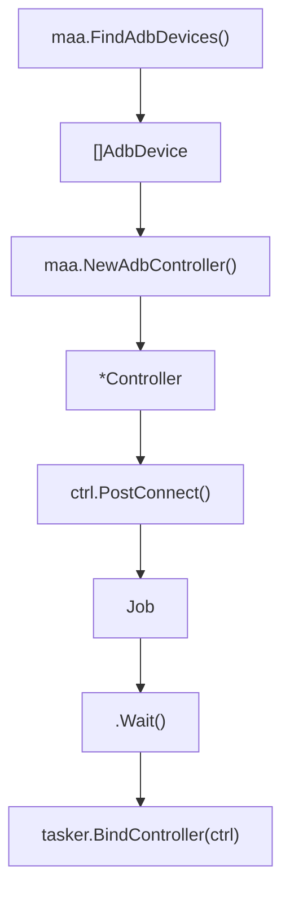
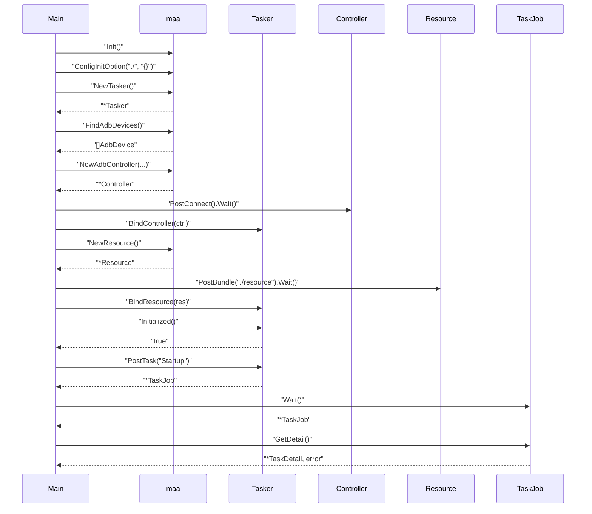

# Quick Start Guide

Relevant source files

* [README.md](https://github.com/MaaXYZ/maa-framework-go/blob/5f9c965c/README.md?plain=1)
* [README\_zh.md](https://github.com/MaaXYZ/maa-framework-go/blob/5f9c965c/README_zh.md?plain=1)
* [context.go](https://github.com/MaaXYZ/maa-framework-go/blob/5f9c965c/context.go)
* [examples/custom-action/main.go](https://github.com/MaaXYZ/maa-framework-go/blob/5f9c965c/examples/custom-action/main.go)
* [examples/quick-start/main.go](https://github.com/MaaXYZ/maa-framework-go/blob/5f9c965c/examples/quick-start/main.go)
* [tasker.go](https://github.com/MaaXYZ/maa-framework-go/blob/5f9c965c/tasker.go)
* [test/pipleline\_smoking\_test.go](https://github.com/MaaXYZ/maa-framework-go/blob/5f9c965c/test/pipleline_smoking_test.go)
* [test/run\_without\_file\_test.go](https://github.com/MaaXYZ/maa-framework-go/blob/5f9c965c/test/run_without_file_test.go)

This page provides an end-to-end walkthrough of assembling a working maa-framework-go program: initializing the framework, connecting to a device, loading resources, running a task, and reading results. It covers the exact call sequence every program must follow.

For installation steps and library path configuration, see [Installation and Initialization](/MaaXYZ/maa-framework-go/2.1-installation-and-initialization). For deeper reference on each component used here, see [Core Components](/MaaXYZ/maa-framework-go/3-core-components).

---

## Overview of the Call Sequence

Every maa-framework-go program follows a fixed construction order. The `Tasker` cannot be used until both a `Controller` and a `Resource` are bound to it.

**Initialization and execution flow:**



Sources: [examples/quick-start/main.go1-64](https://github.com/MaaXYZ/maa-framework-go/blob/5f9c965c/examples/quick-start/main.go#L1-L64)

---

## Step 1: Initialize the Framework

`maa.Init()` must be called before any other framework function. It loads the native MaaFramework shared libraries via purego. Functional options such as `maa.WithLibDir` control where libraries are found.

`maa.ConfigInitOption(userPath, defaultConfig)` sets the user data directory and a default JSON configuration string. The `userPath` argument is typically `"./"` for the current working directory.

```
maa.Init()
maa.ConfigInitOption("./", "{}")
```

Both calls must succeed before any struct is created. `ConfigInitOption` returns an `error`; check it before proceeding.

Sources: [examples/quick-start/main.go11-15](https://github.com/MaaXYZ/maa-framework-go/blob/5f9c965c/examples/quick-start/main.go#L11-L15) [README.md101-106](https://github.com/MaaXYZ/maa-framework-go/blob/5f9c965c/README.md?plain=1#L101-L106)

---

## Step 2: Create a Tasker

`NewTasker()` allocates the central orchestrator struct. It returns `(*Tasker, error)`. Always `defer tasker.Destroy()` immediately after a successful creation.

```
tasker, err := maa.NewTasker()
defer tasker.Destroy()
```

At this point, `tasker.Initialized()` returns `false` because no `Controller` or `Resource` has been bound yet.

Sources: [examples/quick-start/main.go16-22](https://github.com/MaaXYZ/maa-framework-go/blob/5f9c965c/examples/quick-start/main.go#L16-L22) [tasker\_test.go10-15](https://github.com/MaaXYZ/maa-framework-go/blob/5f9c965c/tasker_test.go#L10-L15)

---

## Step 3: Connect a Controller

### Discover ADB Devices

`maa.FindAdbDevices()` queries the system for connected Android devices via ADB. It returns `([]AdbDevice, error)`.

| Field | Type | Description |
| --- | --- | --- |
| `AdbPath` | `string` | Path to the `adb` executable |
| `Address` | `string` | Device serial or host:port |
| `ScreencapMethod` | `AdbScreencapMethod` | Selected screencap method |
| `InputMethod` | `AdbInputMethod` | Selected input method |
| `Config` | `string` | JSON config blob from the framework |

### Create and Connect the Controller

`maa.NewAdbController(adbPath, address, screencapMethod, inputMethod, config, agentPath)` returns `(*Controller, error)`.

`PostConnect()` is asynchronous. It returns a `Job`. Calling `.Wait()` on the job blocks until the connection completes. Always check the result before proceeding.

```
ctrl.PostConnect().Wait()
tasker.BindController(ctrl)
```

**Controller and device discovery flow:**



Sources: [examples/quick-start/main.go23-43](https://github.com/MaaXYZ/maa-framework-go/blob/5f9c965c/examples/quick-start/main.go#L23-L43) [README.md114-134](https://github.com/MaaXYZ/maa-framework-go/blob/5f9c965c/README.md?plain=1#L114-L134)

For other controller types (Win32, PlayCover, Gamepad, Custom), see [Device Discovery and Connection](/MaaXYZ/maa-framework-go/2.3-device-discovery-and-connection) and [Controller](/MaaXYZ/maa-framework-go/3.2-controller).

---

## Step 4: Load a Resource

`maa.NewResource()` allocates the resource manager. `res.PostBundle(path)` asynchronously loads a resource bundle directory — a folder containing pipeline JSON files, images, and models. Like `PostConnect`, it returns a `Job`; call `.Wait()` to block until loading finishes.

```
res, err := maa.NewResource()
defer res.Destroy()
res.PostBundle("./resource").Wait()
tasker.BindResource(res)
```

The resource directory layout that MaaFramework expects:

```
./resource/
  pipeline/       ← JSON files defining tasks and nodes
  image/          ← Template images for recognition
  model/          ← ONNX or other inference models
```

Sources: [examples/quick-start/main.go44-54](https://github.com/MaaXYZ/maa-framework-go/blob/5f9c965c/examples/quick-start/main.go#L44-L54) [resource\_test.go246-252](https://github.com/MaaXYZ/maa-framework-go/blob/5f9c965c/resource_test.go#L246-L252)

---

## Step 5: Verify Initialization

`tasker.Initialized()` returns `true` only when both a connected `Controller` and a loaded `Resource` have been bound. Check this before posting any tasks.

```
if !tasker.Initialized() {
    // Controller or Resource setup failed
}
```

Sources: [examples/quick-start/main.go53-56](https://github.com/MaaXYZ/maa-framework-go/blob/5f9c965c/examples/quick-start/main.go#L53-L56) [tasker\_test.go49-64](https://github.com/MaaXYZ/maa-framework-go/blob/5f9c965c/tasker_test.go#L49-L64)

---

## Step 6: Post a Task and Wait

`tasker.PostTask(entryNodeName, optionalPipeline...)` submits a task for execution. The first argument is the name of the entry node defined in the loaded pipeline JSON. It returns a `*TaskJob`.

`TaskJob.Wait()` blocks until the task finishes and returns itself, enabling method chaining. `TaskJob.GetDetail()` retrieves the full `*TaskDetail` after completion.

```
detail, err := tasker.PostTask("Startup").Wait().GetDetail()
```

**Task submission and result flow:**

Sources: [examples/quick-start/main.go58-63](https://github.com/MaaXYZ/maa-framework-go/blob/5f9c965c/examples/quick-start/main.go#L58-L63) [tasker\_test.go86-92](https://github.com/MaaXYZ/maa-framework-go/blob/5f9c965c/tasker_test.go#L86-L92)

---

## Complete Example

The canonical minimal program is at [examples/quick-start/main.go1-64](https://github.com/MaaXYZ/maa-framework-go/blob/5f9c965c/examples/quick-start/main.go#L1-L64) The full sequence assembled:



Sources: [examples/quick-start/main.go1-64](https://github.com/MaaXYZ/maa-framework-go/blob/5f9c965c/examples/quick-start/main.go#L1-L64) [README.md89-156](https://github.com/MaaXYZ/maa-framework-go/blob/5f9c965c/README.md?plain=1#L89-L156)

---

## Key Types and Functions Reference

| Symbol | Package-level or Method | Returns | Purpose |
| --- | --- | --- | --- |
| `maa.Init` | package | — | Load native libraries |
| `maa.ConfigInitOption` | package | `error` | Set user path and default config |
| `maa.FindAdbDevices` | package | `[]AdbDevice, error` | Enumerate ADB-connected devices |
| `maa.NewAdbController` | package | `*Controller, error` | Create ADB controller |
| `maa.NewResource` | package | `*Resource, error` | Create resource manager |
| `maa.NewTasker` | package | `*Tasker, error` | Create task orchestrator |
| `ctrl.PostConnect` | `*Controller` | `*Job` | Initiate device connection |
| `res.PostBundle` | `*Resource` | `*Job` | Load resource directory |
| `tasker.BindController` | `*Tasker` | `error` | Attach controller |
| `tasker.BindResource` | `*Tasker` | `error` | Attach resource |
| `tasker.Initialized` | `*Tasker` | `bool` | Check full initialization |
| `tasker.PostTask` | `*Tasker` | `*TaskJob` | Submit a named task |
| `job.Wait` | `*TaskJob` | `*TaskJob` | Block until completion |
| `job.GetDetail` | `*TaskJob` | `*TaskDetail, error` | Retrieve execution results |

Sources: [examples/quick-start/main.go1-64](https://github.com/MaaXYZ/maa-framework-go/blob/5f9c965c/examples/quick-start/main.go#L1-L64) [tasker\_test.go1-92](https://github.com/MaaXYZ/maa-framework-go/blob/5f9c965c/tasker_test.go#L1-L92) [resource\_test.go10-20](https://github.com/MaaXYZ/maa-framework-go/blob/5f9c965c/resource_test.go#L10-L20)

---

## What Comes Next

* To use a different controller type (Windows desktop, iOS via PlayCover), see [Device Discovery and Connection](/MaaXYZ/maa-framework-go/2.3-device-discovery-and-connection).
* To define custom automation logic beyond what JSON pipelines provide, see [Your First Custom Action](/MaaXYZ/maa-framework-go/2.4-your-first-custom-action) and [Your First Custom Recognition](/MaaXYZ/maa-framework-go/2.5-your-first-custom-recognition).
* For the complete reference on pipeline node definitions and task flow, see [Pipeline and Nodes](/MaaXYZ/maa-framework-go/3.5-pipeline-and-nodes) and [Pipeline Architecture](/MaaXYZ/maa-framework-go/4.1-pipeline-architecture).