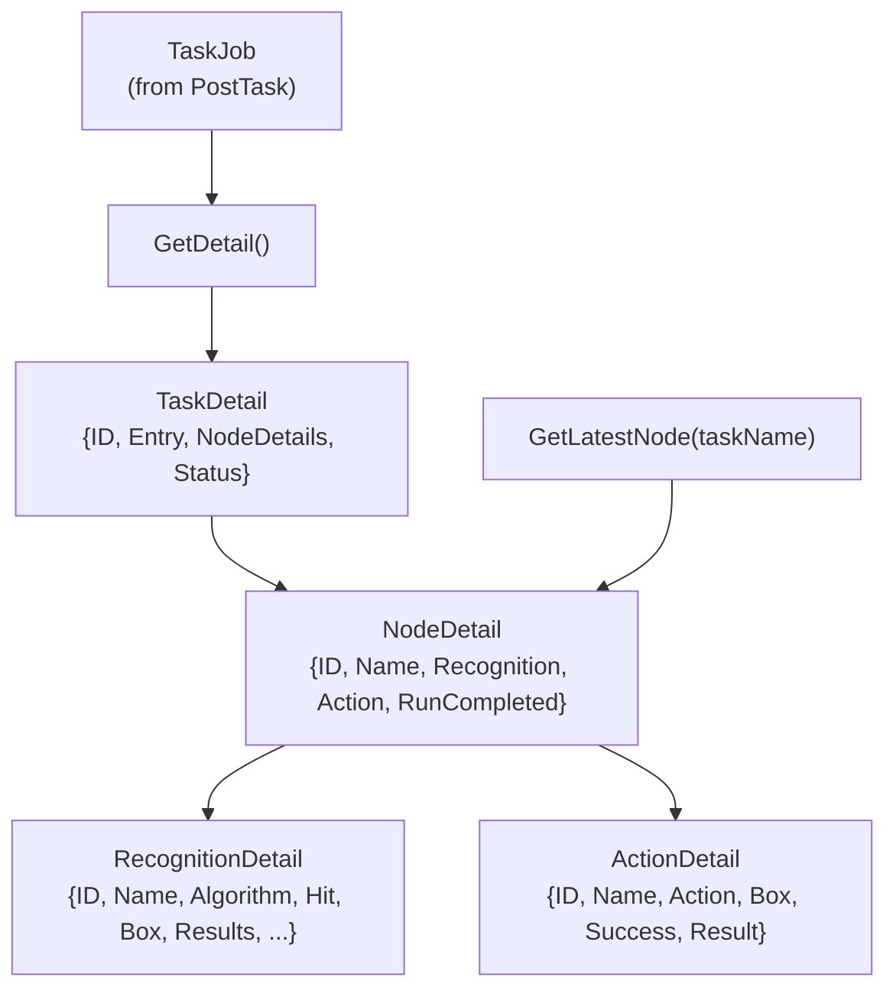
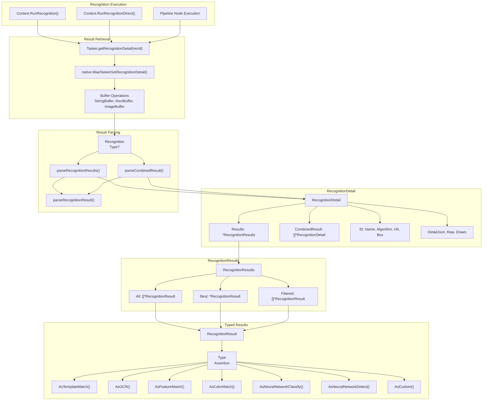
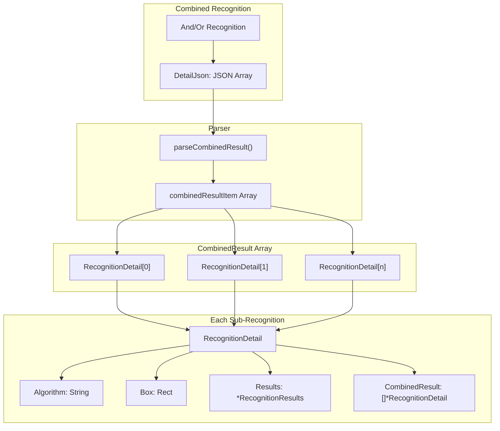
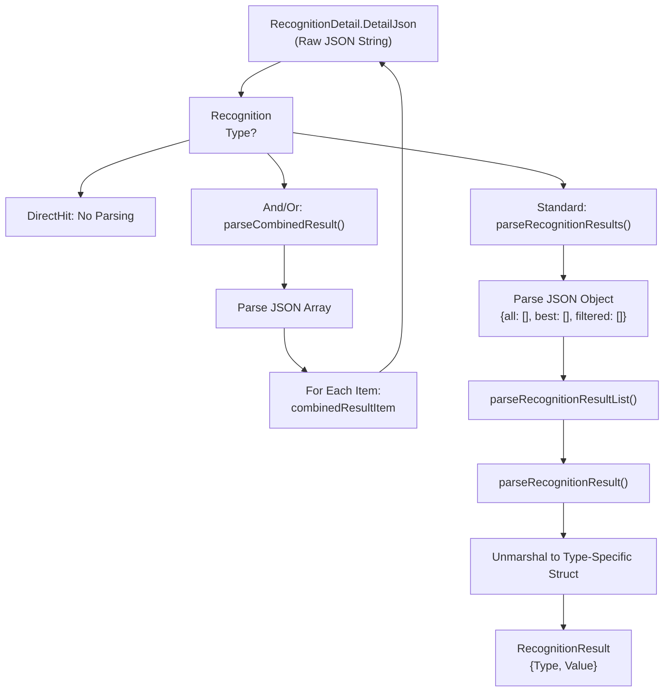

# Recognition Result Handling

Relevant source files

* [CHANGELOG.md](https://github.com/MaaXYZ/maa-framework-go/blob/5f9c965c/CHANGELOG.md?plain=1)
* [context.go](https://github.com/MaaXYZ/maa-framework-go/blob/5f9c965c/context.go)
* [event.go](https://github.com/MaaXYZ/maa-framework-go/blob/5f9c965c/event.go)
* [recognition\_result.go](https://github.com/MaaXYZ/maa-framework-go/blob/5f9c965c/recognition_result.go)
* [recognition\_result\_test.go](https://github.com/MaaXYZ/maa-framework-go/blob/5f9c965c/recognition_result_test.go)
* [tasker.go](https://github.com/MaaXYZ/maa-framework-go/blob/5f9c965c/tasker.go)

This page documents how recognition results are structured, parsed, and accessed after a recognition operation completes. Recognition results provide detailed information about what was detected, including bounding boxes, scores, and algorithm-specific data. For information about defining recognition parameters, see [Recognition Types](/MaaXYZ/maa-framework-go/4.2-recognition-types). For information about executing recognitions, see [Context](/MaaXYZ/maa-framework-go/3.4-context).

## Overview

When a recognition operation completes—whether through `Context.RunRecognition()`, `Context.RunRecognitionDirect()`, or as part of a pipeline node—the framework returns a `RecognitionDetail` object containing comprehensive information about what was detected. This object includes:

* **Algorithm metadata**: The recognition type and node name
* **Hit status**: Whether the recognition succeeded
* **Bounding box**: The detected region
* **Structured results**: Type-specific data parsed from JSON
* **Raw JSON**: The original detail JSON for custom parsing
* **Debug images**: Raw and annotated images when debug mode is enabled

Sources: [tasker.go229-241](https://github.com/MaaXYZ/maa-framework-go/blob/5f9c965c/tasker.go#L229-L241) [context.go79-94](https://github.com/MaaXYZ/maa-framework-go/blob/5f9c965c/context.go#L79-L94)

## Retrieving Results from Tasker

`Tasker` exposes four methods to query execution results by ID after a task runs:

| Method | Signature | Description |
| --- | --- | --- |
| `GetRecognitionDetail` | `(recId int64) (*RecognitionDetail, error)` | Fetch recognition detail by recognition ID |
| `GetActionDetail` | `(actionId int64) (*ActionDetail, error)` | Fetch action detail by action ID |
| `GetTaskDetail` | `(taskId int64) (*TaskDetail, error)` | Fetch full task detail including all node results |
| `GetLatestNode` | `(taskName string) (*NodeDetail, error)` | Fetch the most recent node execution for a given node name |

**ID sources:**

* `Context.RunRecognition()` and `Context.RunRecognitionDirect()` call `Tasker.GetRecognitionDetail` internally and return `*RecognitionDetail` directly.
* `Context.RunAction()` and `Context.RunActionDirect()` call `Tasker.GetActionDetail` internally.
* `TaskJob.GetDetail()` (returned by `PostTask`) calls `GetTaskDetail`, which resolves all node IDs and their embedded recognition/action details.
* In custom action/recognition callbacks, `CustomActionArg.TaskID` or `CustomRecognitionArg.TaskID` can be passed to `Tasker.GetTaskDetail(taskId)` to fetch the full task state on demand.

Sources: [tasker.go244-307](https://github.com/MaaXYZ/maa-framework-go/blob/5f9c965c/tasker.go#L244-L307) [tasker.go320-359](https://github.com/MaaXYZ/maa-framework-go/blob/5f9c965c/tasker.go#L320-L359) [tasker.go416-478](https://github.com/MaaXYZ/maa-framework-go/blob/5f9c965c/tasker.go#L416-L478) [context.go38-94](https://github.com/MaaXYZ/maa-framework-go/blob/5f9c965c/context.go#L38-L94) [custom\_action.go37-44](https://github.com/MaaXYZ/maa-framework-go/blob/5f9c965c/custom_action.go#L37-L44) [custom\_recognition.go38-45](https://github.com/MaaXYZ/maa-framework-go/blob/5f9c965c/custom_recognition.go#L38-L45)

## RecognitionDetail Structure

The `RecognitionDetail` struct [tasker.go229-241](https://github.com/MaaXYZ/maa-framework-go/blob/5f9c965c/tasker.go#L229-L241) is the primary container for recognition results:

| Field | Type | Description |
| --- | --- | --- |
| `ID` | `int64` | Unique recognition operation identifier |
| `Name` | `string` | Node name from the pipeline |
| `Algorithm` | `string` | Recognition type (e.g., "OCR", "TemplateMatch") |
| `Hit` | `bool` | Whether the recognition succeeded |
| `Box` | `Rect` | Bounding box of the detected region |
| `DetailJson` | `string` | Raw JSON containing algorithm-specific details |
| `Results` | `*RecognitionResults` | Parsed structured results (nil for DirectHit, And, Or) |
| `CombinedResult` | `[]*RecognitionDetail` | For And/Or algorithms: array of sub-recognitions |
| `Raw` | `image.Image` | Original screenshot (available when debug mode enabled) |
| `Draws` | `[]image.Image` | Annotated images (available when debug mode enabled) |

The `Results` field is populated for most recognition types but remains `nil` for `DirectHit`, `And`, and `Or` recognitions. Combined recognitions use the `CombinedResult` field instead.

Sources: [tasker.go229-241](https://github.com/MaaXYZ/maa-framework-go/blob/5f9c965c/tasker.go#L229-L241) [recognition\_result.go123-130](https://github.com/MaaXYZ/maa-framework-go/blob/5f9c965c/recognition_result.go#L123-L130)

## ActionDetail Structure

`ActionDetail` [tasker.go310-318](https://github.com/MaaXYZ/maa-framework-go/blob/5f9c965c/tasker.go#L310-L318) contains the outcome of a single action execution:

| Field | Type | Description |
| --- | --- | --- |
| `ID` | `int64` | Unique action operation identifier |
| `Name` | `string` | Node name from the pipeline |
| `Action` | `string` | Action type string (e.g., `"Click"`, `"Swipe"`) |
| `Box` | `Rect` | Bounding box used by the action (from the recognition hit box) |
| `Success` | `bool` | Whether the action completed successfully |
| `DetailJson` | `string` | Raw JSON containing action-specific details |
| `Result` | `*ActionResult` | Parsed typed action result |

`GetActionDetail(actionId)` [tasker.go320-359](https://github.com/MaaXYZ/maa-framework-go/blob/5f9c965c/tasker.go#L320-L359) fetches the action detail from the native runtime, parses `DetailJson` into the typed `ActionResult` via `parseActionResult`, and returns the populated struct.

Sources: [tasker.go310-359](https://github.com/MaaXYZ/maa-framework-go/blob/5f9c965c/tasker.go#L310-L359)

## NodeDetail and TaskDetail Structures

### NodeDetail

`NodeDetail` [tasker.go362-368](https://github.com/MaaXYZ/maa-framework-go/blob/5f9c965c/tasker.go#L362-L368) represents a single pipeline node execution:

| Field | Type | Description |
| --- | --- | --- |
| `ID` | `int64` | Unique node execution identifier |
| `Name` | `string` | Node name from the pipeline |
| `Recognition` | `*RecognitionDetail` | Recognition result for this node (fully parsed) |
| `Action` | `*ActionDetail` | Action result for this node (fully parsed) |
| `RunCompleted` | `bool` | Whether the node completed a full execution cycle |

### TaskDetail

`TaskDetail` [tasker.go408-413](https://github.com/MaaXYZ/maa-framework-go/blob/5f9c965c/tasker.go#L408-L413) represents a complete task execution:

| Field | Type | Description |
| --- | --- | --- |
| `ID` | `int64` | Task ID (same as the ID returned by `PostTask`) |
| `Entry` | `string` | Entry node name used to start the task |
| `NodeDetails` | `[]*NodeDetail` | All nodes executed during this task, in order |
| `Status` | `Status` | Final task status (`StatusSuccess`, `StatusFailure`, etc.) |

`GetTaskDetail(taskId)` [tasker.go416-467](https://github.com/MaaXYZ/maa-framework-go/blob/5f9c965c/tasker.go#L416-L467) first fetches the total node count, then fetches the list of node IDs, then resolves each into a `NodeDetail` (with embedded `RecognitionDetail` and `ActionDetail`). `GetLatestNode(taskName)` [tasker.go470-478](https://github.com/MaaXYZ/maa-framework-go/blob/5f9c965c/tasker.go#L470-L478) resolves only the most recently executed node of a given name—useful for polling a specific node's result without iterating all task nodes.



**Diagram: TaskDetail / NodeDetail / RecognitionDetail / ActionDetail nesting**

Sources: [tasker.go362-478](https://github.com/MaaXYZ/maa-framework-go/blob/5f9c965c/tasker.go#L362-L478)

## Recognition Result Architecture



**Diagram: Recognition Result Retrieval and Parsing Flow**

This diagram shows how recognition results flow from execution through retrieval, parsing, and type-safe access. The framework automatically parses the native JSON into structured Go types.

Sources: [tasker.go244-307](https://github.com/MaaXYZ/maa-framework-go/blob/5f9c965c/tasker.go#L244-L307) [recognition\_result.go176-207](https://github.com/MaaXYZ/maa-framework-go/blob/5f9c965c/recognition_result.go#L176-L207) [recognition\_result.go254-298](https://github.com/MaaXYZ/maa-framework-go/blob/5f9c965c/recognition_result.go#L254-L298)

## RecognitionResults and RecognitionResult Types

### RecognitionResults Container

The `RecognitionResults` struct [recognition\_result.go123-130](https://github.com/MaaXYZ/maa-framework-go/blob/5f9c965c/recognition_result.go#L123-L130) organizes results into three categories:

| Field | Type | Description |
| --- | --- | --- |
| `All` | `[]*RecognitionResult` | All detected instances |
| `Best` | `*RecognitionResult` | Single highest-scoring result after ordering (nil if no match) |
| `Filtered` | `[]*RecognitionResult` | Results after applying count/threshold filters |

The framework populates these fields based on the recognition configuration. For example, an OCR recognition might find 10 text regions in `All`, apply threshold/count filters to produce `Filtered`, and store the single top-scoring item as `Best`.

Sources: [recognition\_result.go123-130](https://github.com/MaaXYZ/maa-framework-go/blob/5f9c965c/recognition_result.go#L123-L130)

### RecognitionResult Type

Each `RecognitionResult` [recognition\_result.go8-11](https://github.com/MaaXYZ/maa-framework-go/blob/5f9c965c/recognition_result.go#L8-L11) wraps a type-specific result structure:

| Method | Return Type | Recognition Type |
| --- | --- | --- |
| `Type()` | `RecognitionType` | Returns the recognition algorithm |
| `Value()` | `any` | Returns the underlying result struct |
| `AsTemplateMatch()` | `(*TemplateMatchResult, bool)` | Template matching results |
| `AsFeatureMatch()` | `(*FeatureMatchResult, bool)` | Feature matching results |
| `AsColorMatch()` | `(*ColorMatchResult, bool)` | Color matching results |
| `AsOCR()` | `(*OCRResult, bool)` | OCR text recognition results |
| `AsNeuralNetworkClassify()` | `(*NeuralNetworkClassifyResult, bool)` | Classification results |
| `AsNeuralNetworkDetect()` | `(*NeuralNetworkDetectResult, bool)` | Object detection results |
| `AsCustom()` | `(*CustomRecognitionResult, bool)` | Custom recognition results |

The `As*()` methods provide type-safe access with a boolean indicating success. The second return value is `false` if the recognition type doesn't match.

Sources: [recognition\_result.go8-84](https://github.com/MaaXYZ/maa-framework-go/blob/5f9c965c/recognition_result.go#L8-L84)

## Type-Specific Result Structures

### Template Matching Result

```
```
type TemplateMatchResult struct {


Box   Rect    `json:"box"`    // Bounding box of the match


Score float64 `json:"score"`  // Similarity score (0.0-1.0)


}
```
```

Sources: [recognition\_result.go86-89](https://github.com/MaaXYZ/maa-framework-go/blob/5f9c965c/recognition_result.go#L86-L89)

### Feature Matching Result

```
```
type FeatureMatchResult struct {


Box   Rect `json:"box"`    // Bounding box of the match


Count int  `json:"count"`  // Number of matched keypoints


}
```
```

Sources: [recognition\_result.go91-94](https://github.com/MaaXYZ/maa-framework-go/blob/5f9c965c/recognition_result.go#L91-L94)

### Color Matching Result

```
```
type ColorMatchResult struct {


Box   Rect `json:"box"`    // Bounding box of matched region


Count int  `json:"count"`  // Number of matching pixels


}
```
```

Sources: [recognition\_result.go96-99](https://github.com/MaaXYZ/maa-framework-go/blob/5f9c965c/recognition_result.go#L96-L99)

### OCR Result

```
```
type OCRResult struct {


Box   Rect    `json:"box"`    // Text bounding box


Text  string  `json:"text"`   // Recognized text


Score float64 `json:"score"`  // Confidence score (0.0-1.0)


}
```
```

Sources: [recognition\_result.go101-105](https://github.com/MaaXYZ/maa-framework-go/blob/5f9c965c/recognition_result.go#L101-L105)

### Neural Network Classification Result

```
```
type NeuralNetworkClassifyResult struct {


Box      Rect    `json:"box"`       // Image region classified


ClsIndex uint64  `json:"cls_index"` // Class index


Label    string  `json:"label"`     // Class label name


Score    float64 `json:"score"`     // Highest probability


}
```
```

Sources: [recognition\_result.go108-113](https://github.com/MaaXYZ/maa-framework-go/blob/5f9c965c/recognition_result.go#L108-L113)

### Neural Network Detection Result

```
```
type NeuralNetworkDetectResult struct {


Box      Rect    `json:"box"`       // Detected object bounding box


ClsIndex uint64  `json:"cls_index"` // Class index


Label    string  `json:"label"`     // Class label name


Score    float64 `json:"score"`     // Detection confidence


}
```
```

Sources: [recognition\_result.go116-121](https://github.com/MaaXYZ/maa-framework-go/blob/5f9c965c/recognition_result.go#L116-L121)

### Custom Recognition Result

Custom recognitions return the `Box` and `Detail` fields provided by the `CustomRecognitionRunner` implementation. The `Detail` field is stored as a string and can contain arbitrary data.

Sources: [recognition\_result.go78-85](https://github.com/MaaXYZ/maa-framework-go/blob/5f9c965c/recognition_result.go#L78-L85) [custom\_recognition.go47-53](https://github.com/MaaXYZ/maa-framework-go/blob/5f9c965c/custom_recognition.go#L47-L53)

## Accessing Recognition Results

### Basic Pattern

```
```
// Run a recognition


detail, err := ctx.RunRecognition("FindButton", img, pipeline)


if err != nil {


return err


}


// Check if recognition succeeded


if !detail.Hit {


return errors.New("button not found")


}


// Access bounding box


buttonBox := detail.Box


// Access structured results


if detail.Results != nil {


// Check if a best result was found


if detail.Results.Best != nil {


bestResult := detail.Results.Best


// Type-safe access to specific result type


if ocrResult, ok := bestResult.AsOCR(); ok {


fmt.Printf("Found text: %s (score: %.2f)\n",


ocrResult.Text, ocrResult.Score)


}


}


}
```
```

Sources: [context.go96-130](https://github.com/MaaXYZ/maa-framework-go/blob/5f9c965c/context.go#L96-L130) [recognition\_result\_test.go178-288](https://github.com/MaaXYZ/maa-framework-go/blob/5f9c965c/recognition_result_test.go#L178-L288)

### Iterating Through Results

```
```
// Process all detected instances


for i, result := range detail.Results.All {


switch result.Type() {


case RecognitionTypeTemplateMatch:


if tm, ok := result.AsTemplateMatch(); ok {


fmt.Printf("Match %d: score=%.2f\n", i, tm.Score)


}


case RecognitionTypeOCR:


if ocr, ok := result.AsOCR(); ok {


fmt.Printf("Text %d: %s\n", i, ocr.Text)


}


case RecognitionTypeColorMatch:


if cm, ok := result.AsColorMatch(); ok {


fmt.Printf("Color match %d: count=%d\n", i, cm.Count)


}


}


}
```
```

Sources: [recognition\_result.go13-84](https://github.com/MaaXYZ/maa-framework-go/blob/5f9c965c/recognition_result.go#L13-L84) [recognition\_result\_test.go260-279](https://github.com/MaaXYZ/maa-framework-go/blob/5f9c965c/recognition_result_test.go#L260-L279)

## Combined Recognition Results

### And/Or Recognition Structure

Combined recognitions (`And`, `Or`) use a different result structure. Instead of `Results`, they populate the `CombinedResult` field with an array of `RecognitionDetail` objects representing each sub-recognition.



**Diagram: Combined Recognition Result Structure**

Combined recognitions support recursive nesting—a sub-recognition can itself be an `And` or `Or` type, creating a tree structure.

Sources: [recognition\_result.go244-298](https://github.com/MaaXYZ/maa-framework-go/blob/5f9c965c/recognition_result.go#L244-L298) [tasker.go282-293](https://github.com/MaaXYZ/maa-framework-go/blob/5f9c965c/tasker.go#L282-L293)

### Combined Result JSON Format

The `DetailJson` field for combined recognitions contains a JSON array:

```
```
[


{


"algorithm": "TemplateMatch",


"box": [x, y, w, h],


"detail": {"all": [...], "best": [...], "filtered": [...]},


"name": "template_check",


"reco_id": 12345


},


{


"algorithm": "ColorMatch",


"box": [x, y, w, h],


"detail": {"all": [...], "best": [...], "filtered": [...]},


"name": "color_check",


"reco_id": 12346


}


]
```
```

Each item represents one sub-recognition with its complete detail structure.

Sources: [recognition\_result.go235-243](https://github.com/MaaXYZ/maa-framework-go/blob/5f9c965c/recognition_result.go#L235-L243)

### Accessing Combined Results

```
```
// Run an And recognition


detail, err := ctx.RunRecognition("ComplexCheck", img, pipeline)


if err != nil {


return err


}


// For And/Or recognitions, Results is nil


if detail.Results == nil && detail.CombinedResult != nil {


fmt.Printf("Combined recognition with %d sub-recognitions\n",


len(detail.CombinedResult))


// Iterate through sub-recognitions


for i, subDetail := range detail.CombinedResult {


fmt.Printf("Sub-recognition %d: %s (%s)\n",


i, subDetail.Name, subDetail.Algorithm)


// Each sub-recognition has its own Results


if subDetail.Results != nil && len(subDetail.Results.Best) > 0 {


// Access type-specific data


if subDetail.Algorithm == string(RecognitionTypeTemplateMatch) {


if tm, ok := subDetail.Results.Best[0].AsTemplateMatch(); ok {


fmt.Printf("  Template score: %.2f\n", tm.Score)


}


}


}


// Handle nested combined recognitions


if subDetail.CombinedResult != nil {


fmt.Printf("  Nested combined recognition\n")


}


}


}
```
```

Sources: [recognition\_result\_test.go250-258](https://github.com/MaaXYZ/maa-framework-go/blob/5f9c965c/recognition_result_test.go#L250-L258) [recognition\_result\_test.go340-364](https://github.com/MaaXYZ/maa-framework-go/blob/5f9c965c/recognition_result_test.go#L340-L364)

## Parsing Implementation Details

### Parsing Flow



**Diagram: Recognition Result Parsing Pipeline**

The framework determines the parsing strategy based on the recognition algorithm and automatically handles nested structures.

Sources: [recognition\_result.go176-233](https://github.com/MaaXYZ/maa-framework-go/blob/5f9c965c/recognition_result.go#L176-L233) [recognition\_result.go254-298](https://github.com/MaaXYZ/maa-framework-go/blob/5f9c965c/recognition_result.go#L254-L298) [recognition\_result.go132-174](https://github.com/MaaXYZ/maa-framework-go/blob/5f9c965c/recognition_result.go#L132-L174)

### Parser Functions

| Function | Purpose | Input | Output |
| --- | --- | --- | --- |
| `parseRecognitionResults()` | Parse standard recognition results | Algorithm type, DetailJson | `*RecognitionResults` |
| `parseCombinedResult()` | Parse And/Or recognition results | DetailJson | `[]*RecognitionDetail` |
| `parseRecognitionResultList()` | Parse result array or single object | Algorithm type, JSON array | `[]*RecognitionResult` |
| `parseRecognitionResult()` | Parse single result item | Algorithm type, JSON object | `*RecognitionResult` |
| `isCombinedRecognition()` | Check if algorithm is And/Or | Algorithm string | `bool` |

Sources: [recognition\_result.go176-233](https://github.com/MaaXYZ/maa-framework-go/blob/5f9c965c/recognition_result.go#L176-L233) [recognition\_result.go244-298](https://github.com/MaaXYZ/maa-framework-go/blob/5f9c965c/recognition_result.go#L244-L298)

### JSON Format Flexibility

The parsing logic [recognition\_result.go209-233](https://github.com/MaaXYZ/maa-framework-go/blob/5f9c965c/recognition_result.go#L209-L233) handles both array and single-object formats:

```
```
// Array format


{"all": [{"box": [...]}, {"box": [...]}]}


// Single object format (automatically converted to array)


{"all": {"box": [...]}}


// Empty/null formats


{"all": null}


{"all": []}
```
```

This flexibility allows the native framework to return either format depending on the recognition parameters.

Sources: [recognition\_result.go209-233](https://github.com/MaaXYZ/maa-framework-go/blob/5f9c965c/recognition_result.go#L209-L233) [recognition\_result\_test.go14-38](https://github.com/MaaXYZ/maa-framework-go/blob/5f9c965c/recognition_result_test.go#L14-L38)

## Result Validation

### Testing Result Consistency

The test suite [recognition\_result\_test.go290-338](https://github.com/MaaXYZ/maa-framework-go/blob/5f9c965c/recognition_result_test.go#L290-L338) validates that parsed results match the raw JSON:

```
```
func requireRecognitionResultMatchesRaw(t *testing.T,


result *RecognitionResult, raw map[string]any) {


// Marshal the structured result back to JSON


resultJSON, err := json.Marshal(result.Value())


require.NoError(t, err)


// Compare with original raw data


resultMap := map[string]any{}


require.NoError(t, json.Unmarshal(resultJSON, &resultMap))


// Verify all fields match


for key, rawVal := range raw {


resultVal, ok := resultMap[key]


require.True(t, ok, "result missing key: %s", key)


require.Equal(t, rawVal, resultVal)


}


}
```
```

This ensures that no data is lost during parsing and that the structured types accurately represent the underlying JSON.

Sources: [recognition\_result\_test.go290-338](https://github.com/MaaXYZ/maa-framework-go/blob/5f9c965c/recognition_result_test.go#L290-L338)

## DirectHit Special Case

The `DirectHit` recognition type always succeeds and has no meaningful result data. For this type:

* `RecognitionDetail.Hit` is always `true`
* `RecognitionDetail.Results` is `nil`
* `RecognitionDetail.DetailJson` is empty or `"{}"` or `"null"`

This is by design—`DirectHit` is used for flow control, not detection.

Sources: [recognition\_result.go179-181](https://github.com/MaaXYZ/maa-framework-go/blob/5f9c965c/recognition_result.go#L179-L181) [recognition\_result\_test.go188-190](https://github.com/MaaXYZ/maa-framework-go/blob/5f9c965c/recognition_result_test.go#L188-L190)

## Error Handling

### Parsing Failures

If parsing fails, the methods return sensible defaults rather than panicking:

* `parseRecognitionResults()` returns an empty `RecognitionResults` with zero-length arrays
* `parseRecognitionResultList()` returns an empty slice on parse errors
* Type assertion methods (`AsOCR()`, etc.) return `nil, false` on type mismatch

### Checking for Results

Always check if results exist before accessing them:

```
```
if detail.Results != nil && detail.Results.Best != nil {


bestResult := detail.Results.Best


// Safe to access


}
```
```

For combined recognitions:

```
```
if detail.CombinedResult != nil && len(detail.CombinedResult) > 0 {


firstSub := detail.CombinedResult[0]


// Safe to access


}
```
```

Sources: [recognition\_result.go183-189](https://github.com/MaaXYZ/maa-framework-go/blob/5f9c965c/recognition_result.go#L183-L189) [recognition\_result\_test.go268-274](https://github.com/MaaXYZ/maa-framework-go/blob/5f9c965c/recognition_result_test.go#L268-L274)

## Integration with Context API

The `Context` methods automatically retrieve and parse recognition results:

| Method | Returns | Description |
| --- | --- | --- |
| `RunRecognition()` | `(*RecognitionDetail, error)` | Run recognition with pipeline override |
| `RunRecognitionDirect()` | `(*RecognitionDetail, error)` | Run recognition with direct parameters |

Both methods:

1. Execute the recognition via the native framework
2. Retrieve the raw result buffers
3. Call `Tasker.GetRecognitionDetail()` [tasker.go244-307](https://github.com/MaaXYZ/maa-framework-go/blob/5f9c965c/tasker.go#L244-L307)
4. Parse the JSON into structured types
5. Return the complete `RecognitionDetail`

Sources: [context.go79-94](https://github.com/MaaXYZ/maa-framework-go/blob/5f9c965c/context.go#L79-L94) [context.go200-235](https://github.com/MaaXYZ/maa-framework-go/blob/5f9c965c/context.go#L200-L235) [tasker.go244-307](https://github.com/MaaXYZ/maa-framework-go/blob/5f9c965c/tasker.go#L244-L307)

## Summary Table

| Recognition Type | Results Field | CombinedResult Field | Primary Result Type |
| --- | --- | --- | --- |
| DirectHit | `nil` | `nil` | N/A |
| TemplateMatch | `*RecognitionResults` | `nil` | `TemplateMatchResult` |
| FeatureMatch | `*RecognitionResults` | `nil` | `FeatureMatchResult` |
| ColorMatch | `*RecognitionResults` | `nil` | `ColorMatchResult` |
| OCR | `*RecognitionResults` | `nil` | `OCRResult` |
| NeuralNetworkClassify | `*RecognitionResults` | `nil` | `NeuralNetworkClassifyResult` |
| NeuralNetworkDetect | `*RecognitionResults` | `nil` | `NeuralNetworkDetectResult` |
| Custom | `*RecognitionResults` | `nil` | `CustomRecognitionResult` |
| And | `nil` | `[]*RecognitionDetail` | N/A (use CombinedResult) |
| Or | `nil` | `[]*RecognitionDetail` | N/A (use CombinedResult) |

Sources: [recognition\_result.go1-298](https://github.com/MaaXYZ/maa-framework-go/blob/5f9c965c/recognition_result.go#L1-L298) [tasker.go229-241](https://github.com/MaaXYZ/maa-framework-go/blob/5f9c965c/tasker.go#L229-L241)