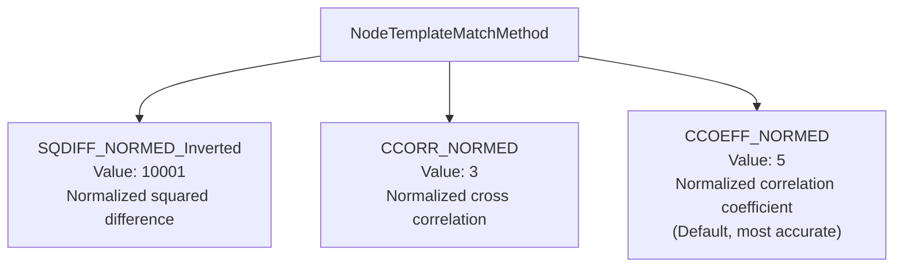
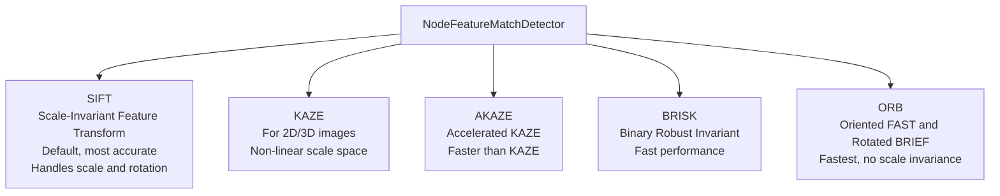
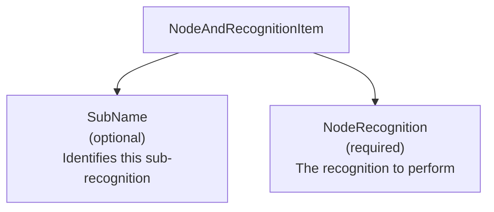
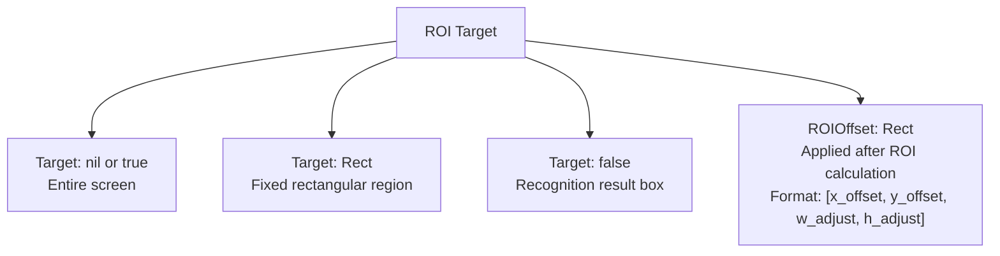
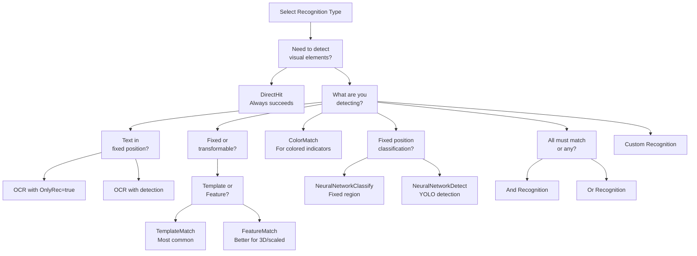

# Recognition Types

Relevant source files

* [CHANGELOG.md](https://github.com/MaaXYZ/maa-framework-go/blob/5f9c965c/CHANGELOG.md?plain=1)
* [context\_test.go](https://github.com/MaaXYZ/maa-framework-go/blob/5f9c965c/context_test.go)
* [event.go](https://github.com/MaaXYZ/maa-framework-go/blob/5f9c965c/event.go)
* [recognition\_result.go](https://github.com/MaaXYZ/maa-framework-go/blob/5f9c965c/recognition_result.go)
* [recognition\_result\_test.go](https://github.com/MaaXYZ/maa-framework-go/blob/5f9c965c/recognition_result_test.go)
* [resource\_test.go](https://github.com/MaaXYZ/maa-framework-go/blob/5f9c965c/resource_test.go)
* [tasker\_test.go](https://github.com/MaaXYZ/maa-framework-go/blob/5f9c965c/tasker_test.go)

## Purpose and Scope

This page documents the recognition algorithms available in maa-framework-go for identifying targets on screen. Recognition is the first step in task execution, determining whether specific visual elements are present before actions can be performed.

For information about how recognition results are processed and parsed, see [Recognition Result Handling](/MaaXYZ/maa-framework-go/4.5-recognition-result-handling). For details on how recognition fits into the pipeline execution model, see [Pipeline Architecture](/MaaXYZ/maa-framework-go/4.1-pipeline-architecture).

## Recognition Type Overview

The framework provides 10 recognition types, each optimized for different visual identification scenarios. All recognition types are defined by the `NodeRecognitionType` enumeration.

**Recognition Type Hierarchy:**

```mermaid
flowchart TD

DirectHit["DirectHit<br>No actual recognition"]
TemplateMatch["TemplateMatch<br>Image template matching"]
FeatureMatch["FeatureMatch<br>Keypoint feature matching"]
ColorMatch["ColorMatch<br>Color range detection"]
OCR["OCR<br>Text extraction"]
NNClassify["NeuralNetworkClassify<br>Fixed position classification"]
NNDetect["NeuralNetworkDetect<br>Object detection (YOLO)"]
And["And<br>All sub-recognitions succeed"]
Or["Or<br>Any sub-recognition succeeds"]
Custom["Custom<br>User-defined recognition"]
Recognition["NodeRecognition"]

Recognition --> DirectHit
Recognition --> TemplateMatch
Recognition --> FeatureMatch
Recognition --> ColorMatch
Recognition --> OCR
Recognition --> NNClassify
Recognition --> NNDetect
Recognition --> And
Recognition --> Or
Recognition --> Custom

subgraph Extensibility ["Extensibility"]
    Custom
end

subgraph subGraph3 ["Composite Recognition"]
    And
    Or
end

subgraph subGraph2 ["Neural Network Recognition"]
    NNClassify
    NNDetect
end

subgraph subGraph1 ["Text Recognition"]
    OCR
end

subgraph subGraph0 ["Basic Recognition"]
    DirectHit
    TemplateMatch
    FeatureMatch
    ColorMatch
end
```



**Recognition Type Summary:**

| Type | Use Case | Key Parameters | Result Contains |
| --- | --- | --- | --- |
| `DirectHit` | Always succeeds, no recognition | None | Empty box |
| `TemplateMatch` | Find exact image matches | Template images, threshold | Match score, box |
| `FeatureMatch` | Find images with perspective/scale changes | Template, detector algorithm | Feature count, box |
| `ColorMatch` | Detect color ranges | Lower/upper bounds, color space | Pixel count, box |
| `OCR` | Extract text | Expected patterns, model | Text, score, box |
| `NeuralNetworkClassify` | Classify fixed regions | Model, expected classes | Class label, probabilities |
| `NeuralNetworkDetect` | Detect objects anywhere | Model (YOLO), expected classes | Class label, score, box |
| `And` | Combine multiple recognitions (all must match) | Sub-recognitions | Combined results |
| `Or` | Try multiple recognitions (first match wins) | Sub-recognitions | First successful result |
| `Custom` | User-defined logic | Custom parameters | User-defined data |

**Sources:** [node\_recognition.go67-81](https://github.com/MaaXYZ/maa-framework-go/blob/5f9c965c/node_recognition.go#L67-L81) [node\_recognition.go9-15](https://github.com/MaaXYZ/maa-framework-go/blob/5f9c965c/node_recognition.go#L9-L15)

## DirectHit Recognition

`DirectHit` performs no actual recognition and always succeeds immediately. This is useful for nodes that only need to execute actions without waiting for specific visual conditions.

**Type Constant:** `NodeRecognitionTypeDirectHit`  
**Parameter Struct:** `NodeDirectHitParam` (empty struct)  
**Constructor:** `RecDirectHit()`

**Example Usage:**

```
```
node := NewNode("AlwaysExecute",


WithRecognition(RecDirectHit()),


WithAction(ActClick(/* ... */)),


)
```
```

**Common Use Cases:**

* Entry nodes that always proceed
* Action-only nodes in sequential workflows
* Nodes that rely solely on timing rather than visual detection

**Sources:** [node\_recognition.go88-100](https://github.com/MaaXYZ/maa-framework-go/blob/5f9c965c/node_recognition.go#L88-L100) [context\_test.go436-450](https://github.com/MaaXYZ/maa-framework-go/blob/5f9c965c/context_test.go#L436-L450)

## TemplateMatch Recognition

`TemplateMatch` uses OpenCV template matching to find exact visual matches of template images within the screen. This is the most commonly used recognition type for UI elements.

**Type Constant:** `NodeRecognitionTypeTemplateMatch`  
**Parameter Struct:** `NodeTemplateMatchParam`  
**Constructor:** `RecTemplateMatch(template []string, opts ...TemplateMatchOption)`

**Key Parameters:**

| Parameter | Type | Default | Description |
| --- | --- | --- | --- |
| `Template` | `[]string` | Required | Image file paths relative to resource directory |
| `Threshold` | `[]float64` | 0.7 | Match confidence threshold [0-1.0] |
| `Method` | `NodeTemplateMatchMethod` | 5 (CCOEFF\_NORMED) | OpenCV matching algorithm |
| `OrderBy` | `NodeTemplateMatchOrderBy` | Horizontal | Result ordering method |
| `Index` | `int` | 0 | Which match to select from results |
| `GreenMask` | `bool` | false | Treat green (RGB 0,255,0) as transparent |
| `ROI` | `Target` | Full screen | Region of interest |

**Template Matching Methods:**



**Example Usage:**

```
```
recognition := RecTemplateMatch(


[]string{"button.png", "button_pressed.png"},


WithTemplateMatchThreshold([]float64{0.8}),


WithTemplateMatchMethod(NodeTemplateMatchMethodCCOEFF_NORMED),


WithTemplateMatchOrderBy(NodeTemplateMatchOrderByScore),


WithTemplateMatchROI(NewTargetRect(Rect{100, 100, 800, 600})),


)
```
```

**Recognition Result:**

* Type: `TemplateMatchResult`
* Fields: `Box` (Rect), `Score` (float64)

**Sources:** [node\_recognition.go102-209](https://github.com/MaaXYZ/maa-framework-go/blob/5f9c965c/node_recognition.go#L102-L209) [node\_recognition.go122-139](https://github.com/MaaXYZ/maa-framework-go/blob/5f9c965c/node_recognition.go#L122-L139) [recognition\_result.go86-89](https://github.com/MaaXYZ/maa-framework-go/blob/5f9c965c/recognition_result.go#L86-L89)

## FeatureMatch Recognition

`FeatureMatch` uses keypoint-based feature detection for matching images with perspective transformations, scale changes, or partial occlusion. More robust than template matching but slower.

**Type Constant:** `NodeRecognitionTypeFeatureMatch`  
**Parameter Struct:** `NodeFeatureMatchParam`  
**Constructor:** `RecFeatureMatch(template []string, opts ...FeatureMatchOption)`

**Key Parameters:**

| Parameter | Type | Default | Description |
| --- | --- | --- | --- |
| `Template` | `[]string` | Required | Feature template image paths |
| `Detector` | `NodeFeatureMatchDetector` | SIFT | Feature detection algorithm |
| `Count` | `int` | 4 | Minimum matching keypoints threshold |
| `Ratio` | `float64` | 0.6 | KNN matching distance ratio [0-1.0] |
| `OrderBy` | `NodeFeatureMatchOrderBy` | Horizontal | Result ordering method |
| `GreenMask` | `bool` | false | Treat green as transparent |

**Feature Detector Algorithms:**



**Example Usage:**

```
```
recognition := RecFeatureMatch(


[]string{"icon_3d.png"},


WithFeatureMatchDetector(NodeFeatureMatchMethodSIFT),


WithFeatureMatchCount(10),


WithFeatureMatchRatio(0.7),


)
```
```

**Recognition Result:**

* Type: `FeatureMatchResult`
* Fields: `Box` (Rect), `Count` (int - number of matched keypoints)

**Sources:** [node\_recognition.go211-331](https://github.com/MaaXYZ/maa-framework-go/blob/5f9c965c/node_recognition.go#L211-L331) [node\_recognition.go222-231](https://github.com/MaaXYZ/maa-framework-go/blob/5f9c965c/node_recognition.go#L222-L231) [recognition\_result.go91-94](https://github.com/MaaXYZ/maa-framework-go/blob/5f9c965c/recognition_result.go#L91-L94)

## ColorMatch Recognition

`ColorMatch` detects regions based on color ranges in specified color spaces. Useful for detecting colored UI elements or status indicators.

**Type Constant:** `NodeRecognitionTypeColorMatch`  
**Parameter Struct:** `NodeColorMatchParam`  
**Constructor:** `RecColorMatch(lower, upper [][]int, opts ...ColorMatchOption)`

**Key Parameters:**

| Parameter | Type | Default | Description |
| --- | --- | --- | --- |
| `Lower` | `[][]int` | Required | Color lower bounds per channel |
| `Upper` | `[][]int` | Required | Color upper bounds per channel |
| `Method` | `NodeColorMatchMethod` | 4 (RGB) | Color space for matching |
| `Count` | `int` | 1 | Minimum pixel count threshold |
| `Connected` | `bool` | false | Use connected component analysis |
| `OrderBy` | `NodeColorMatchOrderBy` | Horizontal | Result ordering method |

**Color Space Methods:**

| Method | Value | Channels | Description |
| --- | --- | --- | --- |
| `NodeColorMatchMethodRGB` | 4 | 3 | RGB color space (default) |
| `NodeColorMatchMethodHSV` | 40 | 3 | HSV color space (better for color ranges) |
| `NodeColorMatchMethodGRAY` | 6 | 1 | Grayscale |

**Example Usage:**

```
```
// Detect red color in RGB space


recognition := RecColorMatch(


[][]int{{180, 0, 0}},      // Lower: red channel > 180


[][]int{{255, 100, 100}},  // Upper: red channel max, minimal G/B


WithColorMatchMethod(NodeColorMatchMethodRGB),


WithColorMatchConnected(true),


WithColorMatchCount(50),


)
```
```

**Recognition Result:**

* Type: `ColorMatchResult`
* Fields: `Box` (Rect), `Count` (int - pixel count in matched region)

**Sources:** [node\_recognition.go333-444](https://github.com/MaaXYZ/maa-framework-go/blob/5f9c965c/node_recognition.go#L333-L444) [node\_recognition.go354-373](https://github.com/MaaXYZ/maa-framework-go/blob/5f9c965c/node_recognition.go#L354-L373) [recognition\_result.go96-99](https://github.com/MaaXYZ/maa-framework-go/blob/5f9c965c/recognition_result.go#L96-L99)

## OCR Recognition

`OCR` performs optical character recognition to extract text from the screen. Uses deep learning models (default: PaddleOCR) for high-accuracy text detection and recognition.

**Type Constant:** `NodeRecognitionTypeOCR`  
**Parameter Struct:** `NodeOCRParam`  
**Constructor:** `RecOCR(opts ...OCROption)`

**Key Parameters:**

| Parameter | Type | Default | Description |
| --- | --- | --- | --- |
| `Expected` | `[]string` | Required | Expected text patterns (regex supported) |
| `Threshold` | `float64` | 0.3 | OCR confidence threshold [0-1.0] |
| `Replace` | `[][2]string` | Empty | Text replacement rules (e.g., "0" → "O") |
| `OrderBy` | `NodeOCROrderBy` | Horizontal | Result ordering method |
| `OnlyRec` | `bool` | false | Recognition-only mode (no detection) |
| `Model` | `string` | Default | Model folder path relative to `model/ocr/` |

**OCR Ordering Options:**

| OrderBy | Description |
| --- | --- |
| `Horizontal` | Order by x coordinate (left to right) |
| `Vertical` | Order by y coordinate (top to bottom) |
| `Area` | Order by text region area |
| `Length` | Order by text length |
| `Random` | Random order |

**Example Usage:**

```
```
recognition := RecOCR(


WithOCRExpected([]string{"Level [0-9]+", "Stage .*"}),


WithOCRThreshold(0.5),


WithOCRReplace([][2]string{{"0", "O"}, {"1", "I"}}),


WithOCROrderBy(NodeOCROrderByLength),


WithOCRROI(NewTargetRect(Rect{0, 0, 300, 100})),


)
```
```

**Recognition Result:**

* Type: `OCRResult`
* Fields: `Box` (Rect), `Text` (string), `Score` (float64)

**Sources:** [node\_recognition.go446-559](https://github.com/MaaXYZ/maa-framework-go/blob/5f9c965c/node_recognition.go#L446-L559) [node\_recognition.go458-477](https://github.com/MaaXYZ/maa-framework-go/blob/5f9c965c/node_recognition.go#L458-L477) [recognition\_result.go101-105](https://github.com/MaaXYZ/maa-framework-go/blob/5f9c965c/recognition_result.go#L101-L105)

## NeuralNetworkClassify Recognition

`NeuralNetworkClassify` uses ONNX neural network models to classify fixed image regions into predefined categories. Useful for recognizing game states or categorizing UI elements.

**Type Constant:** `NodeRecognitionTypeNeuralNetworkClassify`  
**Parameter Struct:** `NodeNeuralNetworkClassifyParam`  
**Constructor:** `RecNeuralNetworkClassify(model string, opts ...NeuralClassifyOption)`

**Key Parameters:**

| Parameter | Type | Default | Description |
| --- | --- | --- | --- |
| `Model` | `string` | Required | Model path relative to `model/classify/` |
| `Expected` | `[]int` | Required | Expected class indices |
| `Labels` | `[]string` | "Unknown" | Human-readable class names |
| `OrderBy` | `NodeNeuralNetworkClassifyOrderBy` | Horizontal | Result ordering |
| `ROI` | `Target` | Full screen | Region to classify |

**Example Usage:**

```
```
recognition := RecNeuralNetworkClassify(


"character_classifier.onnx",


WithNeuralClassifyLabels([]string{"Warrior", "Mage", "Archer"}),


WithNeuralClassifyExpected([]int{0, 2}),  // Accept Warrior or Archer


WithNeuralClassifyROI(NewTargetRect(Rect{100, 100, 224, 224})),


)
```
```

**Recognition Result:**

* Type: `NeuralNetworkClassifyResult`
* Fields: `Box` (Rect), `ClsIndex` (uint64), `Label` (string), `Score` (float64), `Raw` ([]float64), `Probs` ([]float64)

**Sources:** [node\_recognition.go561-651](https://github.com/MaaXYZ/maa-framework-go/blob/5f9c965c/node_recognition.go#L561-L651) [node\_recognition.go572-587](https://github.com/MaaXYZ/maa-framework-go/blob/5f9c965c/node_recognition.go#L572-L587) [recognition\_result.go107-114](https://github.com/MaaXYZ/maa-framework-go/blob/5f9c965c/recognition_result.go#L107-L114)

## NeuralNetworkDetect Recognition

`NeuralNetworkDetect` uses YOLO-based ONNX models to detect objects at arbitrary positions. Supports YOLOv8 and YOLOv11 architectures.

**Type Constant:** `NodeRecognitionTypeNeuralNetworkDetect`  
**Parameter Struct:** `NodeNeuralNetworkDetectParam`  
**Constructor:** `RecNeuralNetworkDetect(model string, opts ...NeuralDetectOption)`

**Key Parameters:**

| Parameter | Type | Default | Description |
| --- | --- | --- | --- |
| `Model` | `string` | Required | YOLO model path relative to `model/detect/` |
| `Expected` | `[]int` | Required | Expected object class indices |
| `Labels` | `[]string` | Auto-read | Class names (read from model metadata) |
| `OrderBy` | `NodeNeuralNetworkDetectOrderBy` | Horizontal | Result ordering |

**Example Usage:**

```
```
recognition := RecNeuralNetworkDetect(


"yolov8n.onnx",


WithNeuralDetectExpected([]int{0, 16}),  // person, dog


WithNeuralDetectOrderBy(NodeNeuralNetworkDetectOrderByArea),


WithNeuralDetectROI(NewTargetRect(Rect{0, 0, 1920, 1080})),


)
```
```

**Recognition Result:**

* Type: `NeuralNetworkDetectResult`
* Fields: `Box` (Rect), `ClsIndex` (uint64), `Label` (string), `Score` (float64)

**Sources:** [node\_recognition.go653-744](https://github.com/MaaXYZ/maa-framework-go/blob/5f9c965c/node_recognition.go#L653-L744) [node\_recognition.go665-680](https://github.com/MaaXYZ/maa-framework-go/blob/5f9c965c/node_recognition.go#L665-L680) [recognition\_result.go116-121](https://github.com/MaaXYZ/maa-framework-go/blob/5f9c965c/recognition_result.go#L116-L121)

## And Recognition (Composite)

`And` recognition requires all sub-recognitions to succeed. The framework executes each sub-recognition sequentially, and the overall recognition succeeds only if all components match.

**Type Constant:** `NodeRecognitionTypeAnd`  
**Parameter Struct:** `NodeAndRecognitionParam`  
**Constructor:** `RecAnd(allOf []NodeAndRecognitionItem, opts ...AndRecognitionOption)`

**Key Parameters:**

| Parameter | Type | Description |
| --- | --- | --- |
| `AllOf` | `[]NodeAndRecognitionItem` | List of sub-recognitions (all required) |
| `BoxIndex` | `int` | Which sub-recognition's box to use as final box |

**Sub-Recognition Item Structure:**



**Example Usage:**

```
```
recognition := RecAnd(


[]NodeAndRecognitionItem{


AndItem("button", RecTemplateMatch([]string{"button.png"})),


AndItem("text", RecOCR(WithOCRExpected([]string{"Confirm"}))),


},


WithAndRecognitionBoxIndex(0),  // Use button's box


)
```
```

**Recognition Result:**

* The result is stored in `CombinedResult []RecognitionDetail`
* Each sub-recognition's result is accessible by name
* If any sub-recognition fails, the entire And recognition fails

**Sources:** [node\_recognition.go746-790](https://github.com/MaaXYZ/maa-framework-go/blob/5f9c965c/node_recognition.go#L746-L790) [recognition\_result.go254-298](https://github.com/MaaXYZ/maa-framework-go/blob/5f9c965c/recognition_result.go#L254-L298)

## Or Recognition (Composite)

`Or` recognition tries multiple recognition strategies, succeeding when any one matches. Sub-recognitions are tried in order until one succeeds.

**Type Constant:** `NodeRecognitionTypeOr`  
**Parameter Struct:** `NodeOrRecognitionParam`  
**Constructor:** `RecOr(anyOf []*NodeRecognition)`

**Key Parameters:**

| Parameter | Type | Description |
| --- | --- | --- |
| `AnyOf` | `[]*NodeRecognition` | List of alternative recognition strategies |

**Example Usage:**

```
```
recognition := RecOr([]*NodeRecognition{


RecTemplateMatch([]string{"button_normal.png"}),


RecTemplateMatch([]string{"button_highlighted.png"}),


RecOCR(WithOCRExpected([]string{"Start"})),


})
```
```

**Use Cases:**

* Multiple visual states of the same element
* Fallback recognition strategies
* Detecting any of several possible targets

**Recognition Result:**

* Returns the first successful sub-recognition's result
* Stored in `CombinedResult []RecognitionDetail`

**Sources:** [node\_recognition.go792-808](https://github.com/MaaXYZ/maa-framework-go/blob/5f9c965c/node_recognition.go#L792-L808) [recognition\_result.go254-298](https://github.com/MaaXYZ/maa-framework-go/blob/5f9c965c/recognition_result.go#L254-L298)

## Custom Recognition

`Custom` recognition allows implementation of user-defined recognition logic by implementing the `CustomRecognitionRunner` interface. For details on implementing custom recognition, see [Custom Recognition](/MaaXYZ/maa-framework-go/5.2-custom-recognition).

**Type Constant:** `NodeRecognitionTypeCustom`  
**Parameter Struct:** `NodeCustomRecognitionParam`  
**Constructor:** `RecCustom(name string, opts ...CustomRecognitionOption)`

**Key Parameters:**

| Parameter | Type | Description |
| --- | --- | --- |
| `CustomRecognition` | `string` | Registered recognizer name |
| `CustomRecognitionParam` | `any` | Custom parameters passed to recognizer |
| `ROI` | `Target` | Region of interest |

**Example Usage:**

```
```
// Registration (in Resource)


resource.RegisterCustomRecognition("MyRecognizer", &MyRecognizer{})


// Usage in pipeline


recognition := RecCustom("MyRecognizer",


WithCustomRecognitionParam(map[string]any{"threshold": 0.8}),


WithCustomRecognitionROI(NewTargetRect(Rect{0, 0, 100, 100})),


)
```
```

**Recognition Result:**

* Type: `CustomRecognitionResult`
* User-defined fields in `Detail` field

**Sources:** [node\_recognition.go810-860](https://github.com/MaaXYZ/maa-framework-go/blob/5f9c965c/node_recognition.go#L810-L860) [recognition\_result.go77-84](https://github.com/MaaXYZ/maa-framework-go/blob/5f9c965c/recognition_result.go#L77-L84)

## Common Recognition Parameters

Several parameters are shared across multiple recognition types:

**Region of Interest (ROI):**



**Ordering Methods:**

All recognition types that return multiple results support ordering:

| OrderBy Value | Available In | Description |
| --- | --- | --- |
| `Horizontal` | All | Left to right (ascending x) |
| `Vertical` | All | Top to bottom (ascending y) |
| `Score` | Template, Color, NN | By confidence/score |
| `Area` | Feature, Color, NN | By bounding box area |
| `Length` | OCR | By text length |
| `Random` | All except NN | Random selection |

**Index Selection:**

The `Index` parameter selects which result to use from ordered results:

* `0` - First result (default)
* `1` - Second result
* `-1` - All results (for detection types)

**Sources:** [node\_recognition.go124-127](https://github.com/MaaXYZ/maa-framework-go/blob/5f9c965c/node_recognition.go#L124-L127) [node\_recognition.go236-239](https://github.com/MaaXYZ/maa-framework-go/blob/5f9c965c/node_recognition.go#L236-L239) [node\_recognition.go356-359](https://github.com/MaaXYZ/maa-framework-go/blob/5f9c965c/node_recognition.go#L356-L359)

## Creating Recognition Configurations

**Functional Options Pattern:**

All recognition types use the functional options pattern for configuration:

```
```
// Basic creation


rec := RecTemplateMatch([]string{"image.png"})


// With options


rec := RecTemplateMatch(


[]string{"image.png"},


WithTemplateMatchThreshold([]float64{0.8}),


WithTemplateMatchROI(NewTargetRect(Rect{0, 0, 800, 600})),


)
```
```

**Programmatic vs JSON Configuration:**

```
```
// Programmatic


node := NewNode("FindButton",


WithRecognition(RecTemplateMatch(


[]string{"button.png"},


WithTemplateMatchThreshold([]float64{0.8}),


)),


)


// JSON (loaded via Resource.PostPipeline)


{


"FindButton": {


"recognition": {


"type": "TemplateMatch",


"param": {


"template": ["button.png"],


"threshold": [0.8]


}


}


}


}
```
```

**Retrieving Recognition Configuration:**

```
```
// From Resource


node, err := resource.GetNode("FindButton")


param := node.Recognition.Param.(*NodeTemplateMatchParam)


// From Context (in custom action)


node, err := ctx.GetNode("FindButton")
```
```

**Sources:** [node\_recognition.go196-209](https://github.com/MaaXYZ/maa-framework-go/blob/5f9c965c/node_recognition.go#L196-L209) [context\_test.go452-485](https://github.com/MaaXYZ/maa-framework-go/blob/5f9c965c/context_test.go#L452-L485)

## Recognition Type Decision Matrix

**Choosing the Right Recognition Type:**



**Sources:** [node\_recognition.go67-81](https://github.com/MaaXYZ/maa-framework-go/blob/5f9c965c/node_recognition.go#L67-L81)