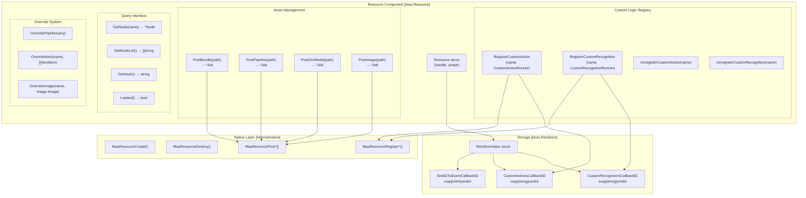
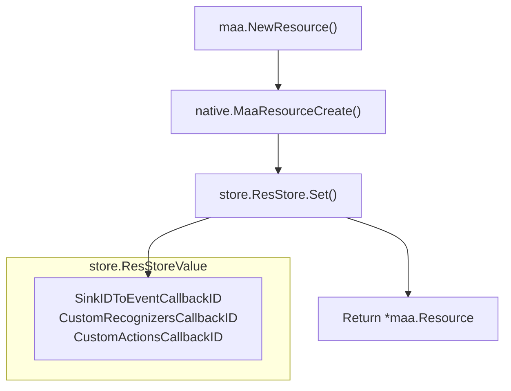

# Resource

Relevant source files

* [resource.go](https://github.com/MaaXYZ/maa-framework-go/blob/7a918a74/resource.go)
* [resource\_test.go](https://github.com/MaaXYZ/maa-framework-go/blob/7a918a74/resource_test.go)
* [toolkit.go](https://github.com/MaaXYZ/maa-framework-go/blob/7a918a74/toolkit.go)

The `Resource` component manages all assets and configurations required for task execution in maa-framework-go. It loads and maintains pipeline definitions, OCR models, image templates, and provides facilities for registering custom recognition and action logic. The Resource is one of three core components that must be bound to a [Tasker](/MaaXYZ/maa-framework-go/3.1-tasker) before task execution can begin. [resource.go14-21](https://github.com/MaaXYZ/maa-framework-go/blob/7a918a74/resource.go#L14-L21)

For information about using pipelines and nodes that the Resource loads, see [Pipeline and Nodes](/MaaXYZ/maa-framework-go/3.5-pipeline-and-nodes). For details on implementing custom actions and recognitions that are registered with the Resource, see [Custom Actions](/MaaXYZ/maa-framework-go/5.1-custom-actions) and [Custom Recognition](/MaaXYZ/maa-framework-go/5.2-custom-recognition).

Sources: [resource.go14-21](https://github.com/MaaXYZ/maa-framework-go/blob/7a918a74/resource.go#L14-L21)

## Overview and Responsibilities

The Resource component serves four primary functions:

1. **Asset Loading**: Asynchronously loads pipeline definitions, OCR models, image templates, and resource bundles from the filesystem. [resource.go291-319](https://github.com/MaaXYZ/maa-framework-go/blob/7a918a74/resource.go#L291-L319)
2. **Custom Logic Registry**: Maintains registrations of custom recognition and action implementations. [resource.go137-289](https://github.com/MaaXYZ/maa-framework-go/blob/7a918a74/resource.go#L137-L289)
3. **Runtime Configuration**: Provides pipeline and image overrides for dynamic behavior modification. [resource.go321-377](https://github.com/MaaXYZ/maa-framework-go/blob/7a918a74/resource.go#L321-L377)
4. **Inference Management**: Configures the execution provider and device for neural network inference operations. [resource.go62-135](https://github.com/MaaXYZ/maa-framework-go/blob/7a918a74/resource.go#L62-L135)

### Code Entity Space Mapping

The following diagram bridges natural language concepts to the specific code entities in the `maa` package.

**Title: Resource Component Architecture**



Sources: [resource.go14-60](https://github.com/MaaXYZ/maa-framework-go/blob/7a918a74/resource.go#L14-L60) [resource.go137-289](https://github.com/MaaXYZ/maa-framework-go/blob/7a918a74/resource.go#L137-L289) [resource.go291-319](https://github.com/MaaXYZ/maa-framework-go/blob/7a918a74/resource.go#L291-L319) [resource.go321-407](https://github.com/MaaXYZ/maa-framework-go/blob/7a918a74/resource.go#L321-L407) [internal/store/store.go1-30](https://github.com/MaaXYZ/maa-framework-go/blob/7a918a74/internal/store/store.go#L1-L30)

## Creation and Lifecycle

### Creating a Resource

A Resource is created using `NewResource()`, which allocates a native resource handle and initializes internal storage for callbacks and custom logic. [resource.go23-41](https://github.com/MaaXYZ/maa-framework-go/blob/7a918a74/resource.go#L23-L41)

**Title: Resource Initialization Flow**



The creation process:

1. Calls `native.MaaResourceCreate()` to allocate native resource handle. [resource.go25](https://github.com/MaaXYZ/maa-framework-go/blob/7a918a74/resource.go#L25-L25)
2. Initializes three maps in `store.ResStore` for managing callbacks to prevent memory leaks and handle unregistration. [resource.go30-36](https://github.com/MaaXYZ/maa-framework-go/blob/7a918a74/resource.go#L30-L36)
3. Returns a `*Resource` pointer containing the handle. [resource.go38-40](https://github.com/MaaXYZ/maa-framework-go/blob/7a918a74/resource.go#L38-L40)

Sources: [resource.go23-41](https://github.com/MaaXYZ/maa-framework-go/blob/7a918a74/resource.go#L23-L41)

### Destroying a Resource

When a Resource is no longer needed, `Destroy()` must be called to prevent resource leaks. The destruction process automatically unregisters all callbacks before releasing the native resource. [resource.go44-60](https://github.com/MaaXYZ/maa-framework-go/blob/7a918a74/resource.go#L44-L60)

| Cleanup Phase | Action | Code Reference |
| --- | --- | --- |
| 1. Event Callbacks | Unregister all event sinks | [resource.go47-49](https://github.com/MaaXYZ/maa-framework-go/blob/7a918a74/resource.go#L47-L49) |
| 2. Custom Recognitions | Unregister all custom recognitions | [resource.go50-52](https://github.com/MaaXYZ/maa-framework-go/blob/7a918a74/resource.go#L50-L52) |
| 3. Custom Actions | Unregister all custom actions | [resource.go53-55](https://github.com/MaaXYZ/maa-framework-go/blob/7a918a74/resource.go#L53-L55) |
| 4. Store Cleanup | Remove entry from `store.ResStore` | [resource.go56](https://github.com/MaaXYZ/maa-framework-go/blob/7a918a74/resource.go#L56-L56) |
| 5. Native Cleanup | Call `native.MaaResourceDestroy()` | [resource.go59](https://github.com/MaaXYZ/maa-framework-go/blob/7a918a74/resource.go#L59-L59) |

Sources: [resource.go43-60](https://github.com/MaaXYZ/maa-framework-go/blob/7a918a74/resource.go#L43-L60)

## Asset Loading

All asset loading operations in Resource are asynchronous and return a `Job` that can be queried for status or waited upon for completion. [resource.go291-319](https://github.com/MaaXYZ/maa-framework-go/blob/7a918a74/resource.go#L291-L319)

### Loading Methods

| Method | Purpose | Path Type | Returns |
| --- | --- | --- | --- |
| `PostBundle(path)` | Load complete resource bundle | Directory path | `*Job` |
| `PostPipeline(path)` | Load pipeline definitions | Directory or single JSON/JSONC file | `*Job` |
| `PostOcrModel(path)` | Load OCR model | Model directory | `*Job` |
| `PostImage(path)` | Load image templates | Directory or single image file | `*Job` |

**Example usage pattern**:

```
```
// Load a resource bundle asynchronously


job := res.PostBundle("./assets/resource")


// Wait for completion and check success


if job.Wait().Success() {


fmt.Println("Resource loaded successfully")


}
```
```

Sources: [resource.go291-319](https://github.com/MaaXYZ/maa-framework-go/blob/7a918a74/resource.go#L291-L319) [resource\_test.go246-252](https://github.com/MaaXYZ/maa-framework-go/blob/7a918a74/resource_test.go#L246-L252)

### Checking Load Status

After loading assets, you can query the Resource state:

| Method | Purpose | Return Type |
| --- | --- | --- |
| `Loaded()` | Check if resources are loaded | `bool` |
| `GetHash()` | Get hash of loaded resources | `string, error` |
| `Clear()` | Clear all loaded content | `error` |

Sources: [resource.go409-442](https://github.com/MaaXYZ/maa-framework-go/blob/7a918a74/resource.go#L409-L442)

## Custom Logic Registration

The Resource maintains registries for custom actions and recognitions, allowing user-defined implementations to be invoked during pipeline execution. [resource.go137-289](https://github.com/MaaXYZ/maa-framework-go/blob/7a918a74/resource.go#L137-L289)

### Custom Action Registration

| Method | Purpose | Parameters |
| --- | --- | --- |
| `RegisterCustomAction(name, action)` | Register custom action | `name: string`, `action: CustomActionRunner` |
| `UnregisterCustomAction(name)` | Remove custom action | `name: string` |
| `ClearCustomAction()` | Remove all custom actions | None |
| `GetCustomActionList()` | List registered actions | Returns `[]string, error` |

**Registration process**:

1. `registerCustomAction()` stores runner in global map and returns unique ID. [resource.go216](https://github.com/MaaXYZ/maa-framework-go/blob/7a918a74/resource.go#L216-L216)
2. Native layer is notified via `native.MaaResourceRegisterCustomAction` with `_MaaCustomActionCallbackAgent`. [resource.go218-225](https://github.com/MaaXYZ/maa-framework-go/blob/7a918a74/resource.go#L218-L225)
3. `store.ResStore` maps action name to callback ID. [resource.go233-240](https://github.com/MaaXYZ/maa-framework-go/blob/7a918a74/resource.go#L233-L240)
4. If a name already exists, the old registration is automatically cleaned up. [resource.go241-243](https://github.com/MaaXYZ/maa-framework-go/blob/7a918a74/resource.go#L241-L243)

Sources: [resource.go214-244](https://github.com/MaaXYZ/maa-framework-go/blob/7a918a74/resource.go#L214-L244) [resource.go246-270](https://github.com/MaaXYZ/maa-framework-go/blob/7a918a74/resource.go#L246-L270) [resource.go272-289](https://github.com/MaaXYZ/maa-framework-go/blob/7a918a74/resource.go#L272-L289) [resource.go471-482](https://github.com/MaaXYZ/maa-framework-go/blob/7a918a74/resource.go#L471-L482)

### Custom Recognition Registration

| Method | Purpose | Parameters |
| --- | --- | --- |
| `RegisterCustomRecognition(name, recognition)` | Register custom recognition | `name: string`, `recognition: CustomRecognitionRunner` |
| `UnregisterCustomRecognition(name)` | Remove custom recognition | `name: string` |
| `ClearCustomRecognition()` | Remove all custom recognitions | None |
| `GetCustomRecognitionList()` | List registered recognitions | Returns `[]string, error` |

The registration mechanism mirrors custom actions, using the same callback ID pattern with separate storage maps. [resource.go137-167](https://github.com/MaaXYZ/maa-framework-go/blob/7a918a74/resource.go#L137-L167)

Sources: [resource.go137-167](https://github.com/MaaXYZ/maa-framework-go/blob/7a918a74/resource.go#L137-L167) [resource.go169-193](https://github.com/MaaXYZ/maa-framework-go/blob/7a918a74/resource.go#L169-L193) [resource.go195-212](https://github.com/MaaXYZ/maa-framework-go/blob/7a918a74/resource.go#L195-L212) [resource.go458-469](https://github.com/MaaXYZ/maa-framework-go/blob/7a918a74/resource.go#L458-L469)

## Pipeline Overrides

The Resource provides runtime override capabilities that modify pipeline behavior without reloading assets. These overrides are particularly useful for dynamic task configuration. [resource.go321-377](https://github.com/MaaXYZ/maa-framework-go/blob/7a918a74/resource.go#L321-L377)

### OverridePipeline

`OverridePipeline(override)` accepts multiple input types and converts them to JSON. [resource.go321-343](https://github.com/MaaXYZ/maa-framework-go/blob/7a918a74/resource.go#L321-L343)

| Input Type | Handling |
| --- | --- |
| `string` | Passed directly as JSON |
| `[]byte` | Converted to string |
| Any other type | Marshaled to JSON via internal logic |

The override replaces or merges with existing pipeline definitions in the native layer. [resource.go321-325](https://github.com/MaaXYZ/maa-framework-go/blob/7a918a74/resource.go#L321-L325)

Sources: [resource.go321-343](https://github.com/MaaXYZ/maa-framework-go/blob/7a918a74/resource.go#L321-L343)

### OverrideNext

`OverrideNext(name, nextList)` modifies the `next` list for a specific node. [resource.go345-366](https://github.com/MaaXYZ/maa-framework-go/blob/7a918a74/resource.go#L345-L366)

* Creates the node if it doesn't exist.
* Replaces the entire next list.
* Uses `NextItem` structs with `Name`, `JumpBack`, and `Anchor` fields.

Sources: [resource.go345-366](https://github.com/MaaXYZ/maa-framework-go/blob/7a918a74/resource.go#L345-L366) [resource\_test.go254-295](https://github.com/MaaXYZ/maa-framework-go/blob/7a918a74/resource_test.go#L254-L295)

### OverrideImage

`OverrideImage(imageName, image)` replaces template image data at runtime using `image.Image` from Go's standard library. [resource.go368-377](https://github.com/MaaXYZ/maa-framework-go/blob/7a918a74/resource.go#L368-L377)

Sources: [resource.go368-377](https://github.com/MaaXYZ/maa-framework-go/blob/7a918a74/resource.go#L368-L377)

## Inference Configuration

For pipelines using neural network-based recognition (OCR, classification, detection), the Resource configures the inference execution provider and device. [resource.go62-135](https://github.com/MaaXYZ/maa-framework-go/blob/7a918a74/resource.go#L62-L135)

| Method | Provider | Device | Use Case |
| --- | --- | --- | --- |
| `UseCPU()` | `native.MaaInferenceExecutionProvider_CPU` | `native.MaaInferenceDevice_CPU` | Universal compatibility |
| `UseDirectml(deviceID)` | `native.MaaInferenceExecutionProvider_DirectML` | Specified GPU ID | Windows GPU acceleration |
| `UseCoreml(coremlFlag)` | `native.MaaInferenceExecutionProvider_CoreML` | Specified device | macOS/iOS acceleration |
| `UseAutoExecutionProvider()` | `native.MaaInferenceExecutionProvider_Auto` | `native.MaaInferenceDevice_Auto` | Automatic best selection |

Sources: [resource.go62-135](https://github.com/MaaXYZ/maa-framework-go/blob/7a918a74/resource.go#L62-L135)

## Querying Resources

The Resource provides methods to inspect loaded pipeline definitions and retrieve default parameters. [resource.go380-407](https://github.com/MaaXYZ/maa-framework-go/blob/7a918a74/resource.go#L380-L407)

| Method | Return Type | Description |
| --- | --- | --- |
| `GetNode(name)` | `*Node, error` | Returns parsed node definition with all parameters. [resource.go380-388](https://github.com/MaaXYZ/maa-framework-go/blob/7a918a74/resource.go#L380-L388) |
| `GetNodeJSON(name)` | `string, error` | Returns raw JSON definition. [resource.go390-399](https://github.com/MaaXYZ/maa-framework-go/blob/7a918a74/resource.go#L390-L399) |
| `GetNodeList()` | `[]string, error` | Returns all node names in loaded pipelines. [resource.go401-407](https://github.com/MaaXYZ/maa-framework-go/blob/7a918a74/resource.go#L401-L407) |

### Default Parameters

The Resource can retrieve default parameters for recognition and action types from the native layer using `GetDefaultRecognitionParam` and `GetDefaultActionParam`. [resource.go484-606](https://github.com/MaaXYZ/maa-framework-go/blob/7a918a74/resource.go#L484-L606)

Sources: [resource.go380-407](https://github.com/MaaXYZ/maa-framework-go/blob/7a918a74/resource.go#L380-L407) [resource.go444-456](https://github.com/MaaXYZ/maa-framework-go/blob/7a918a74/resource.go#L444-L456) [resource.go484-606](https://github.com/MaaXYZ/maa-framework-go/blob/7a918a74/resource.go#L484-L606)

## Event System

The Resource implements an event sink system for monitoring resource loading operations. [resource.go607-669](https://github.com/MaaXYZ/maa-framework-go/blob/7a918a74/resource.go#L607-L669)

**ResourceEventSink interface**:

* `OnResourceLoading(res *Resource, event EventStatus, detail ResourceLoadingDetail)` [resource.go608-610](https://github.com/MaaXYZ/maa-framework-go/blob/7a918a74/resource.go#L608-L610)

The detail includes information about what resource is being loaded (bundle, pipeline, OCR model, or image). [resource.go656-669](https://github.com/MaaXYZ/maa-framework-go/blob/7a918a74/resource.go#L656-L669)

Sources: [resource.go607-669](https://github.com/MaaXYZ/maa-framework-go/blob/7a918a74/resource.go#L607-L669)

## Integration with Tasker

The Resource must be bound to a Tasker before pipeline execution.

**Binding sequence**:

1. Create and configure Resource. [resource.go24-41](https://github.com/MaaXYZ/maa-framework-go/blob/7a918a74/resource.go#L24-L41)
2. Load all required assets via `PostBundle` or similar. [resource.go291-298](https://github.com/MaaXYZ/maa-framework-go/blob/7a918a74/resource.go#L291-L298)
3. Register custom logic (optional). [resource.go138-167](https://github.com/MaaXYZ/maa-framework-go/blob/7a918a74/resource.go#L138-L167)
4. Create Tasker and bind Resource with `tasker.BindResource(res)`.
5. Bind Controller to complete Tasker initialization.
6. Execute tasks - Tasker uses Resource for node definitions and custom logic.

Sources: [resource.go1-670](https://github.com/MaaXYZ/maa-framework-go/blob/7a918a74/resource.go#L1-L670) [resource\_test.go37-42](https://github.com/MaaXYZ/maa-framework-go/blob/7a918a74/resource_test.go#L37-L42)