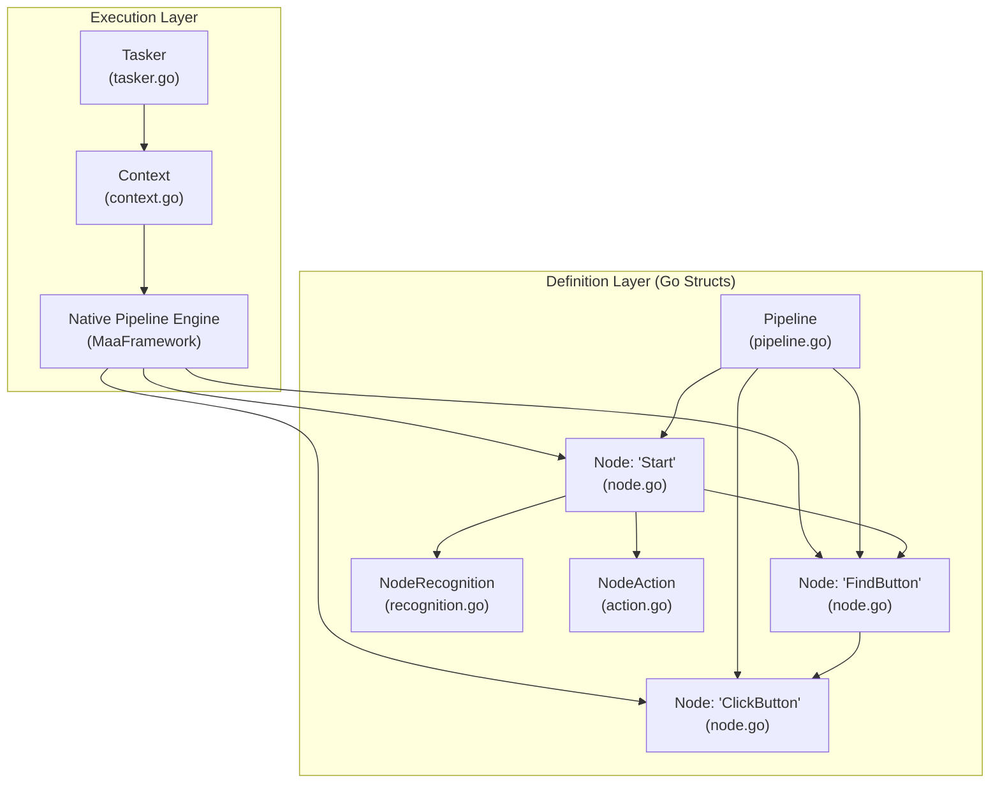
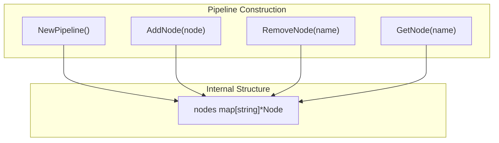
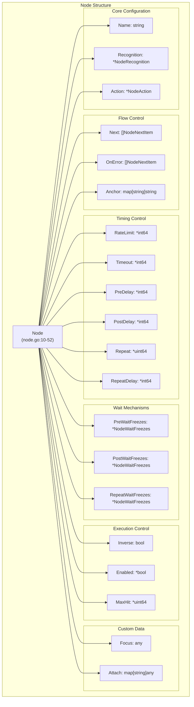
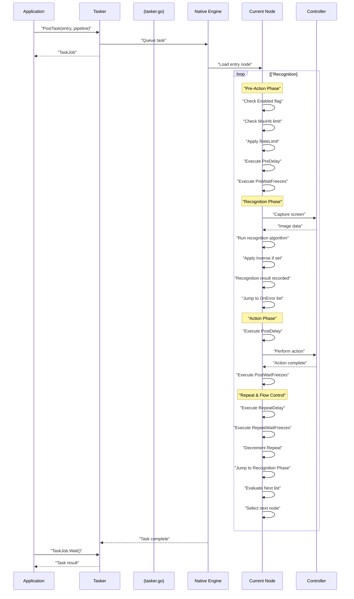
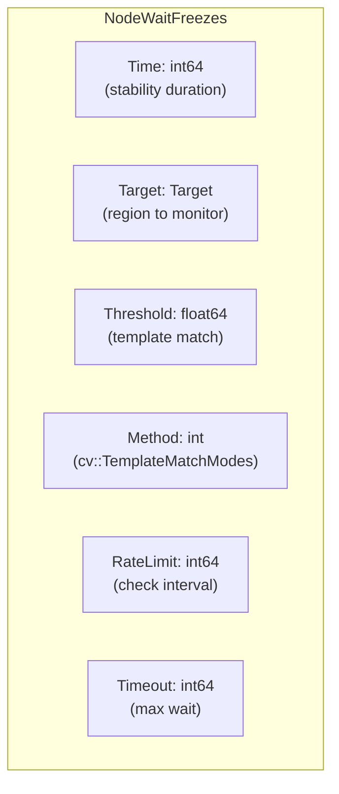
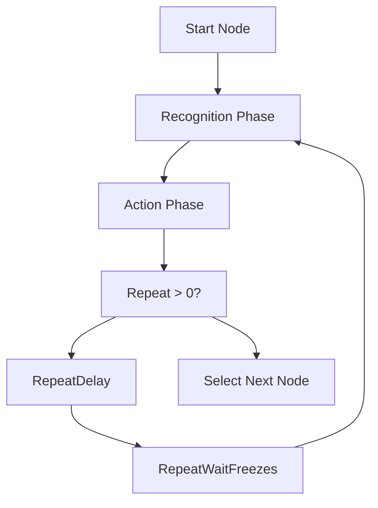
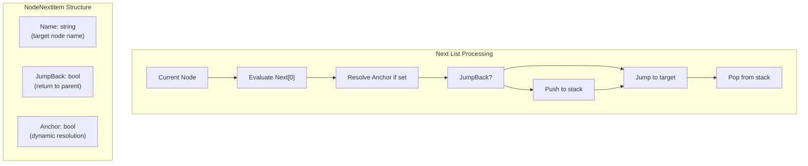
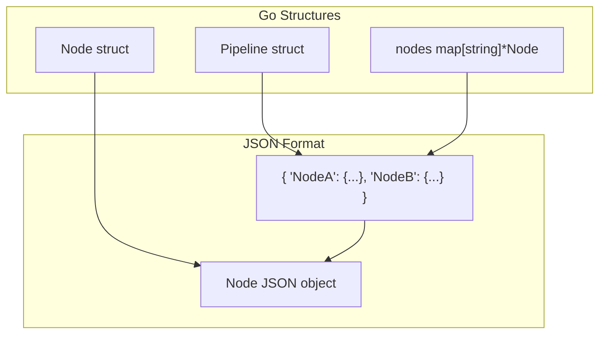
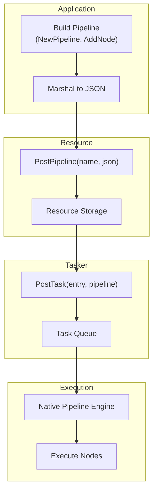

# Task Definition and Execution

Relevant source files

* [README.md](https://github.com/MaaXYZ/maa-framework-go/blob/5f9c965c/README.md?plain=1)
* [README\_zh.md](https://github.com/MaaXYZ/maa-framework-go/blob/5f9c965c/README_zh.md?plain=1)
* [examples/custom-action/main.go](https://github.com/MaaXYZ/maa-framework-go/blob/5f9c965c/examples/custom-action/main.go)
* [examples/quick-start/main.go](https://github.com/MaaXYZ/maa-framework-go/blob/5f9c965c/examples/quick-start/main.go)

This document describes the task definition and execution system in maa-framework-go. It covers how automation workflows are defined as declarative data structures using Pipelines and Nodes, and how the framework executes these definitions.

**Scope**: This page focuses on the high-level architecture of task definitions and the execution lifecycle. For detailed documentation on specific recognition algorithms, see [Recognition Types](/MaaXYZ/maa-framework-go/4.2-recognition-types). For action implementations, see [Action Types](/MaaXYZ/maa-framework-go/4.3-action-types). For node flow control mechanisms, see [Flow Control and Timing](/MaaXYZ/maa-framework-go/4.4-flow-control-and-timing). For handling recognition results, see [Recognition Result Handling](/MaaXYZ/maa-framework-go/4.5-recognition-result-handling). For error handling patterns, see [Error Handling](/MaaXYZ/maa-framework-go/4.6-error-handling).

## Overview: Declarative Task Definition

The framework uses a declarative approach to define automation tasks. Rather than writing imperative code, users define workflows as data structures that the framework interprets and executes. This approach is implemented through two primary types:

* **`Pipeline`**: A collection of named nodes that form the complete workflow definition
* **`Node`**: A single unit of work consisting of a recognition phase and an action phase

**Key Concepts**:

| Concept | Definition | Code Location |
| --- | --- | --- |
| Task | A logical sequential structure from start to finish | Executed by Tasker |
| Entry | The first node in a task execution | Specified in `Tasker.PostTask()` |
| Pipeline | Collection of all nodes | [`Pipeline` struct](https://github.com/MaaXYZ/maa-framework-go/blob/5f9c965c/`Pipeline` struct)() |
| Node | Single unit with recognition and action phases | [`Node` struct](https://github.com/MaaXYZ/maa-framework-go/blob/5f9c965c/`Node` struct)() |



Sources: [pipeline.go1-71](https://github.com/MaaXYZ/maa-framework-go/blob/5f9c965c/pipeline.go#L1-L71) [node.go1-52](https://github.com/MaaXYZ/maa-framework-go/blob/5f9c965c/node.go#L1-L52)

## Pipeline Structure

The `Pipeline` type serves as a container for all nodes in a workflow. It is implemented as a map from node names to `Node` pointers, enabling efficient lookup during execution.

### Pipeline Operations



**Pipeline Methods**:

| Method | Purpose | Return Type |
| --- | --- | --- |
| `NewPipeline()` | Creates empty pipeline | `*Pipeline` |
| `AddNode(node)` | Adds node to pipeline | `*Pipeline` (chainable) |
| `RemoveNode(name)` | Removes node by name | `*Pipeline` (chainable) |
| `GetNode(name)` | Retrieves node | `(*Node, bool)` |
| `HasNode(name)` | Checks node existence | `bool` |
| `Len()` | Returns node count | `int` |
| `Clear()` | Removes all nodes | `*Pipeline` (chainable) |
| `MarshalJSON()` | Serializes to JSON | `([]byte, error)` |

The pipeline supports method chaining for fluent construction:

```
```
pipeline := NewPipeline().


AddNode(startNode).


AddNode(findButtonNode).


AddNode(clickButtonNode)
```
```

Sources: [pipeline.go20-71](https://github.com/MaaXYZ/maa-framework-go/blob/5f9c965c/pipeline.go#L20-L71)

## Node Structure and Lifecycle

A `Node` represents a single step in the automation workflow. Each node executes in two phases: **Recognition** (detecting targets on screen) and **Action** (performing operations when recognition succeeds).

### Node Composition



Sources: [node.go9-52](https://github.com/MaaXYZ/maa-framework-go/blob/5f9c965c/node.go#L9-L52)

### Node Creation and Configuration

Nodes are created using the `NewNode()` constructor with functional options:

```
```
node := NewNode("FindButton",


WithRecognition(recognition),


WithAction(action),


WithNext([]NodeNextItem{{Name: "NextNode"}}),


WithTimeout(30 * time.Second),


)
```
```

**Construction Methods**:

| Pattern | Implementation |
| --- | --- |
| Constructor | `NewNode(name, ...opts)` at [node.go189-199](https://github.com/MaaXYZ/maa-framework-go/blob/5f9c965c/node.go#L189-L199) |
| Functional Options | `NodeOption` type at [node.go54-186](https://github.com/MaaXYZ/maa-framework-go/blob/5f9c965c/node.go#L54-L186) |
| Method Chaining | Setter methods at [node.go201-330](https://github.com/MaaXYZ/maa-framework-go/blob/5f9c965c/node.go#L201-L330) |

**Common Node Options**:

| Option | Purpose | Default |
| --- | --- | --- |
| `WithRecognition` | Sets recognition algorithm | None |
| `WithAction` | Sets action to perform | None |
| `WithNext` | Sets next nodes list | `[]` |
| `WithRateLimit` | Minimum interval between attempts | 1000ms |
| `WithTimeout` | Maximum recognition wait time | 20000ms |
| `WithOnError` | Error handling nodes | `[]` |
| `WithMaxHit` | Maximum execution count | Unlimited |
| `WithRepeat` | Number of repetitions | 1 |

Sources: [node.go54-199](https://github.com/MaaXYZ/maa-framework-go/blob/5f9c965c/node.go#L54-L199)

## Task Execution Lifecycle

When a task is posted to the `Tasker`, the framework executes the pipeline node-by-node. The execution follows a well-defined lifecycle with multiple phases.

### Execution Flow



Sources: [node.go22-52](https://github.com/MaaXYZ/maa-framework-go/blob/5f9c965c/node.go#L22-L52) [pipeline.go11-18](https://github.com/MaaXYZ/maa-framework-go/blob/5f9c965c/pipeline.go#L11-L18)

### Execution Phases

#### 1. Node Selection Phase

The framework begins execution at the entry node specified in `Tasker.PostTask()`. After each node completes, the next node is selected based on:

* **Next list**: Standard progression to subsequent nodes ([node.go21](https://github.com/MaaXYZ/maa-framework-go/blob/5f9c965c/node.go#L21-L21))
* **OnError list**: Fallback when recognition times out or action fails ([node.go27](https://github.com/MaaXYZ/maa-framework-go/blob/5f9c965c/node.go#L27-L27))
* **Anchor resolution**: Dynamic targets resolved at runtime ([node.go14](https://github.com/MaaXYZ/maa-framework-go/blob/5f9c965c/node.go#L14-L14))
* **JumpBack mechanism**: Return to parent node after sub-chain completes ([node.go336-338](https://github.com/MaaXYZ/maa-framework-go/blob/5f9c965c/node.go#L336-L338))

#### 2. Pre-Execution Checks

Before recognition begins, the framework checks:

| Check | Field | Purpose |
| --- | --- | --- |
| Enabled | `Enabled *bool` | Skip disabled nodes (default: true) |
| MaxHit | `MaxHit *uint64` | Enforce execution limit |
| RateLimit | `RateLimit *int64` | Throttle recognition attempts |

Sources: [node.go30-33](https://github.com/MaaXYZ/maa-framework-go/blob/5f9c965c/node.go#L30-L33)

#### 3. Recognition Phase

The node captures the screen via the bound `Controller` and executes the recognition algorithm specified in `NodeRecognition`. The recognition can:

* Succeed immediately if target is found
* Retry until `Timeout` is reached ([node.go25](https://github.com/MaaXYZ/maa-framework-go/blob/5f9c965c/node.go#L25-L25))
* Respect `RateLimit` between attempts ([node.go23](https://github.com/MaaXYZ/maa-framework-go/blob/5f9c965c/node.go#L23-L23))
* Have result inverted if `Inverse` is true ([node.go29](https://github.com/MaaXYZ/maa-framework-go/blob/5f9c965c/node.go#L29-L29))

#### 4. Action Phase

Upon successful recognition, the node executes the action specified in `NodeAction`. The action phase includes:

* `PreDelay`: Wait before action ([node.go35](https://github.com/MaaXYZ/maa-framework-go/blob/5f9c965c/node.go#L35-L35))
* **Action execution**: Click, swipe, input, etc.
* `PostDelay`: Wait after action ([node.go37](https://github.com/MaaXYZ/maa-framework-go/blob/5f9c965c/node.go#L37-L37))

#### 5. Wait Mechanisms

The framework supports waiting for screen stabilization at three points:

| Wait Type | Field | When Applied |
| --- | --- | --- |
| Pre-action | `PreWaitFreezes` | Before action execution |
| Post-action | `PostWaitFreezes` | After action execution |
| Repeat | `RepeatWaitFreezes` | Between repetitions |

The `NodeWaitFreezes` structure monitors a screen region and waits until it remains stable for a specified duration:



Sources: [node.go38-47](https://github.com/MaaXYZ/maa-framework-go/blob/5f9c965c/node.go#L38-L47) [node.go476-493](https://github.com/MaaXYZ/maa-framework-go/blob/5f9c965c/node.go#L476-L493)

#### 6. Repeat Mechanism

If `Repeat` is set, the node re-executes from the recognition phase:



Sources: [node.go43-47](https://github.com/MaaXYZ/maa-framework-go/blob/5f9c965c/node.go#L43-L47)

## Node Configuration Patterns

The framework provides three patterns for configuring nodes:

### 1. Functional Options Pattern

Used during node construction with `NewNode()`:

```
```
node := NewNode("example",


WithRecognition(rec),


WithTimeout(30*time.Second),


WithMaxHit(5),


)
```
```

Each option is a function type `NodeOption func(*Node)` defined at [node.go54-186](https://github.com/MaaXYZ/maa-framework-go/blob/5f9c965c/node.go#L54-L186)

### 2. Method Chaining Pattern

Used for fluent configuration after construction:

```
```
node := NewNode("example").


SetRecognition(rec).


SetTimeout(30*time.Second).


SetMaxHit(5).


AddNext("nextNode")
```
```

Setter methods return `*Node` to enable chaining at [node.go201-330](https://github.com/MaaXYZ/maa-framework-go/blob/5f9c965c/node.go#L201-L330)

### 3. Direct Field Access

Used for complex or dynamic configurations:

```
```
node.Recognition = &NodeRecognition{...}


node.Timeout = ptr.Int64(30000)


node.Next = []NodeNextItem{{Name: "next"}}
```
```

Sources: [node.go54-330](https://github.com/MaaXYZ/maa-framework-go/blob/5f9c965c/node.go#L54-L330)

## Next List and Flow Control

The `Next` field controls node-to-node transitions. It is a slice of `NodeNextItem` structures:



Sources: [node.go332-352](https://github.com/MaaXYZ/maa-framework-go/blob/5f9c965c/node.go#L332-L352) [node.go356-371](https://github.com/MaaXYZ/maa-framework-go/blob/5f9c965c/node.go#L356-L371)

### Node Attributes

**Standard Next**: Direct progression to named node

```
```
node.AddNext("NextNode")
```
```

**JumpBack**: Return to parent after sub-chain completes

```
```
node.AddNext("SubTask", WithJumpBack())
```
```

**Anchor**: Resolve target dynamically at runtime

```
```
node.AddNext("anchorName", WithAnchor())
```
```

The `NodeAttributeOption` functions configure these attributes at [node.go354-371](https://github.com/MaaXYZ/maa-framework-go/blob/5f9c965c/node.go#L354-L371)

### Anchor System

Anchors enable dynamic flow control. Nodes can set anchors that later nodes reference:

| Operation | Method | Location |
| --- | --- | --- |
| Set anchor to self | `AddAnchor(name)` | [node.go374-376](https://github.com/MaaXYZ/maa-framework-go/blob/5f9c965c/node.go#L374-L376) |
| Set anchor to target | `SetAnchorTarget(name, target)` | [node.go208-217](https://github.com/MaaXYZ/maa-framework-go/blob/5f9c965c/node.go#L208-L217) |
| Clear anchor | `ClearAnchor(name)` | [node.go378-381](https://github.com/MaaXYZ/maa-framework-go/blob/5f9c965c/node.go#L378-L381) |
| Remove anchor | `RemoveAnchor(name)` | [node.go384-392](https://github.com/MaaXYZ/maa-framework-go/blob/5f9c965c/node.go#L384-L392) |
| Reference anchor | `AddNext(name, WithAnchor())` | [node.go366-370](https://github.com/MaaXYZ/maa-framework-go/blob/5f9c965c/node.go#L366-L370) |

The `Anchor` field maps anchor names to target node names at [node.go14](https://github.com/MaaXYZ/maa-framework-go/blob/5f9c965c/node.go#L14-L14)

Sources: [node.go14](https://github.com/MaaXYZ/maa-framework-go/blob/5f9c965c/node.go#L14-L14) [node.go208-392](https://github.com/MaaXYZ/maa-framework-go/blob/5f9c965c/node.go#L208-L392)

## Next Management

The `Next` and `OnError` lists are managed through dedicated methods:

### Next List Operations

| Method | Purpose | Location |
| --- | --- | --- |
| `AddNext(name, ...opts)` | Add or update next item | [node.go395-420](https://github.com/MaaXYZ/maa-framework-go/blob/5f9c965c/node.go#L395-L420) |
| `RemoveNext(name)` | Remove next item by name | [node.go423-433](https://github.com/MaaXYZ/maa-framework-go/blob/5f9c965c/node.go#L423-L433) |
| `SetNext(items)` | Replace entire next list | [node.go232-235](https://github.com/MaaXYZ/maa-framework-go/blob/5f9c965c/node.go#L232-L235) |

### OnError List Operations

| Method | Purpose | Location |
| --- | --- | --- |
| `AddOnError(name, ...opts)` | Add or update error handler | [node.go436-461](https://github.com/MaaXYZ/maa-framework-go/blob/5f9c965c/node.go#L436-L461) |
| `RemoveOnError(name)` | Remove error handler | [node.go464-474](https://github.com/MaaXYZ/maa-framework-go/blob/5f9c965c/node.go#L464-L474) |
| `SetOnError(items)` | Replace entire error list | [node.go252-255](https://github.com/MaaXYZ/maa-framework-go/blob/5f9c965c/node.go#L252-L255) |

**Deduplication Behavior**: Both `AddNext` and `AddOnError` update existing entries rather than creating duplicates when the same name is added multiple times. This is implemented at [node.go407-418](https://github.com/MaaXYZ/maa-framework-go/blob/5f9c965c/node.go#L407-L418) and [node.go448-459](https://github.com/MaaXYZ/maa-framework-go/blob/5f9c965c/node.go#L448-L459)

Sources: [node.go395-474](https://github.com/MaaXYZ/maa-framework-go/blob/5f9c965c/node.go#L395-L474)

## Custom Data Attachment

Nodes support attaching custom data for application-specific purposes:

### Focus Field

The `Focus` field stores arbitrary data of type `any`:

```
```
node.SetFocus(map[string]interface{}{


"priority": "high",


"metadata": customData,


})
```
```

Defined at [node.go49](https://github.com/MaaXYZ/maa-framework-go/blob/5f9c965c/node.go#L49-L49)

### Attach Field

The `Attach` field is a `map[string]any` for structured custom data:

```
```
node.SetAttach(map[string]any{


"description": "Button detection",


"retry_count": 3,


"custom_handler": handlerFunc,


})
```
```

Defined at [node.go51](https://github.com/MaaXYZ/maa-framework-go/blob/5f9c965c/node.go#L51-L51)

Sources: [node.go49-51](https://github.com/MaaXYZ/maa-framework-go/blob/5f9c965c/node.go#L49-L51) [node.go174-186](https://github.com/MaaXYZ/maa-framework-go/blob/5f9c965c/node.go#L174-L186) [node.go321-330](https://github.com/MaaXYZ/maa-framework-go/blob/5f9c965c/node.go#L321-L330)

## Pipeline JSON Serialization

Pipelines serialize to JSON for storage and transmission. The JSON format matches the MaaFramework pipeline protocol:



The `Pipeline.MarshalJSON()` method at [pipeline.go32-35](https://github.com/MaaXYZ/maa-framework-go/blob/5f9c965c/pipeline.go#L32-L35) directly marshals the internal `nodes` map, producing a JSON object where keys are node names and values are node configurations.

**JSON Tag Behavior**:

* `json:"-"` excludes `Name` field (it becomes the map key)
* `json:"...,omitempty"` omits nil/zero values
* Field names use snake\_case in JSON

Sources: [pipeline.go32-35](https://github.com/MaaXYZ/maa-framework-go/blob/5f9c965c/pipeline.go#L32-L35) [node.go11-51](https://github.com/MaaXYZ/maa-framework-go/blob/5f9c965c/node.go#L11-L51)

## Integration with Tasker

Tasks are executed through the `Tasker` component. The typical workflow:

1. Create a `Pipeline` and add `Node` instances
2. Marshal pipeline to JSON
3. Post pipeline to `Resource` via `Resource.PostPipeline()`
4. Post task to `Tasker` via `Tasker.PostTask(entry, pipeline)`
5. Monitor execution via `TaskJob` and event callbacks



For detailed information on the `Tasker` component, see [Tasker](/MaaXYZ/maa-framework-go/3.1-tasker). For `Resource` management, see [Resource](/MaaXYZ/maa-framework-go/3.3-resource). For execution context, see [Context](/MaaXYZ/maa-framework-go/3.4-context).

Sources: [pipeline.go1-71](https://github.com/MaaXYZ/maa-framework-go/blob/5f9c965c/pipeline.go#L1-L71) [node.go1-555](https://github.com/MaaXYZ/maa-framework-go/blob/5f9c965c/node.go#L1-L555)

## Summary

The task definition and execution system provides a powerful declarative framework for automation workflows:

* **Declarative Structure**: Tasks are data, not code
* **Two-Phase Execution**: Recognition followed by action
* **Rich Flow Control**: Next lists, anchors, JumpBack, error handling
* **Precise Timing**: Rate limiting, timeouts, delays, wait-for-stable
* **Repetition Support**: Node-level repeat with delays
* **Execution Limits**: MaxHit for preventing infinite loops
* **Custom Data**: Focus and Attach fields for application data
* **Method Chaining**: Fluent API for node construction
* **JSON Serialization**: Standard format for storage and transmission

This architecture enables complex automation scenarios to be expressed as declarative pipeline definitions that the framework interprets and executes reliably.