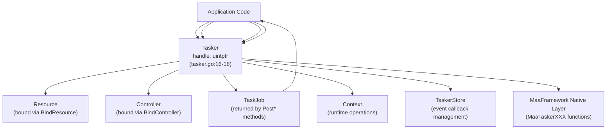
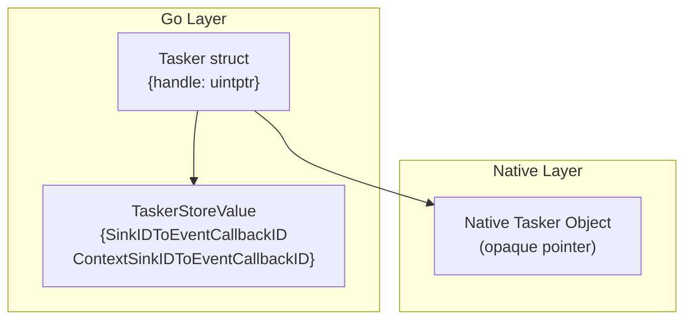
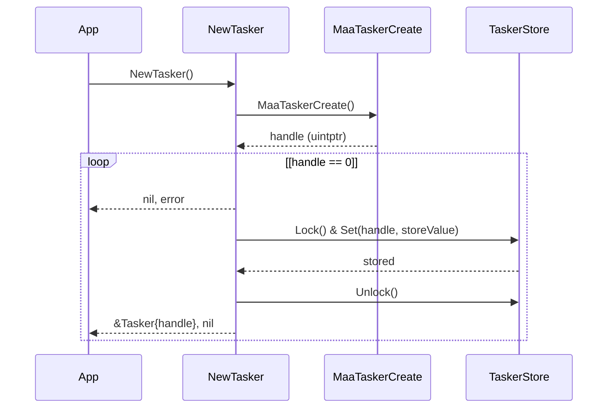
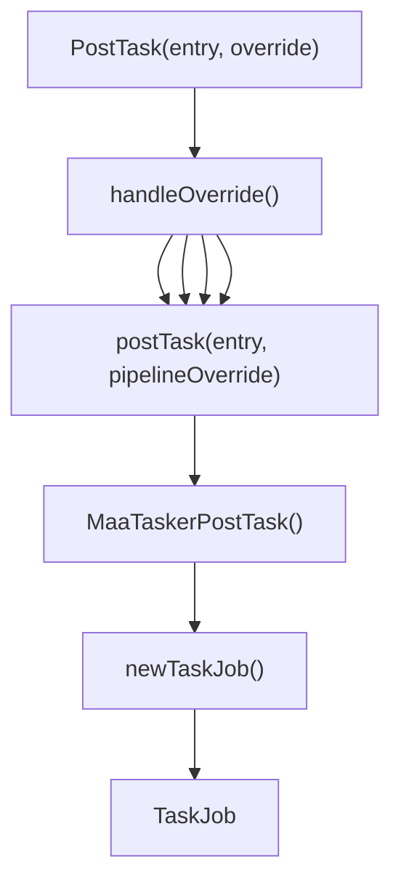
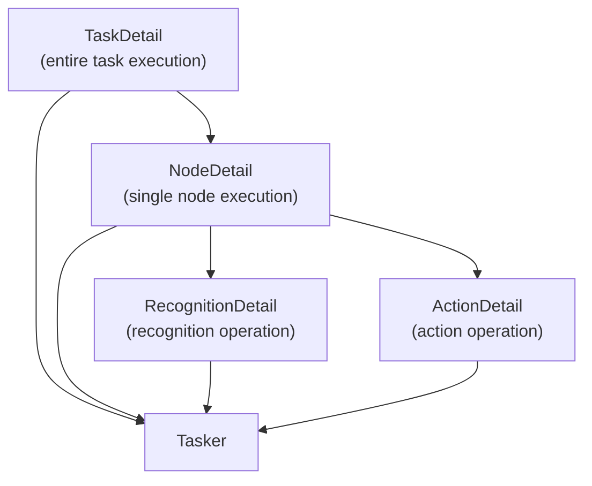
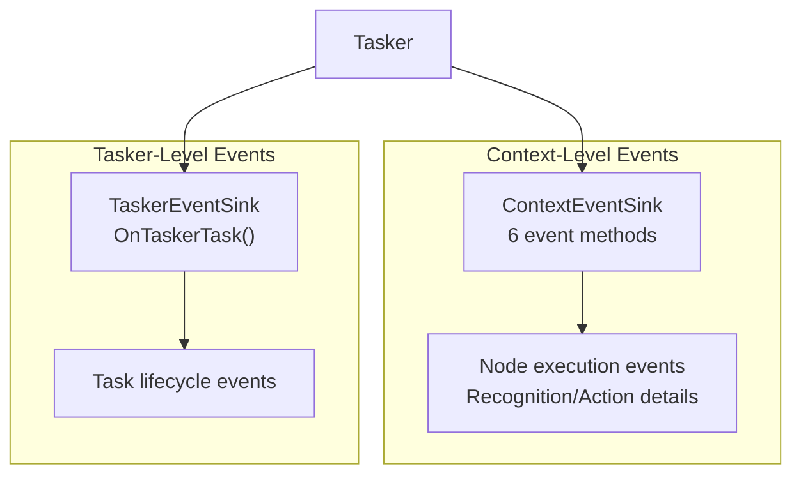
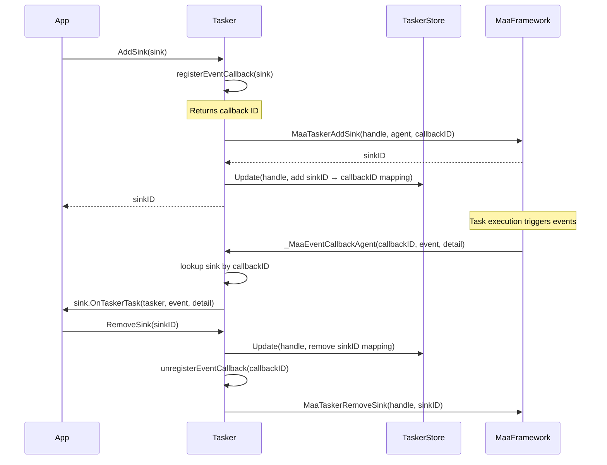
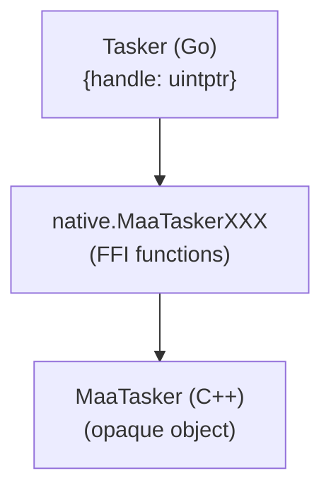
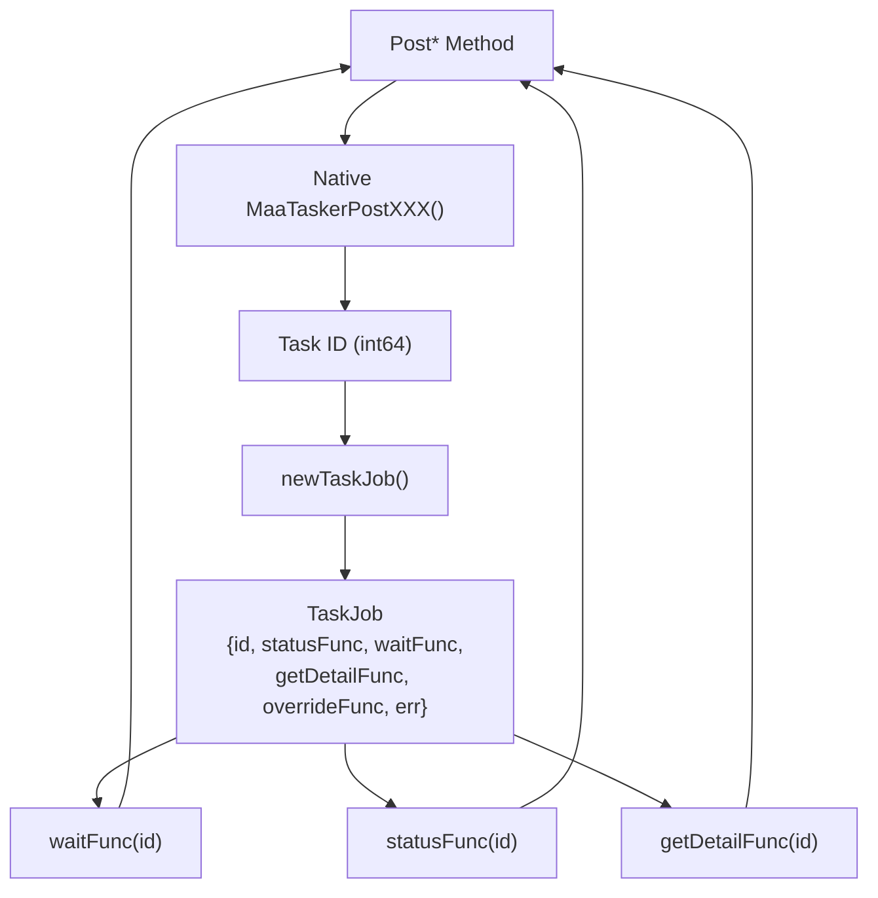

# Tasker

Relevant source files

* [README.md](https://github.com/MaaXYZ/maa-framework-go/blob/5f9c965c/README.md?plain=1)
* [README\_zh.md](https://github.com/MaaXYZ/maa-framework-go/blob/5f9c965c/README_zh.md?plain=1)
* [context.go](https://github.com/MaaXYZ/maa-framework-go/blob/5f9c965c/context.go)
* [context\_test.go](https://github.com/MaaXYZ/maa-framework-go/blob/5f9c965c/context_test.go)
* [examples/custom-action/main.go](https://github.com/MaaXYZ/maa-framework-go/blob/5f9c965c/examples/custom-action/main.go)
* [examples/quick-start/main.go](https://github.com/MaaXYZ/maa-framework-go/blob/5f9c965c/examples/quick-start/main.go)
* [resource\_test.go](https://github.com/MaaXYZ/maa-framework-go/blob/5f9c965c/resource_test.go)
* [tasker.go](https://github.com/MaaXYZ/maa-framework-go/blob/5f9c965c/tasker.go)
* [tasker\_test.go](https://github.com/MaaXYZ/maa-framework-go/blob/5f9c965c/tasker_test.go)

The Tasker component is the central orchestrator in maa-framework-go that coordinates Resources and Controllers to execute automated tasks. It manages task lifecycle, binds components, executes pipelines, and provides event notifications and detailed task information.

For information about the Context runtime operations available within custom actions and recognitions, see [Context](/MaaXYZ/maa-framework-go/3.4-context). For details on Controllers and Resources that bind to the Tasker, see [Controller](/MaaXYZ/maa-framework-go/3.2-controller) and [Resource](/MaaXYZ/maa-framework-go/3.3-resource) respectively. For information about Pipeline and Node structure, see [Pipeline and Nodes](/MaaXYZ/maa-framework-go/3.5-pipeline-and-nodes).

## Architecture Overview

The Tasker sits at the center of the framework's execution model, coordinating between Resources (which provide pipeline definitions and assets) and Controllers (which interact with devices).



**Sources:** [tasker.go14-18](https://github.com/MaaXYZ/maa-framework-go/blob/5f9c965c/tasker.go#L14-L18) [tasker.go20-37](https://github.com/MaaXYZ/maa-framework-go/blob/5f9c965c/tasker.go#L20-L37) [tasker.go56-72](https://github.com/MaaXYZ/maa-framework-go/blob/5f9c965c/tasker.go#L56-L72)

## Tasker Structure

The `Tasker` type is a lightweight wrapper around a native framework handle. All operations are delegated to the underlying MaaFramework library via FFI.



| Field | Type | Description |
| --- | --- | --- |
| `handle` | `uintptr` | Opaque pointer to the native MaaTasker object |

The handle is used for all native function calls. Additional metadata (event callback mappings) is stored separately in `store.TaskerStore`.

**Sources:** [tasker.go14-18](https://github.com/MaaXYZ/maa-framework-go/blob/5f9c965c/tasker.go#L14-L18) [tasker.go27-32](https://github.com/MaaXYZ/maa-framework-go/blob/5f9c965c/tasker.go#L27-L32)

## Creating and Destroying a Tasker

### Creation

A new Tasker is created using `NewTasker()`, which allocates a native tasker instance and registers it in the callback store.



**Function Signature:**

```
```
func NewTasker() (*Tasker, error)
```
```

Returns a new Tasker instance or an error if creation fails. The caller is responsible for calling `Destroy()` to free resources.

**Sources:** [tasker.go20-37](https://github.com/MaaXYZ/maa-framework-go/blob/5f9c965c/tasker.go#L20-L37) [examples/quick-start/main.go16-21](https://github.com/MaaXYZ/maa-framework-go/blob/5f9c965c/examples/quick-start/main.go#L16-L21)

### Destruction

The `Destroy()` method releases the native tasker and unregisters all event callbacks.

**Function Signature:**

```
```
func (t *Tasker) Destroy()
```
```

After calling `Destroy()`, the Tasker instance should not be used. This method cleans up all registered event callbacks before destroying the native object.

**Sources:** [tasker.go39-54](https://github.com/MaaXYZ/maa-framework-go/blob/5f9c965c/tasker.go#L39-L54) [examples/quick-start/main.go21](https://github.com/MaaXYZ/maa-framework-go/blob/5f9c965c/examples/quick-start/main.go#L21-L21)

## Binding Components

Before executing tasks, a Tasker must be bound to both a Resource and a Controller. The binding process stores references to these components in the native layer.

### Binding a Resource

```
```
func (t *Tasker) BindResource(res *Resource) error
```
```

Binds an initialized Resource to the Tasker. The Resource must have loaded assets (via `PostBundle`, `PostPipeline`, etc.) before binding, though this is not strictly enforced—assets can also be loaded after binding.

**Example:**

```
```
res, _ := maa.NewResource()


res.PostBundle("./resource").Wait()


tasker.BindResource(res)
```
```

**Sources:** [tasker.go56-63](https://github.com/MaaXYZ/maa-framework-go/blob/5f9c965c/tasker.go#L56-L63) [tasker\_test.go17-22](https://github.com/MaaXYZ/maa-framework-go/blob/5f9c965c/tasker_test.go#L17-L22)

### Binding a Controller

```
```
func (t *Tasker) BindController(ctrl *Controller) error
```
```

Binds an initialized Controller to the Tasker. The Controller should have successfully connected (via `PostConnect().Wait()`) before binding for most use cases.

**Example:**

```
```
ctrl, _ := maa.NewAdbController(...)


ctrl.PostConnect().Wait()


tasker.BindController(ctrl)
```
```

**Sources:** [tasker.go65-72](https://github.com/MaaXYZ/maa-framework-go/blob/5f9c965c/tasker.go#L65-L72) [tasker\_test.go17-22](https://github.com/MaaXYZ/maa-framework-go/blob/5f9c965c/tasker_test.go#L17-L22)

### Checking Initialization Status

```
```
func (t *Tasker) Initialized() bool
```
```

Returns `true` if both a Resource and a Controller have been successfully bound to the Tasker. This is a prerequisite for executing most task operations.

**Sources:** [tasker.go74-78](https://github.com/MaaXYZ/maa-framework-go/blob/5f9c965c/tasker.go#L74-L78) [tasker\_test.go49-64](https://github.com/MaaXYZ/maa-framework-go/blob/5f9c965c/tasker_test.go#L49-L64)

## Task Execution Methods

The Tasker provides three primary execution methods that return `TaskJob` instances for asynchronous operation. All methods follow the pattern of posting work to a native queue and immediately returning a job handle.

### PostTask

```
```
func (t *Tasker) PostTask(entry string, override ...any) *TaskJob
```
```

Posts a pipeline task to execute asynchronously. The `entry` parameter specifies the starting node name in the pipeline. The optional `override` parameter can be:

* A JSON string
* A `[]byte` containing JSON
* A `Pipeline` object
* Any value that can be marshaled to JSON

The override modifies or supplements the pipeline definition for this execution. If no override is provided or if the value is `nil`, an empty JSON object `{}` is used.



**Example:**

```
```
// Using a Pipeline object


pipeline := maa.NewPipeline()


node := maa.NewNode("Task").SetAction(...)


pipeline.AddNode(node)


job := tasker.PostTask(node.Name, pipeline)


// Using raw JSON


job := tasker.PostTask("Task", `{"Task":{"action":"Click"}}`)


// Using a map


job := tasker.PostTask("Task", map[string]any{


"Task": map[string]any{"action": "Click"},


})
```
```

**Sources:** [tasker.go80-113](https://github.com/MaaXYZ/maa-framework-go/blob/5f9c965c/tasker.go#L80-L113) [tasker\_test.go66-92](https://github.com/MaaXYZ/maa-framework-go/blob/5f9c965c/tasker_test.go#L66-L92)

### PostRecognition

```
```
func (t *Tasker) PostRecognition(


recType RecognitionType,


recParam RecognitionParam,


img image.Image,


) *TaskJob
```
```

Posts a direct recognition operation without requiring a pipeline entry. This is useful for one-off recognition tasks or testing recognition configurations.

**Parameters:**

* `recType`: Recognition algorithm type (e.g., `RecognitionTypeOCR`, `RecognitionTypeTemplateMatch`)
* `recParam`: Recognition-specific parameters implementing `RecognitionParam` interface
* `img`: Input image as `image.Image`

**Sources:** [tasker.go115-129](https://github.com/MaaXYZ/maa-framework-go/blob/5f9c965c/tasker.go#L115-L129)

### PostAction

```
```
func (t *Tasker) PostAction(


actionType ActionType,


actionParam ActionParam,


box Rect,


recoDetail *RecognitionDetail,


) *TaskJob
```
```

Posts a direct action operation without requiring a pipeline entry. The `box` and `recoDetail` should typically come from a previous recognition result.

**Parameters:**

* `actionType`: Action type (e.g., `ActionTypeClick`, `ActionTypeSwipe`)
* `actionParam`: Action-specific parameters implementing `ActionParam` interface
* `box`: Recognition hit box (typically from previous recognition)
* `recoDetail`: Previous recognition detail (may be `nil` if not applicable)

**Sources:** [tasker.go131-152](https://github.com/MaaXYZ/maa-framework-go/blob/5f9c965c/tasker.go#L131-L152)

## Task Control and Status

### Task Control Methods

| Method | Return Type | Description |
| --- | --- | --- |
| `PostStop()` | `*TaskJob` | Asynchronously stops the currently running task and any pending operations |
| `Running()` | `bool` | Returns `true` if the Tasker is currently executing a task |
| `Stopping()` | `bool` | Returns `true` if the Tasker is in the process of stopping (not yet fully stopped) |

```
#mermaid-h6q9srsd9rh{font-family:ui-sans-serif,-apple-system,system-ui,Segoe UI,Helvetica;font-size:16px;fill:#333;}@keyframes edge-animation-frame{from{stroke-dashoffset:0;}}@keyframes dash{to{stroke-dashoffset:0;}}#mermaid-h6q9srsd9rh .edge-animation-slow{stroke-dasharray:9,5!important;stroke-dashoffset:900;animation:dash 50s linear infinite;stroke-linecap:round;}#mermaid-h6q9srsd9rh .edge-animation-fast{stroke-dasharray:9,5!important;stroke-dashoffset:900;animation:dash 20s linear infinite;stroke-linecap:round;}#mermaid-h6q9srsd9rh .error-icon{fill:#dddddd;}#mermaid-h6q9srsd9rh .error-text{fill:#222222;stroke:#222222;}#mermaid-h6q9srsd9rh .edge-thickness-normal{stroke-width:1px;}#mermaid-h6q9srsd9rh .edge-thickness-thick{stroke-width:3.5px;}#mermaid-h6q9srsd9rh .edge-pattern-solid{stroke-dasharray:0;}#mermaid-h6q9srsd9rh .edge-thickness-invisible{stroke-width:0;fill:none;}#mermaid-h6q9srsd9rh .edge-pattern-dashed{stroke-dasharray:3;}#mermaid-h6q9srsd9rh .edge-pattern-dotted{stroke-dasharray:2;}#mermaid-h6q9srsd9rh .marker{fill:#999;stroke:#999;}#mermaid-h6q9srsd9rh .marker.cross{stroke:#999;}#mermaid-h6q9srsd9rh svg{font-family:ui-sans-serif,-apple-system,system-ui,Segoe UI,Helvetica;font-size:16px;}#mermaid-h6q9srsd9rh p{margin:0;}#mermaid-h6q9srsd9rh defs #statediagram-barbEnd{fill:#999;stroke:#999;}#mermaid-h6q9srsd9rh g.stateGroup text{fill:#dddddd;stroke:none;font-size:10px;}#mermaid-h6q9srsd9rh g.stateGroup text{fill:#333;stroke:none;font-size:10px;}#mermaid-h6q9srsd9rh g.stateGroup .state-title{font-weight:bolder;fill:#333;}#mermaid-h6q9srsd9rh g.stateGroup rect{fill:#ffffff;stroke:#dddddd;}#mermaid-h6q9srsd9rh g.stateGroup line{stroke:#999;stroke-width:1;}#mermaid-h6q9srsd9rh .transition{stroke:#999;stroke-width:1;fill:none;}#mermaid-h6q9srsd9rh .stateGroup .composit{fill:#f4f4f4;border-bottom:1px;}#mermaid-h6q9srsd9rh .stateGroup .alt-composit{fill:#e0e0e0;border-bottom:1px;}#mermaid-h6q9srsd9rh .state-note{stroke:#e6d280;fill:#fff5ad;}#mermaid-h6q9srsd9rh .state-note text{fill:#333;stroke:none;font-size:10px;}#mermaid-h6q9srsd9rh .stateLabel .box{stroke:none;stroke-width:0;fill:#ffffff;opacity:0.5;}#mermaid-h6q9srsd9rh .edgeLabel .label rect{fill:#ffffff;opacity:0.5;}#mermaid-h6q9srsd9rh .edgeLabel{background-color:#ffffff;text-align:center;}#mermaid-h6q9srsd9rh .edgeLabel p{background-color:#ffffff;}#mermaid-h6q9srsd9rh .edgeLabel rect{opacity:0.5;background-color:#ffffff;fill:#ffffff;}#mermaid-h6q9srsd9rh .edgeLabel .label text{fill:#333;}#mermaid-h6q9srsd9rh .label div .edgeLabel{color:#333;}#mermaid-h6q9srsd9rh .stateLabel text{fill:#333;font-size:10px;font-weight:bold;}#mermaid-h6q9srsd9rh .node circle.state-start{fill:#999;stroke:#999;}#mermaid-h6q9srsd9rh .node .fork-join{fill:#999;stroke:#999;}#mermaid-h6q9srsd9rh .node circle.state-end{fill:#dddddd;stroke:#f4f4f4;stroke-width:1.5;}#mermaid-h6q9srsd9rh .end-state-inner{fill:#f4f4f4;stroke-width:1.5;}#mermaid-h6q9srsd9rh .node rect{fill:#ffffff;stroke:#dddddd;stroke-width:1px;}#mermaid-h6q9srsd9rh .node polygon{fill:#ffffff;stroke:#dddddd;stroke-width:1px;}#mermaid-h6q9srsd9rh #statediagram-barbEnd{fill:#999;}#mermaid-h6q9srsd9rh .statediagram-cluster rect{fill:#ffffff;stroke:#dddddd;stroke-width:1px;}#mermaid-h6q9srsd9rh .cluster-label,#mermaid-h6q9srsd9rh .nodeLabel{color:#333;}#mermaid-h6q9srsd9rh .statediagram-cluster rect.outer{rx:5px;ry:5px;}#mermaid-h6q9srsd9rh .statediagram-state .divider{stroke:#dddddd;}#mermaid-h6q9srsd9rh .statediagram-state .title-state{rx:5px;ry:5px;}#mermaid-h6q9srsd9rh .statediagram-cluster.statediagram-cluster .inner{fill:#f4f4f4;}#mermaid-h6q9srsd9rh .statediagram-cluster.statediagram-cluster-alt .inner{fill:#f8f8f8;}#mermaid-h6q9srsd9rh .statediagram-cluster .inner{rx:0;ry:0;}#mermaid-h6q9srsd9rh .statediagram-state rect.basic{rx:5px;ry:5px;}#mermaid-h6q9srsd9rh .statediagram-state rect.divider{stroke-dasharray:10,10;fill:#f8f8f8;}#mermaid-h6q9srsd9rh .note-edge{stroke-dasharray:5;}#mermaid-h6q9srsd9rh .statediagram-note rect{fill:#fff5ad;stroke:#e6d280;stroke-width:1px;rx:0;ry:0;}#mermaid-h6q9srsd9rh .statediagram-note rect{fill:#fff5ad;stroke:#e6d280;stroke-width:1px;rx:0;ry:0;}#mermaid-h6q9srsd9rh .statediagram-note text{fill:#333;}#mermaid-h6q9srsd9rh .statediagram-note .nodeLabel{color:#333;}#mermaid-h6q9srsd9rh .statediagram .edgeLabel{color:red;}#mermaid-h6q9srsd9rh #dependencyStart,#mermaid-h6q9srsd9rh #dependencyEnd{fill:#999;stroke:#999;stroke-width:1;}#mermaid-h6q9srsd9rh .statediagramTitleText{text-anchor:middle;font-size:18px;fill:#333;}#mermaid-h6q9srsd9rh :root{--mermaid-font-family:"trebuchet ms",verdana,arial,sans-serif;}

PostTask()


PostStop()


stop complete


task complete


Idle


Running


Stopping


Running() returns true


Stopping() returns true  
Running() may return true
```

**Sources:** [tasker.go154-179](https://github.com/MaaXYZ/maa-framework-go/blob/5f9c965c/tasker.go#L154-L179) [tasker\_test.go170-202](https://github.com/MaaXYZ/maa-framework-go/blob/5f9c965c/tasker_test.go#L170-L202)

### Status Queries

The Tasker provides internal status and wait methods used by `TaskJob`. These are typically not called directly by application code but are used within job operations:

```
```
func (t *Tasker) status(id int64) Status


func (t *Tasker) wait(id int64) Status
```
```

The `Status` type indicates job completion state:

* `StatusInvalid`: Job ID is invalid or unknown
* `StatusPending`: Job is queued but not yet started
* `StatusRunning`: Job is currently executing
* `StatusSuccess`: Job completed successfully
* `StatusFailure`: Job completed with failure

**Sources:** [tasker.go159-167](https://github.com/MaaXYZ/maa-framework-go/blob/5f9c965c/tasker.go#L159-L167)

## Retrieving Task Details

The Tasker provides comprehensive methods for querying execution details at multiple levels of granularity.

### Detail Retrieval Hierarchy



### Detail Structure Types

| Type | Description | Key Fields |
| --- | --- | --- |
| `TaskDetail` | Complete task execution information | `ID`, `Entry`, `NodeDetails`, `Status` |
| `NodeDetail` | Single node execution information | `ID`, `Name`, `Recognition`, `Action`, `RunCompleted` |
| `RecognitionDetail` | Recognition operation results | `ID`, `Name`, `Algorithm`, `Hit`, `Box`, `Results`, `Raw`, `Draws` |
| `ActionDetail` | Action operation results | `ID`, `Name`, `Action`, `Box`, `Success`, `Result` |

### GetTaskDetail

```
```
func (t *Tasker) GetTaskDetail(taskID int64) (*TaskDetail, error)
```
```

Retrieves complete detail for a task execution, including all node executions that occurred. This method is typically called via `TaskJob.GetDetail()` rather than directly.

**TaskDetail Structure:**

```
```
type TaskDetail struct {


ID          int64


Entry       string


NodeDetails []*NodeDetail


Status      Status


}
```
```

**Sources:** [tasker.go406-466](https://github.com/MaaXYZ/maa-framework-go/blob/5f9c965c/tasker.go#L406-L466)

### GetRecognitionDetail

```
```
func (t *Tasker) GetRecognitionDetail(recID int64) (*RecognitionDetail, error)
```
```

Retrieves details for a specific recognition operation. Returns `nil, nil` if the recognition ID is not found (rather than an error).

**RecognitionDetail Structure:**

```
```
type RecognitionDetail struct {


ID             int64


Name           string


Algorithm      string


Hit            bool


Box            Rect


DetailJson     string


Results        *RecognitionResults  // nil for DirectHit, And, Or


CombinedResult []*RecognitionDetail // for And/Or algorithms


Raw            image.Image          // when debug/save_draw enabled


Draws          []image.Image        // when debug/save_draw enabled


}
```
```

The `Results` field contains algorithm-specific results parsed from `DetailJson`. For combined recognition types (And/Or), `CombinedResult` contains the sub-recognition details instead.

**Sources:** [tasker.go227-306](https://github.com/MaaXYZ/maa-framework-go/blob/5f9c965c/tasker.go#L227-L306)

### GetActionDetail

```
```
func (t *Tasker) GetActionDetail(actionID int64) (*ActionDetail, error)
```
```

Retrieves details for a specific action operation. Returns `nil, nil` if the action ID is not found.

**ActionDetail Structure:**

```
```
type ActionDetail struct {


ID         int64


Name       string


Action     string


Box        Rect


Success    bool


DetailJson string


Result     *ActionResult


}
```
```

The `Result` field is parsed from `DetailJson` and contains action-specific information (e.g., clicked coordinates for Click actions).

**Sources:** [tasker.go308-358](https://github.com/MaaXYZ/maa-framework-go/blob/5f9c965c/tasker.go#L308-L358)

### GetLatestNode

```
```
func (t *Tasker) GetLatestNode(taskName string) (*NodeDetail, error)
```
```

Returns the most recently executed node detail for a given task name. This is useful for getting incremental updates during long-running tasks without querying the entire task detail.

**Sources:** [tasker.go468-477](https://github.com/MaaXYZ/maa-framework-go/blob/5f9c965c/tasker.go#L468-L477) [tasker\_test.go249-272](https://github.com/MaaXYZ/maa-framework-go/blob/5f9c965c/tasker_test.go#L249-L272)

## Component Access

The Tasker provides methods to retrieve bound components. These return lightweight wrapper objects sharing the same native handle as the originally bound components.

```
```
func (t *Tasker) GetResource() *Resource


func (t *Tasker) GetController() *Controller
```
```

**Usage Pattern:**

```
```
tasker.BindResource(res1)


res2 := tasker.GetResource()


// res2.handle == res1.handle (same native object)
```
```

**Sources:** [tasker.go181-191](https://github.com/MaaXYZ/maa-framework-go/blob/5f9c965c/tasker.go#L181-L191) [tasker\_test.go204-230](https://github.com/MaaXYZ/maa-framework-go/blob/5f9c965c/tasker_test.go#L204-L230)

## Cache Management

```
```
func (t *Tasker) ClearCache() error
```
```

Clears all queryable runtime cache maintained by the Tasker. This includes cached task, node, recognition, and action details. This operation is typically not needed during normal operation but can be useful for memory management in long-running processes.

**Sources:** [tasker.go193-200](https://github.com/MaaXYZ/maa-framework-go/blob/5f9c965c/tasker.go#L193-L200) [tasker\_test.go232-247](https://github.com/MaaXYZ/maa-framework-go/blob/5f9c965c/tasker_test.go#L232-L247)

## Event System Integration

The Tasker provides a comprehensive event system for monitoring task execution. Events are delivered through sink interfaces that can be registered and removed dynamically.

### Event Sink Types

The Tasker supports two categories of event sinks:



### TaskerEventSink Interface

```
```
type TaskerEventSink interface {


OnTaskerTask(tasker *Tasker, event EventStatus, detail TaskerTaskDetail)


}
```
```

Receives high-level task lifecycle events. The `EventStatus` indicates event type (Started, Success, Failed, etc.), and `TaskerTaskDetail` provides task-specific information.

**Sources:** [tasker.go555-558](https://github.com/MaaXYZ/maa-framework-go/blob/5f9c965c/tasker.go#L555-L558)

### ContextEventSink Interface

```
```
type ContextEventSink interface {


OnNodePipelineNode(ctx *Context, event EventStatus, detail NodePipelineNodeDetail)


OnNodeRecognitionNode(ctx *Context, event EventStatus, detail NodeRecognitionNodeDetail)


OnNodeActionNode(ctx *Context, event EventStatus, detail NodeActionNodeDetail)


OnNodeNextList(ctx *Context, event EventStatus, detail NodeNextListDetail)


OnNodeRecognition(ctx *Context, event EventStatus, detail NodeRecognitionDetail)


OnNodeAction(ctx *Context, event EventStatus, detail NodeActionDetail)


}
```
```

Receives detailed node-level execution events during task processing. Each method corresponds to a specific phase of node execution.

**Sources:** [tasker.go579-587](https://github.com/MaaXYZ/maa-framework-go/blob/5f9c965c/tasker.go#L579-L587)

### Event Registration Methods

| Method | Return Type | Description |
| --- | --- | --- |
| `AddSink(sink TaskerEventSink)` | `int64` | Registers a tasker-level event listener, returns sink ID |
| `RemoveSink(sinkID int64)` | - | Unregisters a tasker-level event listener by ID |
| `ClearSinks()` | - | Removes all tasker-level event listeners |
| `AddContextSink(sink ContextEventSink)` | `int64` | Registers a context-level event listener, returns sink ID |
| `RemoveContextSink(sinkID int64)` | - | Unregisters a context-level event listener by ID |
| `ClearContextSinks()` | - | Removes all context-level event listeners |



**Sources:** [tasker.go479-553](https://github.com/MaaXYZ/maa-framework-go/blob/5f9c965c/tasker.go#L479-L553)

### Convenience Event Registration

For single-event monitoring, the Tasker provides convenience methods that automatically create adapter sinks:

```
```
func (t *Tasker) OnTaskerTask(fn func(EventStatus, TaskerTaskDetail)) int64


func (t *Tasker) OnNodePipelineNodeInContext(fn func(*Context, EventStatus, NodePipelineNodeDetail)) int64


func (t *Tasker) OnNodeRecognitionNodeInContext(fn func(*Context, EventStatus, NodeRecognitionNodeDetail)) int64


func (t *Tasker) OnNodeActionNodeInContext(fn func(*Context, EventStatus, NodeActionNodeDetail)) int64


func (t *Tasker) OnNodeNextListInContext(fn func(*Context, EventStatus, NodeNextListDetail)) int64


func (t *Tasker) OnNodeRecognitionInContext(fn func(*Context, EventStatus, NodeRecognitionDetail)) int64


func (t *Tasker) OnNodeActionInContext(fn func(*Context, EventStatus, NodeActionDetail)) int64
```
```

**Example:**

```
```
sinkID := tasker.OnTaskerTask(func(status maa.EventStatus, detail maa.TaskerTaskDetail) {


if status == maa.EventStatusSuccess {


fmt.Printf("Task %d completed successfully\n", detail.TaskID)


}


})


defer tasker.RemoveSink(sinkID)
```
```

**Sources:** [tasker.go560-676](https://github.com/MaaXYZ/maa-framework-go/blob/5f9c965c/tasker.go#L560-L676)

## Override Operations

### OverridePipeline During Execution

The Tasker supports runtime pipeline modification through the `TaskJob.OverridePipeline()` method, which delegates to an internal method:

```
```
func (t *Tasker) overridePipeline(taskID int64, override any) error
```
```

This internal method is called by `TaskJob.OverridePipeline()` and accepts the same override formats as `PostTask()`: string, `[]byte`, Pipeline object, or any JSON-marshalable value. The override replaces or modifies the pipeline definition for the specified running task.

**Example (via TaskJob):**

```
```
job := tasker.PostTask("Entry", originalPipeline)


// Modify pipeline while task is running


newPipeline := maa.NewPipeline()


// ... configure new pipeline ...


job.OverridePipeline(newPipeline)
```
```

**Sources:** [tasker.go202-225](https://github.com/MaaXYZ/maa-framework-go/blob/5f9c965c/tasker.go#L202-L225) [tasker\_test.go274-314](https://github.com/MaaXYZ/maa-framework-go/blob/5f9c965c/tasker_test.go#L274-L314)

## Internal Implementation Details

### Handle Management

The Tasker stores a single `uintptr` handle that references a native MaaTasker object. All operations are performed by passing this handle to native functions via the `internal/native` package.



**Sources:** [tasker.go14-18](https://github.com/MaaXYZ/maa-framework-go/blob/5f9c965c/tasker.go#L14-L18)

### Store Management

Event callback mappings are stored separately in `store.TaskerStore` to maintain the relationship between sink IDs and callback IDs across the FFI boundary:

```
```
type TaskerStoreValue struct {


SinkIDToEventCallbackID        map[int64]uint64


ContextSinkIDToEventCallbackID map[int64]uint64


}
```
```

The store is protected by a `sync.RWMutex` for thread-safe concurrent access. When a Tasker is destroyed, all registered callbacks must be unregistered to prevent memory leaks and dangling callback references.

**Sources:** [tasker.go27-32](https://github.com/MaaXYZ/maa-framework-go/blob/5f9c965c/tasker.go#L27-L32) [tasker.go42-51](https://github.com/MaaXYZ/maa-framework-go/blob/5f9c965c/tasker.go#L42-L51)

### Async Job Pattern

All `Post*` methods return `TaskJob` instances that encapsulate the asynchronous operation pattern:



The `newTaskJob()` function creates jobs with function references to the Tasker's status/wait/detail methods, enabling the job to query its own state without storing a Tasker reference.

**Sources:** [tasker.go104-107](https://github.com/MaaXYZ/maa-framework-go/blob/5f9c965c/tasker.go#L104-L107) [tasker.go178](https://github.com/MaaXYZ/maa-framework-go/blob/5f9c965c/tasker.go#L178-L178)

## Usage Patterns

### Basic Task Execution

```
```
// 1. Create tasker


tasker, _ := maa.NewTasker()


defer tasker.Destroy()


// 2. Bind components


ctrl, _ := maa.NewAdbController(...)


ctrl.PostConnect().Wait()


tasker.BindController(ctrl)


res, _ := maa.NewResource()


res.PostBundle("./resource").Wait()


tasker.BindResource(res)


// 3. Execute task


job := tasker.PostTask("EntryNode")


if job.Wait().Success() {


detail, _ := job.GetDetail()


fmt.Printf("Task completed with %d nodes\n", len(detail.NodeDetails))


}
```
```

**Sources:** [examples/quick-start/main.go10-64](https://github.com/MaaXYZ/maa-framework-go/blob/5f9c965c/examples/quick-start/main.go#L10-L64) [examples/custom-action/main.go10-69](https://github.com/MaaXYZ/maa-framework-go/blob/5f9c965c/examples/custom-action/main.go#L10-L69)

### Task Monitoring with Events

```
```
tasker, _ := maa.NewTasker()


defer tasker.Destroy()


// Register event listener


sinkID := tasker.OnTaskerTask(func(status maa.EventStatus, detail maa.TaskerTaskDetail) {


switch status {


case maa.EventStatusStarted:


fmt.Printf("Task %d started: %s\n", detail.TaskID, detail.Entry)


case maa.EventStatusSuccess:


fmt.Printf("Task %d succeeded\n", detail.TaskID)


case maa.EventStatusFailed:


fmt.Printf("Task %d failed\n", detail.TaskID)


}


})


defer tasker.RemoveSink(sinkID)


job := tasker.PostTask("EntryNode")


job.Wait()
```
```

**Sources:** [tasker.go573-577](https://github.com/MaaXYZ/maa-framework-go/blob/5f9c965c/tasker.go#L573-L577)

### Pipeline Override During Execution

```
```
job := tasker.PostTask("Entry", originalPipeline)


// Modify pipeline mid-execution


newPipeline := maa.NewPipeline()


newNode := maa.NewNode("Entry").SetAction(...)


newPipeline.AddNode(newNode)


if job.OverridePipeline(newPipeline) {


fmt.Println("Pipeline override successful")


}


job.Wait()
```
```

**Sources:** [tasker\_test.go274-314](https://github.com/MaaXYZ/maa-framework-go/blob/5f9c965c/tasker_test.go#L274-L314)

### Incremental Progress Monitoring

```
```
job := tasker.PostTask("LongRunningTask")


// Poll for progress


go func() {


for !job.Status().IsDone() {


if latest, err := tasker.GetLatestNode("LongRunningTask"); err == nil {


fmt.Printf("Latest node: %s (completed: %v)\n",


latest.Name, latest.RunCompleted)


}


time.Sleep(1 * time.Second)


}


}()


job.Wait()
```
```

**Sources:** [tasker.go468-477](https://github.com/MaaXYZ/maa-framework-go/blob/5f9c965c/tasker.go#L468-L477) [tasker\_test.go249-272](https://github.com/MaaXYZ/maa-framework-go/blob/5f9c965c/tasker_test.go#L249-L272)

---

**Sources:** [tasker.go1-677](https://github.com/MaaXYZ/maa-framework-go/blob/5f9c965c/tasker.go#L1-L677) [tasker\_test.go1-315](https://github.com/MaaXYZ/maa-framework-go/blob/5f9c965c/tasker_test.go#L1-L315) [context.go1-506](https://github.com/MaaXYZ/maa-framework-go/blob/5f9c965c/context.go#L1-L506) [README.md89-156](https://github.com/MaaXYZ/maa-framework-go/blob/5f9c965c/README.md?plain=1#L89-L156) [examples/quick-start/main.go1-65](https://github.com/MaaXYZ/maa-framework-go/blob/5f9c965c/examples/quick-start/main.go#L1-L65) [examples/custom-action/main.go1-76](https://github.com/MaaXYZ/maa-framework-go/blob/5f9c965c/examples/custom-action/main.go#L1-L76)