# Test Examples and Patterns

Relevant source files

* [context\_test.go](https://github.com/MaaXYZ/maa-framework-go/blob/5f9c965c/context_test.go)
* [controller\_test.go](https://github.com/MaaXYZ/maa-framework-go/blob/5f9c965c/controller_test.go)
* [custom\_controller.go](https://github.com/MaaXYZ/maa-framework-go/blob/5f9c965c/custom_controller.go)
* [dbg\_controller.go](https://github.com/MaaXYZ/maa-framework-go/blob/5f9c965c/dbg_controller.go)
* [resource\_test.go](https://github.com/MaaXYZ/maa-framework-go/blob/5f9c965c/resource_test.go)
* [tasker\_test.go](https://github.com/MaaXYZ/maa-framework-go/blob/5f9c965c/tasker_test.go)
* [test/pipleline\_smoking\_test.go](https://github.com/MaaXYZ/maa-framework-go/blob/5f9c965c/test/pipleline_smoking_test.go)
* [test/run\_without\_file\_test.go](https://github.com/MaaXYZ/maa-framework-go/blob/5f9c965c/test/run_without_file_test.go)

This page showcases practical test examples and common patterns from the `maa-framework-go` test suite. It demonstrates how to effectively test automation workflows, custom extensions, and framework components using the testing utilities and patterns established in the codebase.

For documentation of testing utilities like `CarouselImageController` and `BlankController`, see [Testing Utilities](/MaaXYZ/maa-framework-go/8.1-testing-utilities). For CI/CD pipeline details, see [CI/CD Pipeline](/MaaXYZ/maa-framework-go/8.2-cicd-pipeline).

---

## Common Test Setup Patterns

The test suite establishes reusable helper functions that encapsulate component creation and configuration. These patterns reduce boilerplate and ensure consistent test setup across the codebase.

### Component Creation Helpers

The framework provides standardized helper functions for creating core components in tests:

| Helper Function | Purpose | Returns | Error Handling |
| --- | --- | --- | --- |
| `createResource(t)` | Creates a new Resource instance | `*Resource` | Fails test immediately on error |
| `createTasker(t)` | Creates a new Tasker instance | `*Tasker` | Fails test immediately on error |
| `createCarouselImageController(t)` | Creates debug controller with test images | `*Controller` | Fails test immediately on error |
| `taskerBind(t, tasker, ctrl, res)` | Binds Resource and Controller to Tasker | void | Fails test immediately on error |

These helpers use `require.NoError()` and `require.NotNil()` to fail tests immediately if component creation fails, preventing cascading errors in subsequent test steps.

**Sources:** [controller\_test.go11-17](https://github.com/MaaXYZ/maa-framework-go/blob/5f9c965c/controller_test.go#L11-L17) [resource\_test.go10-15](https://github.com/MaaXYZ/maa-framework-go/blob/5f9c965c/resource_test.go#L10-L15) [tasker\_test.go10-22](https://github.com/MaaXYZ/maa-framework-go/blob/5f9c965c/tasker_test.go#L10-L22)

### Standard Test Structure Pattern

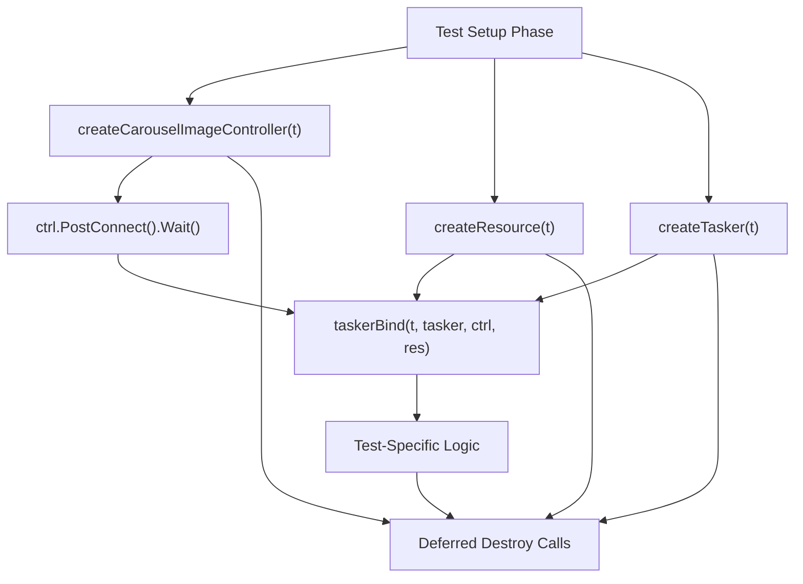

**Typical Test Structure:**

1. Create controller, resource, and tasker using helper functions
2. Register `defer Destroy()` immediately after creation
3. Connect controller with `PostConnect().Wait().Success()`
4. Bind components using `taskerBind()` helper
5. Execute test-specific logic (register custom extensions, post tasks, etc.)
6. Assert results using `require` assertions
7. Cleanup happens automatically via deferred `Destroy()` calls

**Sources:** [context\_test.go28-52](https://github.com/MaaXYZ/maa-framework-go/blob/5f9c965c/context_test.go#L28-L52) [resource\_test.go28-52](https://github.com/MaaXYZ/maa-framework-go/blob/5f9c965c/resource_test.go#L28-L52) [tasker\_test.go66-92](https://github.com/MaaXYZ/maa-framework-go/blob/5f9c965c/tasker_test.go#L66-L92)

---

## Controller Testing Patterns

Controller tests verify device interaction operations using the `CarouselImageController` for predictable, file-based testing without requiring actual devices.

### Basic Controller Operation Tests

Controller operation tests follow a consistent pattern:

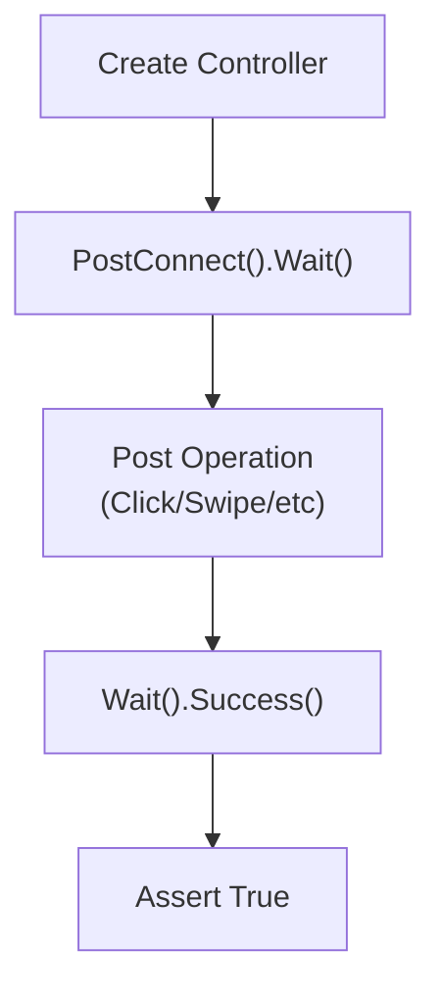

**Example Test Pattern:**

```
```
func TestController_PostClick(t *testing.T) {


ctrl := createCarouselImageController(t)


defer ctrl.Destroy()


// 1. Establish connection


isConnected := ctrl.PostConnect().Wait().Success()


require.True(t, isConnected)


// 2. Execute operation


clicked := ctrl.PostClick(100, 200).Wait().Success()


require.True(t, clicked)


}
```
```

This pattern is replicated across all controller operations: `PostSwipe`, `PostClickKey`, `PostInputText`, `PostStartApp`, `PostStopApp`, `PostTouchDown`, `PostTouchMove`, `PostTouchUp`, `PostKeyDown`, `PostKeyUp`, `PostScreencap`, and `PostInactive`.

**Sources:** [controller\_test.go86-93](https://github.com/MaaXYZ/maa-framework-go/blob/5f9c965c/controller_test.go#L86-L93) [controller\_test.go95-102](https://github.com/MaaXYZ/maa-framework-go/blob/5f9c965c/controller_test.go#L95-L102) [controller\_test.go104-111](https://github.com/MaaXYZ/maa-framework-go/blob/5f9c965c/controller_test.go#L104-L111)

### Screenshot and Image Caching Tests

Tests for screenshot functionality verify both basic capture and advanced image buffer reuse:

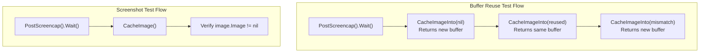

The buffer reuse pattern tests three scenarios:

* **nil buffer**: Framework allocates new `image.RGBA`
* **matching buffer**: Framework reuses provided buffer
* **mismatched bounds**: Framework allocates new buffer with correct dimensions

**Sources:** [controller\_test.go193-200](https://github.com/MaaXYZ/maa-framework-go/blob/5f9c965c/controller_test.go#L193-L200) [controller\_test.go223-246](https://github.com/MaaXYZ/maa-framework-go/blob/5f9c965c/controller_test.go#L223-L246)

---

## Resource Testing Patterns

Resource tests focus on custom extension registration, pipeline management, and resource loading operations.

### Custom Action Registration Pattern

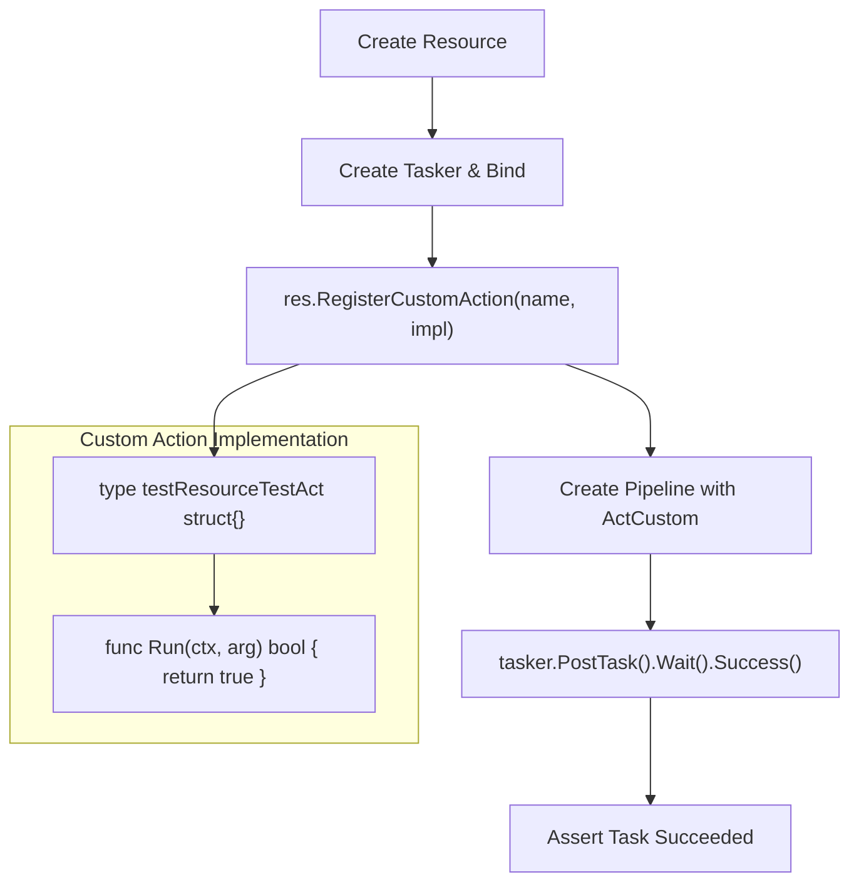

**Example Implementation:**

The test defines a minimal custom action struct that embeds no additional state and returns success:

```
```
type testResourceTestAct struct{}


func (t *testResourceTestAct) Run(_ *Context, _ *CustomActionArg) bool {


return true


}
```
```

This struct is registered with the resource and referenced in a pipeline node:

```
```
err := res.RegisterCustomAction("TestAct", &testResourceTestAct{})


require.NoError(t, err)


pipeline := NewPipeline()


node := NewNode("TestNode").


SetAction(ActCustom(CustomActionParam{CustomAction: "TestAct"}))


pipeline.AddNode(node)


got := tasker.PostTask(node.Name, pipeline).Wait().Success()


require.True(t, got)
```
```

**Sources:** [resource\_test.go135-165](https://github.com/MaaXYZ/maa-framework-go/blob/5f9c965c/resource_test.go#L135-L165) [resource\_test.go141-149](https://github.com/MaaXYZ/maa-framework-go/blob/5f9c965c/resource_test.go#L141-L149)

### Custom Recognition Registration Pattern

Custom recognition tests follow the same registration pattern but implement the `CustomRecognitionRunner` interface:

```
```
type testResourceTestRec struct{}


func (t *testResourceTestRec) Run(_ *Context, _ *CustomRecognitionArg) (*CustomRecognitionResult, bool) {


return &CustomRecognitionResult{}, true


}
```
```

The key difference is the return type: custom recognitions return `(*CustomRecognitionResult, bool)` instead of `bool`, allowing them to provide recognition details (bounding boxes, confidence scores, etc.).

**Sources:** [resource\_test.go22-52](https://github.com/MaaXYZ/maa-framework-go/blob/5f9c965c/resource_test.go#L22-L52)

### Unregister and Clear Pattern

Tests verify that extensions can be dynamically removed:

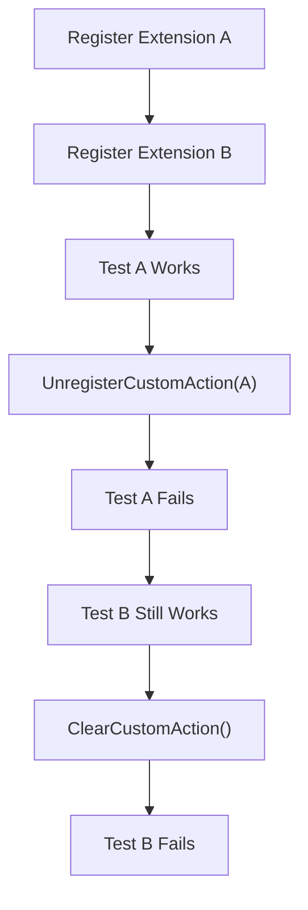

This pattern ensures that:

1. Individual unregistration removes only the specified extension
2. Clear operations remove all extensions of that type
3. Unregistered extensions cause task failure when referenced

**Sources:** [resource\_test.go167-198](https://github.com/MaaXYZ/maa-framework-go/blob/5f9c965c/resource_test.go#L167-L198) [resource\_test.go200-244](https://github.com/MaaXYZ/maa-framework-go/blob/5f9c965c/resource_test.go#L200-L244)

---

## Tasker Testing Patterns

Tasker tests verify task execution, pipeline management, and state queries.

### Pipeline Execution Test Pattern

Basic pipeline execution tests follow this structure:

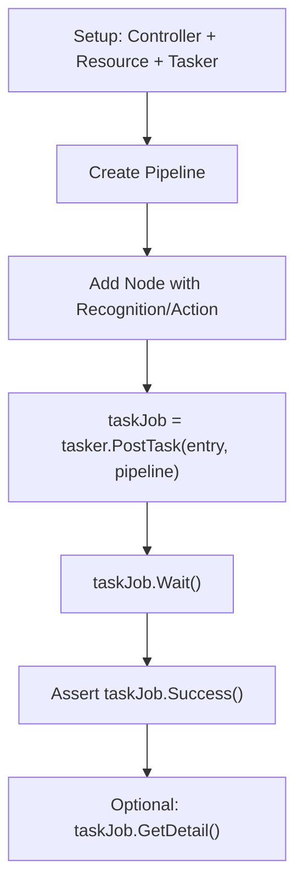

**Example:**

```
```
pipeline := NewPipeline()


node := NewNode("TestNode").


SetAction(ActClick(ClickParam{


Target: NewTargetRect(Rect{100, 200, 100, 100}),


}))


pipeline.AddNode(node)


taskJob := tasker.PostTask(node.Name, pipeline)


got := taskJob.Wait().Success()


require.True(t, got)


detail, err := taskJob.GetDetail()


require.NoError(t, err)
```
```

**Sources:** [tasker\_test.go66-92](https://github.com/MaaXYZ/maa-framework-go/blob/5f9c965c/tasker_test.go#L66-L92)

### Component Binding and Retrieval Pattern

Tests verify bidirectional binding relationships:

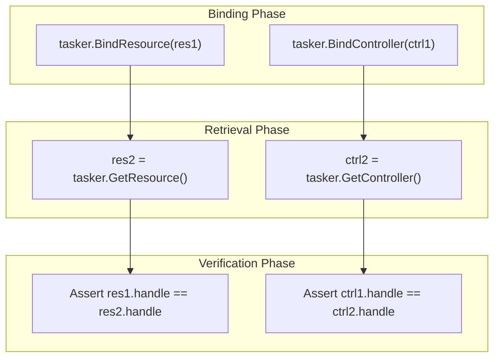

This pattern verifies that bound components can be retrieved and that the handles match, confirming proper component association.

**Sources:** [tasker\_test.go204-230](https://github.com/MaaXYZ/maa-framework-go/blob/5f9c965c/tasker_test.go#L204-L230)

### Override Pipeline Test Pattern

Tests for dynamic pipeline modification during task execution:

```
```
// Start a task with initial pipeline


taskJob := tasker.PostTask(nodeName, pipeline)


// Modify pipeline while task is running


overridePipeline := NewPipeline()


// ... add modified nodes ...


got := taskJob.OverridePipeline(overridePipeline)


// Note: May return false if task already completed


success := taskJob.Wait().Success()


require.True(t, success)
```
```

This pattern tests the framework's ability to modify task behavior at runtime, useful for adaptive automation scenarios.

**Sources:** [tasker\_test.go274-314](https://github.com/MaaXYZ/maa-framework-go/blob/5f9c965c/tasker_test.go#L274-L314)

---

## Context Testing Patterns

Context tests are unique in that they test framework operations from within custom actions, demonstrating how custom extensions can leverage framework capabilities during execution.

### Nested Operation Testing Pattern

Context tests embed `*testing.T` in custom action structs to enable assertions from within the custom action callback:

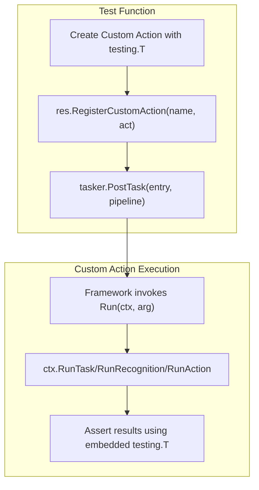

**Example Pattern:**

```
```
type testContextRunTaskAct struct {


t *testing.T


}


func (t *testContextRunTaskAct) Run(ctx *Context, _ *CustomActionArg) bool {


pipeline := NewPipeline()


testNode := NewNode("Test").


SetAction(ActClick(ClickParam{Target: NewTargetRect(Rect{100, 100, 10, 10})}))


pipeline.AddNode(testNode)


detail, err := ctx.RunTask(testNode.Name, pipeline)


require.NoError(t.t, err)


require.NotNil(t.t, detail)


return true


}
```
```

This pattern allows:

* Testing context operations from within custom actions
* Using standard test assertions inside callbacks
* Verifying nested operation results during task execution

**Sources:** [context\_test.go10-26](https://github.com/MaaXYZ/maa-framework-go/blob/5f9c965c/context_test.go#L10-L26) [context\_test.go28-52](https://github.com/MaaXYZ/maa-framework-go/blob/5f9c965c/context_test.go#L28-L52)

### Context Override Testing Pattern

Tests verify that custom actions can dynamically modify pipeline behavior:

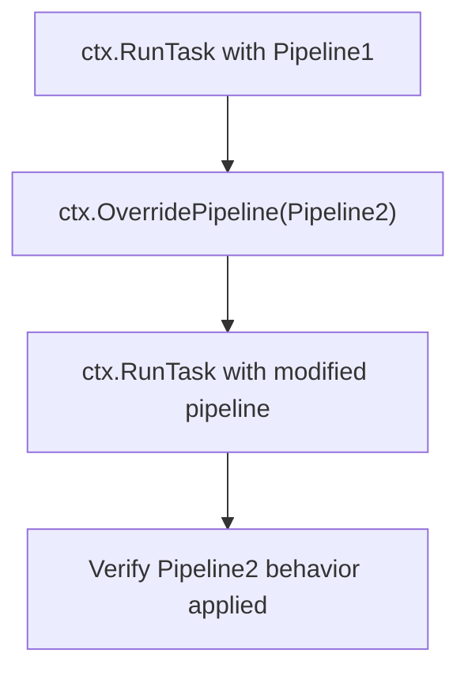

**Test Pattern:**

```
```
func (t *testContextOverriderPipelineAct) Run(ctx *Context, _ *CustomActionArg) bool {


// Execute with first pipeline


pipeline1 := NewPipeline()


// ... add nodes ...


detail1, err := ctx.RunTask(nodeName, pipeline1)


require.NoError(t.t, err)


// Override with second pipeline


pipeline2 := NewPipeline()


// ... add different nodes ...


err = ctx.OverridePipeline(pipeline2)


require.NoError(t.t, err)


// Execute again - uses overridden pipeline


detail2, err2 := ctx.RunTask(nodeName)


require.NoError(t.t, err2)


return true


}
```
```

Similarly, `ctx.OverrideNext()` allows custom actions to modify node flow control dynamically.

**Sources:** [context\_test.go152-208](https://github.com/MaaXYZ/maa-framework-go/blob/5f9c965c/context_test.go#L152-L208) [context\_test.go210-262](https://github.com/MaaXYZ/maa-framework-go/blob/5f9c965c/context_test.go#L210-L262)

### Comprehensive GetNode Testing Pattern

The `testContextGetNodeDataAct` demonstrates a table-driven testing pattern for verifying node data retrieval and parsing:

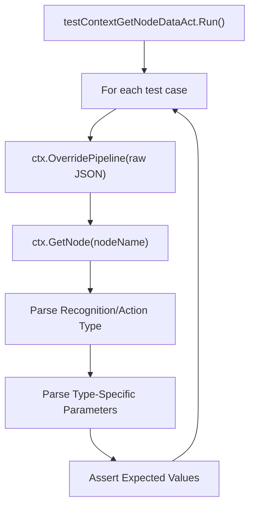

This pattern tests:

* **Recognition Types**: DirectHit, TemplateMatch, FeatureMatch, ColorMatch, OCR, NeuralNetworkClassify, NeuralNetworkDetect, Custom
* **Action Types**: DoNothing, Click, LongPress, Swipe, MultiSwipe, TouchDown/Move/Up, ClickKey, LongPressKey, KeyDown/Up, InputText, StartApp, StopApp, StopTask, Command, Scroll, Screencap, Custom
* **Node Attributes**: Next lists, rate\_limit, timeout, on\_error, inverse, enabled, max\_hit, delays, wait\_freezes, focus, attach, anchor

**Example Test Case:**

```
```
cases := []Case{


{


Name: "TemplateMatch",


testFunc: func(ctx *Context) {


raw := map[string]any{


"test_template": map[string]any{


"recognition": map[string]any{


"type": "TemplateMatch",


"param": map[string]any{


"template": []string{"test.png"},


"threshold": 0.8,


"order_by": "Score",


},


},


},


}


ctx.OverridePipeline(raw)


nodeData, err := ctx.GetNode("test_template")


assert.NoError(t, err)


assert.Equal(t, RecognitionTypeTemplateMatch, nodeData.Recognition.Type)


param := nodeData.Recognition.Param.(*TemplateMatchParam)


assert.Equal(t, []string{"test.png"}, param.Template)


assert.Equal(t, []float64{0.8}, param.Threshold)


},


},


}
```
```

**Sources:** [context\_test.go328-467](https://github.com/MaaXYZ/maa-framework-go/blob/5f9c965c/context_test.go#L328-L467) [context\_test.go510-543](https://github.com/MaaXYZ/maa-framework-go/blob/5f9c965c/context_test.go#L510-L543) [context\_test.go736-750](https://github.com/MaaXYZ/maa-framework-go/blob/5f9c965c/context_test.go#L736-L750)

---

## Integration Test Patterns

Integration tests demonstrate complete workflows combining multiple components and custom extensions.

### End-to-End Workflow Test Pattern

The `TestRunWithoutFile` demonstrates a full integration test without loading external pipeline files:

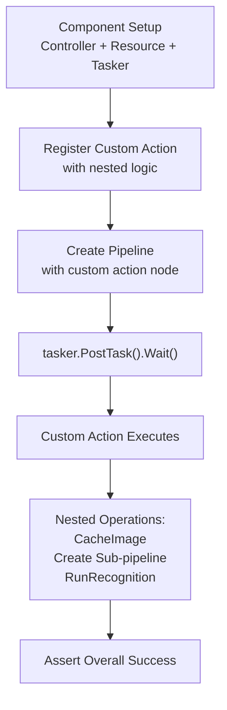

**Key Pattern Elements:**

1. **Custom Action with Complex Logic**: The custom action doesn't just return a boolean—it performs actual framework operations:

```
```
type MyAct struct {


t *testing.T


}


func (a *MyAct) Run(ctx *maa.Context, arg *maa.CustomActionArg) bool {


// Access tasker and controller


tasker := ctx.GetTasker()


ctrl := tasker.GetController()


// Capture current screen


img, err := ctrl.CacheImage()


require.NoError(a.t, err)


// Create and execute sub-pipeline


pipeline := maa.NewPipeline()


node := maa.NewNode("MyColorMatching").


SetRecognition(maa.RecColorMatch(maa.ColorMatchParam{


Lower: [][]int{{100, 100, 100}},


Upper: [][]int{{255, 255, 255}},


}))


pipeline.AddNode(node)


// Run recognition on captured image


detail, err := ctx.RunRecognition("MyColorMatching", img, pipeline)


require.NoError(a.t, err)


require.NotNil(a.t, detail)


return true


}
```
```

2. **Pipeline Created Programmatically**: Unlike file-based tests, the pipeline is constructed entirely in code using the Pipeline/Node builder API.
3. **Nested Recognition Execution**: The custom action creates its own sub-pipeline and executes recognition operations, demonstrating how complex multi-stage automation can be composed.

**Sources:** [test/run\_without\_file\_test.go10-76](https://github.com/MaaXYZ/maa-framework-go/blob/5f9c965c/test/run_without_file_test.go#L10-L76) [test/run\_without\_file\_test.go49-75](https://github.com/MaaXYZ/maa-framework-go/blob/5f9c965c/test/run_without_file_test.go#L49-L75)

### Commented Pipeline Smoking Test Pattern

The commented-out test in `pipleline_smoking_test.go` shows the pattern for integration tests with external pipeline resources:

```
```
// Pattern (commented for reference):


// 1. Create controller (DbgController for recording playback)


// 2. Create resource and load bundle from directory


// 3. Create tasker and bind components


// 4. Post task by name (referencing pipeline loaded from bundle)


// 5. Wait for completion and assert success
```
```

This pattern is useful for testing against pre-recorded interaction sequences or validated pipeline configurations stored in JSON files.

**Sources:** [test/pipleline\_smoking\_test.go3-33](https://github.com/MaaXYZ/maa-framework-go/blob/5f9c965c/test/pipleline_smoking_test.go#L3-L33)

---

## Test Data and Override Patterns

### HandleOverride Testing Pattern

Both `Tasker` and `Context` implement `handleOverride()` for flexible pipeline override parameter handling. Tests verify multiple input types:

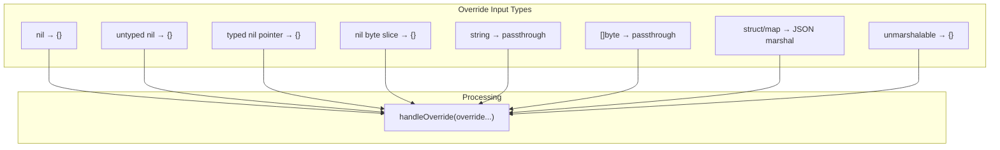

**Test Cases:**

| Input Type | Example | Expected Output | Purpose |
| --- | --- | --- | --- |
| `nil` | `nil` | `"{}"` | No override provided |
| Untyped nil | `[]any{nil}` | `"{}"` | Safe nil handling |
| Typed nil pointer | `(*T)(nil)` | `"{}"` | Prevent nil dereference |
| Nil byte slice | `[]byte(nil)` | `"{}"` | Empty override |
| String | `"{\"A\":1}"` | `"{\"A\":1}"` | Direct JSON string |
| Byte slice | `[]byte("{\"A\":1}")` | `"{\"A\":1}"` | Binary JSON |
| Map/struct | `map[string]any{"A": 1}` | `"{\"A\":1}"` | Auto-marshal objects |
| Unmarshalable | `map[string]any{"f": func(){}}` | `"{}"` | Graceful failure |

This pattern ensures that override parameters are flexible and safe, preventing nil pointer dereferences and handling various input formats gracefully.

**Sources:** [context\_test.go264-326](https://github.com/MaaXYZ/maa-framework-go/blob/5f9c965c/context_test.go#L264-L326) [tasker\_test.go94-168](https://github.com/MaaXYZ/maa-framework-go/blob/5f9c965c/tasker_test.go#L94-L168)

---

## Summary of Test Patterns

| Pattern Category | Key Characteristics | Primary Files |
| --- | --- | --- |
| **Component Creation** | Reusable helpers, immediate error handling, deferred cleanup | `*_test.go` helper functions |
| **Controller Testing** | CarouselImageController usage, operation success verification | [controller\_test.go](https://github.com/MaaXYZ/maa-framework-go/blob/5f9c965c/controller_test.go) |
| **Resource Testing** | Custom extension registration/unregistration, pipeline management | [resource\_test.go](https://github.com/MaaXYZ/maa-framework-go/blob/5f9c965c/resource_test.go) |
| **Tasker Testing** | Pipeline execution, binding verification, state queries | [tasker\_test.go](https://github.com/MaaXYZ/maa-framework-go/blob/5f9c965c/tasker_test.go) |
| **Context Testing** | Nested operations, testing.T embedding, dynamic overrides | [context\_test.go](https://github.com/MaaXYZ/maa-framework-go/blob/5f9c965c/context_test.go) |
| **Integration Testing** | End-to-end workflows, custom logic composition, programmatic pipelines | [test/run\_without\_file\_test.go](https://github.com/MaaXYZ/maa-framework-go/blob/5f9c965c/test/run_without_file_test.go) |
| **Override Testing** | Multi-type parameter handling, safe nil processing | [context\_test.go264-326](https://github.com/MaaXYZ/maa-framework-go/blob/5f9c965c/context_test.go#L264-L326) [tasker\_test.go94-168](https://github.com/MaaXYZ/maa-framework-go/blob/5f9c965c/tasker_test.go#L94-L168) |

These patterns provide a comprehensive foundation for testing automation workflows, custom extensions, and framework operations in `maa-framework-go`. They demonstrate best practices for test organization, assertion strategies, and the effective use of debugging utilities like `CarouselImageController`.