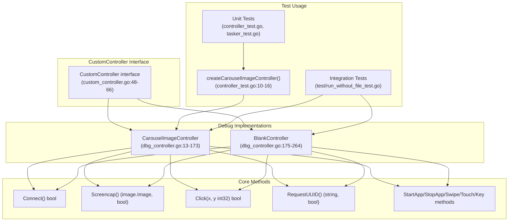
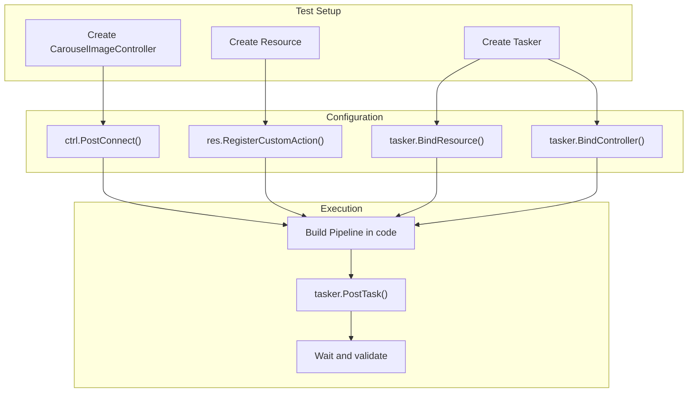
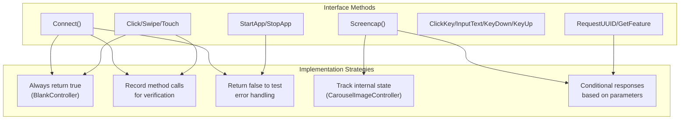

# Testing Utilities

Relevant source files

* [context\_test.go](https://github.com/MaaXYZ/maa-framework-go/blob/5f9c965c/context_test.go)
* [controller\_test.go](https://github.com/MaaXYZ/maa-framework-go/blob/5f9c965c/controller_test.go)
* [custom\_controller.go](https://github.com/MaaXYZ/maa-framework-go/blob/5f9c965c/custom_controller.go)
* [dbg\_controller.go](https://github.com/MaaXYZ/maa-framework-go/blob/5f9c965c/dbg_controller.go)
* [resource\_test.go](https://github.com/MaaXYZ/maa-framework-go/blob/5f9c965c/resource_test.go)
* [tasker\_test.go](https://github.com/MaaXYZ/maa-framework-go/blob/5f9c965c/tasker_test.go)
* [test/pipleline\_smoking\_test.go](https://github.com/MaaXYZ/maa-framework-go/blob/5f9c965c/test/pipleline_smoking_test.go)
* [test/run\_without\_file\_test.go](https://github.com/MaaXYZ/maa-framework-go/blob/5f9c965c/test/run_without_file_test.go)

This page documents the testing utilities provided by maa-framework-go, specifically the debug controller implementations that enable automated testing without requiring physical devices or live connections. These utilities allow developers to write comprehensive unit and integration tests for automation pipelines and custom logic.

For information about CI/CD pipeline configuration and test execution across platforms, see [CI/CD Pipeline](/MaaXYZ/maa-framework-go/8.2-cicd-pipeline). For comprehensive test examples showing common testing patterns, see [Test Examples and Patterns](/MaaXYZ/maa-framework-go/8.3-test-examples-and-patterns).

## TestMain Initialization

Every test package in this repository initializes the framework in a `TestMain` function before any tests run. This is the required entry point for framework setup.

**Root package** ([main\_test.go8-15](https://github.com/MaaXYZ/maa-framework-go/blob/5f9c965c/main_test.go#L8-L15)):

```
TestMain(m *testing.M)
  ├── Init(WithLogDir("./test/debug"), WithStdoutLevel(LoggingLevelOff))
  └── os.Exit(m.Run())
```

**Integration test package** ([test/main\_test.go10-17](https://github.com/MaaXYZ/maa-framework-go/blob/5f9c965c/test/main_test.go#L10-L17)):

```
TestMain(m *testing.M)
  ├── maa.Init(maa.WithLogDir("./debug"), maa.WithStdoutLevel(maa.LoggingLevelOff))
  └── os.Exit(m.Run())
```

| Option | Value | Purpose |
| --- | --- | --- |
| `WithLogDir` | `"./test/debug"` or `"./debug"` | Writes framework logs to a local directory instead of cluttering test output |
| `WithStdoutLevel` | `LoggingLevelOff` | Suppresses all MaaFramework stdout logging during tests |

The `os.Exit(m.Run())` pattern is required because `testing.M.Run()` returns an exit code that must be passed to `os.Exit` to ensure correct test pass/fail reporting. Using `defer` does not work in this context.

`Init` must be called exactly once per process. The inited singleton guard (see page 2.1) prevents double initialization, but `TestMain` ensures initialization happens before any test function executes.

Sources: [main\_test.go1-15](https://github.com/MaaXYZ/maa-framework-go/blob/5f9c965c/main_test.go#L1-L15) [test/main\_test.go1-17](https://github.com/MaaXYZ/maa-framework-go/blob/5f9c965c/test/main_test.go#L1-L17)

---

## Overview

The framework provides two debug controller implementations that satisfy the `CustomController` interface for testing purposes:

| Controller | Purpose | Screen Capture Behavior | Connection Behavior |
| --- | --- | --- | --- |
| `CarouselImageController` | Replay static images for visual recognition testing | Cycles through loaded image files | Loads images from directory/file path |
| `BlankController` | Minimal stub for logic testing | Returns blank 1280×720 RGBA image | Always succeeds immediately |

Both controllers implement all required `CustomController` interface methods with successful return values, allowing pipelines to execute without device dependencies.

## Debug Controller Architecture



**Sources:** [dbg\_controller.go1-265](https://github.com/MaaXYZ/maa-framework-go/blob/5f9c965c/dbg_controller.go#L1-L265) [custom\_controller.go42-66](https://github.com/MaaXYZ/maa-framework-go/blob/5f9c965c/custom_controller.go#L42-L66) [controller\_test.go10-16](https://github.com/MaaXYZ/maa-framework-go/blob/5f9c965c/controller_test.go#L10-L16)

## CarouselImageController

`CarouselImageController` loads image files from a specified path and cycles through them during screencap operations, enabling visual recognition algorithm testing with static image datasets.

### Implementation Details

The controller is created via `NewCarouselImageController(path string)` at [dbg\_controller.go21-25](https://github.com/MaaXYZ/maa-framework-go/blob/5f9c965c/dbg_controller.go#L21-L25) The struct at [dbg\_controller.go13-19](https://github.com/MaaXYZ/maa-framework-go/blob/5f9c965c/dbg_controller.go#L13-L19) contains:

```
```
type CarouselImageController struct {


path       string          // Directory or file path


images     []image.Image   // Loaded image cache


imageIndex int             // Current position in carousel


resolution image.Point     // Resolution from first image


connected  atomic.Bool     // Connection state


}
```
```

### Connection Behavior

The `Connect()` method at [dbg\_controller.go38-93](https://github.com/MaaXYZ/maa-framework-go/blob/5f9c965c/dbg_controller.go#L38-L93) performs the following operations:

1. **Path Validation**: Checks if the path exists using `os.Stat`
2. **Image Loading**:
   * If path is a directory: walks recursively and attempts to decode all files
   * If path is a file: attempts to decode the single file
3. **Format Support**: Supports PNG, JPEG, and GIF formats via standard library decoders
4. **Resolution Detection**: Uses the first successfully loaded image to determine controller resolution
5. **State Management**: Sets `connected` to true only if at least one image loads successfully

### Screencap Behavior

The `Screencap()` method at [dbg\_controller.go126-138](https://github.com/MaaXYZ/maa-framework-go/blob/5f9c965c/dbg_controller.go#L126-L138) implements a round-robin carousel:

1. Returns the image at current `imageIndex`
2. Increments `imageIndex`
3. Wraps back to 0 when reaching the end of the image array
4. Returns `false` if no images are loaded

This behavior allows pipelines with loops or multiple recognition attempts to receive different images on each capture, simulating dynamic screen states.

### Action Method Stubs

All action methods ([dbg\_controller.go28-173](https://github.com/MaaXYZ/maa-framework-go/blob/5f9c965c/dbg_controller.go#L28-L173)) return `true` without performing actual operations:

* `Click`, `Swipe`, `TouchDown`, `TouchMove`, `TouchUp`
* `ClickKey`, `InputText`, `KeyDown`, `KeyUp`
* `StartApp`, `StopApp`
* `Scroll`

The `RequestUUID()` method returns the path string as the UUID.

### Usage Pattern

```
```
// Typical test setup


testingPath := "./test/data_set/PipelineSmoking/Screenshot"


ctrl, err := maa.NewCarouselImageController(testingPath)


require.NoError(t, err)


defer ctrl.Destroy()


isConnected := ctrl.PostConnect().Wait().Success()


require.True(t, isConnected)


// Controller now ready for use with tasker
```
```

**Sources:** [dbg\_controller.go13-173](https://github.com/MaaXYZ/maa-framework-go/blob/5f9c965c/dbg_controller.go#L13-L173) [controller\_test.go10-21](https://github.com/MaaXYZ/maa-framework-go/blob/5f9c965c/controller_test.go#L10-L21) [tasker\_test.go40-47](https://github.com/MaaXYZ/maa-framework-go/blob/5f9c965c/tasker_test.go#L40-L47)

## BlankController

`BlankController` provides a minimal stub implementation that always succeeds and returns a blank image, useful for testing pipeline logic without image content dependencies.

### Implementation Details

The controller is created via `NewBlankController()` at [dbg\_controller.go177-179](https://github.com/MaaXYZ/maa-framework-go/blob/5f9c965c/dbg_controller.go#L177-L179) The struct at [dbg\_controller.go175](https://github.com/MaaXYZ/maa-framework-go/blob/5f9c965c/dbg_controller.go#L175-L175) is empty:

```
```
type BlankController struct{}
```
```

### Connection and Screencap Behavior

* `Connect()` at [dbg\_controller.go192-194](https://github.com/MaaXYZ/maa-framework-go/blob/5f9c965c/dbg_controller.go#L192-L194): Always returns `true` immediately
* `Connected()` at [dbg\_controller.go197-199](https://github.com/MaaXYZ/maa-framework-go/blob/5f9c965c/dbg_controller.go#L197-L199): Always returns `true`
* `Screencap()` at [dbg\_controller.go227-229](https://github.com/MaaXYZ/maa-framework-go/blob/5f9c965c/dbg_controller.go#L227-L229): Always returns a new 1280×720 RGBA image with zero-initialized pixels
* `RequestUUID()` at [dbg\_controller.go222-224](https://github.com/MaaXYZ/maa-framework-go/blob/5f9c965c/dbg_controller.go#L222-L224): Returns the constant string `"blank-controller"`

### Action Method Stubs

All action methods ([dbg\_controller.go182-263](https://github.com/MaaXYZ/maa-framework-go/blob/5f9c965c/dbg_controller.go#L182-L263)) return `true` without validation or side effects.

### Usage Pattern

`BlankController` is appropriate when:

* Testing custom action logic that doesn't depend on screen content
* Testing pipeline flow control and error handling
* Testing event callback behavior
* Performance testing without I/O overhead

**Sources:** [dbg\_controller.go175-264](https://github.com/MaaXYZ/maa-framework-go/blob/5f9c965c/dbg_controller.go#L175-L264)

## Testing Patterns with Debug Controllers

### Helper Function Pattern

Test suites typically define helper functions to create pre-configured controllers:

```
```
func createCarouselImageController(t *testing.T) *Controller {


testingPath := "./test/data_set/PipelineSmoking/Screenshot"


ctrl, err := NewCarouselImageController(testingPath)


require.NoError(t, err)


require.NotNil(t, ctrl)


return ctrl


}
```
```

This pattern is demonstrated at [controller\_test.go10-16](https://github.com/MaaXYZ/maa-framework-go/blob/5f9c965c/controller_test.go#L10-L16) and used throughout the test suite.

**Sources:** [controller\_test.go10-16](https://github.com/MaaXYZ/maa-framework-go/blob/5f9c965c/controller_test.go#L10-L16)

### Unit Test Pattern

```mermaid
sequenceDiagram
  participant Test Function
  participant createCarouselImageController()
  participant CarouselImageController
  participant Job

  Test Function->>createCarouselImageController(): "Call helper"
  createCarouselImageController()->>CarouselImageController: "NewCarouselImageController(path)"
  createCarouselImageController()-->>Test Function: "Return *Controller"
  Test Function->>CarouselImageController: "PostConnect()"
  CarouselImageController-->>Test Function: "Job"
  Test Function->>Job: "Wait().Success()"
  Job-->>Test Function: "true"
  Test Function->>CarouselImageController: "PostClick(100, 200)"
  CarouselImageController-->>Test Function: "Job"
  Test Function->>Job: "Wait().Success()"
  Job-->>Test Function: "true"
  Test Function->>CarouselImageController: "Destroy()"
```

The pattern is seen throughout [controller\_test.go23-222](https://github.com/MaaXYZ/maa-framework-go/blob/5f9c965c/controller_test.go#L23-L222) where each test:

1. Creates controller via helper
2. Defers `Destroy()` call
3. Posts operations and validates results
4. Uses `require` assertions from testify

**Sources:** [controller\_test.go23-222](https://github.com/MaaXYZ/maa-framework-go/blob/5f9c965c/controller_test.go#L23-L222)

### Integration Test Pattern

The integration test pattern at [test/run\_without\_file\_test.go10-47](https://github.com/MaaXYZ/maa-framework-go/blob/5f9c965c/test/run_without_file_test.go#L10-L47) demonstrates full component integration:



This pattern tests:

* Custom action invocation with context access
* Pipeline construction without external files
* Controller integration with tasker
* Resource binding and custom logic registration

**Sources:** [test/run\_without\_file\_test.go10-77](https://github.com/MaaXYZ/maa-framework-go/blob/5f9c965c/test/run_without_file_test.go#L10-L77)

### Tasker Integration Tests

The tasker test suite at [tasker\_test.go10-242](https://github.com/MaaXYZ/maa-framework-go/blob/5f9c965c/tasker_test.go#L10-L242) demonstrates patterns for testing tasker operations:

| Test Type | Example Test | Controller Used | Purpose |
| --- | --- | --- | --- |
| Binding | `TestTasker_BindResource` | None required | Test resource attachment |
| Binding | `TestTasker_BindController` | CarouselImageController | Test controller attachment |
| Pipeline Execution | `TestTasker_PostPipeline` | CarouselImageController | Test task execution |
| Status | `TestTasker_Running` | CarouselImageController | Test state queries |
| Control | `TestTasker_PostStop` | CarouselImageController | Test task cancellation |
| Details | `TestTasker_GetLatestNode` | CarouselImageController | Test node information retrieval |
| Override | `TestTasker_OverridePipeline` | CarouselImageController | Test runtime pipeline modification |

Common helper pattern at [tasker\_test.go17-22](https://github.com/MaaXYZ/maa-framework-go/blob/5f9c965c/tasker_test.go#L17-L22):

```
```
func taskerBind(t *testing.T, tasker *Tasker, ctrl *Controller, res *Resource) {


err := tasker.BindResource(res)


require.NoError(t, err)


err = tasker.BindController(ctrl)


require.NoError(t, err)


}
```
```

**Sources:** [tasker\_test.go10-242](https://github.com/MaaXYZ/maa-framework-go/blob/5f9c965c/tasker_test.go#L10-L242)

## Mock and Stub Approaches

### Custom Controller as Test Double

The `CustomController` interface at [custom\_controller.go48-66](https://github.com/MaaXYZ/maa-framework-go/blob/5f9c965c/custom_controller.go#L48-L66) can be implemented for specialized test scenarios:



### Recording Controller Pattern

For verification-focused tests, implement a controller that records method invocations:

```
```
type RecordingController struct {


Clicks []image.Point


Swipes []SwipeRecord


AppStarts []string


}
```
```

This pattern enables assertions on controller usage without actual device interaction.

### Failure Simulation Pattern

To test error handling, implement controllers that return `false` for specific operations:

```
```
type FailingController struct {


ShouldConnectFail   bool


ShouldScreencapFail bool


}
```
```

This allows testing of:

* Connection failure recovery
* Screencap timeout handling
* Action failure fallback logic
* Error event generation

Sources: [custom\_controller.go48-66](https://github.com/MaaXYZ/maa-framework-go/blob/5f9c965c/custom_controller.go#L48-L66) [dbg\_controller.go1-265](https://github.com/MaaXYZ/maa-framework-go/blob/5f9c965c/dbg_controller.go#L1-L265)

## Test Data Organization

The test suite uses a structured data directory. The `test/data_set` directory is a **git submodule** pointing to `https://github.com/MaaXYZ/MaaFrameworkTesting.git` ([.gitmodules1-3](https://github.com/MaaXYZ/maa-framework-go/blob/5f9c965c/.gitmodules#L1-L3)):

```
test/
├── data_set/                    # Git submodule: MaaFrameworkTesting
│   └── PipelineSmoking/
│       ├── Screenshot/          # Images for CarouselImageController
│       ├── resource/            # Pipeline definition files
│       └── MaaRecording.txt     # Recording data
└── main_test.go                 # TestMain for integration tests
```

The `Screenshot` directory is referenced at [controller\_test.go11](https://github.com/MaaXYZ/maa-framework-go/blob/5f9c965c/controller_test.go#L11-L11) and provides the image carousel dataset. The `resource` directory contains pipeline definition files for smoking tests.

The submodule must be initialized (`git submodule update --init`) before tests that depend on image files or pipeline resource bundles can run. Tests in `test/run_without_file_test.go` are specifically designed to avoid this dependency by constructing pipelines entirely in Go code.

Sources: [.gitmodules1-3](https://github.com/MaaXYZ/maa-framework-go/blob/5f9c965c/.gitmodules#L1-L3) [controller\_test.go10-16](https://github.com/MaaXYZ/maa-framework-go/blob/5f9c965c/controller_test.go#L10-L16)

## Best Practices

### Lifecycle Management

Always use `defer` to ensure controller cleanup:

```
```
ctrl := createCarouselImageController(t)


defer ctrl.Destroy()
```
```

This pattern appears consistently at [controller\_test.go20](https://github.com/MaaXYZ/maa-framework-go/blob/5f9c965c/controller_test.go#L20-L20) [tasker\_test.go26](https://github.com/MaaXYZ/maa-framework-go/blob/5f9c965c/tasker_test.go#L26-L26) and throughout the test suite.

### Connection Validation

Always verify connection success before proceeding with tests:

```
```
isConnected := ctrl.PostConnect().Wait().Success()


require.True(t, isConnected)
```
```

This pattern at [controller\_test.go72-73](https://github.com/MaaXYZ/maa-framework-go/blob/5f9c965c/controller_test.go#L72-L73) ensures the controller is ready before testing dependent operations.

### Assertion Library Integration

The test suite uses `github.com/stretchr/testify/require` for assertions, providing clear failure messages and automatic test termination on failure. This is evident throughout [controller\_test.go7](https://github.com/MaaXYZ/maa-framework-go/blob/5f9c965c/controller_test.go#L7-L7) and [tasker\_test.go7](https://github.com/MaaXYZ/maa-framework-go/blob/5f9c965c/tasker_test.go#L7-L7)

### Test Isolation

Each test function creates its own controller, resource, and tasker instances, ensuring test isolation and preventing cross-test interference. This pattern is demonstrated at [tasker\_test.go24-60](https://github.com/MaaXYZ/maa-framework-go/blob/5f9c965c/tasker_test.go#L24-L60)

**Sources:** [controller\_test.go1-222](https://github.com/MaaXYZ/maa-framework-go/blob/5f9c965c/controller_test.go#L1-L222) [tasker\_test.go1-242](https://github.com/MaaXYZ/maa-framework-go/blob/5f9c965c/tasker_test.go#L1-L242) [test/run\_without\_file\_test.go1-77](https://github.com/MaaXYZ/maa-framework-go/blob/5f9c965c/test/run_without_file_test.go#L1-L77)