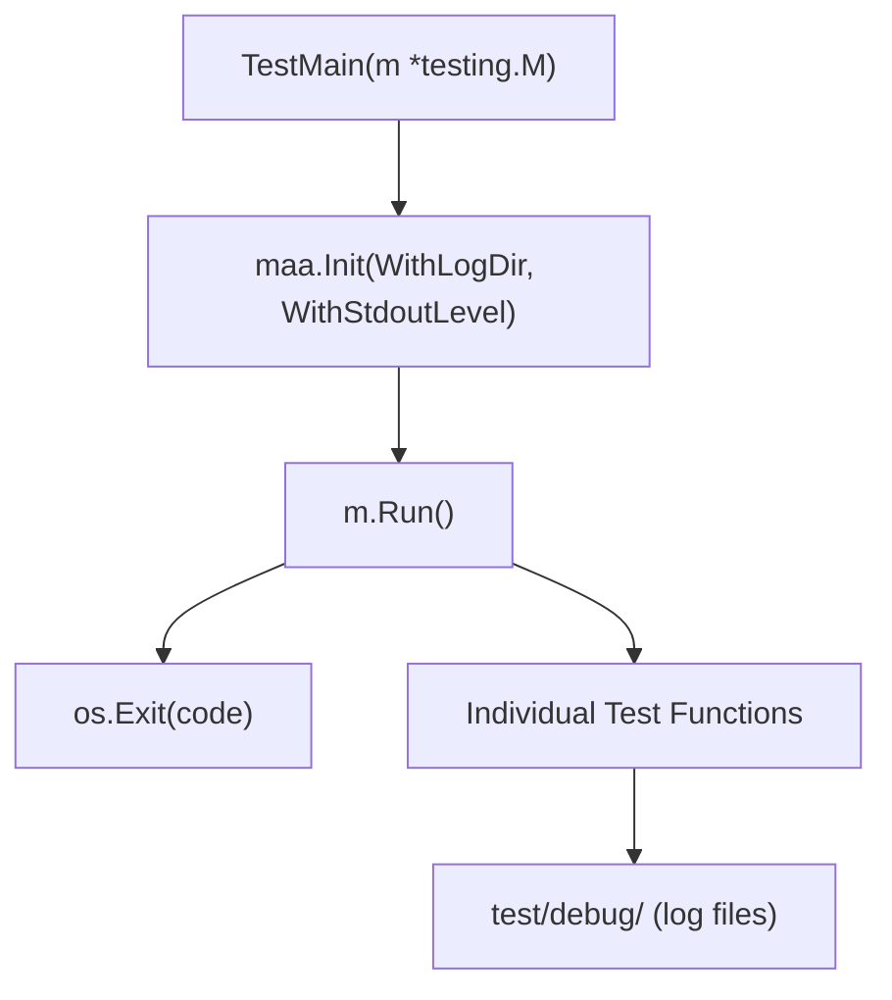
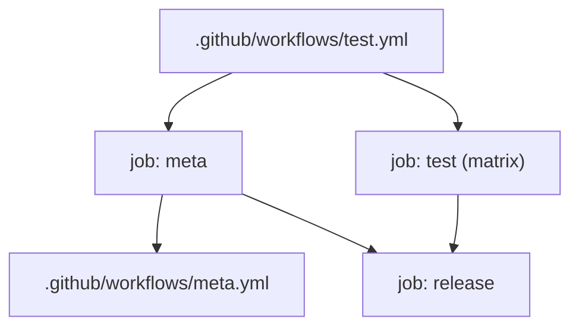
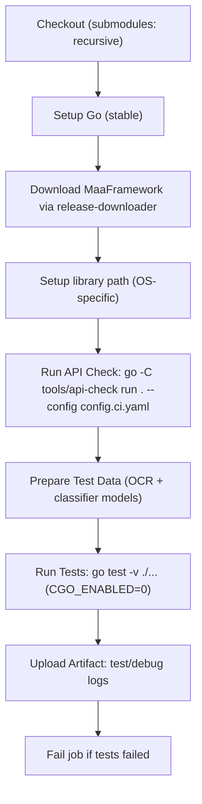

# Testing and Development

Relevant source files

* [.github/workflows/test.yml](https://github.com/MaaXYZ/maa-framework-go/blob/5f9c965c/.github/workflows/test.yml)
* [.gitignore](https://github.com/MaaXYZ/maa-framework-go/blob/5f9c965c/.gitignore)
* [test/classifier.onnx](https://github.com/MaaXYZ/maa-framework-go/blob/5f9c965c/test/classifier.onnx)

This section covers the testing infrastructure, CI/CD pipeline, and development patterns used to validate and release `maa-framework-go`. It is intended for contributors and developers working on the binding itself.

* For runtime usage of debug controller implementations, see [Testing Utilities](/MaaXYZ/maa-framework-go/8.1-testing-utilities).
* For the full CI workflow breakdown, see [CI/CD Pipeline](/MaaXYZ/maa-framework-go/8.2-cicd-pipeline).
* For concrete test patterns and examples, see [Test Examples and Patterns](/MaaXYZ/maa-framework-go/8.3-test-examples-and-patterns).

---

## Repository Structure for Testing

The test suite spans two Go packages with separate initialization:

| File | Package | Purpose |
| --- | --- | --- |
| `main_test.go` | `maa` (root) | Initializes framework for unit tests in the root package |
| `test/main_test.go` | `test` | Initializes framework for integration/smoking tests |
| `test/data_set/` | — | Pipeline resource bundles, OCR models, classifier models |
| `test/debug/` | — | Log output directory (gitignored) |
| `deps/` | — | Downloaded MaaFramework binaries (gitignored) |

Sources: `main_test.go:1-15`, `test/main_test.go:1-17`, `.gitignore:1-5`

---

## Initialization Pattern

Both test packages follow the same `TestMain` pattern to initialize the MaaFramework library before any tests run.

**Root package** (`main_test.go`):

```
Init(
    WithLogDir("./test/debug"),
    WithStdoutLevel(LoggingLevelOff),
)
```

**Test package** (`test/main_test.go`):

```
maa.Init(
    maa.WithLogDir("./debug"),
    maa.WithStdoutLevel(maa.LoggingLevelOff),
)
```

Both suppress stdout logging via `LoggingLevelOff` and direct log files to a local `debug/` directory. This ensures test output is clean while retaining detailed logs for post-failure inspection.

Sources: `main_test.go:8-15`, `test/main_test.go:10-17`

---

## High-Level Test Flow

**Diagram: TestMain Initialization and Test Execution Flow**



Sources: `main_test.go:8-15`, `test/main_test.go:10-17`

---

## CI Workflow Overview

The CI system uses two GitHub Actions workflows:

| Workflow | File | Role |
| --- | --- | --- |
| `meta` | `.github/workflows/meta.yml` | Determines version tag and release status |
| `test` | `.github/workflows/test.yml` | Runs tests across all platforms; triggers release |

The `test` workflow depends on `meta` for its release job. The `meta` workflow runs as a reusable `workflow_call` target.

**Diagram: Workflow Dependency and Job Sequence**



Sources: `.github/workflows/test.yml:22-141`, `.github/workflows/meta.yml:1-58`

---

## Test Matrix

The `test` job runs on three OS/architecture combinations in parallel, with `fail-fast: false` so all platforms are always reported.

| Runner OS | Architecture | MaaFramework Prefix | Container |
| --- | --- | --- | --- |
| `windows-latest` | `x86_64` | `MAA-win` | *(none)* |
| `ubuntu-latest` | `x86_64` | `MAA-linux` | `archlinux:base-devel` |
| `macos-latest` | `aarch64` | `MAA-macos` | *(none)* |

The Ubuntu runner uses an Arch Linux container to ensure the same native library environment.

Sources: `.github/workflows/test.yml:29-44`

---

## Per-Platform Library Loading

After downloading MaaFramework binaries into `deps/`, each platform configures dynamic library resolution differently:

| Platform | Environment Variable | Value |
| --- | --- | --- |
| Windows | `PATH` (prepend) | `$GITHUB_WORKSPACE/deps/bin` |
| Linux | `LD_LIBRARY_PATH` | `$GITHUB_WORKSPACE/deps/bin` |
| macOS | `DYLD_LIBRARY_PATH` | `$GITHUB_WORKSPACE/deps/bin` |

This matches how `maa.Init` loads shared libraries at runtime via `purego` — it relies on the OS dynamic linker to find `MaaFramework` libraries by name. See [Native FFI Integration](/MaaXYZ/maa-framework-go/7.1-native-ffi-integration) for the full loading mechanism.

Sources: `.github/workflows/test.yml:85-98`

---

## Step-by-Step CI Job Execution

**Diagram: test job Steps per Matrix Runner**



Sources: `.github/workflows/test.yml:61-129`

---

## Test Data Preparation

Before running tests, the CI copies model files into the expected resource bundle paths:

```
test/data_set/PipelineSmoking/resource/model/ocr/
  ← test/data_set/MaaCommonAssets/OCR/ppocr_v4/zh_cn/*

test/data_set/PipelineSmoking/resource/model/classify/
  ← test/classifier.onnx
```

The `test/classifier.onnx` file is a minimal stub model that satisfies the MaaFramework classifier interface during testing. It is committed directly to the repository.

Sources: `.github/workflows/test.yml:104-109`, `test/classifier.onnx:1-11`

---

## API Compatibility Check

The `tools/api-check` tool runs before the test suite:

```
go -C tools/api-check run . --config config.ci.yaml
```

This step validates that the Go binding's exported API surface remains consistent with the expected MaaFramework API. It runs as a distinct step so API drift is surfaced independently from test failures.

Sources: `.github/workflows/test.yml:100-102`

---

## Test Execution

Tests run with CGO explicitly disabled:

```
CGO_ENABLED: 0
go test -v ./...
```

Disabling CGO is a deliberate requirement of the `purego`-based FFI design — the binding does not use Cgo at all. See [Native FFI Integration](/MaaXYZ/maa-framework-go/7.1-native-ffi-integration) for details.

The `continue-on-error: true` flag on the test step ensures artifact upload always runs, even when tests fail. A separate explicit failure step then exits non-zero if tests failed, so the job itself is marked failed in the UI.

Sources: `.github/workflows/test.yml:111-129`

---

## Artifact Upload and Debugging

Log output from all test runs is uploaded as a GitHub Actions artifact named:

```
{MAA_FILE_PREFIX}-{ARCH}-full_log
```

For example: `MAA-linux-x86_64-full_log`. The artifact contains the contents of `test/debug/`, which is the log directory configured in `TestMain`.

Sources: `.github/workflows/test.yml:119-123`, `test/main_test.go:12`

---

## Release Job

A `release` job runs only when the `meta` workflow determines `is_release == 'true'` (i.e., a `v*` tag push). It depends on both `meta` and `test` completing successfully.

```
if: ${{ needs.meta.outputs.is_release == 'true' }}
needs: [meta, test]
```

Pre-release tagging: if the tag contains `-alpha`, `-beta`, or `-rc`, the GitHub release is marked as a pre-release.

Sources: `.github/workflows/test.yml:131-141`, `.github/workflows/meta.yml:22-50`

---

## Version Determination Logic

The `meta` workflow outputs three values consumed by the release job:

| Output | Description |
| --- | --- |
| `is_release` | `true` if triggered by a `refs/tags/v*` push |
| `tag` | Semantic version tag (e.g., `v1.7.0`) or CI snapshot tag |
| `version` | Full version string (with build metadata for CI builds) |

For non-release builds, the version is derived from the latest MaaFramework release tag plus a CI timestamp and commit hash, producing strings like:

```
v1.7.0-post.0612-ci.8678478007+gf5e12a1c.20240413
```

Sources: `.github/workflows/meta.yml:22-58`

---

For implementation details of the specific testing utilities (debug controllers, `TestMain` patterns), see [Testing Utilities](/MaaXYZ/maa-framework-go/8.1-testing-utilities). For concrete test function patterns and examples, see [Test Examples and Patterns](/MaaXYZ/maa-framework-go/8.3-test-examples-and-patterns).