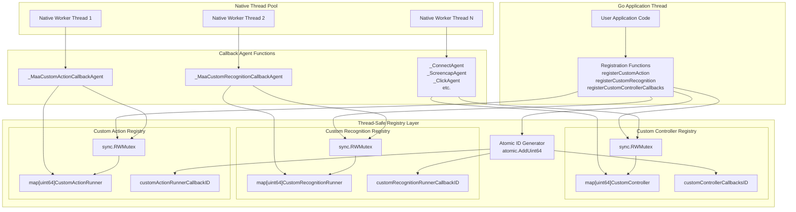
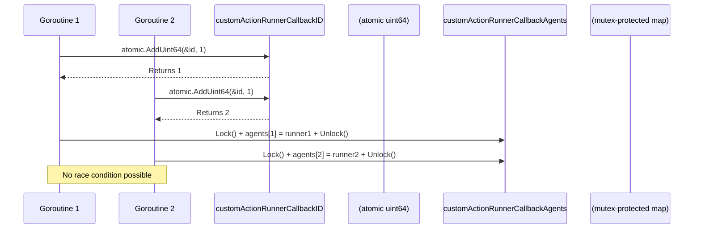
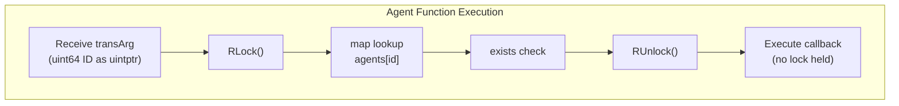
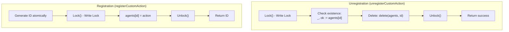
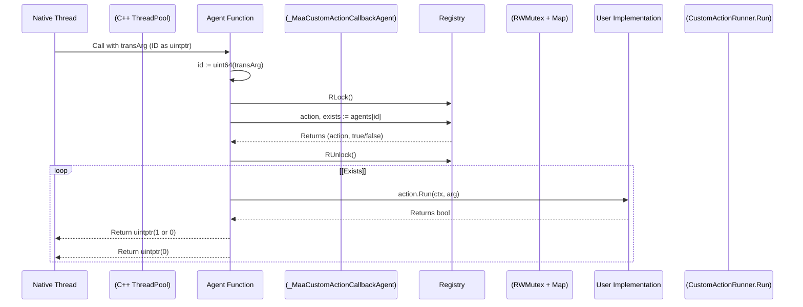
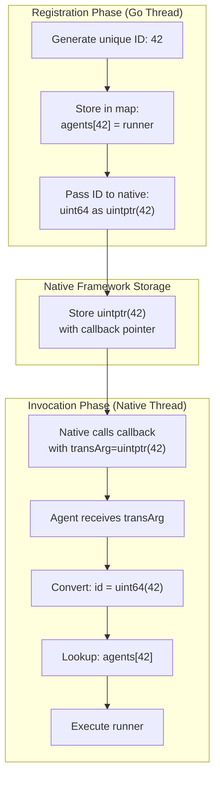

# Thread Safety and Concurrency

Relevant source files

* [context.go](https://github.com/MaaXYZ/maa-framework-go/blob/5f9c965c/context.go)
* [controller\_test.go](https://github.com/MaaXYZ/maa-framework-go/blob/5f9c965c/controller_test.go)
* [custom\_action.go](https://github.com/MaaXYZ/maa-framework-go/blob/5f9c965c/custom_action.go)
* [custom\_controller.go](https://github.com/MaaXYZ/maa-framework-go/blob/5f9c965c/custom_controller.go)
* [dbg\_controller.go](https://github.com/MaaXYZ/maa-framework-go/blob/5f9c965c/dbg_controller.go)
* [resource.go](https://github.com/MaaXYZ/maa-framework-go/blob/5f9c965c/resource.go)
* [tasker.go](https://github.com/MaaXYZ/maa-framework-go/blob/5f9c965c/tasker.go)

This document explains the thread-safety guarantees and concurrency patterns used in maa-framework-go, focusing on the callback registry systems and synchronization primitives. Understanding these patterns is critical for implementing custom extensions and avoiding race conditions in multi-threaded environments.

For information about the native interop architecture that enables callbacks from native threads, see page 7.3. For details on how data is marshaled across thread boundaries, see page 7.2.

## Concurrency Architecture Overview

The framework operates in a multi-threaded environment where the native MaaFramework library executes tasks asynchronously on internal thread pools. Custom Go code (actions, recognizers, and controller implementations) is invoked through callbacks from these native threads. The framework provides thread-safe callback registry systems to manage this bidirectional communication safely.



Sources: [custom\_action.go1-94](https://github.com/MaaXYZ/maa-framework-go/blob/5f9c965c/custom_action.go#L1-L94) [custom\_recognition.go1-100](https://github.com/MaaXYZ/maa-framework-go/blob/5f9c965c/custom_recognition.go#L1-L100) [custom\_controller.go1-436](https://github.com/MaaXYZ/maa-framework-go/blob/5f9c965c/custom_controller.go#L1-L436)

## Callback Registry Pattern

All three extension systems (custom actions, custom recognitions, and custom controllers) implement an identical thread-safety pattern consisting of:

1. **Atomic ID Counter**: A `uint64` counter incremented atomically to generate unique IDs
2. **Registry Map**: A `map[uint64]T` storing the callback implementations by ID
3. **RWMutex**: A `sync.RWMutex` protecting concurrent access to the registry map

This pattern ensures safe concurrent registration from Go code and safe concurrent invocation from native threads.

### Registry Components

| Component | Custom Action | Custom Recognition | Custom Controller |
| --- | --- | --- | --- |
| ID Counter | `customActionRunnerCallbackID` | `customRecognitionRunnerCallbackID` | `customControllerCallbacksID` |
| Registry Map | `customActionRunnerCallbackAgents` | `customRecognitionRunnerCallbackAgents` | `customControllerCallbacksAgents` |
| Mutex | `customActionRunnerCallbackAgentsMutex` | `customRecognitionRunnerCallbackAgentsMutex` | `customControllerCallbacksAgentsMutex` |
| Value Type | `CustomActionRunner` | `CustomRecognitionRunner` | `CustomController` |

Sources: [custom\_action.go10-14](https://github.com/MaaXYZ/maa-framework-go/blob/5f9c965c/custom_action.go#L10-L14) [custom\_recognition.go11-15](https://github.com/MaaXYZ/maa-framework-go/blob/5f9c965c/custom_recognition.go#L11-L15) [custom\_controller.go12-16](https://github.com/MaaXYZ/maa-framework-go/blob/5f9c965c/custom_controller.go#L12-L16)

## Atomic ID Generation

Each callback registration generates a unique ID using `atomic.AddUint64`, which atomically increments a package-level counter and returns the new value. This operation is thread-safe and ensures no two registrations receive the same ID, even when called concurrently.



The atomic operation guarantees that even if multiple goroutines call `registerCustomAction` simultaneously, each receives a unique ID. The ID is generated before acquiring the mutex, minimizing lock contention.

**`registerCustomAction` execution order:**

1. `atomic.AddUint64(&customActionRunnerCallbackID, 1)` — generates a unique ID without holding any lock
2. `customActionRunnerCallbackAgentsMutex.Lock()` — acquires exclusive write access
3. `customActionRunnerCallbackAgents[id] = action` — writes under exclusive access
4. `customActionRunnerCallbackAgentsMutex.Unlock()` — releases write lock
5. Returns the ID, which callers can retain for later unregistration

Sources: [custom\_action.go16-24](https://github.com/MaaXYZ/maa-framework-go/blob/5f9c965c/custom_action.go#L16-L24) [custom\_recognition.go17-25](https://github.com/MaaXYZ/maa-framework-go/blob/5f9c965c/custom_recognition.go#L17-L25) [custom\_controller.go18-26](https://github.com/MaaXYZ/maa-framework-go/blob/5f9c965c/custom_controller.go#L18-L26)

## Mutex-Protected Map Access

All callback registries use `sync.RWMutex` to protect concurrent access to the registry maps. This allows multiple concurrent readers (callback invocations) while ensuring exclusive access for writers (registration/unregistration).

### Read Lock Usage (Callback Invocation)

When the native framework invokes a callback, the agent function acquires a read lock to look up the implementation:



**Key Pattern**: The read lock is released **before** executing the actual callback. This prevents holding the lock during user code execution, which could cause deadlocks if user code attempts re-registration or other operations requiring the lock.

Sources: [custom\_action.go62-64](https://github.com/MaaXYZ/maa-framework-go/blob/5f9c965c/custom_action.go#L62-L64) [custom\_recognition.go68-70](https://github.com/MaaXYZ/maa-framework-go/blob/5f9c965c/custom_recognition.go#L68-L70) [custom\_controller.go115-117](https://github.com/MaaXYZ/maa-framework-go/blob/5f9c965c/custom_controller.go#L115-L117)

### Write Lock Usage (Registration/Unregistration)

Registration and unregistration operations acquire a write lock to modify the map:



The unregistration functions use `defer` to ensure the lock is released even if a panic occurs during the check. `unregisterCustomAction` acquires the write lock, uses `defer` for guaranteed release, checks for key existence before deleting, and returns `false` if the ID was not registered. See [custom\_action.go26-35](https://github.com/MaaXYZ/maa-framework-go/blob/5f9c965c/custom_action.go#L26-L35) for the full implementation.

Sources: [custom\_action.go26-35](https://github.com/MaaXYZ/maa-framework-go/blob/5f9c965c/custom_action.go#L26-L35) [custom\_recognition.go27-36](https://github.com/MaaXYZ/maa-framework-go/blob/5f9c965c/custom_recognition.go#L27-L36) [custom\_controller.go28-32](https://github.com/MaaXYZ/maa-framework-go/blob/5f9c965c/custom_controller.go#L28-L32)

## Callback Invocation Thread Safety

Callback agent functions serve as the bridge between native threads and Go implementations. They implement a consistent pattern to ensure thread-safe callback invocation.

### Agent Function Pattern

All agent functions follow this pattern:



### Example: Custom Action Agent

The custom action callback agent demonstrates this pattern:

**Key Steps** in `_MaaCustomActionCallbackAgent`:

| Step | Line | Operation |
| --- | --- | --- |
| 1 | [custom\_action.go60](https://github.com/MaaXYZ/maa-framework-go/blob/5f9c965c/custom_action.go#L60-L60) | Cast `transArg` (uintptr) to `uint64` ID |
| 2 | [custom\_action.go62](https://github.com/MaaXYZ/maa-framework-go/blob/5f9c965c/custom_action.go#L62-L62) | Acquire read lock via `RLock()` |
| 3 | [custom\_action.go63](https://github.com/MaaXYZ/maa-framework-go/blob/5f9c965c/custom_action.go#L63-L63) | Look up implementation in `customActionRunnerCallbackAgents` |
| 4 | [custom\_action.go64](https://github.com/MaaXYZ/maa-framework-go/blob/5f9c965c/custom_action.go#L64-L64) | Release read lock via `RUnlock()` |
| 5 | [custom\_action.go66-68](https://github.com/MaaXYZ/maa-framework-go/blob/5f9c965c/custom_action.go#L66-L68) | Guard: check existence and nil before proceeding |
| 6 | [custom\_action.go78-88](https://github.com/MaaXYZ/maa-framework-go/blob/5f9c965c/custom_action.go#L78-L88) | Execute user callback — no lock held during execution |
| 7 | [custom\_action.go89-92](https://github.com/MaaXYZ/maa-framework-go/blob/5f9c965c/custom_action.go#L89-L92) | Convert boolean result to `uintptr` return value |

Sources: [custom\_action.go50-93](https://github.com/MaaXYZ/maa-framework-go/blob/5f9c965c/custom_action.go#L50-L93) [custom\_recognition.go56-99](https://github.com/MaaXYZ/maa-framework-go/blob/5f9c965c/custom_recognition.go#L56-L99) [custom\_controller.go110-127](https://github.com/MaaXYZ/maa-framework-go/blob/5f9c965c/custom_controller.go#L110-L127)

## The transArg Pattern

The `transArg` parameter is central to callback thread safety. It enables safe communication across the Go-native boundary without maintaining global state or requiring complex synchronization.

### How transArg Works



**Safety Properties:**

* **No Pointer Dereferencing**: The `uintptr` is never dereferenced as a memory address; it's only used as a numeric ID
* **No Memory Management**: Go's garbage collector doesn't track the uintptr, preventing premature collection issues
* **Thread-Safe Lookup**: The map lookup is always protected by the RWMutex
* **No Global State Leakage**: Each callback operates independently using its unique ID

The pattern is documented in comments throughout the code: "Here, we are simply passing the uint64 value as a pointer and will not actually dereference this pointer."

Sources: [custom\_action.go58-60](https://github.com/MaaXYZ/maa-framework-go/blob/5f9c965c/custom_action.go#L58-L60) [custom\_recognition.go64-66](https://github.com/MaaXYZ/maa-framework-go/blob/5f9c965c/custom_recognition.go#L64-L66) [custom\_controller.go110-113](https://github.com/MaaXYZ/maa-framework-go/blob/5f9c965c/custom_controller.go#L110-L113)

## Atomic Operations in Debug Controllers

The debug controllers demonstrate additional concurrency patterns using `sync/atomic` for state management without mutex overhead.

### CarouselImageController Connection State

The `CarouselImageController` uses `atomic.Bool` to manage connection state thread-safely:

**`CarouselImageController` connection state transitions**

```
#mermaid-c3oc4se2qoa{font-family:ui-sans-serif,-apple-system,system-ui,Segoe UI,Helvetica;font-size:16px;fill:#333;}@keyframes edge-animation-frame{from{stroke-dashoffset:0;}}@keyframes dash{to{stroke-dashoffset:0;}}#mermaid-c3oc4se2qoa .edge-animation-slow{stroke-dasharray:9,5!important;stroke-dashoffset:900;animation:dash 50s linear infinite;stroke-linecap:round;}#mermaid-c3oc4se2qoa .edge-animation-fast{stroke-dasharray:9,5!important;stroke-dashoffset:900;animation:dash 20s linear infinite;stroke-linecap:round;}#mermaid-c3oc4se2qoa .error-icon{fill:#dddddd;}#mermaid-c3oc4se2qoa .error-text{fill:#222222;stroke:#222222;}#mermaid-c3oc4se2qoa .edge-thickness-normal{stroke-width:1px;}#mermaid-c3oc4se2qoa .edge-thickness-thick{stroke-width:3.5px;}#mermaid-c3oc4se2qoa .edge-pattern-solid{stroke-dasharray:0;}#mermaid-c3oc4se2qoa .edge-thickness-invisible{stroke-width:0;fill:none;}#mermaid-c3oc4se2qoa .edge-pattern-dashed{stroke-dasharray:3;}#mermaid-c3oc4se2qoa .edge-pattern-dotted{stroke-dasharray:2;}#mermaid-c3oc4se2qoa .marker{fill:#999;stroke:#999;}#mermaid-c3oc4se2qoa .marker.cross{stroke:#999;}#mermaid-c3oc4se2qoa svg{font-family:ui-sans-serif,-apple-system,system-ui,Segoe UI,Helvetica;font-size:16px;}#mermaid-c3oc4se2qoa p{margin:0;}#mermaid-c3oc4se2qoa defs #statediagram-barbEnd{fill:#999;stroke:#999;}#mermaid-c3oc4se2qoa g.stateGroup text{fill:#dddddd;stroke:none;font-size:10px;}#mermaid-c3oc4se2qoa g.stateGroup text{fill:#333;stroke:none;font-size:10px;}#mermaid-c3oc4se2qoa g.stateGroup .state-title{font-weight:bolder;fill:#333;}#mermaid-c3oc4se2qoa g.stateGroup rect{fill:#ffffff;stroke:#dddddd;}#mermaid-c3oc4se2qoa g.stateGroup line{stroke:#999;stroke-width:1;}#mermaid-c3oc4se2qoa .transition{stroke:#999;stroke-width:1;fill:none;}#mermaid-c3oc4se2qoa .stateGroup .composit{fill:#f4f4f4;border-bottom:1px;}#mermaid-c3oc4se2qoa .stateGroup .alt-composit{fill:#e0e0e0;border-bottom:1px;}#mermaid-c3oc4se2qoa .state-note{stroke:#e6d280;fill:#fff5ad;}#mermaid-c3oc4se2qoa .state-note text{fill:#333;stroke:none;font-size:10px;}#mermaid-c3oc4se2qoa .stateLabel .box{stroke:none;stroke-width:0;fill:#ffffff;opacity:0.5;}#mermaid-c3oc4se2qoa .edgeLabel .label rect{fill:#ffffff;opacity:0.5;}#mermaid-c3oc4se2qoa .edgeLabel{background-color:#ffffff;text-align:center;}#mermaid-c3oc4se2qoa .edgeLabel p{background-color:#ffffff;}#mermaid-c3oc4se2qoa .edgeLabel rect{opacity:0.5;background-color:#ffffff;fill:#ffffff;}#mermaid-c3oc4se2qoa .edgeLabel .label text{fill:#333;}#mermaid-c3oc4se2qoa .label div .edgeLabel{color:#333;}#mermaid-c3oc4se2qoa .stateLabel text{fill:#333;font-size:10px;font-weight:bold;}#mermaid-c3oc4se2qoa .node circle.state-start{fill:#999;stroke:#999;}#mermaid-c3oc4se2qoa .node .fork-join{fill:#999;stroke:#999;}#mermaid-c3oc4se2qoa .node circle.state-end{fill:#dddddd;stroke:#f4f4f4;stroke-width:1.5;}#mermaid-c3oc4se2qoa .end-state-inner{fill:#f4f4f4;stroke-width:1.5;}#mermaid-c3oc4se2qoa .node rect{fill:#ffffff;stroke:#dddddd;stroke-width:1px;}#mermaid-c3oc4se2qoa .node polygon{fill:#ffffff;stroke:#dddddd;stroke-width:1px;}#mermaid-c3oc4se2qoa #statediagram-barbEnd{fill:#999;}#mermaid-c3oc4se2qoa .statediagram-cluster rect{fill:#ffffff;stroke:#dddddd;stroke-width:1px;}#mermaid-c3oc4se2qoa .cluster-label,#mermaid-c3oc4se2qoa .nodeLabel{color:#333;}#mermaid-c3oc4se2qoa .statediagram-cluster rect.outer{rx:5px;ry:5px;}#mermaid-c3oc4se2qoa .statediagram-state .divider{stroke:#dddddd;}#mermaid-c3oc4se2qoa .statediagram-state .title-state{rx:5px;ry:5px;}#mermaid-c3oc4se2qoa .statediagram-cluster.statediagram-cluster .inner{fill:#f4f4f4;}#mermaid-c3oc4se2qoa .statediagram-cluster.statediagram-cluster-alt .inner{fill:#f8f8f8;}#mermaid-c3oc4se2qoa .statediagram-cluster .inner{rx:0;ry:0;}#mermaid-c3oc4se2qoa .statediagram-state rect.basic{rx:5px;ry:5px;}#mermaid-c3oc4se2qoa .statediagram-state rect.divider{stroke-dasharray:10,10;fill:#f8f8f8;}#mermaid-c3oc4se2qoa .note-edge{stroke-dasharray:5;}#mermaid-c3oc4se2qoa .statediagram-note rect{fill:#fff5ad;stroke:#e6d280;stroke-width:1px;rx:0;ry:0;}#mermaid-c3oc4se2qoa .statediagram-note rect{fill:#fff5ad;stroke:#e6d280;stroke-width:1px;rx:0;ry:0;}#mermaid-c3oc4se2qoa .statediagram-note text{fill:#333;}#mermaid-c3oc4se2qoa .statediagram-note .nodeLabel{color:#333;}#mermaid-c3oc4se2qoa .statediagram .edgeLabel{color:red;}#mermaid-c3oc4se2qoa #dependencyStart,#mermaid-c3oc4se2qoa #dependencyEnd{fill:#999;stroke:#999;stroke-width:1;}#mermaid-c3oc4se2qoa .statediagramTitleText{text-anchor:middle;font-size:18px;fill:#333;}#mermaid-c3oc4se2qoa :root{--mermaid-font-family:"trebuchet ms",verdana,arial,sans-serif;}

"Connect() called"


"connected.Store(true)"


"Error or no images loaded"


"connected.Store(false) at reconnect start"


"Connected() via connected.Load()"


Disconnected


Connecting


Connected
```

**Implementation Details:**

| Operation | Method | Atomic Function | Purpose |
| --- | --- | --- | --- |
| Initialize connection | `Connect()` | `atomic.Store(false)` then `atomic.Store(true)` | Reset state before attempting connection; set true on success |
| Check connection status | `Connected()` | `atomic.Load()` | Read current state without locks |

**Thread Safety Guarantee**: Multiple goroutines can call `Connected()` while `Connect()` is executing on another goroutine without race conditions. The atomic operations ensure visibility of state changes across threads.

Sources: [dbg\_controller.go13-98](https://github.com/MaaXYZ/maa-framework-go/blob/5f9c965c/dbg_controller.go#L13-L98)

## Concurrent Access Patterns

### Safe Patterns

The following patterns are thread-safe in the framework:

1. **Multiple Concurrent Callback Invocations** — Multiple native threads may simultaneously call `_MaaCustomActionCallbackAgent` (with different or same IDs), `_MaaCustomRecognitionCallbackAgent`, and any `_*Agent` controller function. Each acquires only a read lock independently and executes safely without blocking one another.
2. **Registration During Execution** — A Go goroutine may call `registerCustomAction` while native threads are invoking callbacks. The write lock in `registerCustomAction` waits for all active read locks to release, then proceeds. Existing callbacks continue to execute unaffected.
3. **Unregistration During Execution** — Because the callback agent functions release their read lock *before* invoking user code, an unregistration via `unregisterCustomAction` (write lock) can proceed without waiting for in-progress callback executions. Future invocations with the now-removed ID will find no entry and return `0`.

### Patterns to Avoid

1. **Unsynchronized mutable state in callback implementations** — If a `CustomActionRunner`, `CustomRecognitionRunner`, or `CustomController` implementation holds mutable fields accessed during callbacks, those fields must be protected with `sync/atomic` types or a `sync.Mutex`. Native threads can invoke callbacks concurrently, and Go's race detector will flag unprotected concurrent writes.
2. **Calling `UnregisterCustomAction`/`UnregisterCustomRecognition` from within the corresponding callback** — While not a deadlock (the lock is not held during execution), it creates ordering hazards and can confuse task state. Unregistration should occur after the task completes.
3. **Blocking indefinitely inside a callback** — Callbacks execute on native worker threads managed by MaaFramework. Blocking a callback (e.g., on a channel receive with no sender) ties up a native worker thread and may stall task execution.

Sources: [custom\_action.go50-93](https://github.com/MaaXYZ/maa-framework-go/blob/5f9c965c/custom_action.go#L50-L93) [custom\_recognition.go56-99](https://github.com/MaaXYZ/maa-framework-go/blob/5f9c965c/custom_recognition.go#L56-L99) [custom\_controller.go110-435](https://github.com/MaaXYZ/maa-framework-go/blob/5f9c965c/custom_controller.go#L110-L435)

## Thread-Safety Guarantees Summary

The framework provides the following thread-safety guarantees:

| Component | Guarantee | Mechanism |
| --- | --- | --- |
| Callback Registration | Safe concurrent registration from multiple goroutines | `atomic.AddUint64` + `sync.RWMutex` write lock |
| Callback Invocation | Safe concurrent invocation from multiple native threads | `sync.RWMutex` read lock for lookup only |
| Callback Execution | User code executes without locks held | Lock released before callback invocation |
| Unregistration | Safe removal even during concurrent invocations | `sync.RWMutex` write lock + defer unlock |
| ID Generation | Unique IDs guaranteed even under concurrent registration | `atomic.AddUint64` |
| Connection State | Atomic read/write of boolean state | `atomic.Bool` (Load/Store) |

**Synchronization Primitives Used:**

* `sync.RWMutex`: All callback registries
* `sync/atomic` (AddUint64): ID generation
* `sync/atomic` (Bool): Debug controller connection state

Sources: [custom\_action.go1-94](https://github.com/MaaXYZ/maa-framework-go/blob/5f9c965c/custom_action.go#L1-L94) [custom\_recognition.go1-100](https://github.com/MaaXYZ/maa-framework-go/blob/5f9c965c/custom_recognition.go#L1-L100) [custom\_controller.go1-436](https://github.com/MaaXYZ/maa-framework-go/blob/5f9c965c/custom_controller.go#L1-L436) [dbg\_controller.go10-98](https://github.com/MaaXYZ/maa-framework-go/blob/5f9c965c/dbg_controller.go#L10-L98)

## Best Practices for Extension Developers

When implementing custom actions, recognitions, or controllers:

1. **Callback Implementations Should Be Stateless or Thread-Safe**

   * Avoid mutable shared state in callback implementations
   * Use atomic types or mutexes for any shared state
   * Consider each invocation independent
2. **Do Not Hold Locks During Blocking Operations**

   * Callbacks execute on native worker threads
   * Blocking prevents other tasks from executing
   * Keep operations fast and non-blocking
3. **Resource Cleanup**

   * Unregister callbacks when no longer needed
   * Unregistration is safe even if callbacks are in progress
   * Future invocations will safely fail after unregistration
4. **Error Handling**

   * Return `false` from callbacks to indicate failure
   * Do not panic in callback implementations
   * Panics in callbacks will crash the native framework
5. **Use Provided Synchronization**

   * Do not attempt to manage callback registration manually
   * Use the framework's registration/unregistration functions
   * Trust the framework's thread-safety mechanisms

**Sources**: [custom\_action.go46-48](https://github.com/MaaXYZ/maa-framework-go/blob/5f9c965c/custom_action.go#L46-L48) [custom\_recognition.go52-54](https://github.com/MaaXYZ/maa-framework-go/blob/5f9c965c/custom_recognition.go#L52-L54) [custom\_controller.go42-66](https://github.com/MaaXYZ/maa-framework-go/blob/5f9c965c/custom_controller.go#L42-L66)