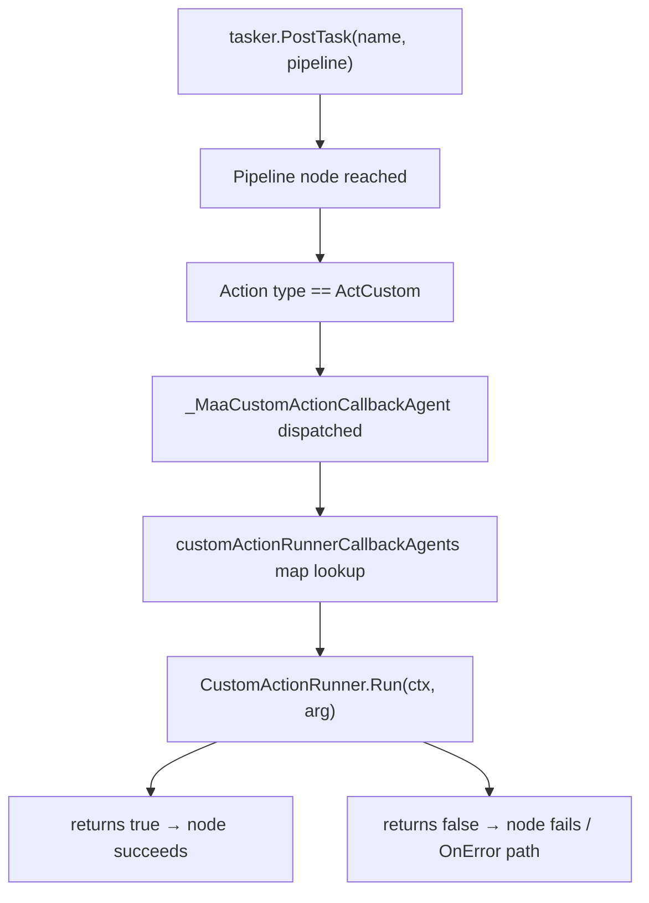
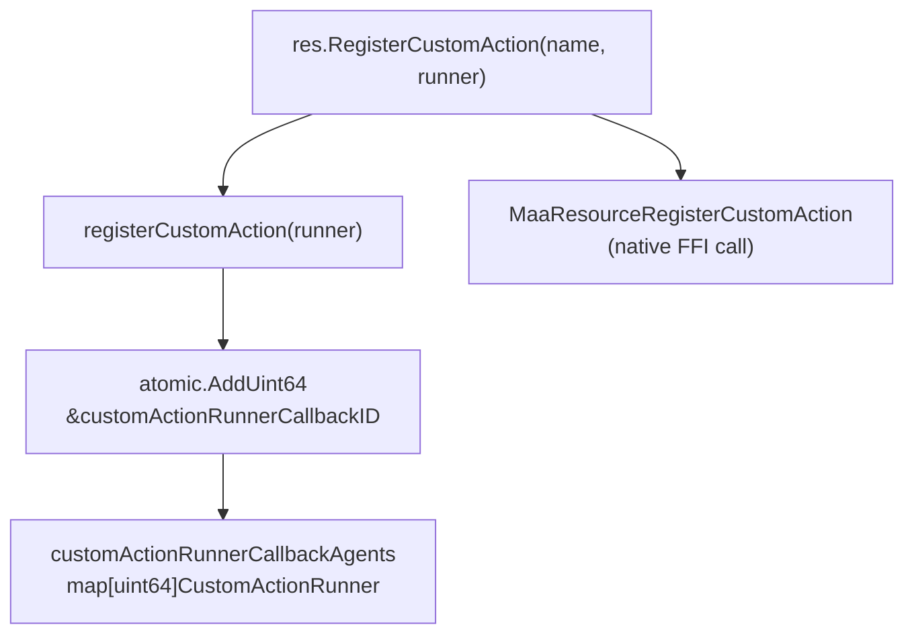
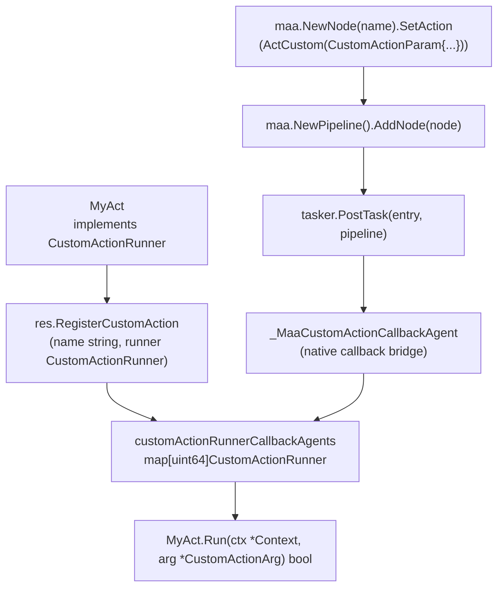

# Your First Custom Action

Relevant source files

* [README.md](https://github.com/MaaXYZ/maa-framework-go/blob/5f9c965c/README.md?plain=1)
* [README\_zh.md](https://github.com/MaaXYZ/maa-framework-go/blob/5f9c965c/README_zh.md?plain=1)
* [custom\_action.go](https://github.com/MaaXYZ/maa-framework-go/blob/5f9c965c/custom_action.go)
* [examples/custom-action/main.go](https://github.com/MaaXYZ/maa-framework-go/blob/5f9c965c/examples/custom-action/main.go)
* [examples/quick-start/main.go](https://github.com/MaaXYZ/maa-framework-go/blob/5f9c965c/examples/quick-start/main.go)
* [test/pipleline\_smoking\_test.go](https://github.com/MaaXYZ/maa-framework-go/blob/5f9c965c/test/pipleline_smoking_test.go)
* [test/run\_without\_file\_test.go](https://github.com/MaaXYZ/maa-framework-go/blob/5f9c965c/test/run_without_file_test.go)

This page is a step-by-step guide to writing, registering, and invoking a custom action in maa-framework-go. It covers the `CustomActionRunner` interface, how to register an implementation with a `Resource`, and how to attach it to a pipeline node using `ActCustom`.

For a deeper reference on the registration internals and thread-safety guarantees, see [Custom Actions](/MaaXYZ/maa-framework-go/5.1-custom-actions). For the analogous process using custom recognition, see [Your First Custom Recognition](/MaaXYZ/maa-framework-go/2.5-your-first-custom-recognition).

---

## What a Custom Action Is

A custom action is Go code that MaaFramework calls during pipeline execution, in place of a built-in action such as `Click` or `Swipe`. The framework invokes it when a pipeline node whose action type is `ActCustom` is reached. The action receives a `Context` (giving access to the running tasker, controller, and in-flight pipeline state) and a `CustomActionArg` describing the current node.

The custom action signals success or failure with a `bool` return value.

---

## Execution Flow

**Custom action lifecycle in a pipeline run**



Sources: [custom\_action.go50-93](https://github.com/MaaXYZ/maa-framework-go/blob/5f9c965c/custom_action.go#L50-L93)

---

## The `CustomActionRunner` Interface

[custom\_action.go46-48](https://github.com/MaaXYZ/maa-framework-go/blob/5f9c965c/custom_action.go#L46-L48)

```
type CustomActionRunner interface {
    Run(ctx *Context, arg *CustomActionArg) bool
}
```

Any struct that has a `Run` method with this signature can be registered as a custom action.

### `CustomActionArg` Fields

Defined at [custom\_action.go37-44](https://github.com/MaaXYZ/maa-framework-go/blob/5f9c965c/custom_action.go#L37-L44)

| Field | Type | Description |
| --- | --- | --- |
| `TaskID` | `int64` | ID of the running task; use with `Tasker.GetTaskDetail` |
| `CurrentTaskName` | `string` | Name of the pipeline node being executed |
| `CustomActionName` | `string` | The name used when registering the action |
| `CustomActionParam` | `string` | The `CustomActionParam` string from the pipeline node |
| `RecognitionDetail` | `*RecognitionDetail` | Result of the recognition step that preceded this action |
| `Box` | `Rect` | Bounding box identified by that recognition step |

---

## Step 1 — Implement the Interface

Define a struct and a `Run` method on it. The method may be as simple as a no-op or as complex as needed.

**Minimal implementation** ([examples/custom-action/main.go71-75](https://github.com/MaaXYZ/maa-framework-go/blob/5f9c965c/examples/custom-action/main.go#L71-L75)):

```
type MyAct struct{}

func (a *MyAct) Run(_ *maa.Context, _ *maa.CustomActionArg) bool {
    return true
}
```

**Implementation that uses the context** ([test/run\_without\_file\_test.go49-75](https://github.com/MaaXYZ/maa-framework-go/blob/5f9c965c/test/run_without_file_test.go#L49-L75)):

```
type MyAct struct{ t *testing.T }

func (a *MyAct) Run(ctx *maa.Context, arg *maa.CustomActionArg) bool {
    tasker := ctx.GetTasker()
    ctrl := tasker.GetController()
    img, err := ctrl.CacheImage()
    // ... use img ...
    return true
}
```

Within `Run`, the `ctx` parameter exposes:

* `ctx.GetTasker()` → `*Tasker` (for querying task/recognition detail)
* `ctx.RunRecognition(...)` → run an ad-hoc recognition step
* `ctx.RunAction(...)` → invoke another action inline
* `ctx.OverridePipeline(...)` → dynamically alter flow

See [Context](/MaaXYZ/maa-framework-go/3.4-context) for the full `Context` API.

---

## Step 2 — Register with `Resource`

Before posting any task that references the custom action, register the implementation on the `Resource` object using `RegisterCustomAction`.

```
err := res.RegisterCustomAction("MyAct", &MyAct{})
```

* The first argument is the **name string** that the pipeline node references.
* The second argument is any value implementing `CustomActionRunner`.

**Registration data flow**



Sources: [custom\_action.go16-24](https://github.com/MaaXYZ/maa-framework-go/blob/5f9c965c/custom_action.go#L16-L24)

Internally, `registerCustomAction` atomically increments a global counter to generate a unique ID, stores the runner in a `sync.RWMutex`-protected map, and passes the ID as the `transArg` to the native FFI layer. When the framework invokes the callback, `_MaaCustomActionCallbackAgent` uses this ID to look up the correct runner.

---

## Step 3 — Reference in a Pipeline Node

### Option A — Inline Pipeline (no JSON file)

Use `maa.NewPipeline()`, `maa.NewNode()`, and `maa.ActCustom()` to build the pipeline in Go:

[test/run\_without\_file\_test.go37-46](https://github.com/MaaXYZ/maa-framework-go/blob/5f9c965c/test/run_without_file_test.go#L37-L46)

```
pipeline := maa.NewPipeline()
myTaskNode := maa.NewNode("MyTask").
    SetAction(maa.ActCustom(maa.CustomActionParam{
        CustomAction:      "MyAct",
        CustomActionParam: "abcdefg",
    }))
pipeline.AddNode(myTaskNode)

got := tasker.PostTask("MyTask", pipeline).Wait().Success()
```

`CustomActionParam.CustomAction` must exactly match the name string passed to `RegisterCustomAction`. The `CustomActionParam` string is forwarded verbatim to `CustomActionArg.CustomActionParam` inside `Run`.

### Option B — Pipeline JSON file in a resource bundle

In a JSON pipeline file loaded via `res.PostBundle(...)`, add a node such as:

```
```
{


"MyTask": {


"action": "Custom",


"custom_action": "MyAct",


"custom_action_param": "abcdefg"


}


}
```
```

The `"custom_action"` value must match the name registered with `RegisterCustomAction`.

---

## Step 4 — Post the Task and Verify

[examples/custom-action/main.go62-68](https://github.com/MaaXYZ/maa-framework-go/blob/5f9c965c/examples/custom-action/main.go#L62-L68)

```
detail, err := tasker.PostTask("Startup").Wait().GetDetail()
if err != nil {
    fmt.Println("Failed to get task detail:", err)
    os.Exit(1)
}
fmt.Println(detail)
```

`PostTask` returns a `TaskJob`. Calling `.Wait()` blocks until the task finishes. `.GetDetail()` returns a `*TaskDetail` describing which nodes ran and their outcomes. If `Run` returned `false`, the framework marks the node as failed; the pipeline then follows the `OnError` transition (if defined) or stops.

---

## Full Wiring Diagram

**Symbols and types involved end-to-end**



Sources: [custom\_action.go1-93](https://github.com/MaaXYZ/maa-framework-go/blob/5f9c965c/custom_action.go#L1-L93) [test/run\_without\_file\_test.go34-47](https://github.com/MaaXYZ/maa-framework-go/blob/5f9c965c/test/run_without_file_test.go#L34-L47) [examples/custom-action/main.go58-75](https://github.com/MaaXYZ/maa-framework-go/blob/5f9c965c/examples/custom-action/main.go#L58-L75)

---

## Registration Order

Registration must happen **before** any task that triggers the node. The `RegisterCustomAction` call is safe to make at any point after `maa.Init()` and before `PostTask`. In the examples, it is done after `BindResource` and before `PostTask`.

| Step | Call | File |
| --- | --- | --- |
| 1 | `maa.Init()` | — |
| 2 | `maa.NewResource()` + `res.PostBundle(...)` | — |
| 3 | `res.RegisterCustomAction("MyAct", &MyAct{})` | [examples/custom-action/main.go58](https://github.com/MaaXYZ/maa-framework-go/blob/5f9c965c/examples/custom-action/main.go#L58-L58) |
| 4 | `tasker.PostTask(...)` | [examples/custom-action/main.go63](https://github.com/MaaXYZ/maa-framework-go/blob/5f9c965c/examples/custom-action/main.go#L63-L63) |

---

## Common Mistakes

| Mistake | Effect |
| --- | --- |
| Name mismatch between `RegisterCustomAction` and `custom_action` in the node | Framework cannot find the runner; callback lookup returns `nil`; node fails |
| Registering after `PostTask` | Race condition; node may execute before runner is in the map |
| Returning `false` when the node should proceed | Pipeline treats the node as failed and follows `OnError` transitions |
| Not checking `err` from `RegisterCustomAction` | Silent failure if resource handle is invalid |