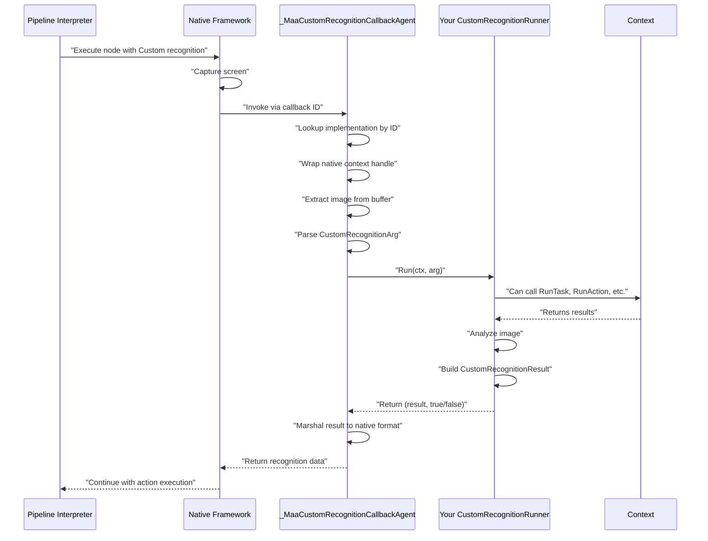
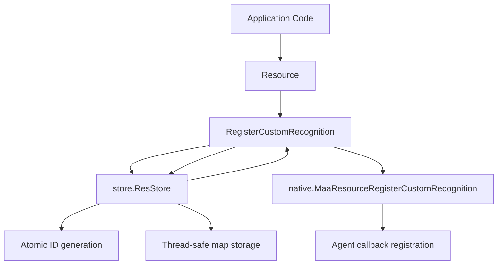

# Your First Custom Recognition

Relevant source files

* [README.md](https://github.com/MaaXYZ/maa-framework-go/blob/5f9c965c/README.md?plain=1)
* [README\_zh.md](https://github.com/MaaXYZ/maa-framework-go/blob/5f9c965c/README_zh.md?plain=1)
* [custom\_action.go](https://github.com/MaaXYZ/maa-framework-go/blob/5f9c965c/custom_action.go)
* [examples/custom-action/main.go](https://github.com/MaaXYZ/maa-framework-go/blob/5f9c965c/examples/custom-action/main.go)
* [examples/quick-start/main.go](https://github.com/MaaXYZ/maa-framework-go/blob/5f9c965c/examples/quick-start/main.go)
* [resource.go](https://github.com/MaaXYZ/maa-framework-go/blob/5f9c965c/resource.go)

## Purpose and Scope

This tutorial guides you through implementing your first custom recognition algorithm in maa-framework-go. Custom recognitions allow you to define your own image analysis logic beyond the built-in recognition types (template matching, OCR, feature detection, etc.).

By the end of this tutorial, you will understand how to:

* Implement the `CustomRecognitionRunner` interface
* Register your custom recognition with a `Resource`
* Reference your custom recognition in pipeline JSON
* Process recognition results and return them to the framework

For detailed documentation of the custom recognition system architecture and advanced patterns, see [Custom Recognition](/MaaXYZ/maa-framework-go/5.2-custom-recognition). For information about implementing custom actions, see [Your First Custom Action](/MaaXYZ/maa-framework-go/2.4-your-first-custom-action).

**Sources:** README.md:164, README\_zh.md:165

---

## When to Use Custom Recognition

Custom recognitions are appropriate when:

* **Built-in recognizers are insufficient**: Your detection logic requires algorithms not provided by the framework's standard recognition types
* **Complex image analysis**: You need to combine multiple detection methods or apply custom preprocessing
* **External dependencies**: Your recognition requires integration with external services or specialized libraries
* **Performance optimization**: You can implement a faster algorithm for your specific use case
* **Dynamic detection criteria**: Recognition parameters need to change based on runtime state

**Sources:** README.md:47, README\_zh.md:47

---

## The CustomRecognitionRunner Interface

Custom recognitions must implement the `CustomRecognitionRunner` interface, which defines a single method:

```
```
type CustomRecognitionRunner interface {


Run(ctx *Context, arg *CustomRecognitionArg) (*CustomRecognitionResult, bool)


}
```
```

### Method Signature

| Component | Type | Description |
| --- | --- | --- |
| **Context** | `*Context` | Provides access to framework capabilities during recognition |
| **Argument** | `*CustomRecognitionArg` | Contains recognition parameters and current task information |
| **Result** | `*CustomRecognitionResult` | The recognition result to return to the framework |
| **Success Flag** | `bool` | `true` if recognition succeeded, `false` otherwise |

### CustomRecognitionArg Structure

The `*CustomRecognitionArg` passed to your `Run` method contains:

| Field | Type | Description |
| --- | --- | --- |
| `TaskID` | `int64` | Current task ID for retrieving task details via `Tasker.GetTaskDetail` |
| `CurrentTaskName` | `string` | Name of the currently executing pipeline node |
| `CustomRecognitionName` | `string` | Name you registered this recognition under |
| `CustomRecognitionParam` | `string` | JSON string of parameters from pipeline configuration |
| `Image` | `image.Image` | Current screen capture to analyze |

### CustomRecognitionResult Structure

Your `Run` method must return a `*CustomRecognitionResult`:

| Field | Type | Description |
| --- | --- | --- |
| `Box` | `Rect` | Detected region as a rectangle (x, y, width, height) |
| `Detail` | `string` | JSON string containing additional detection details (optional) |

**Sources:** custom\_action.go:37-44 (similar pattern), resource.go:138-167

---

## Recognition Execution Flow

The following diagram illustrates how the framework invokes your custom recognition:



**Sources:** custom\_action.go:50-93 (similar callback pattern), resource.go:138-167

---

## Creating Your First Custom Recognition

### Step 1: Define Your Recognition Struct

Create a struct that will implement the `CustomRecognitionRunner` interface:

```
```
type MyCustomRecognizer struct {


// Optional: Add fields for configuration


threshold float64


}
```
```

### Step 2: Implement the Run Method

Implement the `Run` method to perform your custom detection logic:

```
```
func (r *MyCustomRecognizer) Run(


ctx *maa.Context,


arg *maa.CustomRecognitionArg,


) (*maa.CustomRecognitionResult, bool) {


// Access the current screen image


img := arg.Image


// Parse custom parameters from pipeline JSON (if needed)


var params struct {


MinSize int `json:"min_size"`


}


if arg.CustomRecognitionParam != "" {


json.Unmarshal([]byte(arg.CustomRecognitionParam), &params)


}


// Perform your detection logic


detected, box := r.detectObject(img, params.MinSize)


if !detected {


return nil, false


}


// Build and return result


result := &maa.CustomRecognitionResult{


Box: box,


Detail: `{"confidence": 0.95}`, // Optional JSON details


}


return result, true


}


func (r *MyCustomRecognizer) detectObject(


img image.Image,


minSize int,


) (bool, maa.Rect) {


// Your detection algorithm here


// Return (found, rectangle)


return true, maa.Rect{X: 100, Y: 100, Width: 50, Height: 50}


}
```
```

**Sources:** custom\_action.go:46-48 (similar interface pattern), examples/custom-action/main.go:71-75

---

## Registering Your Custom Recognition

### Registration Process

After creating your `Resource` and before binding it to the `Tasker`, register your custom recognition:

```
```
// Create resource


res, err := maa.NewResource()


if err != nil {


// Handle error


}


defer res.Destroy()


// Register custom recognition with a unique name


recognizer := &MyCustomRecognizer{threshold: 0.8}


err = res.RegisterCustomRecognition("MyRecognizer", recognizer)


if err != nil {


// Handle registration error


}


// Load pipeline resources


res.PostBundle("./resource").Wait()
```
```

The registration flow is managed internally:



**Sources:** resource.go:138-167, custom\_action.go:16-24 (similar pattern)

### Managing Registrations

The `Resource` provides methods for managing custom recognitions:

| Method | Purpose |
| --- | --- |
| `RegisterCustomRecognition(name, runner)` | Register or replace a custom recognition |
| `UnregisterCustomRecognition(name)` | Remove a specific custom recognition |
| `ClearCustomRecognition()` | Remove all custom recognitions |
| `GetCustomRecognitionList()` | Query registered recognition names |

**Sources:** resource.go:138-212, resource.go:458-469

---

## Using Custom Recognition in Pipeline

### Pipeline Configuration

Reference your custom recognition in pipeline JSON using the `Custom` recognition type:

```
```
{


"MyDetectionTask": {


"recognition": "Custom",


"custom_recognition": "MyRecognizer",


"custom_recognition_param": {


"min_size": 10


},


"action": "Click"


}


}
```
```

### Configuration Fields

| Field | Type | Required | Description |
| --- | --- | --- | --- |
| `recognition` | `string` | Yes | Must be `"Custom"` |
| `custom_recognition` | `string` | Yes | Name used in `RegisterCustomRecognition` |
| `custom_recognition_param` | `object` or `string` | No | Parameters passed to your `Run` method as JSON |

The `custom_recognition_param` will be serialized to a JSON string and provided in `CustomRecognitionArg.CustomRecognitionParam`.

**Sources:** README.md:50, README\_zh.md:50, resource.go:138-167

---

## Complete Working Example

### Recognition Implementation

```
```
package main


import (


"encoding/json"


"fmt"


"image"


"os"


"github.com/MaaXYZ/maa-framework-go/v4"


)


// ColorDetector finds regions with specific color characteristics


type ColorDetector struct {


targetColor [3]uint8


}


func (d *ColorDetector) Run(


ctx *maa.Context,


arg *maa.CustomRecognitionArg,


) (*maa.CustomRecognitionResult, bool) {


img := arg.Image


// Parse parameters


var params struct {


Tolerance int `json:"tolerance"`


}


if arg.CustomRecognitionParam != "" {


json.Unmarshal([]byte(arg.CustomRecognitionParam), &params)


}


// Simple color detection (example logic)


bounds := img.Bounds()


found := false


var resultBox maa.Rect


for y := bounds.Min.Y; y < bounds.Max.Y; y += 10 {


for x := bounds.Min.X; x < bounds.Max.X; x += 10 {


r, g, b, _ := img.At(x, y).RGBA()


if d.matchesColor(uint8(r>>8), uint8(g>>8), uint8(b>>8), params.Tolerance) {


found = true


resultBox = maa.Rect{X: x, Y: y, Width: 50, Height: 50}


goto FoundColor


}


}


}


FoundColor:


if !found {


return nil, false


}


return &maa.CustomRecognitionResult{


Box:    resultBox,


Detail: fmt.Sprintf(`{"color_matched": true}`),


}, true


}


func (d *ColorDetector) matchesColor(r, g, b uint8, tolerance int) bool {


return abs(int(r)-int(d.targetColor[0])) <= tolerance &&


abs(int(g)-int(d.targetColor[1])) <= tolerance &&


abs(int(b)-int(d.targetColor[2])) <= tolerance


}


func abs(x int) int {


if x < 0 {


return -x


}


return x


}
```
```

### Main Application

```
```
func main() {


// Initialize framework


maa.Init()


if err := maa.ConfigInitOption("./", "{}"); err != nil {


fmt.Println("Failed to init config:", err)


os.Exit(1)


}


// Create and setup tasker


tasker, _ := maa.NewTasker()


defer tasker.Destroy()


// Setup controller (example uses ADB)


devices, _ := maa.FindAdbDevices()


ctrl, _ := maa.NewAdbController(


devices[0].AdbPath,


devices[0].Address,


devices[0].ScreencapMethod,


devices[0].InputMethod,


devices[0].Config,


"path/to/MaaAgentBinary",


)


defer ctrl.Destroy()


ctrl.PostConnect().Wait()


tasker.BindController(ctrl)


// Create resource and register custom recognition


res, _ := maa.NewResource()


defer res.Destroy()


detector := &ColorDetector{


targetColor: [3]uint8{255, 0, 0}, // Red


}


if err := res.RegisterCustomRecognition("ColorDetector", detector); err != nil {


fmt.Println("Failed to register recognition:", err)


os.Exit(1)


}


// Load pipeline resources


res.PostBundle("./resource").Wait()


tasker.BindResource(res)


// Execute task


detail, _ := tasker.PostTask("FindRedButton").Wait().GetDetail()


fmt.Println(detail)


}
```
```

### Pipeline JSON (resource/pipeline/task.json)

```
```
{


"FindRedButton": {


"recognition": "Custom",


"custom_recognition": "ColorDetector",


"custom_recognition_param": {


"tolerance": 30


},


"action": "Click",


"next": ["ConfirmAction"]


},


"ConfirmAction": {


"recognition": "OCR",


"expected": "Confirm",


"action": "Click"


}


}
```
```

**Sources:** examples/custom-action/main.go:1-76 (similar structure), examples/quick-start/main.go:1-64, resource.go:138-167

---

## Accessing Framework Capabilities

### Using the Context Parameter

The `*Context` parameter in your `Run` method provides access to framework operations:

| Method | Purpose |
| --- | --- |
| `RunTask(entry string)` | Execute a sub-pipeline |
| `RunRecognition(name, param)` | Run another recognition |
| `RunAction(name, param, box)` | Execute an action |
| `OverridePipeline(override)` | Dynamically modify pipeline |
| `OverrideNext(name, nextList)` | Change node navigation |
| `GetTasker()` | Access the parent Tasker |

### Example: Running Sub-tasks

```
```
func (r *MyRecognizer) Run(


ctx *maa.Context,


arg *maa.CustomRecognitionArg,


) (*maa.CustomRecognitionResult, bool) {


// Perform initial detection


if !r.preliminaryCheck(arg.Image) {


return nil, false


}


// Run a sub-task for additional processing


if !ctx.RunTask("PreprocessImage") {


return nil, false


}


// Continue with main recognition logic


box := r.detectMainFeature(arg.Image)


return &maa.CustomRecognitionResult{Box: box}, true


}
```
```

**Sources:** custom\_action.go:70-71 (Context usage pattern), resource.go:138-167

---

## Best Practices

### Thread Safety

Custom recognitions may be invoked from multiple threads concurrently. Ensure your implementation is thread-safe:

* **Immutable state**: Store configuration in fields, avoid mutable state
* **Synchronization**: Use mutexes if you must maintain mutable state
* **Context isolation**: Each `Run` invocation receives independent context and arguments

```
```
type SafeRecognizer struct {


config     Config       // Immutable after creation


cacheMutex sync.RWMutex // Protects mutable cache


cache      map[string]CachedData


}
```
```

**Sources:** custom\_action.go:4-14 (thread-safe pattern)

### Error Handling

Return meaningful information through the boolean flag and optional Detail field:

* **Return `false`**: When detection definitively fails (object not found, invalid image, etc.)
* **Return `true`**: Only when you have valid detection results
* **Use Detail**: Include diagnostic information in the Detail JSON for debugging

```
```
func (r *MyRecognizer) Run(ctx *maa.Context, arg *maa.CustomRecognitionArg) (*maa.CustomRecognitionResult, bool) {


if arg.Image == nil {


// Cannot process, return false


return nil, false


}


result, confidence := r.detect(arg.Image)


if confidence < r.threshold {


// Detection confidence too low


return nil, false


}


return &maa.CustomRecognitionResult{


Box:    result,


Detail: fmt.Sprintf(`{"confidence": %.2f}`, confidence),


}, true


}
```
```

### Performance Considerations

* **Image processing**: The `arg.Image` is a full screen capture; crop to ROI if possible
* **Caching**: Cache expensive computations, but ensure thread safety
* **Early returns**: Fail fast when detection criteria are not met
* **Avoid blocking**: Do not perform long-running operations that block the pipeline

**Sources:** custom\_action.go:46-93

---

## Comparison: Custom Recognition vs Custom Action

| Aspect | Custom Recognition | Custom Action |
| --- | --- | --- |
| **Purpose** | Detect/locate elements in images | Perform operations on detected elements |
| **Interface** | `CustomRecognitionRunner` | `CustomActionRunner` |
| **Input** | Image + parameters | Recognition result + box |
| **Output** | Detection box + details | Success/failure boolean |
| **Execution** | Before action in node | After recognition in node |
| **Pipeline Type** | `"recognition": "Custom"` | `"action": "Custom"` |

**Sources:** custom\_action.go:1-94, resource.go:138-243

---

## Next Steps

After implementing your first custom recognition:

1. **Explore built-in recognitions**: Review [Recognition Types](/MaaXYZ/maa-framework-go/4.2-recognition-types) to understand when custom recognition is necessary
2. **Advanced patterns**: See [Custom Recognition](/MaaXYZ/maa-framework-go/5.2-custom-recognition) for complex scenarios, multi-stage detection, and integration patterns
3. **Custom actions**: Combine with [Custom Actions](/MaaXYZ/maa-framework-go/5.1-custom-actions) for complete custom automation logic
4. **Agent architecture**: For distributed systems, see [Agent Client and Server](/MaaXYZ/maa-framework-go/7.4-agent-client-and-server)
5. **Testing**: Use [Testing Utilities](/MaaXYZ/maa-framework-go/8.1-testing-utilities) to develop recognitions without real devices

**Sources:** README.md:159-166, README\_zh.md:159-167