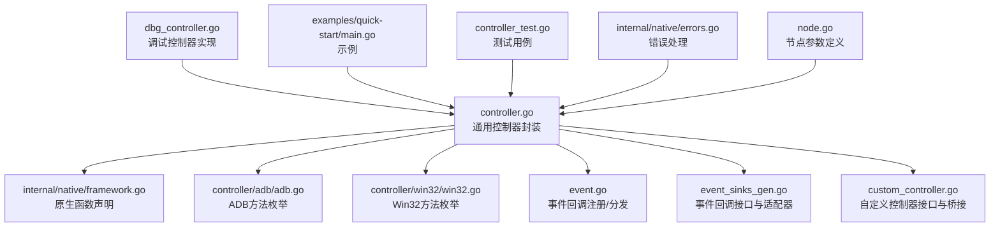
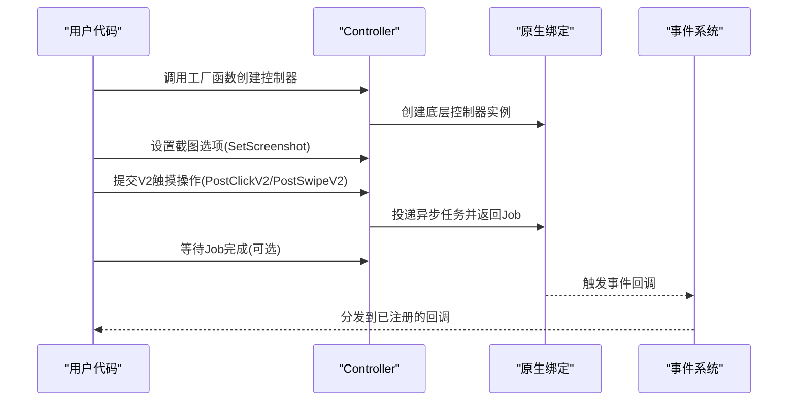
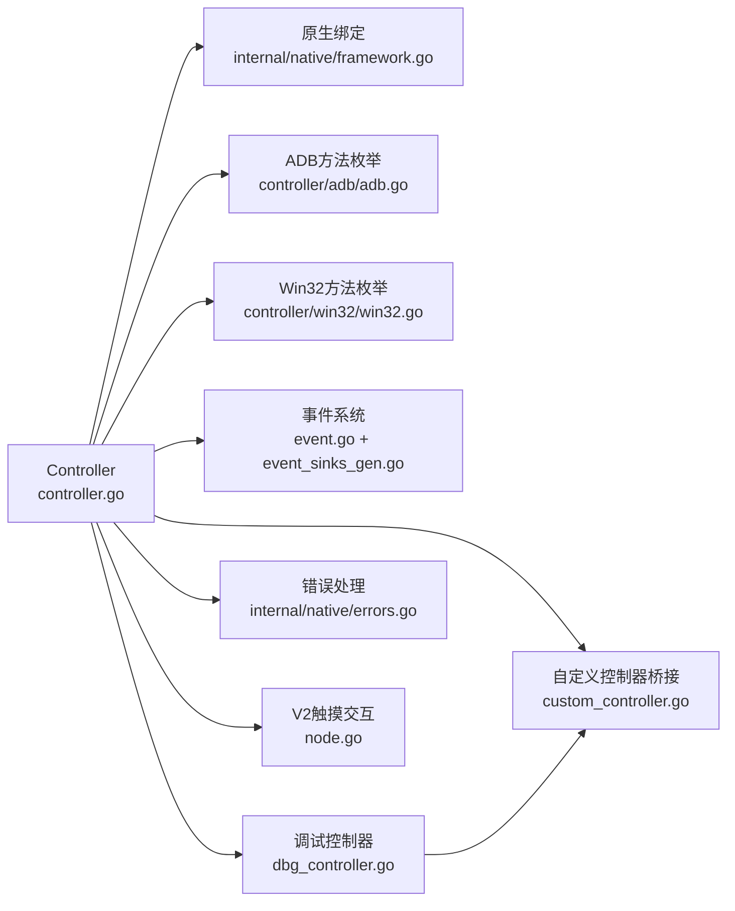

# 控制器

<cite>
**本文引用的文件**
- [controller.go](file://controller.go)
- [custom_controller.go](file://custom_controller.go)
- [dbg_controller.go](file://dbg_controller.go)
- [controller/adb/adb.go](file://controller/adb/adb.go)
- [controller/win32/win32.go](file://controller/win32/win32.go)
- [event.go](file://event.go)
- [event_sinks_gen.go](file://event_sinks_gen.go)
- [internal/native/framework.go](file://internal/native/framework.go)
- [internal/native/errors.go](file://internal/native/errors.go)
- [controller_test.go](file://controller_test.go)
- [examples/quick-start/main.go](file://examples/quick-start/main.go)
- [node.go](file://node.go)
</cite>

## 更新摘要
**变更内容**
- 移除了DbgController功能，新增CarouselImageController和BlankController作为调试替代方案
- 增强了错误处理模式，所有方法现在返回error类型而非nil
- 更新了工厂函数列表，包含新的PlayCover和Gamepad控制器
- 完善了自定义控制器接口，包含Connected()方法

## 目录
1. [简介](#简介)
2. [项目结构](#项目结构)
3. [核心组件](#核心组件)
4. [架构总览](#架构总览)
5. [详细组件分析](#详细组件分析)
6. [依赖关系分析](#依赖关系分析)
7. [性能考量](#性能考量)
8. [故障排查指南](#故障排查指南)
9. [结论](#结论)
10. [附录](#附录)

## 简介
本文件为控制器（Controller）组件的详尽API参考文档，覆盖以下内容：
- 工厂函数：NewAdbController()、NewPlayCoverController()、NewWin32Controller()、NewGamepadController()、NewCustomController() 的用法与参数说明
- 新增调试控制器：NewCarouselImageController()和NewBlankController()用于调试目的
- Controller 结构体的方法：Destroy()、SetScreenshot()（增强的选项配置）、PostConnect()、PostClick()、PostClickV2()、PostSwipe()、PostSwipeV2()、PostClickKey()、PostInputText()、PostStartApp()、PostStopApp()、PostTouchDown()、PostTouchMove()、PostTouchUp()、PostKeyDown()、PostKeyUp()、PostScreencap()、PostScroll()、PostShell()、GetShellOutput()、Connected()、CacheImage()、GetUUID()、GetResolution()
- 事件回调：AddSink()、RemoveSink()、ClearSinks()及其便捷注册方法 OnControllerAction()
- V2触摸交互方法：PostClickV2()和PostSwipeV2()的参数说明（contact和pressure）
- ADB控制器与Windows控制器之间的差异说明
- 完整使用示例路径，展示不同控制器的创建与使用流程

## 项目结构
控制器模块位于顶层目录，包含通用控制器封装与平台特定实现：
- 通用控制器封装与工厂函数：controller.go
- 调试控制器实现：dbg_controller.go（包含CarouselImageController和BlankController）
- 自定义控制器接口与回调桥接：custom_controller.go
- ADB 控制器方法枚举与解析：controller/adb/adb.go
- Win32 控制器方法枚举与解析：controller/win32/win32.go
- 事件系统与回调适配器：event.go、event_sinks_gen.go
- 原生绑定声明：internal/native/framework.go
- 错误处理：internal/native/errors.go
- 节点参数定义（包含触摸交互差异说明）：node.go
- 使用示例与测试：examples/quick-start/main.go、controller_test.go



**图表来源**
- [controller.go](file://controller.go#L1-L512)
- [internal/native/framework.go](file://internal/native/framework.go#L172-L186)
- [controller/adb/adb.go](file://controller/adb/adb.go#L1-L60)
- [controller/win32/win32.go](file://controller/win32/win32.go#L1-L60)
- [event.go](file://event.go#L1-L60)
- [event_sinks_gen.go](file://event_sinks_gen.go#L500-L520)
- [custom_controller.go](file://custom_controller.go#L1-L60)
- [dbg_controller.go](file://dbg_controller.go#L1-L265)
- [examples/quick-start/main.go](file://examples/quick-start/main.go#L1-L65)
- [controller_test.go](file://controller_test.go#L1-L222)
- [internal/native/errors.go](file://internal/native/errors.go#L1-L24)
- [node.go](file://node.go#L1540-L1860)

**章节来源**
- [controller.go](file://controller.go#L1-L512)
- [internal/native/framework.go](file://internal/native/framework.go#L172-L186)

## 核心组件
- Controller：通用控制器封装，负责创建与管理底层控制器实例，并提供统一的操作接口与事件回调机制
- 调试控制器：CarouselImageController（循环显示图片）和BlankController（空白画面）用于调试目的
- CustomController：自定义控制器接口，允许用户通过 Go 实现设备控制逻辑，现已包含 Connected() 方法
- ADB/Win32 方法枚举：分别定义了屏幕截图与输入方法的可选集合及解析工具
- 事件系统：支持注册回调以监听控制器动作等事件
- V2触摸交互：支持带接触点和压力参数的触摸操作

**章节来源**
- [controller.go](file://controller.go#L26-L512)
- [dbg_controller.go](file://dbg_controller.go#L13-L265)
- [custom_controller.go](file://custom_controller.go#L42-L102)
- [controller/adb/adb.go](file://controller/adb/adb.go#L9-L65)
- [controller/win32/win32.go](file://controller/win32/win32.go#L9-L60)
- [event.go](file://event.go#L1-L60)
- [event_sinks_gen.go](file://event_sinks_gen.go#L508-L520)

## 架构总览
控制器的调用链路如下：
- 工厂函数创建底层控制器实例（原生层），并初始化控制器存储
- 通过 PostXxx 方法提交异步任务，返回 Job 并可等待结果
- 通过 SetScreenshot 方法设置截图选项（长边、短边或原始尺寸）
- 通过 AddSink/RemoveSink/ClearSinks 管理事件回调
- 事件回调由原生层触发，经回调适配器分发到用户实现
- V2触摸交互方法支持更精确的触摸控制（contact和pressure参数）



**图表来源**
- [controller.go](file://controller.go#L30-L512)
- [internal/native/framework.go](file://internal/native/framework.go#L172-L186)
- [event.go](file://event.go#L127-L170)
- [event_sinks_gen.go](file://event_sinks_gen.go#L607-L676)

## 详细组件分析

### 工厂函数
- NewAdbController(adbPath, address, screencapMethod, inputMethod, config, agentPath)：创建 ADB 控制器
  - 参数说明
    - adbPath：adb 可执行文件路径
    - address：设备地址（如 127.0.0.1:5555）
    - screencapMethod：屏幕截图方法（位或组合）
    - inputMethod：输入方法（位或组合）
    - config：配置字符串
    - agentPath：MaaAgent 二进制路径
  - 返回值：成功返回 *Controller 和 nil，失败返回 nil 和错误
  - 失败原因：底层创建失败或句柄为 0
  - 初始化：创建后会初始化控制器存储，以便后续事件回调与自定义控制器回调管理

- NewPlayCoverController(address, uuid)：创建 PlayCover 控制器
  - 参数说明
    - address：设备地址
    - uuid：设备UUID
  - 返回值：成功返回 *Controller 和 nil，失败返回 nil 和错误
  - 用途：用于iOS模拟器PlayCover的设备控制

- NewWin32Controller(hWnd, screencapMethod, mouseMethod, keyboardMethod)：创建 Win32 控制器
  - 参数说明
    - hWnd：窗口句柄（unsafe.Pointer）
    - screencapMethod：屏幕截图方法（单选）
    - mouseMethod：鼠标输入方法（单选）
    - keyboardMethod：键盘输入方法（单选）
  - 返回值：成功返回 *Controller 和 nil，失败返回 nil 和错误

- NewGamepadController(hWnd, gamepadType, screencapMethod)：创建虚拟游戏手柄控制器
  - 参数说明
    - hWnd：窗口句柄（可选，如果不需要截图可为nil）
    - gamepadType：游戏手柄类型（Xbox360或DualShock4）
    - screencapMethod：屏幕截图方法（如果hWnd为nil则忽略）
  - 返回值：成功返回 *Controller 和 nil，失败返回 nil 和错误
  - 注意：需要安装ViGEm Bus Driver

- NewCustomController(ctrl)：创建自定义控制器
  - 参数说明
    - ctrl：实现 CustomController 接口的对象（现已包含 Connected() 方法）
  - 返回值：成功返回 *Controller 和 nil，失败返回 nil 和错误
  - 初始化：注册自定义回调并记录回调ID，便于销毁时清理

- **新增** NewCarouselImageController(path)：创建循环图片控制器
  - 参数说明
    - path：图片路径或目录路径
  - 返回值：成功返回 *Controller 和 nil，失败返回 nil 和错误
  - 用途：用于调试，循环显示指定路径下的图片

- **新增** NewBlankController()：创建空白控制器
  - 参数说明：无
  - 返回值：成功返回 *Controller 和 nil，失败返回 nil 和错误
  - 用途：用于调试，返回空白画面

**章节来源**
- [controller.go](file://controller.go#L30-L158)
- [dbg_controller.go](file://dbg_controller.go#L21-L265)

### 调试控制器详解

#### CarouselImageController
- 功能：循环显示指定路径下的图片，用于调试目的
- 特性
  - 支持单个图片文件或整个目录
  - 自动解析支持的图片格式（PNG、JPEG、GIF）
  - 记录设备分辨率
  - 支持重新连接（reconnect-safe）
- 方法实现
  - Connect()：连接并加载图片资源
  - Screencap()：返回下一张图片
  - 其他方法：返回true（占位实现）

#### BlankController
- 功能：返回空白画面的调试控制器
- 特性
  - 总是返回1280x720的空白RGBA图像
  - 所有操作都返回true（占位实现）
  - 适合快速测试框架功能

**章节来源**
- [dbg_controller.go](file://dbg_controller.go#L13-L265)

### 增强的错误处理模式

#### 错误处理改进
- 所有工厂函数现在返回 (result, error) 而不是 (result, nil)
- setOption方法现在返回 error 而不是 bool
- CacheImage、GetUUID、GetResolution等方法返回 (result, error)
- GetShellOutput方法返回 (string, error)
- LibraryLoadError 类型提供详细的库加载错误信息

#### 错误处理最佳实践
```go
ctrl, err := maa.NewAdbController(adbPath, address, screencapMethod, inputMethod, config, agentPath)
if err != nil {
    log.Printf("Failed to create controller: %v", err)
    return
}

// 检查截图设置
err = ctrl.SetScreenshot(maa.WithScreenshotTargetLongSide(1280))
if err != nil {
    log.Printf("Failed to set screenshot option: %v", err)
    return
}
```

**章节来源**
- [controller.go](file://controller.go#L36-L54)
- [controller.go](file://controller.go#L179-L184)
- [controller.go](file://controller.go#L407-L442)
- [internal/native/errors.go](file://internal/native/errors.go#L7-L24)

### Controller 方法总览
- Destroy()：释放控制器实例
  - 行为：解锁控制器存储，注销自定义控制器回调与所有事件回调，删除存储项，再调用原生销毁
  - 注意：调用后该控制器不可再使用

- **增强** 截图选项配置
  - SetScreenshot(opts ...ScreenshotOption) error：设置截图选项，返回错误
  - WithScreenshotTargetLongSide(targetLongSide int32)：设置长边目标尺寸
  - WithScreenshotTargetShortSide(targetShortSide int32)：设置短边目标尺寸
  - WithScreenshotUseRawSize(enabled bool)：启用原始尺寸

- 连接与状态
  - PostConnect() *Job：建立连接，返回 Job，可 Wait() 获取结果
  - Connected() bool：检查当前连接状态

- 设备操作（均返回 Job，可 Wait() 获取结果）
  - PostClick(x, y int32) *Job
  - PostClickV2(x, y, contact, pressure int32) *Job：V2触摸点击，支持接触点和压力参数
  - PostSwipe(x1, y1, x2, y2 int32, duration time.Duration) *Job
  - PostSwipeV2(x1, y1, x2, y2 int32, duration time.Duration, contact, pressure int32) *Job：V2触摸滑动，支持接触点和压力参数
  - PostClickKey(keycode int32) *Job
  - PostInputText(text string) *Job
  - PostStartApp(intent string) *Job
  - PostStopApp(intent string) *Job
  - PostTouchDown(contact, x, y, pressure int32) *Job
  - PostTouchMove(contact, x, y, pressure int32) *Job
  - PostTouchUp(contact int32) *Job
  - PostKeyDown(keycode int32) *Job
  - PostKeyUp(keycode int32) *Job
  - PostScreencap() *Job
  - PostScroll(dx, dy int32) *Job
  - **新增** PostShell(cmd string, timeout time.Duration) *Job：执行ADB shell命令
  - **新增** GetShellOutput() (string, error)：获取最后shell命令的输出

- 元信息查询
  - GetResolution() (width, height int32, err error)：获取设备分辨率
  - CacheImage() (image.Image, error)：获取上次截图请求的图像缓存
  - GetUUID() (string, error)：获取设备 UUID
  - **新增** GetShellOutput() (string, error)：获取shell命令输出

- 事件回调
  - AddSink(sink ControllerEventSink) int64：添加事件回调，返回 sink ID
  - RemoveSink(sinkId int64)：移除指定 sink ID
  - ClearSinks()：清空所有事件回调
  - 便捷注册方法（返回 sink ID）
    - OnControllerAction(fn)

**章节来源**
- [controller.go](file://controller.go#L164-L512)
- [event.go](file://event.go#L1-L60)
- [event_sinks_gen.go](file://event_sinks_gen.go#L607-L676)

### V2触摸交互方法详解

#### PostClickV2 方法
- 功能：支持带接触点和压力参数的触摸点击操作
- 参数说明
  - x, y：点击坐标
  - contact：接触点标识符
    - ADB控制器：手指索引（0=第一个手指，1=第二个手指，以此类推）
    - Windows控制器：鼠标按钮标识（0=左键，1=右键，2=中键）
  - pressure：触摸压力值，范围取决于控制器实现，默认为0
- 返回值：*Job，可通过 Wait() 获取执行结果
- 使用场景：多点触控、精确压力控制、鼠标按键模拟

#### PostSwipeV2 方法
- 功能：支持带接触点和压力参数的触摸滑动操作
- 参数说明
  - x1, y1：滑动起始坐标
  - x2, y2：滑动结束坐标
  - duration：滑动持续时间（毫秒）
  - contact：接触点标识符（规则同PostClickV2）
  - pressure：触摸压力值（规则同PostClickV2）
- 返回值：*Job，可通过 Wait() 获取执行结果
- 使用场景：多点触控滑动、精确压力控制、复杂手势操作

**章节来源**
- [controller.go](file://controller.go#L288-L307)
- [internal/native/framework.go](file://internal/native/framework.go#L189-L193)
- [node.go](file://node.go#L1548-L1549)
- [node.go](file://node.go#L1649-L1650)
- [node.go](file://node.go#L1761-L1762)
- [node.go](file://node.go#L1815-L1816)

### ADB 方法枚举与解析
- ScreencapMethod/InputMethod：位掩码组合，支持多方法并行选择
- 常量与默认值：包含多种方法常量与默认集合
- 字符串表示与解析：提供 String() 与 ParseXxx()，便于从配置字符串转换为枚举值
- 使用建议：根据设备能力与网络环境选择合适方法组合

**章节来源**
- [controller/adb/adb.go](file://controller/adb/adb.go#L9-L170)

### Win32 方法枚举与解析
- ScreencapMethod/InputMethod：单选枚举，非位或组合
- 常量与默认值：包含多种方法常量
- 字符串表示与解析：提供 String() 与 ParseXxx()

**章节来源**
- [controller/win32/win32.go](file://controller/win32/win32.go#L9-L164)

### 自定义控制器接口与桥接
- CustomController 接口：定义 Connect、Connected、RequestUUID、GetFeature、StartApp、StopApp、Screencap、Click、Swipe、TouchDown、TouchMove、TouchUp、ClickKey、InputText、KeyDown、KeyUp 等方法
- MaaCustomControllerCallbacks：原生回调指针表，通过 purego.NewCallback 将 Go 函数桥接到原生层
- 回调代理：_ConnectAgent、_ConnectedAgent、_RequestUUIDAgent、_GetFeatureAgent、_StartAppAgent、_StopAppAgent、_ScreencapAgent、_ClickAgent、_SwipeAgent、_TouchDownAgent、_TouchMoveAgent、_TouchUpAgent、_ClickKey、_InputText、_KeyDown、_KeyUp
- 注册/注销：通过 registerCustomControllerCallbacks/unregisterCustomControllerCallbacks 维护回调映射

**章节来源**
- [custom_controller.go](file://custom_controller.go#L42-L102)
- [custom_controller.go](file://custom_controller.go#L109-L436)

### 事件回调系统
- 回调注册：registerEventCallback 返回唯一回调ID，保存在全局映射中
- 回调分发：_MaaEventCallbackAgent 根据 transArg 查找回调，构造 eventHandler 并按消息前缀分派到对应 OnXxx 方法
- 事件类型：控制器动作等
- 适配器：ControllerEventSinkAdapter 提供便捷的函数式回调包装

**章节来源**
- [event.go](file://event.go#L1-L60)
- [event.go](file://event.go#L127-L170)
- [event_sinks_gen.go](file://event_sinks_gen.go#L508-L520)

## 依赖关系分析
- 控制器封装依赖原生绑定（创建、销毁、选项设置、任务投递、事件回调）
- 调试控制器通过NewCustomController()创建，继承自CustomController接口
- ADB/Win32 方法枚举用于工厂函数参数，决定底层行为
- 事件系统通过回调适配器解耦上层业务与原生事件分发
- 自定义控制器通过回调桥接与原生层交互
- V2触摸交互方法依赖原生框架的相应实现
- 错误处理通过LibraryLoadError提供详细的错误信息



**图表来源**
- [controller.go](file://controller.go#L1-L512)
- [internal/native/framework.go](file://internal/native/framework.go#L172-L186)
- [controller/adb/adb.go](file://controller/adb/adb.go#L1-L60)
- [controller/win32/win32.go](file://controller/win32/win32.go#L1-L60)
- [event.go](file://event.go#L1-L60)
- [event_sinks_gen.go](file://event_sinks_gen.go#L508-L520)
- [custom_controller.go](file://custom_controller.go#L1-L60)
- [dbg_controller.go](file://dbg_controller.go#L1-L265)
- [internal/native/errors.go](file://internal/native/errors.go#L1-L24)
- [node.go](file://node.go#L1540-L1860)

## 性能考量
- 异步任务：所有操作均返回 Job 并可 Wait()，避免阻塞主线程
- 截图选项：合理设置截图选项可减少数据传输与处理开销
- 原生层优化：ADB/Win32 方法枚举允许框架自动选择最快/可用方法，降低延迟
- 事件回调：仅注册必要回调，避免过多 JSON 解析与对象分配
- V2触摸交互：接触点和压力参数可能增加数据传输开销，应按需使用
- 调试控制器：CarouselImageController会缓存图片，注意内存使用

## 故障排查指南
- 控制器创建失败
  - 检查 adbPath/address 或 hWnd 是否有效
  - 检查 screencapMethod/inputMethod 是否符合设备能力
  - 使用错误返回值获取详细错误信息
  - 参考：[controller.go](file://controller.go#L36-L54)
- 连接失败
  - 使用 PostConnect().Wait() 检查结果
  - 使用 Connected() 确认连接状态
  - 参考：[controller_test.go](file://controller_test.go#L69-L83)
- 截图异常
  - 使用 SetScreenshot() 设置合适的截图选项
  - 使用 CacheImage() 验证缓存图像是否存在
  - 参考：[controller_test.go](file://controller_test.go#L192-L211)
- 输入无效
  - 确认坐标与按键码正确
  - 对于触摸序列，确保 TouchDown/Move/Up 成对出现
  - 对于V2触摸方法，确认contact和pressure参数符合目标控制器类型
  - 参考：[controller_test.go](file://controller_test.go#L85-L199)
- 事件回调未触发
  - 确认已 AddSink 并保持 sink 生命周期
  - 使用 OnControllerAction 便捷方法简化注册
  - 参考：[event.go](file://event.go#L127-L170)，[event_sinks_gen.go](file://event_sinks_gen.go#L607-L676)
- 调试控制器问题
  - 确认图片路径有效且可访问
  - 检查图片格式是否受支持
  - 参考：[dbg_controller.go](file://dbg_controller.go#L21-L93)

**章节来源**
- [controller.go](file://controller.go#L164-L512)
- [controller_test.go](file://controller_test.go#L69-L222)
- [event.go](file://event.go#L127-L170)
- [event_sinks_gen.go](file://event_sinks_gen.go#L607-L676)
- [dbg_controller.go](file://dbg_controller.go#L21-L93)

## 结论
Controller 组件提供了统一、跨平台的设备控制抽象，结合异步任务与事件回调机制，能够高效地完成自动化操作与状态监控。通过工厂函数与方法枚举，用户可以灵活选择 ADB、PlayCover、Win32、Gamepad或自定义控制器，并在需要时扩展事件处理能力。新增的调试控制器（CarouselImageController和BlankController）为开发和测试提供了便利。增强的错误处理模式使得错误诊断更加容易，所有方法现在都返回详细的错误信息。新增的V2触摸交互方法进一步增强了多点触控和精确压力控制的能力，而自定义控制器接口的完善使得开发者可以更好地集成各种设备控制需求。

## 附录

### API 一览与使用要点
- 工厂函数
  - NewAdbController：适用于 Android 设备，需提供 adb 路径、设备地址、方法枚举与 agent 路径
  - NewPlayCoverController：适用于iOS模拟器PlayCover设备
  - NewWin32Controller：适用于 Windows 桌面应用，需提供窗口句柄与方法枚举
  - NewGamepadController：适用于虚拟游戏手柄，需提供窗口句柄、手柄类型与方法枚举
  - NewCustomController：适用于自定义设备控制，需实现 CustomController 接口
  - NewCarouselImageController：用于调试，循环显示图片
  - NewBlankController：用于调试，返回空白画面
  - 示例：[examples/quick-start/main.go](file://examples/quick-start/main.go#L29-L41)

- 截图与尺寸
  - SetScreenshot：设置截图选项（长边、短边或原始尺寸）
  - WithScreenshotTargetLongSide：设置长边目标尺寸
  - WithScreenshotTargetShortSide：设置短边目标尺寸
  - WithScreenshotUseRawSize：启用原始尺寸
  - 示例：[controller_test.go](file://controller_test.go#L29-L67)

- 连接与状态
  - PostConnect：建立连接
  - Connected：检查连接状态
  - 示例：[controller_test.go](file://controller_test.go#L69-L83)

- 设备操作
  - PostClick/PostClickV2/PostSwipe/PostSwipeV2/PostClickKey/PostInputText/PostStartApp/PostStopApp/PostTouchDown/PostTouchMove/PostTouchUp/PostKeyDown/PostKeyUp/PostScreencap/PostScroll/PostShell
  - V2触摸交互：PostClickV2和PostSwipeV2支持contact和pressure参数
  - Shell命令：PostShell执行ADB shell命令，GetShellOutput获取输出
  - 示例：[controller_test.go](file://controller_test.go#L85-L199)

- 元信息查询
  - GetResolution：获取设备分辨率
  - CacheImage：获取上次截图缓存
  - GetUUID：获取设备 UUID
  - GetShellOutput：获取shell命令输出
  - 示例：[controller_test.go](file://controller_test.go#L192-L222)

- 事件回调
  - AddSink/RemoveSink/ClearSinks
  - OnControllerAction：便捷的控制器动作回调注册
  - 示例：[event_sinks_gen.go](file://event_sinks_gen.go#L607-L676)

### 调试控制器使用示例

#### CarouselImageController使用
```go
// 创建循环图片控制器
ctrl, err := maa.NewCarouselImageController("./screenshots")
if err != nil {
    log.Printf("Failed to create carousel controller: %v", err)
    return
}
defer ctrl.Destroy()

// 连接并获取截图
ctrl.PostConnect().Wait()
ctrl.PostScreencap().Wait()
img, err := ctrl.CacheImage()
if err != nil {
    log.Printf("Failed to get cached image: %v", err)
    return
}
```

#### BlankController使用
```go
// 创建空白控制器
ctrl, err := maa.NewBlankController()
if err != nil {
    log.Printf("Failed to create blank controller: %v", err)
    return
}
defer ctrl.Destroy()

// 获取空白画面
ctrl.PostConnect().Wait()
ctrl.PostScreencap().Wait()
img, err := ctrl.CacheImage()
if err != nil {
    log.Printf("Failed to get blank image: %v", err)
    return
}
```

### 错误处理最佳实践

#### 基础错误处理
```go
// 工厂函数错误处理
ctrl, err := maa.NewAdbController(adbPath, address, screencapMethod, inputMethod, config, agentPath)
if err != nil {
    log.Printf("创建控制器失败: %v", err)
    return
}

// 方法调用错误处理
err = ctrl.SetScreenshot(maa.WithScreenshotTargetLongSide(1280))
if err != nil {
    log.Printf("设置截图选项失败: %v", err)
    return
}

// 异步操作结果检查
job := ctrl.PostClick(100, 200)
status := job.Wait()
if !status.Success() {
    log.Printf("点击操作失败，状态: %v", status)
    return
}
```

#### 详细错误信息
```go
// 检查具体的错误类型
_, err := maa.NewAdbController(adbPath, address, screencapMethod, inputMethod, config, agentPath)
if err != nil {
    switch e := err.(type) {
    case *native.LibraryLoadError:
        log.Printf("库加载失败 - 库名: %s, 路径: %s, 错误: %v", 
                  e.LibraryName, e.LibraryPath, e.Err)
    default:
        log.Printf("其他错误: %v", e)
    }
}
```

**章节来源**
- [controller.go](file://controller.go#L30-L158)
- [dbg_controller.go](file://dbg_controller.go#L21-L265)
- [controller_test.go](file://controller_test.go#L10-L222)
- [internal/native/errors.go](file://internal/native/errors.go#L7-L24)

### ADB控制器与Windows控制器差异对比

| 特性 | ADB控制器 | Windows控制器 |
|------|-----------|---------------|
| **PostClickV2/PostSwipeV2的contact参数** | 手指索引（0=第一个手指，1=第二个手指...） | 鼠标按钮标识（0=左键，1=右键，2=中键） |
| **压力参数** | 支持触摸压力控制 | 支持鼠标压力控制 |
| **适用场景** | Android设备触摸控制 | Windows桌面应用交互 |
| **典型用途** | 多点触控、手势识别 | 鼠标点击、键盘输入 |
| **新增功能** | PostShell（ADB shell命令） | 无 |

**章节来源**
- [node.go](file://node.go#L1548-L1549)
- [node.go](file://node.go#L1649-L1650)
- [node.go](file://node.go#L1761-L1762)
- [node.go](file://node.go#L1815-L1816)
- [controller.go](file://controller.go#L375-L390)