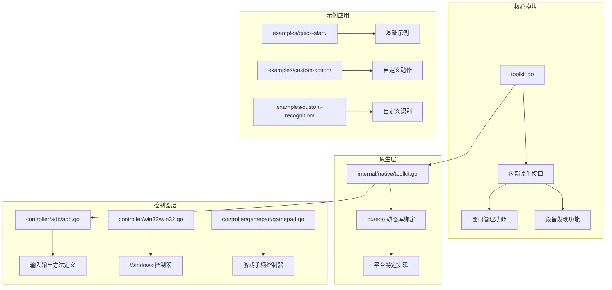
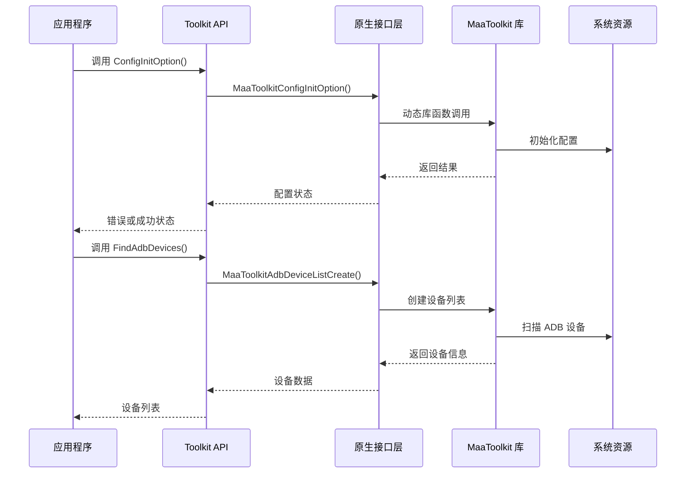
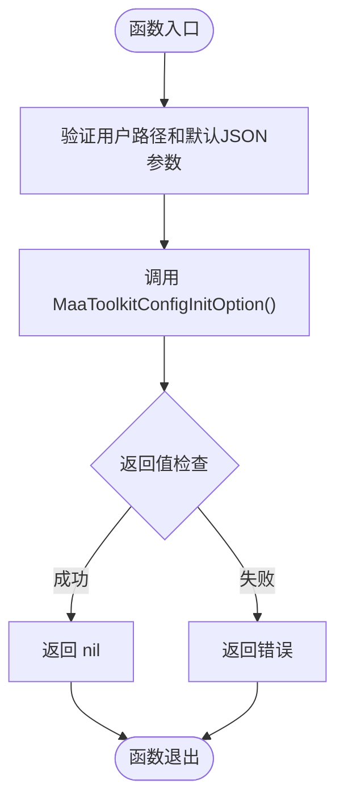
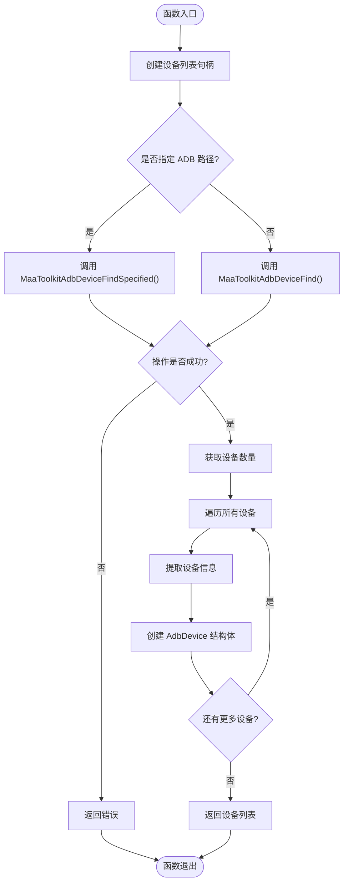
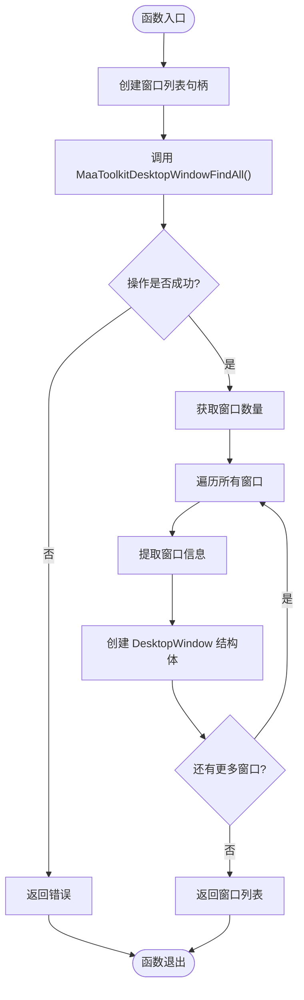
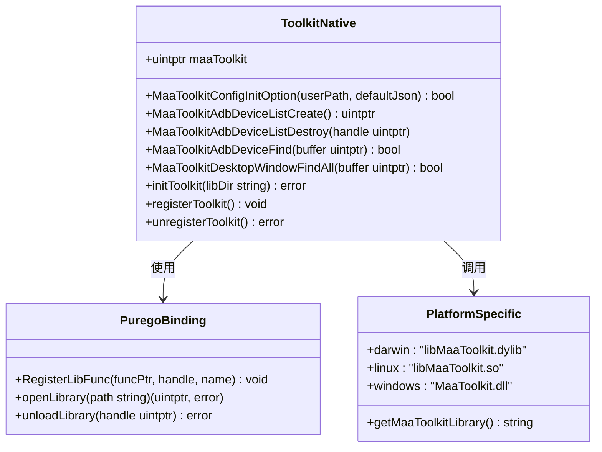
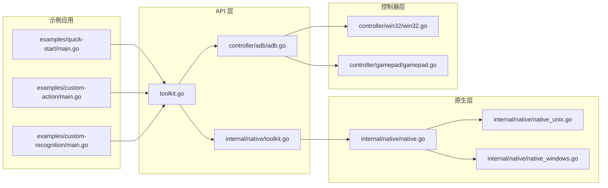

# Toolkit API 参考

<cite>
**本文档引用的文件**
- [toolkit.go](file://toolkit.go)
- [internal/native/toolkit.go](file://internal/native/toolkit.go)
- [internal/native/native.go](file://internal/native/native.go)
- [controller/adb/adb.go](file://controller/adb/adb.go)
- [maa.go](file://maa.go)
- [README.md](file://README.md)
- [toolkit_test.go](file://toolkit_test.go)
- [examples/quick-start/main.go](file://examples/quick-start/main.go)
- [examples/custom-action/main.go](file://examples/custom-action/main.go)
- [examples/custom-recognition/main.go](file://examples/custom-recognition/main.go)
</cite>

## 目录
1. [简介](#简介)
2. [项目结构](#项目结构)
3. [核心组件](#核心组件)
4. [架构概览](#架构概览)
5. [详细组件分析](#详细组件分析)
6. [依赖关系分析](#依赖关系分析)
7. [性能考虑](#性能考虑)
8. [故障排除指南](#故障排除指南)
9. [结论](#结论)

## 简介

MAA Framework Go 绑定的 Toolkit API 提供了系统级设备发现和配置管理功能。该 API 允许开发者自动发现 Android ADB 设备和桌面窗口，以及初始化工具包配置选项。通过纯 Go 实现，使用 purego 库进行动态库调用，无需 CGO 支持。

## 项目结构

该项目采用模块化设计，主要包含以下关键目录：

**图表来源**
- [toolkit.go](file://toolkit.go#L1-L96)
- [internal/native/toolkit.go](file://internal/native/toolkit.go#L1-L105)
- [controller/adb/adb.go](file://controller/adb/adb.go#L1-L170)

**章节来源**
- [README.md](file://README.md#L1-L191)
- [go.mod](file://go.mod#L1-L15)

## 核心组件

### AdbDevice 结构体

AdbDevice 结构体表示单个 ADB 设备及其相关信息：

| 字段名 | 类型 | 描述 |
|--------|------|------|
| Name | string | 设备名称 |
| AdbPath | string | ADB 可执行文件路径 |
| Address | string | 设备地址 |
| ScreencapMethod | ScreencapMethod | 屏幕捕获方法枚举 |
| InputMethod | InputMethod | 输入方法枚举 |
| Config | string | 设备配置字符串 |

### DesktopWindow 结构体

DesktopWindow 结构体表示单个桌面窗口及其属性：

| 字段名 | 类型 | 描述 |
|--------|------|------|
| Handle | unsafe.Pointer | 窗口句柄 |
| ClassName | string | 窗口类名 |
| WindowName | string | 窗口标题 |

**章节来源**
- [toolkit.go](file://toolkit.go#L11-L26)

## 架构概览

Toolkit API 采用分层架构设计，实现了从 Go 层到原生库的完整调用链：

**图表来源**
- [toolkit.go](file://toolkit.go#L28-L70)
- [internal/native/toolkit.go](file://internal/native/toolkit.go#L75-L100)

## 详细组件分析

### 配置初始化功能

ConfigInitOption 函数负责初始化工具包配置选项：

**图表来源**
- [toolkit.go](file://toolkit.go#L28-L34)

### ADB 设备发现功能

FindAdbDevices 函数提供灵活的设备发现机制：

**图表来源**
- [toolkit.go](file://toolkit.go#L36-L70)

### 桌面窗口发现功能

FindDesktopWindows 函数用于发现系统中的所有桌面窗口：

**图表来源**
- [toolkit.go](file://toolkit.go#L72-L95)

### 原生库绑定机制

内部原生层使用 purego 库实现动态库函数绑定：

**图表来源**
- [internal/native/toolkit.go](file://internal/native/toolkit.go#L12-L104)

**章节来源**
- [toolkit.go](file://toolkit.go#L1-L96)
- [internal/native/toolkit.go](file://internal/native/toolkit.go#L1-L105)

## 依赖关系分析

### 外部依赖

项目的主要外部依赖包括：

| 依赖包 | 版本 | 用途 |
|--------|------|------|
| github.com/ebitengine/purego | v0.9.1 | 动态库绑定和调用 |
| github.com/stretchr/testify | v1.11.1 | 测试断言和辅助工具 |

### 内部依赖关系

**图表来源**
- [toolkit.go](file://toolkit.go#L3-L8)
- [internal/native/toolkit.go](file://internal/native/toolkit.go#L3-L9)

**章节来源**
- [go.mod](file://go.mod#L5-L14)

## 性能考虑

### 内存管理

Toolkit API 在设备发现过程中采用了智能的内存管理模式：

1. **自动资源清理**：所有创建的列表句柄都会在函数结束时自动销毁
2. **延迟分配**：设备列表按需创建，避免不必要的内存占用
3. **批量操作**：支持一次性获取所有设备信息，减少系统调用次数

### 平台优化

不同操作系统平台的优化策略：

- **Windows**：优先使用 MaaToolkit.dll 的高性能实现
- **Linux**：使用 libMaaToolkit.so 的标准实现
- **macOS**：采用 libMaaToolkit.dylib 的原生优化

### 错误处理优化

API 提供了完善的错误处理机制：

- **早失败模式**：任何操作失败都会立即返回错误
- **详细错误信息**：错误消息包含具体的操作失败原因
- **资源清理保证**：即使发生错误也会确保资源得到清理

## 故障排除指南

### 常见问题及解决方案

#### 1. 库加载失败

**症状**：初始化时出现库加载错误

**可能原因**：
- MaaFramework 动态库文件缺失
- 库文件权限不足
- 平台不支持

**解决方案**：
- 确认 MaaFramework 库文件存在于指定路径
- 检查库文件的读取权限
- 验证当前操作系统是否受支持

#### 2. 设备发现失败

**症状**：FindAdbDevices 返回空列表或错误

**可能原因**：
- ADB 服务未启动
- 设备未正确连接
- 权限问题

**解决方案**：
- 确保 ADB 服务正常运行
- 检查设备连接状态
- 验证设备权限设置

#### 3. 窗口发现异常

**症状**：FindDesktopWindows 返回错误

**可能原因**：
- 权限不足访问窗口信息
- 系统安全策略限制

**解决方案**：
- 以管理员权限运行程序
- 检查系统安全设置
- 尝试在不同的用户账户下运行

**章节来源**
- [toolkit_test.go](file://toolkit_test.go#L9-L24)

## 结论

MAA Framework Go 绑定的 Toolkit API 提供了一个强大而易用的系统级设备发现和配置管理接口。通过纯 Go 实现和动态库绑定，它能够在多个平台上提供一致的功能体验。

### 主要优势

1. **跨平台支持**：支持 Windows、Linux 和 macOS 平台
2. **零 CGO 依赖**：使用 purego 库实现动态库调用
3. **类型安全**：完整的 Go 类型系统支持
4. **内存安全**：自动资源管理和错误处理
5. **易于使用**：简洁的 API 设计和清晰的文档

### 适用场景

- 自动化测试框架集成
- 设备管理工具开发
- 跨平台应用程序控制
- 游戏自动化脚本
- 系统监控和管理工具

该 API 为开发者提供了可靠的基础设施，使得构建复杂的自动化解决方案变得更加简单和高效。