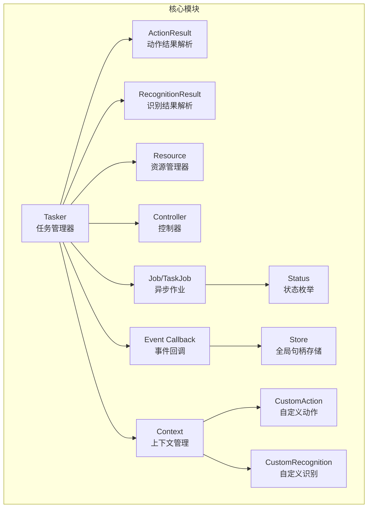
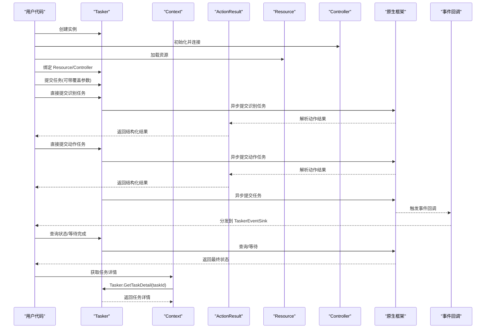
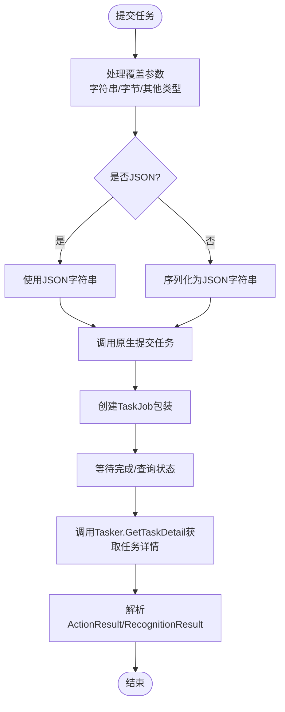
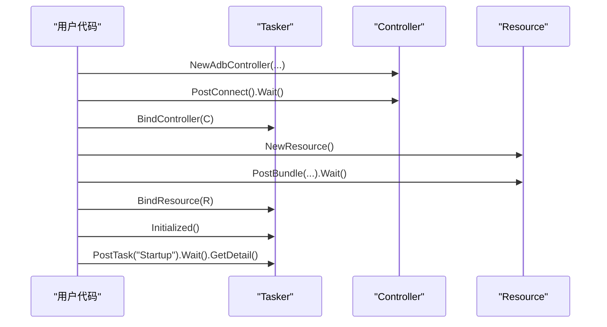
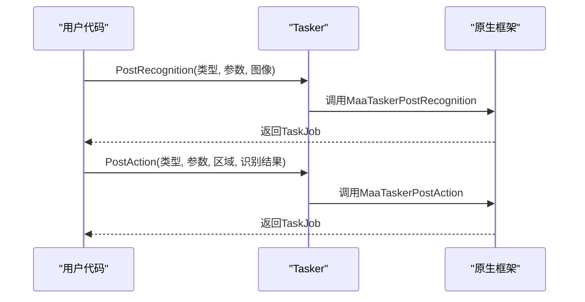
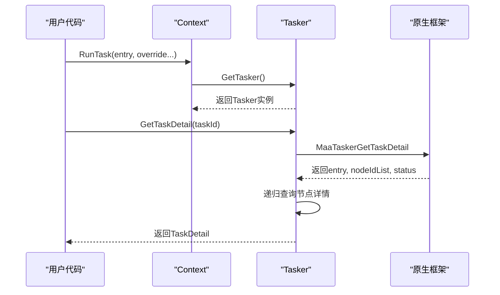
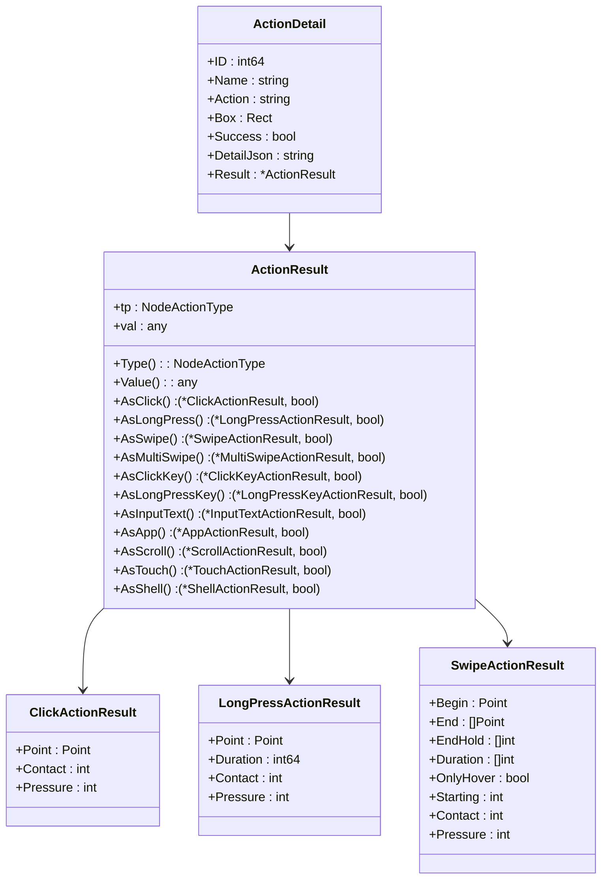
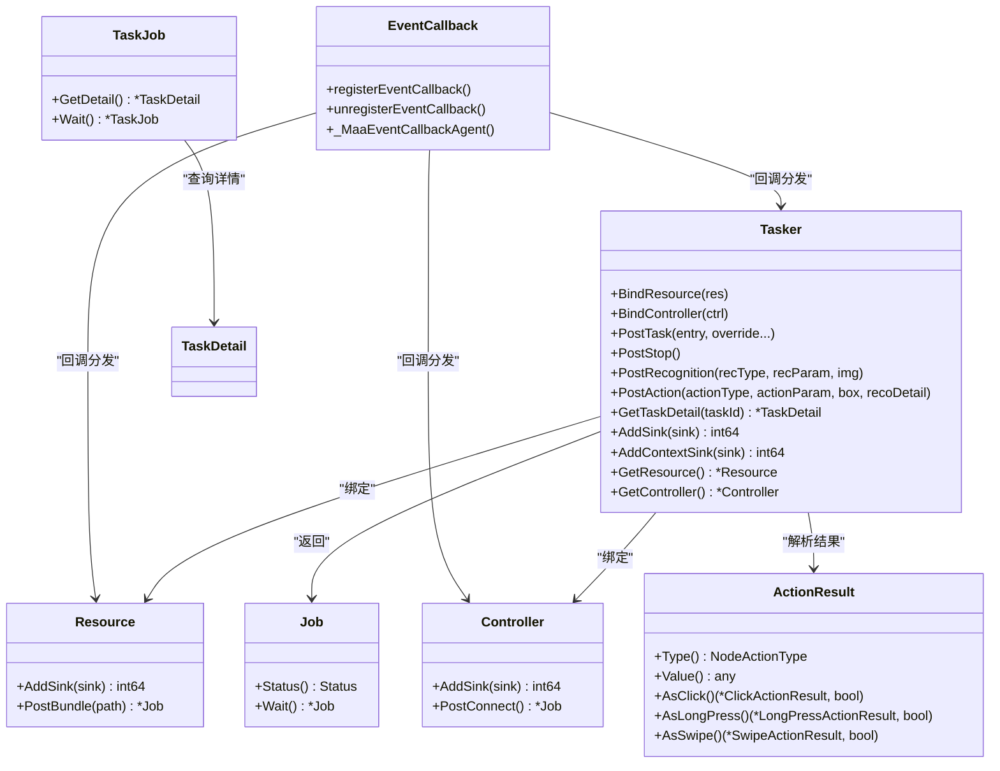
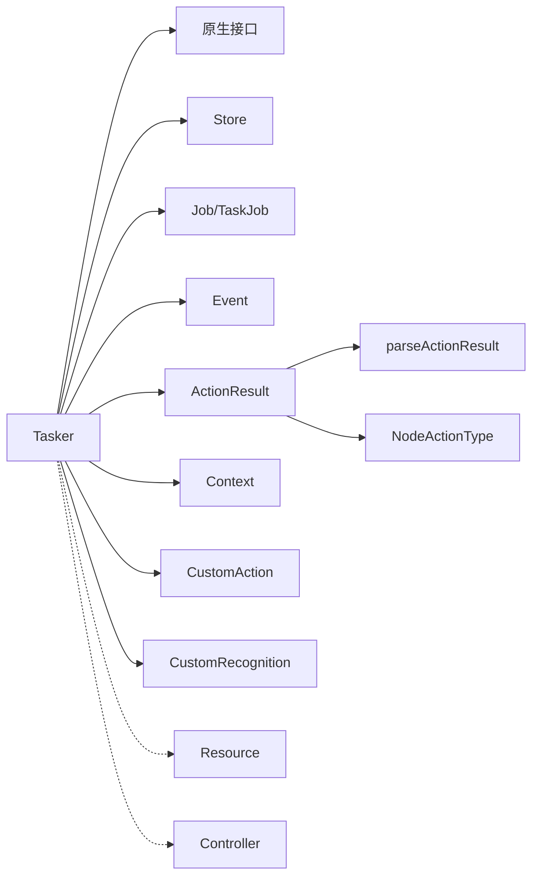

# 任务管理器（Tasker）

<cite>
**本文引用的文件列表**
- [tasker.go](file://tasker.go)
- [action_result.go](file://action_result.go)
- [action_result_test.go](file://action_result_test.go)
- [recognition_result.go](file://recognition_result.go)
- [recognition_result_test.go](file://recognition_result_test.go)
- [resource.go](file://resource.go)
- [controller.go](file://controller.go)
- [job.go](file://job.go)
- [event.go](file://event.go)
- [status.go](file://status.go)
- [context.go](file://context.go)
- [custom_action.go](file://custom_action.go)
- [custom_recognition.go](file://custom_recognition.go)
- [internal/store/store.go](file://internal/store/store.go)
- [event_sinks_gen.go](file://event_sinks_gen.go)
- [examples/quick-start/main.go](file://examples/quick-start/main.go)
- [tasker_test.go](file://tasker_test.go)
</cite>

## 更新摘要
**变更内容**   
- 更新 `GetTaskDetail` 方法的 API 设计说明，反映其作为公共方法的可用性
- 增强任务详情查询章节，详细说明 GetTaskDetail 的使用场景和最佳实践
- 更新架构总览以反映 GetTaskDetail 在 Context 和自定义组件中的集成
- 新增 GetTaskDetail 在自定义动作和识别中的应用场景
- 更新类图以包含 GetTaskDetail 方法的公共接口特性

## 目录
1. [简介](#简介)
2. [项目结构](#项目结构)
3. [核心组件](#核心组件)
4. [架构总览](#架构总览)
5. [组件详解](#组件详解)
6. [依赖关系分析](#依赖关系分析)
7. [性能与并发](#性能与并发)
8. [故障排查指南](#故障排查指南)
9. [结论](#结论)
10. [附录](#附录)

## 简介
本文件系统性阐述 Tasker 在 maa-framework-go 中作为"任务调度与执行中枢"的核心作用。围绕结构体定义、内部句柄管理、任务生命周期（提交、等待、状态查询）、与 Resource 和 Controller 的协同、异步执行模型与事件回调集成、最佳实践与并发安全策略展开，帮助读者从原理到实战全面掌握 Tasker 的使用与优化。特别说明新增的 `PostRecognition` 和 `PostAction` 方法，支持直接提交识别和动作任务，提供更灵活的自动化控制能力。同时详细介绍新的 ActionResult 类型，它提供了对动作执行结果的结构化解析，包括点击、长按、滑动、按键等多种操作类型的专门结果类型。

## 项目结构
Tasker 所在模块位于仓库根目录，主要文件包括：
- 任务管理器：tasker.go
- 动作结果解析：action_result.go
- 动作结果测试：action_result_test.go
- 识别结果解析：recognition_result.go
- 识别结果测试：recognition_result_test.go
- 资源管理器：resource.go
- 控制器：controller.go
- 异步作业抽象：job.go
- 事件系统与回调：event.go
- 状态枚举：status.go
- 上下文管理：context.go
- 自定义动作：custom_action.go
- 自定义识别：custom_recognition.go
- 全局句柄存储：internal/store/store.go
- 事件适配器生成：event_sinks_gen.go
- 快速开始示例：examples/quick-start/main.go
- 单元测试：tasker_test.go

**图表来源**
- [tasker.go](file://tasker.go#L1-L120)
- [action_result.go](file://action_result.go#L1-L60)
- [recognition_result.go](file://recognition_result.go#L1-L60)
- [resource.go](file://resource.go#L1-L120)
- [controller.go](file://controller.go#L1-L120)
- [job.go](file://job.go#L1-L96)
- [status.go](file://status.go#L1-L61)
- [event.go](file://event.go#L1-L120)
- [context.go](file://context.go#L1-L120)
- [custom_action.go](file://custom_action.go#L1-L94)
- [custom_recognition.go](file://custom_recognition.go#L1-L100)
- [internal/store/store.go](file://internal/store/store.go#L1-L65)

**章节来源**
- [tasker.go](file://tasker.go#L1-L120)
- [action_result.go](file://action_result.go#L1-L60)
- [recognition_result.go](file://recognition_result.go#L1-L60)
- [resource.go](file://resource.go#L1-L120)
- [controller.go](file://controller.go#L1-L120)
- [job.go](file://job.go#L1-L96)
- [status.go](file://status.go#L1-L61)
- [event.go](file://event.go#L1-L120)
- [context.go](file://context.go#L1-L120)
- [custom_action.go](file://custom_action.go#L1-L94)
- [custom_recognition.go](file://custom_recognition.go#L1-L100)
- [internal/store/store.go](file://internal/store/store.go#L1-L65)

## 核心组件
- Tasker：封装底层句柄，提供任务提交、停止、状态查询、资源/控制器绑定、事件回调注册等能力。
- ActionResult：新的动作结果类型，提供对不同动作类型的结构化结果解析，包括点击、长按、滑动、按键、输入文本、应用控制、滚动、触摸、Shell命令等操作的专门结果类型。
- RecognitionResult：识别结果类型，提供对模板匹配、特征匹配、颜色匹配、OCR、神经网络分类和检测等识别算法的结构化结果解析。
- Resource：资源加载与管线覆盖，提供事件回调注册。
- Controller：设备控制（ADB/Win32/自定义），提供事件回调注册。
- Job/TaskJob：统一的异步作业抽象，支持状态查询与等待完成。
- Status：任务/作业状态枚举及判定方法。
- Event：事件回调注册、分发与适配器生成。
- Context：上下文管理，提供任务详情查询和自定义组件集成。
- CustomAction/CustomRecognition：自定义动作和识别组件，支持通过 Tasker.GetTaskDetail 获取任务详情。
- Store：全局句柄存储，用于维护 Tasker/Resource/Controller 的回调映射。

**章节来源**
- [tasker.go](file://tasker.go#L1-L120)
- [action_result.go](file://action_result.go#L48-L62)
- [recognition_result.go](file://recognition_result.go#L8-L21)
- [resource.go](file://resource.go#L1-L120)
- [controller.go](file://controller.go#L1-L120)
- [job.go](file://job.go#L1-L96)
- [status.go](file://status.go#L1-L61)
- [event.go](file://event.go#L1-L120)
- [context.go](file://context.go#L1-L120)
- [custom_action.go](file://custom_action.go#L37-L44)
- [custom_recognition.go](file://custom_recognition.go#L38-L45)
- [internal/store/store.go](file://internal/store/store.go#L1-L65)

## 架构总览
Tasker 作为中枢，协调 Resource 与 Controller 完成任务生命周期管理；所有操作以异步 Job 形式返回，支持 Wait 阻塞等待；事件通过回调适配器分发至用户实现的 TaskerEventSink 接口。新增的 `PostRecognition` 和 `PostAction` 方法允许直接提交识别和动作任务，提供更细粒度的控制。ActionResult 类型提供了对动作执行结果的结构化解析，使开发者能够轻松访问不同类型动作的具体结果信息。Context 和自定义组件通过 Tasker.GetTaskDetail 方法获取任务详情，实现完整的任务管理闭环。

**图表来源**
- [tasker.go](file://tasker.go#L117-L154)
- [tasker.go](file://tasker.go#L415-L467)
- [action_result.go](file://action_result.go#L332-L374)
- [resource.go](file://resource.go#L212-L217)
- [controller.go](file://controller.go#L157-L197)
- [job.go](file://job.go#L20-L64)
- [event.go](file://event.go#L296-L334)
- [context.go](file://context.go#L40-L45)

## 组件详解

### Tasker 结构体与句柄管理
- 字段：仅包含底层句柄，避免暴露内部细节。
- 句柄存储：创建时向全局 Store 注册映射，销毁时清理回调映射并释放句柄。
- 绑定：通过 BindResource/BindController 将 Tasker 与 Resource/Controller 绑定，供后续任务执行使用。
- 状态与运行：Initialized/Running/Stopping 提供实例状态检查。
- 缓存：ClearCache 清理运行期缓存。

**章节来源**
- [tasker.go](file://tasker.go#L17-L38)
- [tasker.go](file://tasker.go#L42-L55)
- [tasker.go](file://tasker.go#L57-L73)
- [tasker.go](file://tasker.go#L75-L79)
- [tasker.go](file://tasker.go#L195-L202)
- [internal/store/store.go](file://internal/store/store.go#L44-L65)

### 任务生命周期：提交、等待与状态查询
- 提交任务：PostTask 支持可选覆盖参数（字符串或可 JSON 序列化的对象），内部统一转换为 JSON 字符串后调用原生接口。
- 停止任务：PostStop 发送停止信号，返回 Job。
- 状态查询：status/wait 封装原生状态查询与等待逻辑，配合 Job/TaskJob 使用。
- 任务详情：GetTaskDetail 提供任务级详情查询，支持通过 TaskID 获取完整的任务执行详情。

**图表来源**
- [tasker.go](file://tasker.go#L113-L115)
- [tasker.go](file://tasker.go#L176-L181)
- [tasker.go](file://tasker.go#L415-L467)
- [tasker.go](file://tasker.go#L320-L359)
- [tasker.go](file://tasker.go#L244-L307)

**章节来源**
- [tasker.go](file://tasker.go#L113-L181)
- [tasker.go](file://tasker.go#L415-L467)
- [job.go](file://job.go#L66-L96)

### 与 Resource 和 Controller 的协同
- 绑定：Tasker 通过 BindResource/BindController 将自身与已初始化的 Resource/Controller 关联，确保任务执行时具备资源与设备上下文。
- 获取：GetResource/GetController 提供当前绑定对象的访问。
- 示例：快速开始示例展示了从设备发现、控制器创建、连接、资源加载到任务提交的完整链路。

**图表来源**
- [examples/quick-start/main.go](file://examples/quick-start/main.go#L1-L41)
- [tasker.go](file://tasker.go#L57-L64)
- [tasker.go](file://tasker.go#L183-L193)
- [resource.go](file://resource.go#L212-L217)
- [controller.go](file://controller.go#L157-L197)

**章节来源**
- [tasker.go](file://tasker.go#L57-L64)
- [tasker.go](file://tasker.go#L183-L193)
- [examples/quick-start/main.go](file://examples/quick-start/main.go#L1-L41)

### 直接提交识别与动作任务
- **PostRecognition**：直接提交识别任务，接收识别类型、参数和图像，返回 TaskJob 用于状态查询和等待。适用于需要独立执行识别操作的场景。
- **PostAction**：直接提交动作任务，接收动作类型、参数、目标区域和识别结果，返回 TaskJob。适用于需要独立执行动作操作的场景。
- **灵活性**：这两个方法提供了比 PostTask 更细粒度的控制，允许开发者在不定义完整任务流程的情况下执行特定的识别或动作。
- **参数处理**：识别参数和动作参数会被序列化为 JSON 字符串，识别结果详情也会被序列化后传递给原生接口。

**图表来源**
- [tasker.go](file://tasker.go#L117-L154)

**章节来源**
- [tasker.go](file://tasker.go#L117-L154)

### 任务详情查询：GetTaskDetail 方法
**更新** Tasker 的 GetTaskDetail 方法现已作为公共方法提供，支持通过任务 ID 获取完整的任务执行详情：

- **方法签名**：`GetTaskDetail(taskId int64) (*TaskDetail, error)`
- **功能特性**：
  - 通过任务 ID 查询任务详情
  - 返回包含入口名称、节点详情列表和状态的任务详情
  - 支持空任务详情的查询（size=0的情况）
  - 自动递归查询节点详情和识别/动作详情
- **使用场景**：
  - Context.RunTask 中获取任务详情
  - 自定义动作和识别组件中获取任务上下文
  - 任务监控和调试
  - 任务状态跟踪和日志记录
- **返回结构**：TaskDetail 包含 ID、Entry、NodeDetails 和 Status 字段

**图表来源**
- [tasker.go](file://tasker.go#L415-L467)
- [context.go](file://context.go#L40-L45)

**章节来源**
- [tasker.go](file://tasker.go#L415-L467)
- [context.go](file://context.go#L40-L45)

### ActionResult 类型系统
**新增** 新的 ActionResult 类型系统提供了对动作执行结果的结构化解析，支持多种动作类型的专门结果类型：

- **基础类型**：ActionResult 包含动作类型和值，提供 Type() 和 Value() 访问器。
- **专用结果类型**：
  - ClickActionResult：点击操作结果，包含点击点坐标和接触信息
  - LongPressActionResult：长按操作结果，包含点击点和持续时间
  - SwipeActionResult：滑动操作结果，包含起点、终点序列、持续时间和压力信息
  - MultiSwipeActionResult：多滑动操作结果，包含多个滑动序列
  - ClickKeyActionResult：按键操作结果，包含按键码序列
  - LongPressKeyActionResult：长按键操作结果
  - InputTextActionResult：输入文本结果
  - AppActionResult：应用操作结果，包含包名
  - ScrollActionResult：滚动操作结果，包含滚动偏移
  - TouchActionResult：触摸操作结果，包含触摸点和压力
  - ShellActionResult：Shell命令结果，包含命令、超时、成功标志和输出

- **类型安全访问**：通过 AsClick()、AsLongPress()、AsSwipe() 等方法进行类型安全的转换，避免运行时错误。

**章节来源**
- [action_result.go](file://action_result.go#L48-L62)
- [action_result.go](file://action_result.go#L152-L157)
- [action_result.go](file://action_result.go#L332-L374)

### 改进的任务详情解析
**更新** Tasker 的任务详情解析功能得到了显著增强，特别是在动作结果解析方面：

- **ActionDetail 结构**：包含动作标识、名称、类型、目标区域、成功标志、原始详情JSON和解析后的 ActionResult。
- **ActionResult 解析**：通过 parseActionResult 函数将原始JSON详情解析为对应的 ActionResult 类型，支持所有动作类型。
- **类型安全的结果访问**：ActionDetail.Result 提供了类型安全的结果访问，开发者可以通过 Result.Type() 和 Result.Value() 获取具体结果。
- **测试验证**：通过 comprehensive 测试用例验证了所有动作类型的ActionResult解析正确性，确保结果与原始JSON保持一致。

**图表来源**
- [tasker.go](file://tasker.go#L309-L359)
- [action_result.go](file://action_result.go#L48-L150)
- [action_result.go](file://action_result.go#L152-L331)

**章节来源**
- [tasker.go](file://tasker.go#L309-L359)
- [action_result.go](file://action_result.go#L48-L150)
- [action_result_test.go](file://action_result_test.go#L260-L278)

### 异步执行模型与事件回调系统
- 异步作业：Job/TaskJob 封装状态查询与等待，避免阻塞主线程。
- 事件回调：Tasker/Resource/Controller 均支持 AddSink/AddContextSink 注册回调，内部通过全局回调表进行分发。
- 回调适配器：通过生成的 TaskerEventSinkAdapter 将单一事件回调转为接口实现，便于按需注册。
- 事件分发：_MaaEventCallbackAgent 根据传入的回调ID查找适配器并调用对应 OnXxx 方法。

**图表来源**
- [tasker.go](file://tasker.go#L57-L154)
- [tasker.go](file://tasker.go#L480-L554)
- [resource.go](file://resource.go#L345-L383)
- [controller.go](file://controller.go#L279-L300)
- [job.go](file://job.go#L1-L96)
- [event.go](file://event.go#L1-L120)
- [event.go](file://event.go#L296-L334)
- [event_sinks_gen.go](file://event_sinks_gen.go#L1-L100)
- [action_result.go](file://action_result.go#L48-L150)

**章节来源**
- [job.go](file://job.go#L1-L96)
- [event.go](file://event.go#L1-L120)
- [event.go](file://event.go#L296-L334)
- [event_sinks_gen.go](file://event_sinks_gen.go#L1-L100)

### 最佳实践：NewTasker 实例创建
- 生命周期管理：创建后务必在合适时机调用 Destroy，确保清理回调映射与底层句柄。
- 绑定顺序：先创建并初始化 Controller（连接成功）与 Resource（加载完成），再绑定到 Tasker。
- 初始化校验：使用 Initialized 检查 Tasker 是否就绪。
- 任务覆盖：PostTask 的覆盖参数建议使用结构化数据并通过 JSON 序列化，保证灵活性与可读性。
- 事件订阅：根据需要添加 TaskerEventSink 或 ContextEventSink，注意及时移除以避免内存泄漏。
- ActionResult 使用：在使用 PostAction 时，建议检查 ActionDetail.Result 的类型安全性，使用 AsXxx 方法进行类型转换。
- GetTaskDetail 使用：在需要获取任务详情时，优先使用 TaskJob.GetDetail() 方法，该方法内部会调用 Tasker.GetTaskDetail。

**章节来源**
- [tasker.go](file://tasker.go#L21-L38)
- [tasker.go](file://tasker.go#L57-L73)
- [tasker.go](file://tasker.go#L75-L79)
- [tasker.go](file://tasker.go#L113-L115)
- [tasker.go](file://tasker.go#L480-L554)
- [action_result.go](file://action_result.go#L64-L150)
- [examples/quick-start/main.go](file://examples/quick-start/main.go#L1-L41)

### 多任务并发调度与线程安全
- 并发模型：Tasker 内部通过 Job/TaskJob 的状态查询与等待机制实现异步非阻塞；回调分发由全局回调表保护，注册/注销均受互斥锁保护。
- 线程安全要点：
  - Store 的 Update 采用加锁回调更新，避免竞态。
  - 事件回调注册/注销通过原子ID分配与互斥表保护，确保回调查找与删除的安全性。
  - 建议：同一 Tasker 上的多个任务应通过独立 Job 管理，避免共享状态；如需跨任务同步，应在应用层自行加锁。
- 性能考量：
  - 合理使用 Wait：批量任务可并行提交，统一 Wait 收敛，减少频繁阻塞。
  - 控制事件回调数量：过多回调会增加分发成本，建议按需订阅。
  - 资源与控制器复用：尽量复用已连接的 Controller 与已加载的 Resource，避免重复初始化。
  - ActionResult 缓存：对于频繁使用的动作结果，可以在应用层进行适当的缓存以提高性能。
  - GetTaskDetail 缓存：对于频繁查询的任务详情，可以在应用层进行缓存以减少重复查询。

**章节来源**
- [internal/store/store.go](file://internal/store/store.go#L34-L43)
- [event.go](file://event.go#L11-L40)
- [event.go](file://event.go#L296-L334)
- [tasker_test.go](file://tasker_test.go#L1-L242)

## 依赖关系分析
- Tasker 依赖：
  - 原生接口：创建/销毁、绑定、任务提交、状态查询、等待、事件回调注册、任务详情查询。
  - Store：保存 Tasker 的回调ID映射，便于销毁时清理。
  - Job/TaskJob：封装异步作业与任务详情查询。
  - Event：事件回调注册、分发与适配器。
  - ActionResult：动作结果解析系统。
  - Context：上下文管理，提供任务详情查询。
- 与 Resource/Controller 的耦合：
  - 通过 BindResource/BindController 进行弱耦合绑定，解耦任务执行与资源/设备管理。
  - 通过 GetResource/GetController 提供只读访问，便于调试与诊断。
- ActionResult 依赖：
  - 识别结果解析：RecognitionResult 提供识别结果的结构化解析。
  - JSON 解析：依赖标准库进行 JSON 序列化和反序列化。
  - 类型系统：通过 NodeActionType 和 NodeRecognitionType 进行类型区分。
- GetTaskDetail 依赖：
  - 递归查询：自动查询节点详情、识别详情和动作详情。
  - Context 集成：Context.RunTask 和 Context.GetTaskId 集成 GetTaskDetail。
  - 自定义组件：CustomAction 和 CustomRecognition 通过注释说明可使用 GetTaskDetail。

**图表来源**
- [tasker.go](file://tasker.go#L1-L120)
- [internal/store/store.go](file://internal/store/store.go#L44-L65)
- [job.go](file://job.go#L1-L96)
- [event.go](file://event.go#L1-L120)
- [action_result.go](file://action_result.go#L332-L374)
- [context.go](file://context.go#L1-L120)
- [custom_action.go](file://custom_action.go#L37-L44)
- [custom_recognition.go](file://custom_recognition.go#L38-L45)

**章节来源**
- [tasker.go](file://tasker.go#L1-L120)
- [internal/store/store.go](file://internal/store/store.go#L44-L65)
- [job.go](file://job.go#L1-L96)
- [event.go](file://event.go#L1-L120)
- [action_result.go](file://action_result.go#L332-L374)
- [context.go](file://context.go#L1-L120)
- [custom_action.go](file://custom_action.go#L37-L44)
- [custom_recognition.go](file://custom_recognition.go#L38-L45)

## 性能与并发
- 异步优先：优先使用 PostTask/PostStop 返回的 Job，配合 Wait 在必要时才阻塞。
- 事件开销：回调数量与频率直接影响性能，建议仅订阅关键事件。
- 资源复用：避免重复加载资源与反复连接设备，减少初始化开销。
- 并发边界：Tasker 本身不强制并发控制，应用层应自行保证跨任务共享状态的线程安全。
- ActionResult 性能：ActionResult 的解析是轻量级的 JSON 解析，通常不会成为性能瓶颈。
- GetTaskDetail 性能：GetTaskDetail 方法支持递归查询，对于复杂任务可能产生较多的原生调用，建议在应用层进行适当的缓存。
- 缓存策略：对于重复的动作类型，可以在应用层缓存 ActionResult 的类型信息以提高访问速度；对于频繁查询的任务详情，可以在应用层缓存 TaskDetail 以提高性能。

## 故障排查指南
- 初始化失败：确认已成功连接 Controller 且 Resource 已加载完成，再调用 Initialized 校验。
- 任务无响应：检查 PostTask 返回的 Job 是否被正确 Wait；若长时间 Pending/Running，查看事件回调中是否有异常。
- 回调未触发：确认 AddSink/AddContextSink 成功返回 sinkId，并在销毁前调用 RemoveSink/RemoveContextSink。
- 资源/控制器泄漏：确保在退出时调用 Destroy，以便清理回调映射与底层句柄。
- ActionResult 解析失败：检查 ActionDetail.Result 是否为 nil，以及 DetailJson 是否为空。
- 类型转换错误：使用 AsXxx 方法进行类型转换时，始终检查返回的布尔值以确保类型匹配。
- GetTaskDetail 查询失败：检查 taskId 是否有效，以及原生接口调用是否成功返回。
- 自定义组件集成问题：确认 CustomAction 和 CustomRecognition 中的 TaskID 正确传递，以及 GetTaskDetail 的调用时机。
- 测试参考：单元测试覆盖了绑定、初始化、运行状态、停止、资源/控制器获取、缓存清理、最新节点查询、动作结果解析等场景，可作为行为验证的参考。

**章节来源**
- [tasker_test.go](file://tasker_test.go#L1-L242)
- [tasker.go](file://tasker.go#L42-L55)
- [tasker.go](file://tasker.go#L480-L554)
- [action_result_test.go](file://action_result_test.go#L260-L305)
- [resource.go](file://resource.go#L345-L383)
- [controller.go](file://controller.go#L279-L300)
- [context.go](file://context.go#L40-L45)
- [custom_action.go](file://custom_action.go#L37-L44)
- [custom_recognition.go](file://custom_recognition.go#L38-L45)

## 结论
Tasker 以简洁的结构体与完善的异步作业体系，成为 maa-framework-go 的任务中枢。通过与 Resource/Controller 的松耦合绑定、统一的状态查询与等待机制、以及强大的事件回调系统，开发者可以高效地构建自动化流程。新增的 `PostRecognition` 和 `PostAction` 方法提供了更灵活的控制方式，允许直接提交识别和动作任务。最新的 ActionResult 类型系统进一步增强了对动作执行结果的结构化解析能力，使开发者能够轻松访问不同类型动作的具体结果信息。GetTaskDetail 方法作为公共 API 的引入，为任务详情查询提供了标准化的接口，支持 Context 和自定义组件的深度集成。遵循本文的最佳实践与并发安全建议，可在保证稳定性的同时获得良好的性能表现。

## 附录
- 快速开始示例展示了从设备发现、控制器连接、资源加载到任务提交的完整流程，可直接参考运行。
- 事件适配器生成工具自动生成 TaskerEventSink 接口与适配器，便于按需订阅特定事件。
- ActionResult 类型系统提供了全面的动作结果解析能力，支持所有内置动作类型和自定义动作类型的结果访问。
- GetTaskDetail 方法为任务管理提供了完整的生命周期支持，从任务提交到详情查询的全流程覆盖。

**章节来源**
- [examples/quick-start/main.go](file://examples/quick-start/main.go#L1-L41)
- [event_sinks_gen.go](file://event_sinks_gen.go#L1-L100)
- [action_result.go](file://action_result.go#L48-L150)
- [action_result_test.go](file://action_result_test.go#L1-L306)
- [tasker.go](file://tasker.go#L415-L467)
- [context.go](file://context.go#L40-L45)
- [custom_action.go](file://custom_action.go#L37-L44)
- [custom_recognition.go](file://custom_recognition.go#L38-L45)