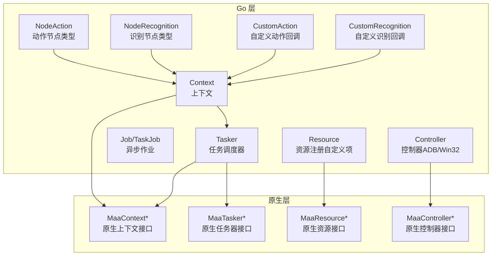
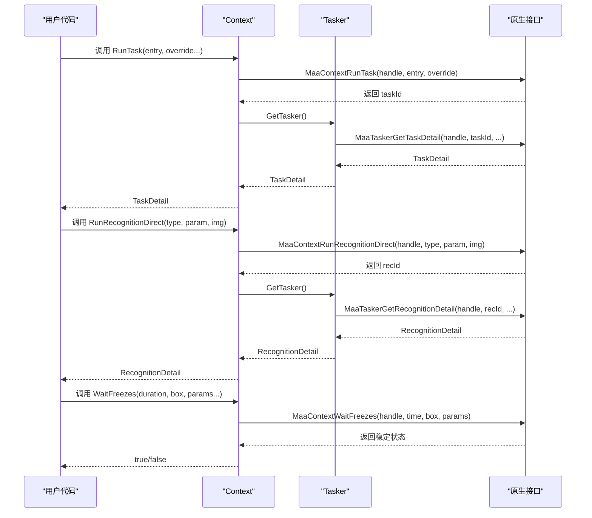
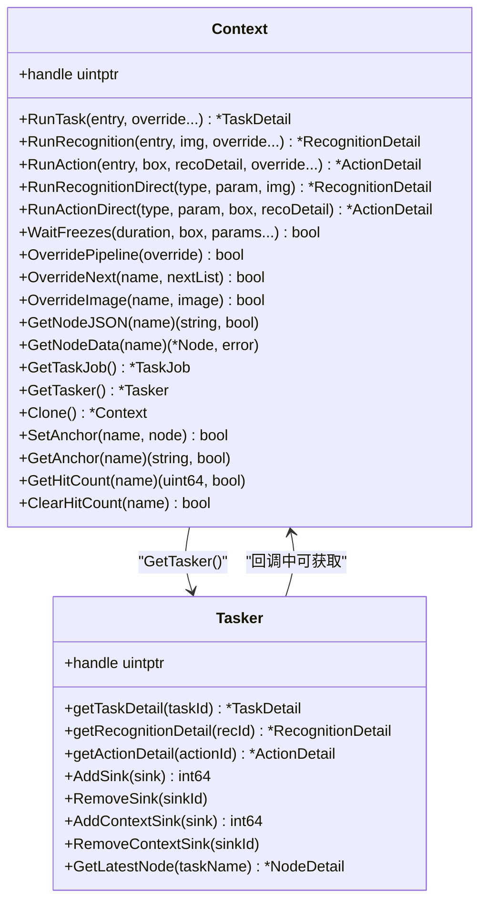
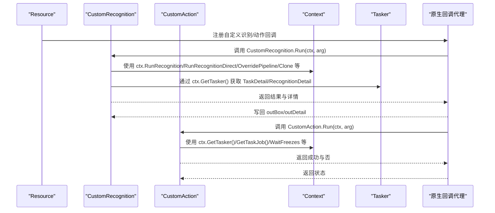
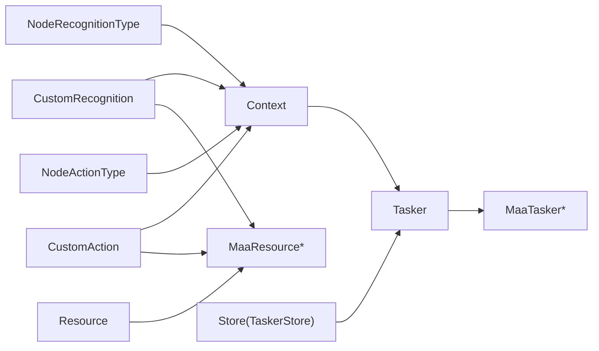

# 执行上下文（Context）

<cite>
**本文引用的文件列表**
- [context.go](file://context.go)
- [tasker.go](file://tasker.go)
- [custom_action.go](file://custom_action.go)
- [custom_recognition.go](file://custom_recognition.go)
- [job.go](file://job.go)
- [internal/native/framework.go](file://internal/native/framework.go)
- [internal/store/store.go](file://internal/store/store.go)
- [examples/custom-action/main.go](file://examples/custom-action/main.go)
- [examples/custom-recognition/main.go](file://examples/custom-recognition/main.go)
- [examples/quick-start/main.go](file://examples/quick-start/main.go)
- [pipeline.go](file://pipeline.go)
- [node_recognition.go](file://node_recognition.go)
- [node_action.go](file://node_action.go)
- [context_test.go](file://context_test.go)
</cite>

## 更新摘要
**变更内容**
- 新增 RunRecognitionDirect 和 RunActionDirect 方法，提供直接识别和直接动作执行能力
- 新增 WaitFreezes 方法，支持等待屏幕稳定检测
- 增强了 Context API 的灵活性，允许在无管道入口的情况下直接执行识别和动作
- 扩展了上下文管理能力，支持更精细的任务控制和状态同步

## 目录
1. [简介](#简介)
2. [项目结构](#项目结构)
3. [核心组件](#核心组件)
4. [架构总览](#架构总览)
5. [组件详解](#组件详解)
6. [依赖关系分析](#依赖关系分析)
7. [性能与并发特性](#性能与并发特性)
8. [故障排查指南](#故障排查指南)
9. [结论](#结论)
10. [附录：使用示例与最佳实践](#附录使用示例与最佳实践)

## 简介
本篇文档围绕"执行上下文（Context）"展开，系统阐述其在任务执行流程中的职责与角色，重点覆盖以下方面：
- Context如何在 RunTask、RunRecognition、RunAction、RunRecognitionDirect、RunActionDirect 和 WaitFreezes 等方法调用中传递执行状态、图像数据、识别结果与动作参数
- Context 与 Tasker 的关联机制，以及在自定义识别与自定义动作回调中的关键作用
- 如何在用户自定义逻辑中安全地访问与操作 Context 数据
- 生命周期管理、线程安全性与复杂任务流中的状态一致性保障机制

## 项目结构
围绕 Context 的相关模块主要分布在如下文件：
- 上下文与任务执行：context.go、tasker.go、job.go
- 原生桥接与导出函数：internal/native/framework.go
- 自定义识别与动作回调：custom_recognition.go、custom_action.go
- 存储与注册表：internal/store/store.go
- 示例工程：examples/custom-action、examples/custom-recognition、examples/quick-start
- 流程配置与节点参数：pipeline.go
- 节点类型定义：node_recognition.go、node_action.go
- 测试用例：context_test.go

**图表来源**
- [context.go](file://context.go#L1-L472)
- [tasker.go](file://tasker.go#L1-L433)
- [custom_recognition.go](file://custom_recognition.go#L1-L103)
- [custom_action.go](file://custom_action.go#L1-L92)
- [internal/native/framework.go](file://internal/native/framework.go#L215-L233)
- [node_recognition.go](file://node_recognition.go#L67-L81)
- [node_action.go](file://node_action.go#L88-L112)

**章节来源**
- [context.go](file://context.go#L1-L472)
- [tasker.go](file://tasker.go#L1-L433)
- [internal/native/framework.go](file://internal/native/framework.go#L215-L233)

## 核心组件
- **Context**：封装底层原生上下文句柄，提供 RunTask、RunRecognition、RunAction、RunRecognitionDirect、RunActionDirect、WaitFreezes 等方法，以及 OverridePipeline、OverrideNext、OverrideImage、GetNodeData、GetTasker、Clone、锚点与命中计数等能力
- **Tasker**：封装底层原生任务器句柄，负责任务提交、状态查询、细节获取、事件回调注册（含 Context 事件）
- **Job/TaskJob**：对异步任务进行状态跟踪与等待，提供 Wait 与 GetDetail 等方法
- **自定义识别/动作回调**：通过 Resource 注册名称到回调代理，回调代理将原生传入的指针转换为 Context、TaskDetail、RecognitionDetail 等结构，供用户实现的 Run 方法使用
- **节点类型系统**：NodeRecognitionType 和 NodeActionType 定义了可用的识别和动作类型，NodeRecognitionParam 和 NodeActionParam 定义了对应的参数接口

**章节来源**
- [context.go](file://context.go#L1-L472)
- [tasker.go](file://tasker.go#L1-L433)
- [job.go](file://job.go#L1-L96)
- [custom_recognition.go](file://custom_recognition.go#L1-L103)
- [custom_action.go](file://custom_action.go#L1-L92)
- [node_recognition.go](file://node_recognition.go#L67-L81)
- [node_action.go](file://node_action.go#L88-L112)

## 架构总览
Context 在框架中的位置是"运行时环境信息载体"，贯穿任务执行的三个阶段：
- 识别阶段：RunRecognition 将图像数据与识别参数传递给底层，返回 RecognitionDetail
- 动作阶段：RunAction 将目标框与识别详情传递给底层，返回 ActionDetail
- 任务阶段：RunTask 将入口与可选覆盖参数传递给底层，返回 TaskDetail
- **新增**：直接识别/动作阶段：RunRecognitionDirect 和 RunActionDirect 提供无需管道入口的直接执行能力
- **新增**：状态监控阶段：WaitFreezes 提供屏幕稳定检测功能

同时，Context 提供 Override 系列方法用于动态修改管道、下一跳与图像，支持在回调中克隆上下文以隔离影响。

**图表来源**
- [context.go](file://context.go#L75-L198)
- [context.go](file://context.go#L209-L279)
- [context.go](file://context.go#L418-L428)
- [tasker.go](file://tasker.go#L141-L238)
- [internal/native/framework.go](file://internal/native/framework.go#L215-L233)

## 组件详解

### Context 的职责与方法族
- **任务执行方法**
  - RunTask：提交任务入口与可选覆盖参数，返回 TaskDetail
  - RunRecognition：基于输入图像执行识别，返回 RecognitionDetail
  - RunAction：基于目标框与识别详情执行动作，返回 ActionDetail
  - **新增**：RunRecognitionDirect：直接基于识别类型和参数执行识别，无需管道入口
  - **新增**：RunActionDirect：直接基于动作类型和参数执行动作，无需管道入口
- **覆盖与注入**
  - OverridePipeline：覆盖当前管线配置
  - OverrideNext：覆盖下一跳列表
  - OverrideImage：注入指定图像名的图像
- **状态监控**
  - **新增**：WaitFreezes：等待屏幕稳定检测，支持超时和ROI参数
- **查询与定位**
  - GetNodeJSON/GetNodeData：按节点名获取节点 JSON 或解析后的 Node 结构
  - GetTaskJob：获取当前任务作业对象
  - GetTasker：获取绑定的 Tasker
  - GetAnchor/ClearHitCount/SetAnchor/GetHitCount：锚点与命中计数管理
- **克隆与派生**
  - Clone：克隆当前 Context，常用于在回调中隔离后续影响

这些方法均通过内部缓冲区（字符串、图像、矩形等）将 Go 层数据安全地传递给原生层，并从原生层读取结构化结果。

**章节来源**
- [context.go](file://context.go#L75-L472)
- [internal/native/framework.go](file://internal/native/framework.go#L215-L233)

### Context 与 Tasker 的关联机制
- Context.GetTasker 返回 Tasker 指针，其中包含底层句柄
- Tasker 提供 getTaskDetail、getRecognitionDetail、getActionDetail 等方法，用于查询任务、识别与动作的详细信息
- Tasker 还提供 AddSink/RemoveSink/AddContextSink/RemoveContextSink 等事件回调注册能力，Context 可在回调中通过 Tasker 获取 TaskDetail、RecognitionDetail 等

**图表来源**
- [context.go](file://context.go#L1-L472)
- [tasker.go](file://tasker.go#L1-L433)

**章节来源**
- [context.go](file://context.go#L407-L472)
- [tasker.go](file://tasker.go#L1-L433)

### 自定义识别与自定义动作回调中的 Context
- **自定义识别回调（CustomRecognition）**
  - 回调代理接收原生传入的 context、taskId、currentTaskName、customRecognitionName、customRecognitionParam、图像与 ROI 等
  - 代理将原生句柄包装为 Context，并通过 Tasker 获取 TaskDetail 与图像缓冲区，构造 CustomRecognitionArg 后调用用户实现的 Run
  - Run 返回 CustomRecognitionResult（包含 Box 与 Detail），代理写回原生输出缓冲区
- **自定义动作回调（CustomAction）**
  - 回调代理接收原生传入的 context、taskId、currentTaskName、customActionName、customActionParam、recoId、box 等
  - 代理将原生句柄包装为 Context，并通过 Tasker 获取 TaskDetail 与 RecognitionDetail，构造 CustomActionArg 后调用用户实现的 Run
  - Run 返回布尔值表示是否成功

**图表来源**
- [custom_recognition.go](file://custom_recognition.go#L1-L103)
- [custom_action.go](file://custom_action.go#L1-L92)
- [context.go](file://context.go#L1-L472)
- [tasker.go](file://tasker.go#L141-L238)

**章节来源**
- [custom_recognition.go](file://custom_recognition.go#L56-L103)
- [custom_action.go](file://custom_action.go#L50-L92)

### 在复杂任务流中的状态一致性与生命周期
- **Context.Clone**：在回调中创建独立上下文副本，避免对主流程产生副作用
- **OverridePipeline/OverrideNext/OverrideImage**：在回调中临时覆盖配置或下一跳，完成后不影响主流程
- **GetTaskJob/Wait**：通过 Job/TaskJob 对任务进行等待与状态查询，确保在多阶段任务中保持一致性
- **锚点与命中计数**：SetAnchor/GetAnchor/GetHitCount/ClearHitCount 支持跨节点的状态追踪与校验
- **新增**：**WaitFreezes**：通过 WaitFreezes 等待屏幕稳定，支持超时控制和ROI参数，确保状态一致性

**章节来源**
- [context.go](file://context.go#L418-L472)
- [job.go](file://job.go#L1-L96)

## 依赖关系分析
- Context 依赖 Tasker 获取 TaskDetail/RecognitionDetail/ActionDetail
- Tasker 依赖原生接口（MaaTasker*）完成任务细节查询与事件回调注册
- 自定义识别/动作回调通过 Resource 注册，回调代理在原生层触发后，再回到 Go 层调用用户实现
- Store 用于维护 Tasker/Resource/Controller 的回调映射，保证回调注销与清理
- **新增**：节点类型系统（NodeRecognitionType、NodeActionType）为直接执行方法提供类型安全

**图表来源**
- [tasker.go](file://tasker.go#L1-L433)
- [internal/native/framework.go](file://internal/native/framework.go#L340-L372)
- [internal/store/store.go](file://internal/store/store.go#L1-L65)
- [node_recognition.go](file://node_recognition.go#L67-L81)
- [node_action.go](file://node_action.go#L88-L112)

**章节来源**
- [tasker.go](file://tasker.go#L1-L433)
- [internal/store/store.go](file://internal/store/store.go#L1-L65)

## 性能与并发特性
- **缓冲区复用**：Context 在调用 Run* 时使用内部缓冲区（图像、矩形、字符串、字符串列表）进行数据传递，调用结束后及时销毁，降低内存碎片与 GC 压力
- **异步等待**：Job/TaskJob 提供 Wait 与状态查询，避免阻塞主线程；在回调中应尽量减少长时间阻塞
- **并发安全**：TaskerStore 使用读写锁保护回调映射，避免竞态；Context 本身不保存共享可变状态，主要通过原生句柄与 Tasker 协作，避免直接共享可变字段
- **线程模型**：回调代理在原生层触发，Go 层回调函数可能在不同 goroutine 中被调用，用户实现 Run 方法时需自行保证线程安全（如加锁或只读访问）
- **新增**：**WaitFreezes** 采用非阻塞等待机制，支持超时控制，避免长时间阻塞

**章节来源**
- [context.go](file://context.go#L60-L472)
- [tasker.go](file://tasker.go#L1-L433)
- [internal/store/store.go](file://internal/store/store.go#L1-L65)

## 故障排查指南
- **识别/动作未返回结果**
  - 检查 Context.RunRecognition/RunAction/RunRecognitionDirect/RunActionDirect 的参数是否正确
  - 确认 Tasker 已绑定 Resource 与 Controller，且初始化成功
- **回调未触发**
  - 确认 Resource 已注册对应名称的自定义识别/动作
  - 检查 Tasker 是否添加了 Context 事件 Sink（若需要）
- **状态不一致或副作用**
  - 使用 Context.Clone 创建副本，在副本上进行覆盖与测试
  - 使用 OverrideNext/OverridePipeline 仅在必要范围内生效
- **锚点与命中计数异常**
  - 使用 GetHitCount/ClearHitCount 验证节点命中情况
  - 使用 SetAnchor/GetAnchor 定位锚点
- **新增**：**WaitFreezes 问题**
  - 检查超时参数是否合理设置
  - 确认 ROI 参数是否正确
  - 验证图像缓冲区是否有效

**章节来源**
- [context.go](file://context.go#L418-L472)
- [tasker.go](file://tasker.go#L357-L433)

## 结论
Context 是 MAA Go 框架中运行时环境的核心载体，贯穿任务执行的识别、动作与任务三个阶段。它通过与 Tasker 的紧密协作，结合原生接口与缓冲区机制，为用户提供统一、可扩展的上下文访问能力。在自定义识别与动作回调中，Context 不仅承载执行状态与数据，还提供覆盖与克隆等工具，帮助用户在复杂任务流中实现安全、可控的状态管理与一致性保障。

**新增功能增强了 Context 的灵活性**：RunRecognitionDirect 和 RunActionDirect 允许在无管道入口的情况下直接执行识别和动作，WaitFreezes 提供了强大的状态监控能力，使开发者能够构建更加精确和可靠的自动化流程。

## 附录：使用示例与最佳实践

### 在自定义识别中安全使用 Context
- 使用 ctx.RunRecognition 在回调内发起一次新的识别，传入图像与覆盖参数
- 使用 ctx.RunRecognitionDirect 直接执行特定类型的识别，无需管道入口
- 使用 ctx.OverridePipeline 临时调整识别区域或算法参数
- 使用 ctx.Clone 创建副本，对副本进行覆盖后再执行任务，避免污染主流程
- 通过 ctx.GetTasker().GetController() 发起设备控制操作（如点击），并在完成后等待

**参考路径**
- [examples/custom-recognition/main.go](file://examples/custom-recognition/main.go#L73-L106)
- [custom_recognition.go](file://custom_recognition.go#L56-L103)
- [context.go](file://context.go#L75-L198)

### 在自定义动作中安全使用 Context
- 通过 ctx.GetTasker() 获取 TaskDetail 与 RecognitionDetail，结合 Box 与识别结果决定动作策略
- 使用 ctx.RunActionDirect 直接执行特定类型的动作，无需管道入口
- 使用 ctx.OverrideNext 切换下一跳任务列表，实现动态流程控制
- 使用 ctx.Clone 与 ctx.OverridePipeline 在副本上下文中验证行为后再应用到主流程
- 使用 ctx.WaitFreezes 等待屏幕稳定，确保动作执行的时机准确性

**参考路径**
- [examples/custom-action/main.go](file://examples/custom-action/main.go#L73-L75)
- [custom_action.go](file://custom_action.go#L50-L92)
- [context.go](file://context.go#L186-L279)

### 在快速开始示例中理解 Context 与 Tasker 的配合
- 初始化 Tasker、绑定 Resource 与 Controller
- 通过 tasker.PostTask 提交任务并 Wait 获取 TaskDetail
- 在回调中使用 Context 与 Tasker 的组合能力进行扩展

**参考路径**
- [examples/quick-start/main.go](file://examples/quick-start/main.go#L10-L41)
- [tasker.go](file://tasker.go#L85-L120)

### 在流程配置中使用自定义识别与动作
- NodeCustomRecognitionParam 与 NodeCustomActionParam 定义了自定义识别与动作的参数结构
- 通过 RecCustom/ActCustom 构建节点，设置 ROI、自定义参数等

**参考路径**
- [pipeline.go](file://pipeline.go#L1150-L1202)
- [pipeline.go](file://pipeline.go#L1984-L2034)

### 使用新增的直接执行方法
- **RunRecognitionDirect 示例**：直接执行 OCR 识别，无需管道入口
- **RunActionDirect 示例**：直接执行点击动作，支持识别详情参数
- **WaitFreezes 示例**：等待屏幕稳定，支持超时和 ROI 参数

**参考路径**
- [context_test.go](file://context_test.go#L1385-L1391)
- [context_test.go](file://context_test.go#L1429-L1432)
- [context_test.go](file://context_test.go#L1393-L1418)
- [context_test.go](file://context_test.go#L1435-L1460)

### 节点类型系统的使用
- **识别类型**：DirectHit、TemplateMatch、FeatureMatch、ColorMatch、OCR、NeuralNetworkClassify、NeuralNetworkDetect、And、Or、Custom
- **动作类型**：DoNothing、Click、LongPress、Swipe、MultiSwipe、TouchDown、TouchMove、TouchUp、ClickKey、LongPressKey、KeyDown、KeyUp、InputText、StartApp、StopApp、StopTask、Scroll、Command、Shell、Custom

**参考路径**
- [node_recognition.go](file://node_recognition.go#L67-L81)
- [node_action.go](file://node_action.go#L88-L112)