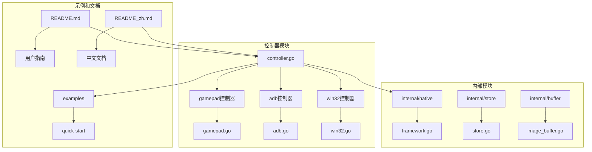
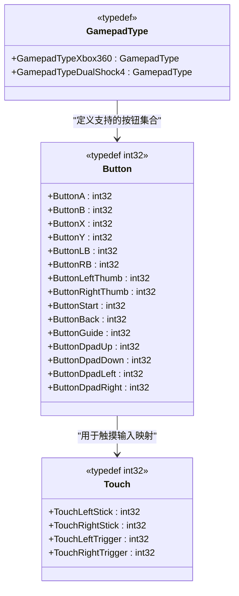
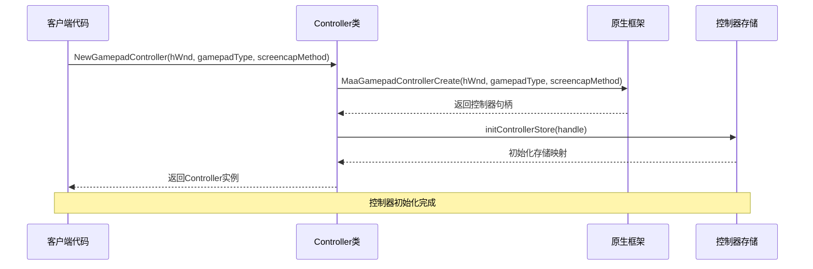
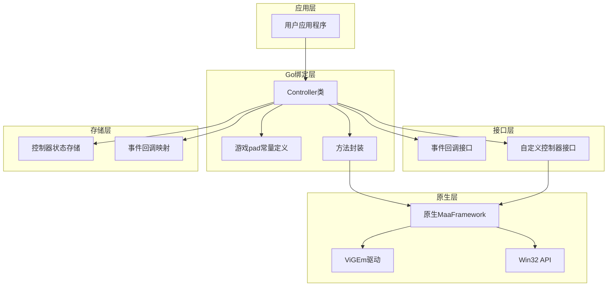
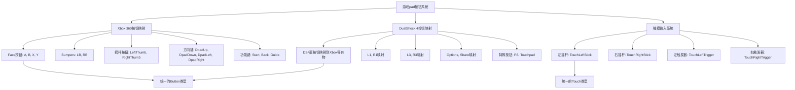
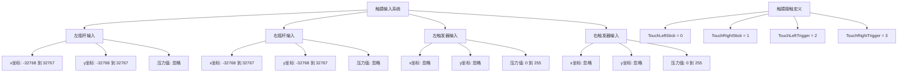
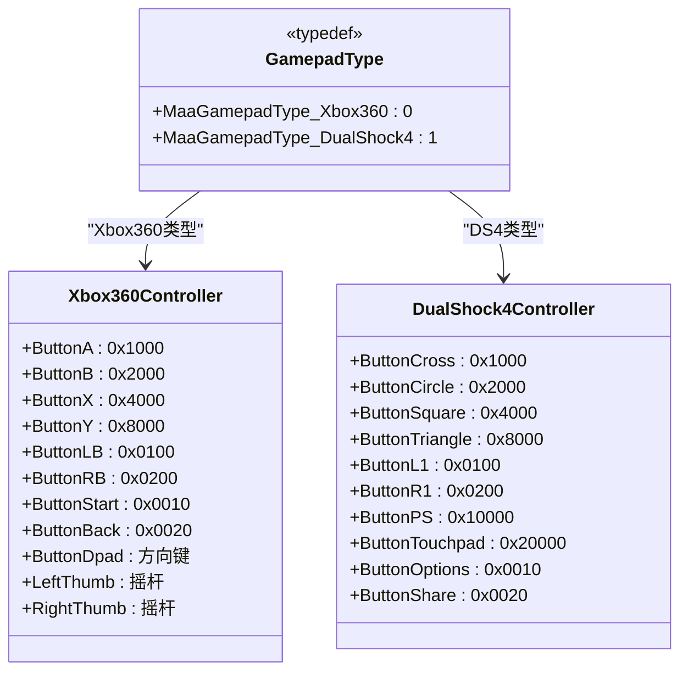
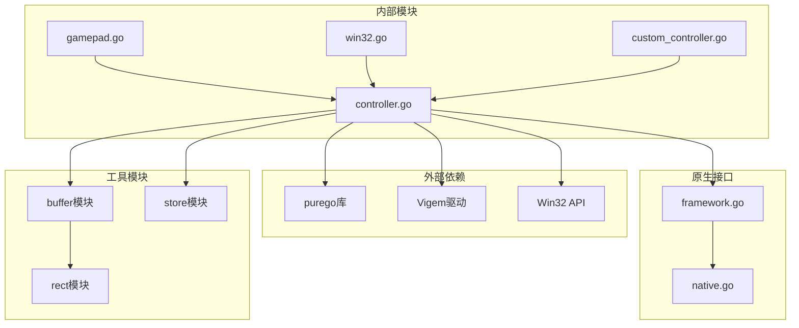

# 游戏pad控制器

<cite>
**本文档引用的文件**
- [controller.go](file://controller.go)
- [gamepad.go](file://controller/gamepad/gamepad.go)
- [win32.go](file://controller/win32/win32.go)
- [adb.go](file://controller/adb/adb.go)
- [framework.go](file://internal/native/framework.go)
- [README.md](file://README.md)
- [README_zh.md](file://README_zh.md)
- [custom_controller.go](file://custom_controller.go)
- [controller_test.go](file://controller_test.go)
</cite>

## 目录
1. [简介](#简介)
2. [项目结构](#项目结构)
3. [核心组件](#核心组件)
4. [架构概览](#架构概览)
5. [详细组件分析](#详细组件分析)
6. [依赖关系分析](#依赖关系分析)
7. [性能考虑](#性能考虑)
8. [故障排除指南](#故障排除指南)
9. [结论](#结论)

## 简介

游戏pad控制器是MaaFramework Go绑定中的一个重要组件，它提供了虚拟游戏pad控制器的功能，允许开发者在Windows平台上创建和控制虚拟的游戏手柄设备。该控制器支持多种游戏pad类型，包括Xbox 360和DualShock 4，并且集成了屏幕截图功能。

主要特性包括：
- 支持Xbox 360和DualShock 4两种游戏pad类型
- 提供完整的按钮映射和触摸输入支持
- 集成Win32屏幕截图功能
- 异步操作支持（通过Job模式）
- 事件回调机制

## 项目结构

该项目采用模块化设计，游戏pad控制器位于controller子目录下：

**图表来源**
- [controller.go](file://controller.go#L1-L50)
- [gamepad.go](file://controller/gamepad/gamepad.go#L1-L20)
- [win32.go](file://controller/win32/win32.go#L1-L20)
- [adb.go](file://controller/adb/adb.go#L1-L20)

**章节来源**
- [controller.go](file://controller.go#L1-L50)
- [README.md](file://README.md#L36-L49)
- [README_zh.md](file://README_zh.md#L36-L49)

## 核心组件

### 游戏pad控制器类型定义

游戏pad控制器的核心类型定义包括按钮常量和触摸常量：

**图表来源**
- [gamepad.go](file://controller/gamepad/gamepad.go#L7-L26)
- [gamepad.go](file://controller/gamepad/gamepad.go#L52-L63)
- [controller.go](file://controller.go#L121-L128)

### 游戏pad控制器创建流程

**图表来源**
- [controller.go](file://controller.go#L138-L153)
- [framework.go](file://internal/native/framework.go#L416-L416)

**章节来源**
- [gamepad.go](file://controller/gamepad/gamepad.go#L1-L64)
- [controller.go](file://controller.go#L121-L153)
- [framework.go](file://internal/native/framework.go#L162-L167)

## 架构概览

游戏pad控制器采用分层架构设计，结合了Go语言的类型安全性和原生C库的高性能特性：

**图表来源**
- [controller.go](file://controller.go#L24-L26)
- [custom_controller.go](file://custom_controller.go#L42-L65)
- [framework.go](file://internal/native/framework.go#L169-L175)

## 详细组件分析

### 游戏pad按钮映射系统

游戏pad控制器实现了完整的按钮映射系统，支持Xbox 360和DualShock 4两种标准：

**图表来源**
- [gamepad.go](file://controller/gamepad/gamepad.go#L9-L26)
- [gamepad.go](file://controller/gamepad/gamepad.go#L28-L46)
- [gamepad.go](file://controller/gamepad/gamepad.go#L48-L63)

#### Xbox 360按钮映射详解

Xbox 360控制器的按钮使用特定的位标志来表示：

| 按钮名称 | 十六进制值 | 十进制值 | 用途 |
|---------|-----------|---------|------|
| ButtonA | 0x1000 | 4096 | 确认/跳跃 |
| ButtonB | 0x2000 | 8192 | 取消/退出 |
| ButtonX | 0x4000 | 16384 | 调试/技能 |
| ButtonY | 0x8000 | 32768 | 特殊功能 |
| ButtonLB | 0x0100 | 256 | 跑步/瞄准 |
| ButtonRB | 0x0200 | 512 | 跑步/瞄准 |
| ButtonLeftThumb | 0x0040 | 64 | 左摇杆点击 |
| ButtonRightThumb | 0x0080 | 128 | 右摇杆点击 |
| ButtonStart | 0x0010 | 16 | 开始/暂停 |
| ButtonBack | 0x0020 | 32 | 返回/菜单 |
| ButtonGuide | 0x0400 | 1024 | Xbox指南按钮 |
| ButtonDpadUp | 0x0001 | 1 | 方向键上 |
| ButtonDpadDown | 0x0002 | 2 | 方向键下 |
| ButtonDpadLeft | 0x0004 | 4 | 方向键左 |
| ButtonDpadRight | 0x0008 | 8 | 方向键右 |

#### DualShock 4按钮映射

DS4控制器的按钮映射到Xbox等价物：

| DS4按钮 | 映射到Xbox | 用途 |
|--------|-----------|------|
| ButtonCross | ButtonA | 确认/攻击 |
| ButtonCircle | ButtonB | 取消/防御 |
| ButtonSquare | ButtonX | 调试/技能 |
| ButtonTriangle | ButtonY | 特殊功能 |
| ButtonL1 | ButtonLB | 跑步/瞄准 |
| ButtonR1 | ButtonRB | 跑步/瞄准 |
| ButtonL3 | ButtonLeftThumb | 左摇杆点击 |
| ButtonR3 | ButtonRightThumb | 右摇杆点击 |
| ButtonOptions | ButtonStart | 开始/设置 |
| ButtonShare | ButtonBack | 返回/菜单 |
| ButtonPS | ButtonPS | PlayStation徽标 |
| ButtonTouchpad | ButtonTouchpad | 触摸板 |

**章节来源**
- [gamepad.go](file://controller/gamepad/gamepad.go#L9-L46)

### 触摸输入系统

游戏pad控制器的触摸系统被重新设计为模拟输入：

**图表来源**
- [gamepad.go](file://controller/gamepad/gamepad.go#L48-L63)

**章节来源**
- [gamepad.go](file://controller/gamepad/gamepad.go#L48-L63)

### 游戏pad类型系统

控制器支持两种主要的游戏pad类型：

**图表来源**
- [controller.go](file://controller.go#L121-L128)
- [framework.go](file://internal/native/framework.go#L162-L167)

**章节来源**
- [controller.go](file://controller.go#L121-L128)
- [framework.go](file://internal/native/framework.go#L162-L167)

## 依赖关系分析

游戏pad控制器的依赖关系展示了其在整个系统中的位置和作用：

**图表来源**
- [controller.go](file://controller.go#L3-L13)
- [framework.go](file://internal/native/framework.go#L169-L175)

### 关键依赖说明

1. **purego库**: 用于Go与原生C库的交互
2. **ViGEm驱动**: 虚拟游戏pad设备驱动程序
3. **Win32 API**: Windows平台的系统API调用
4. **缓冲区管理**: 图像和字符串数据的内存管理
5. **状态存储**: 控制器实例的状态持久化

**章节来源**
- [controller.go](file://controller.go#L3-L13)
- [README.md](file://README.md#L38-L38)

## 性能考虑

游戏pad控制器在设计时考虑了多个性能优化方面：

### 内存管理优化
- 使用原子操作管理自定义控制器回调ID
- 通过缓冲区池减少内存分配开销
- 智能的资源清理机制避免内存泄漏

### 异步操作优化
- 所有控制器操作都支持异步执行
- Job模式提供非阻塞的操作接口
- 事件回调机制实现高效的响应式编程

### 系统集成优化
- 直接调用原生Win32 API减少中间层开销
- ViGEm驱动的高效虚拟设备实现
- 最小化的数据转换和格式适配

## 故障排除指南

### 常见问题及解决方案

#### ViGEm驱动问题
**问题**: 创建游戏pad控制器时失败
**原因**: ViGEm Bus Driver未正确安装
**解决方案**: 
1. 下载并安装最新版本的ViGEm驱动
2. 重启系统确保驱动正确加载
3. 验证驱动状态：设备管理器中查看ViGEm设备

#### 屏幕截图功能异常
**问题**: 游戏pad控制器无法进行屏幕截图
**原因**: 窗口句柄无效或Win32屏幕捕获方法不兼容
**解决方案**:
1. 确保传入有效的窗口句柄
2. 尝试不同的Win32屏幕捕获方法
3. 检查应用程序权限和UAC设置

#### 按钮映射错误
**问题**: DS4按钮映射不符合预期
**原因**: 按钮映射到Xbox等价物的限制
**解决方案**:
1. 使用ButtonCross/ButtonCircle等别名访问DS4按钮
2. 对于特殊按钮(PS、Touchpad)，使用专用常量
3. 检查目标应用程序对不同按钮类型的处理

**章节来源**
- [controller.go](file://controller.go#L136-L137)
- [controller_test.go](file://controller_test.go#L102-L109)

## 结论

游戏pad控制器作为MaaFramework Go绑定的重要组成部分，提供了完整而灵活的虚拟游戏pad解决方案。其设计特点包括：

1. **标准化接口**: 统一的按钮和触摸输入接口，简化了多平台支持
2. **类型安全**: 使用Go的强类型系统确保编译时错误检查
3. **高性能**: 直接调用原生库和驱动程序，最小化性能开销
4. **扩展性**: 支持自定义控制器接口，便于集成特殊需求
5. **易用性**: 提供简洁的API和丰富的示例代码

该控制器特别适用于需要精确游戏pad输入的自动化场景，如游戏测试、机器人控制和多媒体应用测试等。通过合理配置和使用，可以实现稳定可靠的游戏pad自动化功能。