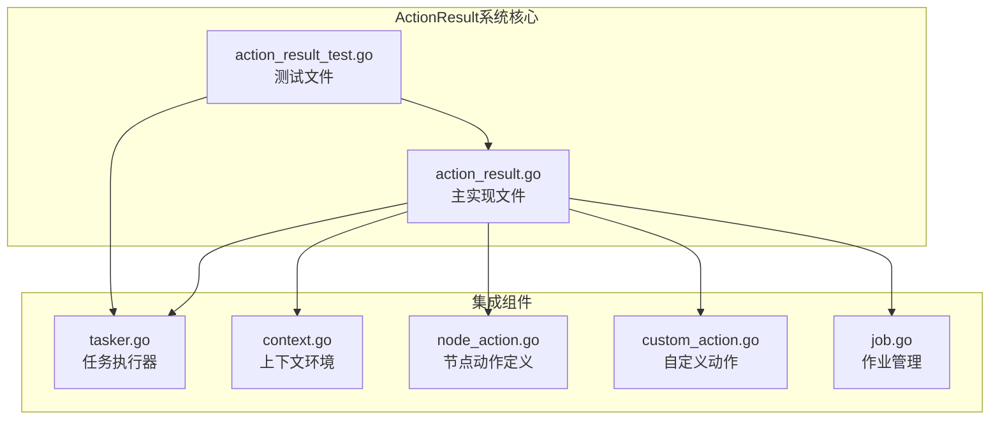
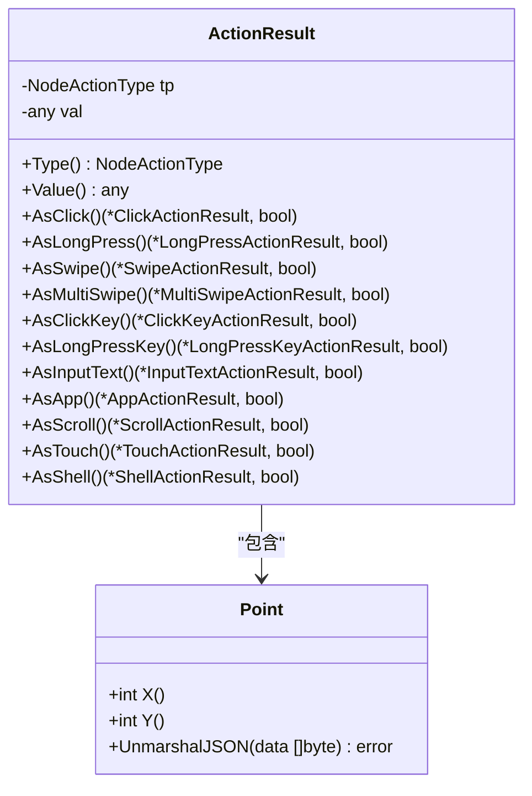
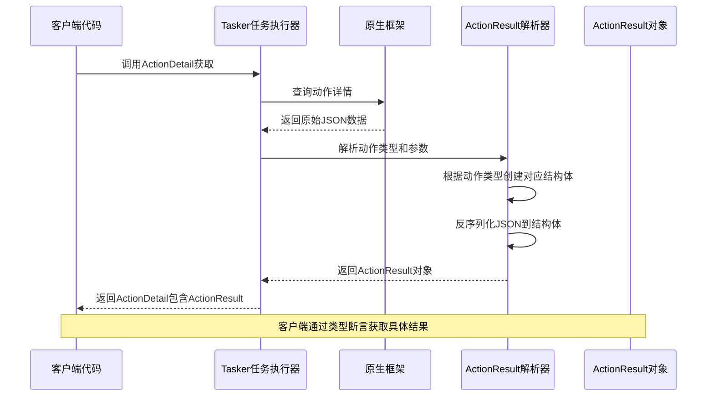
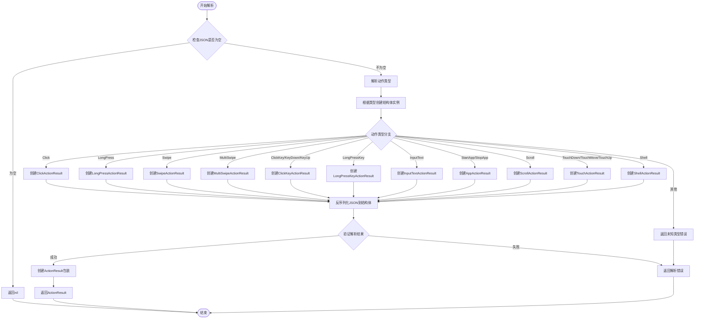
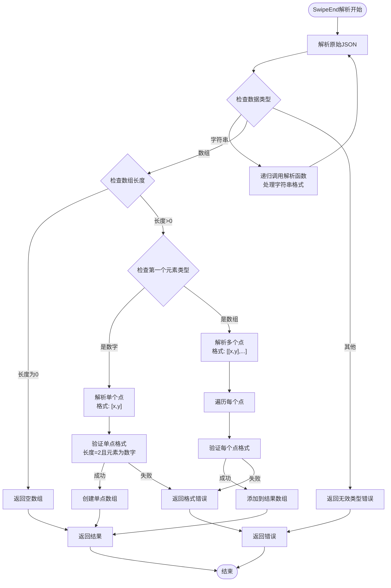
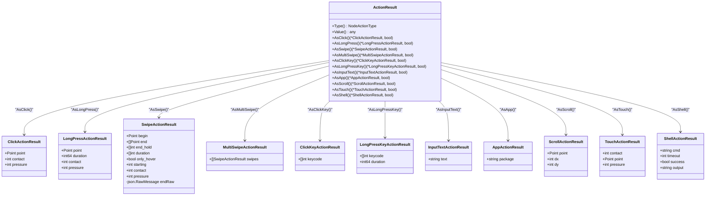
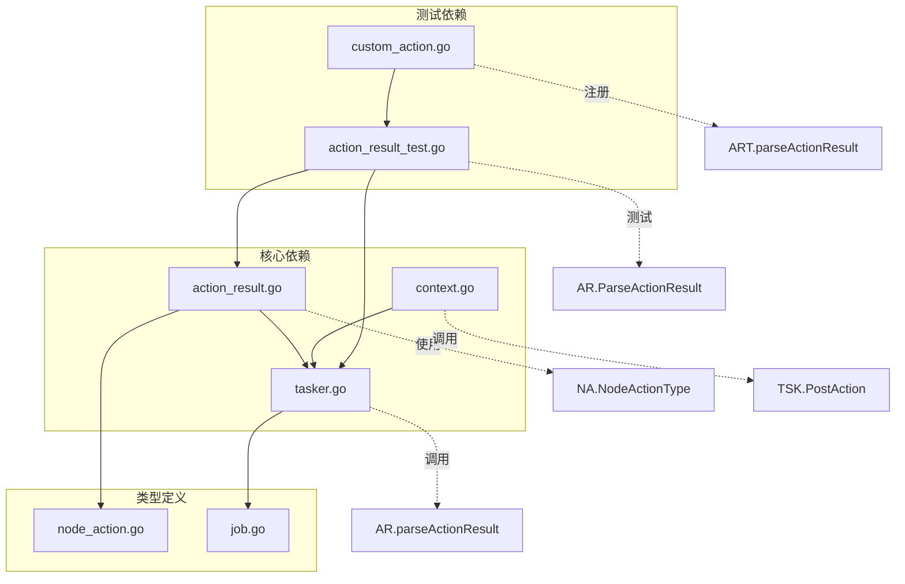

# ActionResult结果系统

<cite>
**本文档引用的文件**
- [action_result.go](file://action_result.go)
- [action_result_test.go](file://action_result_test.go)
- [tasker.go](file://tasker.go)
- [context.go](file://context.go)
- [node_action.go](file://node_action.go)
- [custom_action.go](file://custom_action.go)
- [job.go](file://job.go)
</cite>

## 目录
1. [简介](#简介)
2. [项目结构](#项目结构)
3. [核心组件](#核心组件)
4. [架构概览](#架构概览)
5. [详细组件分析](#详细组件分析)
6. [依赖关系分析](#依赖关系分析)
7. [性能考虑](#性能考虑)
8. [故障排除指南](#故障排除指南)
9. [结论](#结论)

## 简介

ActionResult结果系统是MAA框架中用于处理和解析动作执行结果的核心组件。该系统负责将底层框架返回的原始JSON数据转换为类型安全、易于使用的Go结构体，支持多种不同类型的动作结果，包括点击、长按、滑动、按键输入等。

该系统采用类型安全的设计模式，通过工厂方法和类型断言确保在编译时就能发现类型不匹配的问题，同时提供了灵活的结果访问接口，使得开发者可以轻松地根据具体动作类型获取相应的结果信息。

## 项目结构

ActionResult系统主要分布在以下文件中：



**图表来源**
- [action_result.go](file://action_result.go#L1-L375)
- [tasker.go](file://tasker.go#L309-L359)
- [context.go](file://context.go#L132-L198)

**章节来源**
- [action_result.go](file://action_result.go#L1-L375)
- [tasker.go](file://tasker.go#L1-L678)

## 核心组件

### ActionResult结构体

ActionResult是结果系统的核心容器，它封装了动作类型和对应的详细结果：



**图表来源**
- [action_result.go](file://action_result.go#L48-L150)

### 动作结果类型

系统支持以下九种主要的动作结果类型：

| 动作类型 | 结果结构体 | 主要用途 |
|---------|-----------|----------|
| Click | ClickActionResult | 点击操作结果 |
| LongPress | LongPressActionResult | 长按操作结果 |
| Swipe | SwipeActionResult | 滑动操作结果 |
| MultiSwipe | MultiSwipeActionResult | 多指滑动操作结果 |
| ClickKey/KeyDown/KeyUp | ClickKeyActionResult | 键盘按键操作结果 |
| LongPressKey | LongPressKeyActionResult | 长按键盘按键结果 |
| InputText | InputTextActionResult | 文本输入结果 |
| StartApp/StopApp | AppActionResult | 应用启动/停止结果 |
| Scroll | ScrollActionResult | 滚动操作结果 |
| TouchDown/TouchMove/TouchUp | TouchActionResult | 触摸操作结果 |
| Shell | ShellActionResult | Shell命令执行结果 |

**章节来源**
- [action_result.go](file://action_result.go#L152-L330)

## 架构概览

ActionResult系统在整个MAA框架中的位置如下：



**图表来源**
- [tasker.go](file://tasker.go#L320-L359)
- [action_result.go](file://action_result.go#L332-L374)

## 详细组件分析

### Point类型设计

Point类型是所有坐标相关结果的基础类型，具有以下特点：

```mermaid
flowchart TD
Start([Point反序列化开始]) --> ParseData["解析JSON数据"]
ParseData --> DataType{"数据类型判断"}
DataType --> |字符串| ParseString["解析字符串格式<br/>如: \"[1,2]\""]
DataType --> |数组| ParseArray["解析数组格式<br/>如: [1,2]"]
DataType --> |其他| Error["返回错误"]
ParseString --> ValidateLen1{"长度验证<br/>必须为2"}
ValidateLen1 --> |失败| Error
ValidateLen1 --> |成功| Convert1["转换为整数坐标"]
ParseArray --> ValidateLen2{"长度验证<br/>必须为2"}
ValidateLen2 --> |失败| Error
ValidateLen2 --> |成功| ValidateTypes["验证元素类型<br/>必须为数字"]
ValidateTypes --> |失败| Error
ValidateTypes --> |成功| Convert2["转换为整数坐标"]
Convert1 --> SetPoint["设置Point值"]
Convert2 --> SetPoint
Error --> End([结束])
SetPoint --> End
```

**图表来源**
- [action_result.go](file://action_result.go#L14-L46)

**章节来源**
- [action_result.go](file://action_result.go#L8-L46)

### ActionResult解析流程

解析器根据动作类型动态创建相应结果结构体：



**图表来源**
- [action_result.go](file://action_result.go#L332-L374)

**章节来源**
- [action_result.go](file://action_result.go#L332-L374)

### SwipeActionResult特殊处理

SwipeActionResult需要特殊的JSON处理逻辑，因为它支持多种end参数格式：



**图表来源**
- [action_result.go](file://action_result.go#L239-L289)

**章节来源**
- [action_result.go](file://action_result.go#L192-L237)
- [action_result.go](file://action_result.go#L239-L289)

### 类型安全访问模式

ActionResult提供了类型安全的访问接口：



**图表来源**
- [action_result.go](file://action_result.go#L48-L330)

**章节来源**
- [action_result.go](file://action_result.go#L48-L150)

## 依赖关系分析

ActionResult系统与其他组件的依赖关系如下：



**图表来源**
- [action_result.go](file://action_result.go#L1-L375)
- [tasker.go](file://tasker.go#L133-L154)
- [context.go](file://context.go#L247-L279)

**章节来源**
- [tasker.go](file://tasker.go#L320-L359)
- [context.go](file://context.go#L132-L198)

## 性能考虑

ActionResult系统在设计时考虑了以下性能优化：

1. **延迟解析策略**：只在需要时解析特定类型的结果，避免不必要的计算开销
2. **内存复用**：使用缓冲区和重用机制减少内存分配
3. **类型安全**：通过编译时类型检查避免运行时类型转换开销
4. **JSON处理优化**：针对不同动作类型的JSON格式进行专门优化

## 故障排除指南

### 常见问题及解决方案

1. **解析错误**
   - 症状：`invalid point length: X`
   - 原因：坐标点格式不正确
   - 解决：确保坐标点包含恰好两个整数元素

2. **类型不匹配**
   - 症状：类型断言失败或返回false
   - 原因：动作类型与期望类型不符
   - 解决：使用正确的AsXxx方法或检查动作类型

3. **JSON格式错误**
   - 症状：`invalid swipe end json type: X`
   - 原因：滑动结束点JSON格式不符合要求
   - 解决：确保end参数符合支持的格式之一

4. **未知动作类型**
   - 症状：`unknown action result type: X`
   - 原因：动作类型不在支持列表中
   - 解决：检查动作类型拼写或更新框架版本

**章节来源**
- [action_result.go](file://action_result.go#L14-L46)
- [action_result.go](file://action_result.go#L239-L289)

## 结论

ActionResult结果系统为MAA框架提供了一个类型安全、功能完整的结果处理机制。通过精心设计的类型系统和解析逻辑，该系统能够：

1. **保证类型安全**：编译时检查确保类型匹配
2. **提供灵活性**：支持多种动作类型和复杂的JSON格式
3. **保持性能**：优化的解析算法和内存管理
4. **易于扩展**：清晰的接口设计便于添加新的动作类型

该系统是MAA框架自动化控制能力的重要组成部分，为开发者提供了可靠的结果访问接口，使得复杂的动作执行结果能够以直观、易用的方式呈现给上层应用。