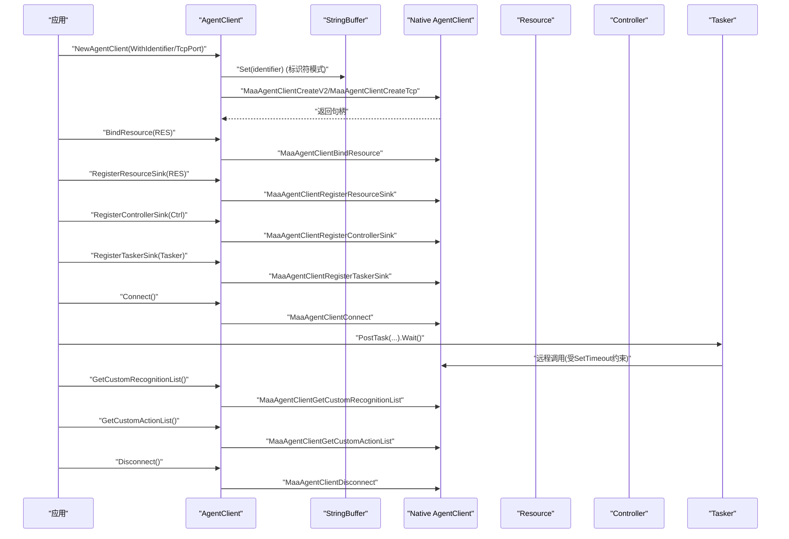
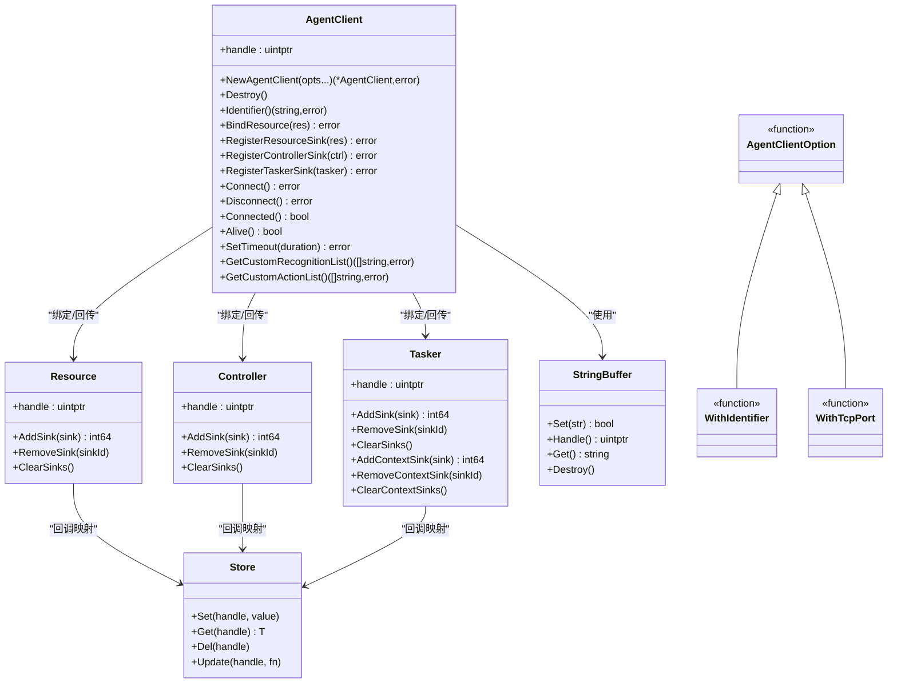

# Agent客户端

<cite>
**本文引用的文件**
- [agent_client.go](file://agent_client.go)
- [internal/native/agent_client.go](file://internal/native/agent_client.go)
- [examples/agent-client/main.go](file://examples/agent-client/main.go)
- [resource.go](file://resource.go)
- [controller.go](file://controller.go)
- [tasker.go](file://tasker.go)
- [internal/buffer/string_buffer.go](file://internal/buffer/string_buffer.go)
- [internal/store/store.go](file://internal/store/store.go)
</cite>

## 更新摘要
**变更内容**
- 新增AgentClient的完全重设计，引入新的options模式
- 改进错误处理机制，增加详细的错误类型和错误信息
- 新增自定义识别和动作列表获取功能
- 增强句柄验证和操作安全性
- 更新API文档以反映新的创建和配置方式

## 目录
1. [简介](#简介)
2. [项目结构](#项目结构)
3. [核心组件](#核心组件)
4. [架构总览](#架构总览)
5. [详细组件分析](#详细组件分析)
6. [依赖关系分析](#依赖关系分析)
7. [性能考量](#性能考量)
8. [故障排查指南](#故障排查指南)
9. [结论](#结论)
10. [附录](#附录)

## 简介
本文件系统性讲解 Agent 客户端的连接管理与资源集成机制，围绕全新的AgentClient创建流程、options模式配置、增强的错误处理机制展开；重点阐述 Connect 与 Disconnect 的连接建立与断开逻辑，Connected 与 Alive 在连接状态检测上的差异与适用场景；详解 SetTimeout 如何设置与 Agent 服务器通信的超时阈值并影响后续所有远程调用；深入分析 BindResource、RegisterResourceSink、RegisterControllerSink、RegisterTaskerSink 四个关键方法，解释它们如何将本地 Resource、Controller 和 Tasker 实例与远程服务器进行绑定并启用事件回传；新增的GetCustomRecognitionList和GetCustomActionList方法提供自定义识别和动作的查询能力；最后结合 examples/agent-client/main.go 演示完整的客户端集成流程，并给出连接超时、资源绑定失败等常见问题的成因与解决方案，以及性能调优建议。

## 项目结构
Agent 客户端位于 Go 层的 maa 包中，通过 internal/native 层动态加载底层库函数，完成与 Agent 服务端的交互。资源、控制器与任务器分别由各自模块提供，Agent 客户端负责将这些本地对象与远端服务建立联系并启用事件回传。新的options模式提供了更灵活的客户端创建方式。

```mermaid
graph TB
subgraph "Go层"
AC["AgentClient<br/>agent_client.go"]
RES["Resource<br/>resource.go"]
CTRL["Controller<br/>controller.go"]
TSK["Tasker<br/>tasker.go"]
SB["StringBuffer<br/>internal/buffer/string_buffer.go"]
STORE["Store<br/>internal/store/store.go"]
END
subgraph "Native层"
NAC["AgentClient接口注册<br/>internal/native/agent_client.go"]
END
AC --> NAC
AC --> SB
AC -. 绑定/回传 .-> RES
AC -. 绑定/回传 .-> CTRL
AC -. 绑定/回传 .-> TSK
RES --> STORE
CTRL --> STORE
TSK --> STORE
```

**图表来源**
- [agent_client.go](file://agent_client.go#L1-L268)
- [internal/native/agent_client.go](file://internal/native/agent_client.go#L1-L85)
- [resource.go](file://resource.go#L1-L665)
- [controller.go](file://controller.go#L1-L512)
- [tasker.go](file://tasker.go#L1-L678)
- [internal/buffer/string_buffer.go](file://internal/buffer/string_buffer.go#L1-L58)
- [internal/store/store.go](file://internal/store/store.go#L1-L65)

**章节来源**
- [agent_client.go](file://agent_client.go#L1-L268)
- [internal/native/agent_client.go](file://internal/native/agent_client.go#L1-L85)

## 核心组件
- **AgentClient**：封装底层句柄，提供连接管理与资源绑定能力，支持options模式创建。
- **Resource/Controller/Tasker**：本地业务对象，通过 AgentClient 与远端服务交互并启用事件回传。
- **StringBuffer**：字符串缓冲区，用于跨语言传递标识符等字符串参数。
- **Store**：全局存储，维护各对象的回调映射，确保事件回传正确路由。
- **AgentClientOption**：选项函数类型，支持WithIdentifier和WithTcpPort两种创建模式。

**章节来源**
- [agent_client.go](file://agent_client.go#L1-L268)
- [resource.go](file://resource.go#L1-L665)
- [controller.go](file://controller.go#L1-L512)
- [tasker.go](file://tasker.go#L1-L678)
- [internal/buffer/string_buffer.go](file://internal/buffer/string_buffer.go#L1-L58)
- [internal/store/store.go](file://internal/store/store.go#L1-L65)

## 架构总览
Agent 客户端通过新的options模式创建实例，支持标识符模式和TCP模式两种创建方式。内部使用 StringBuffer 将标识符传入底层库，获得非零句柄后封装为 Go 对象。随后可通过 BindResource/BindController/BindTasker 将本地对象与远端服务绑定，再通过 Register*Sink 启用事件回传。连接生命周期由 Connect/Disconnect 管理，Connected/Alive 提供不同粒度的状态检测。SetTimeout 设置整体通信超时阈值，影响后续所有远程调用。新增的GetCustomRecognitionList和GetCustomActionList方法提供自定义识别和动作的查询能力。



**图表来源**
- [agent_client.go](file://agent_client.go#L70-L98)
- [internal/native/agent_client.go](file://internal/native/agent_client.go#L64-L79)
- [internal/buffer/string_buffer.go](file://internal/buffer/string_buffer.go#L1-L58)
- [resource.go](file://resource.go#L1-L665)
- [controller.go](file://controller.go#L1-L512)
- [tasker.go](file://tasker.go#L1-L678)

## 详细组件分析

### 新的options模式创建流程与优先级规则
- **创建模式选择**：
  - 标识符模式：通过WithIdentifier创建，使用IPC连接，自动降级到TCP模式（Windows版本<17063）。
  - TCP模式：通过WithTcpPort创建，直接连接指定端口。
- **优先级规则**：
  - 如果同时指定两个选项，最后设置的选项决定创建模式。
  - WithIdentifier优先级：若在WithTcpPort之后设置则生效；若在之前设置则被覆盖。
  - WithTcpPort优先级：若在WithIdentifier之后设置则生效；若在之前设置则被覆盖。
- **默认行为**：如果没有提供任何选项，默认使用标识符模式且identifier为空。
- **底层句柄初始化**：根据选择的模式调用对应的创建函数，返回非零句柄封装为AgentClient对象。

**章节来源**
- [agent_client.go](file://agent_client.go#L38-L98)
- [internal/native/agent_client.go](file://internal/native/agent_client.go#L64-L69)

### 增强的错误处理机制
- **错误类型定义**：
  - ErrInvalidAgentClient：AgentClient无效
  - ErrInvalidResource：Resource无效
  - ErrInvalidController：Controller无效
  - ErrInvalidTasker：Tasker无效
  - ErrInvalidTimeout：超时参数无效（必须非负）
- **统一验证机制**：ensureValid方法检查AgentClient句柄有效性，避免空指针和无效句柄操作。
- **操作错误包装**：agentClientOpError函数统一包装底层操作失败的错误信息。
- **返回值策略**：所有操作方法都返回error类型，提供详细的错误信息和上下文。

**章节来源**
- [agent_client.go](file://agent_client.go#L19-L25)
- [agent_client.go](file://agent_client.go#L100-L109)

### 连接建立与断开：Connect 与 Disconnect
- **Connect**：
  - 调用底层 MaaAgentClientConnect 建立与 Agent 服务器的连接。
  - 使用ensureValid进行统一验证，返回error类型。
  - 成功返回nil，失败返回详细错误信息。
- **Disconnect**：
  - 调用底层 MaaAgentClientDisconnect 断开连接。
  - 使用ensureValid进行统一验证，返回error类型。
  - 成功返回nil，失败返回详细错误信息。

**章节来源**
- [agent_client.go](file://agent_client.go#L186-L206)
- [internal/native/agent_client.go](file://internal/native/agent_client.go#L73-L74)

### 连接状态检测：Connected 与 Alive 的差异与场景
- **Connected**：
  - 仅检查是否已成功建立到 Agent 服务器的连接（网络层面）。
  - 适用于快速判断"是否连上"，不关心服务器是否仍在响应。
- **Alive**：
  - 检查 Agent 服务器是否仍处于可响应状态（包含心跳或健康探测）。
  - 适用于需要确认服务器"可用且活跃"的场景，例如在执行远程调用前做一次健康检查。

**章节来源**
- [agent_client.go](file://agent_client.go#L208-L222)
- [internal/native/agent_client.go](file://internal/native/agent_client.go#L75-L76)

### 超时配置：SetTimeout 的作用域与影响
- **设置方式**：
  - 接收 time.Duration，内部转换为毫秒整数传给底层 MaaAgentClientSetTimeout。
  - 当 duration < 0 时返回ErrInvalidTimeout，防止非法输入。
  - 使用ensureValid进行统一验证。
- **影响范围**：
  - 设置的是与 Agent 服务器通信的整体超时阈值，影响后续所有远程调用（如资源加载、任务下发、事件回传等）。
  - 该超时通常用于控制阻塞等待（如 Connect、远程操作完成等）的最大等待时间。

**章节来源**
- [agent_client.go](file://agent_client.go#L224-L239)
- [internal/native/agent_client.go](file://internal/native/agent_client.go#L77-L77)

### 资源绑定与事件回传：BindResource、RegisterResourceSink、RegisterControllerSink、RegisterTaskerSink
- **BindResource**：
  - 将本地 Resource 与 Agent 服务器进行绑定，使远端能够访问本地资源数据。
  - 包含Resource句柄有效性检查，返回error类型。
- **RegisterResourceSink**：
  - 注册 Resource 的事件回传，使远端事件（如资源加载进度、错误等）能回调到本地 Resource。
  - 包含Resource句柄有效性检查，返回error类型。
- **RegisterControllerSink**：
  - 注册 Controller 的事件回传，使远端控制器相关事件（如连接状态、输入反馈等）能回调到本地 Controller。
  - 包含Controller句柄有效性检查，返回error类型。
- **RegisterTaskerSink**：
  - 注册 Tasker 的事件回传，使远端任务执行相关事件（如节点运行、动作执行等）能回调到本地 Tasker。
  - 包含Tasker句柄有效性检查，返回error类型。

**章节来源**
- [agent_client.go](file://agent_client.go#L130-L184)
- [internal/native/agent_client.go](file://internal/native/agent_client.go#L68-L72)

### 新增功能：自定义识别和动作列表查询
- **GetCustomRecognitionList**：
  - 获取Agent客户端支持的自定义识别名称列表。
  - 使用StringListBuffer进行字符串列表的跨语言传递。
  - 返回error类型，包含详细的错误信息。
- **GetCustomActionList**：
  - 获取Agent客户端支持的自定义动作名称列表。
  - 使用StringListBuffer进行字符串列表的跨语言传递。
  - 返回error类型，包含详细的错误信息。

**章节来源**
- [agent_client.go](file://agent_client.go#L241-L267)
- [internal/native/agent_client.go](file://internal/native/agent_client.go#L78-L79)

### 完整集成流程：examples/agent-client/main.go
- **初始化框架后创建 Tasker、Resource、Controller，并按顺序完成**：
  - Tasker 绑定 Resource；
  - Controller 连接（PostConnect.Wait）；
  - Tasker 绑定 Controller；
  - Tasker 初始化校验；
  - 使用WithTcpPort创建 AgentClient（新方式）；
  - 绑定 Resource；
  - Connect 建立连接；
  - 下发任务（PostTask），等待执行完成；
  - Disconnect 断开连接。
- **新特性展示**：
  - 使用options模式创建AgentClient；
  - 展示了新的错误处理方式；
  - 完整的连接生命周期管理。

**章节来源**
- [examples/agent-client/main.go](file://examples/agent-client/main.go#L1-L72)

## 依赖关系分析
- **AgentClient 依赖**：
  - internal/native/agent_client.go 中的函数指针注册，提供底层库调用入口。
  - internal/buffer/string_buffer.go 提供字符串缓冲区，用于标识符传递。
  - internal/store/store.go 提供全局存储，维护各对象的回调映射，保障事件回传正确路由。
- **与 Resource/Controller/Tasker 的关系**：
  - 通过 Bind* 与 Register* 方法建立绑定与事件回传通道。
  - 事件回传依赖底层回调桥接与 Store 中的回调 ID 映射。
  - 所有操作都经过ensureValid统一验证。



**图表来源**
- [agent_client.go](file://agent_client.go#L1-L268)
- [resource.go](file://resource.go#L1-L665)
- [controller.go](file://controller.go#L1-L512)
- [tasker.go](file://tasker.go#L1-L678)
- [internal/buffer/string_buffer.go](file://internal/buffer/string_buffer.go#L1-L58)
- [internal/store/store.go](file://internal/store/store.go#L1-L65)

## 性能考量
- **合理设置超时时间**：
  - SetTimeout 会影响所有远程调用的阻塞等待上限。过短可能导致频繁超时，过长可能延长失败感知时间。
  - 建议根据网络环境与任务复杂度分场景设置，如连接建立、资源加载、任务执行分别采用不同的超时策略。
- **事件回传与回调映射**：
  - 使用 Store 维护回调 ID 映射，避免重复注册与泄漏；及时清理不再使用的 Sink，减少回调链路开销。
- **连接复用**：
  - 在同一会话内尽量复用已建立的连接，避免频繁 Connect/Disconnect 带来的额外开销。
- **资源绑定顺序**：
  - 先完成 Resource/Controller 的初始化与绑定，再建立 Agent 连接，有助于减少首次远程调用的等待时间。
- **options模式优势**：
  - 新的options模式提供了更清晰的配置方式，减少了参数歧义和错误配置的可能性。

## 故障排查指南
- **连接超时**：
  - 现象：Connect 或后续远程调用返回失败或超时。
  - 排查：检查 SetTimeout 是否过小；确认网络连通性；使用 Alive 检测服务器健康状态；必要时增大超时阈值。
- **资源绑定失败**：
  - 现象：BindResource/BindController/BindTasker 返回错误。
  - 排查：确认本地对象已正确初始化；检查对象句柄有效性；确保绑定顺序符合要求（先绑定 Resource/Controller，再绑定 Tasker）。
- **事件回传无效**：
  - 现象：Register*Sink 返回错误，但未收到回调。
  - 排查：确认已调用 Register*Sink；检查 Store 中的回调映射是否存在；确保回调处理逻辑正确。
- **断开异常**：
  - 现象：Disconnect 返回错误或资源未释放。
  - 排查：确认连接状态；确保在合适的时机调用 Destroy 释放底层资源。
- **options模式配置错误**：
  - 现象：NewAgentClient返回错误或创建的客户端行为不符合预期。
  - 排查：检查options的设置顺序和优先级；确认创建模式选择正确；验证identifier格式（标识符模式）或端口号（TCP模式）。
- **自定义识别/动作查询失败**：
  - 现象：GetCustomRecognitionList或GetCustomActionList返回错误。
  - 排查：确认AgentClient已成功连接；检查连接状态（Connected/Alive）；验证服务器端是否正确注册了自定义识别和动作。

**章节来源**
- [agent_client.go](file://agent_client.go#L224-L239)
- [resource.go](file://resource.go#L1-L665)
- [controller.go](file://controller.go#L1-L512)
- [tasker.go](file://tasker.go#L1-L678)
- [internal/store/store.go](file://internal/store/store.go#L1-L65)

## 结论
Agent 客户端通过全新的options模式创建实例，支持标识符模式和TCP模式两种创建方式，提供了更灵活和安全的配置选项。借助增强的错误处理机制，开发者可以获得更详细的错误信息和上下文。通过 BindResource/Register*Sink 将本地对象与远端服务绑定并启用事件回传；Connect/Disconnect 管理连接生命周期，Connected/Alive 提供不同粒度的状态检测；SetTimeout 统一设定通信超时阈值，影响后续所有远程调用。新增的GetCustomRecognitionList和GetCustomActionList方法提供了自定义识别和动作的查询能力。结合 examples/agent-client/main.go 的集成流程，可以构建更加稳定可靠的 Agent 客户端应用。针对常见问题，应从超时配置、绑定顺序、事件回传映射、资源释放和options模式正确使用等方面综合排查与优化。

## 附录
- **示例入口参考**：examples/agent-client/main.go
- **关键方法路径参考**：
  - NewAgentClient（options模式）：[agent_client.go](file://agent_client.go#L70-L98)
  - Connect/Disconnect/Connected/Alive/SetTimeout：[agent_client.go](file://agent_client.go#L186-L239)
  - BindResource/RegisterResourceSink/RegisterControllerSink/RegisterTaskerSink：[agent_client.go](file://agent_client.go#L130-L184)
  - GetCustomRecognitionList/GetCustomActionList：[agent_client.go](file://agent_client.go#L241-L267)
  - Resource/Controller/Tasker 的事件回传注册：[resource.go](file://resource.go#L1-L665)、[controller.go](file://controller.go#L1-L512)、[tasker.go](file://tasker.go#L1-L678)
- **错误处理参考**：
  - 错误类型定义：[agent_client.go](file://agent_client.go#L19-L25)
  - 统一验证机制：[agent_client.go](file://agent_client.go#L100-L109)