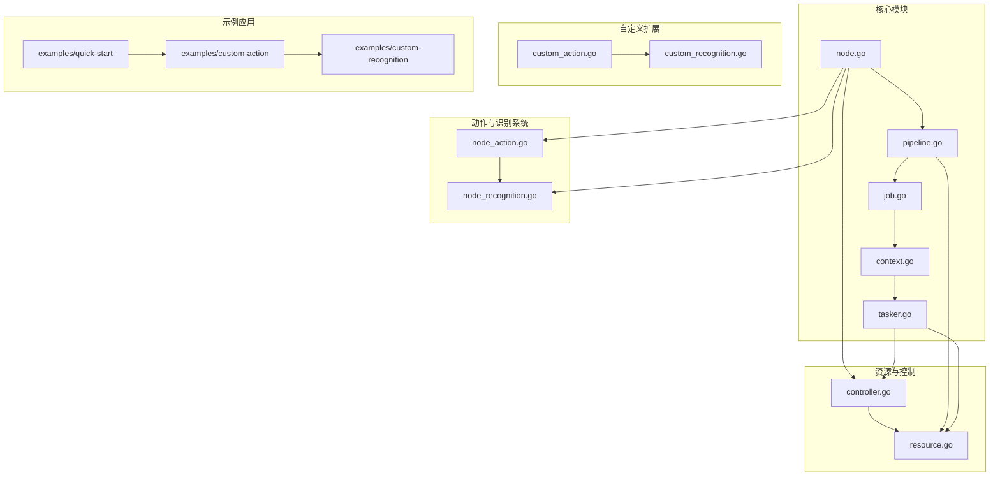
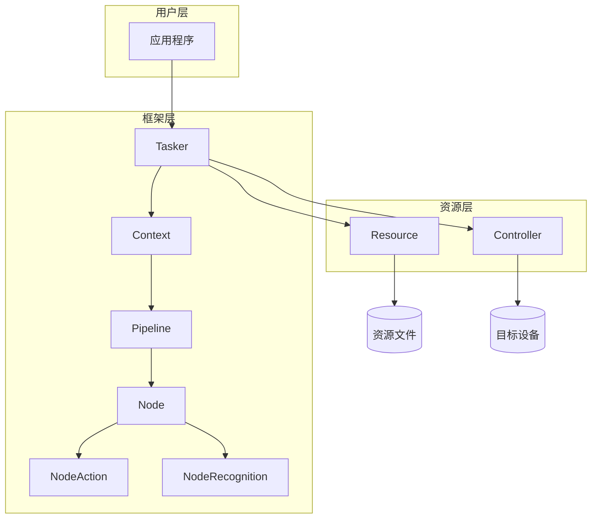
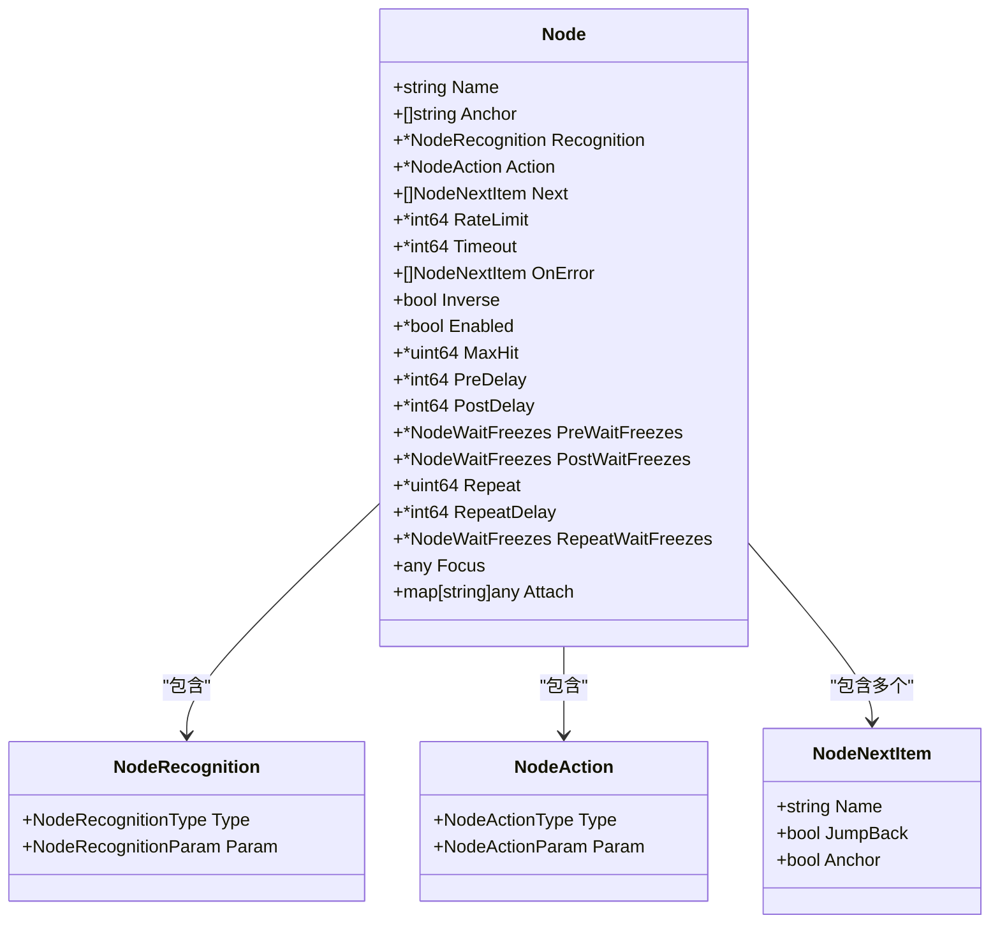
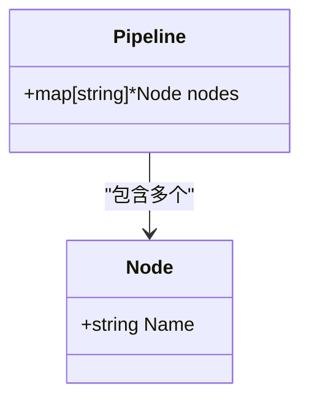
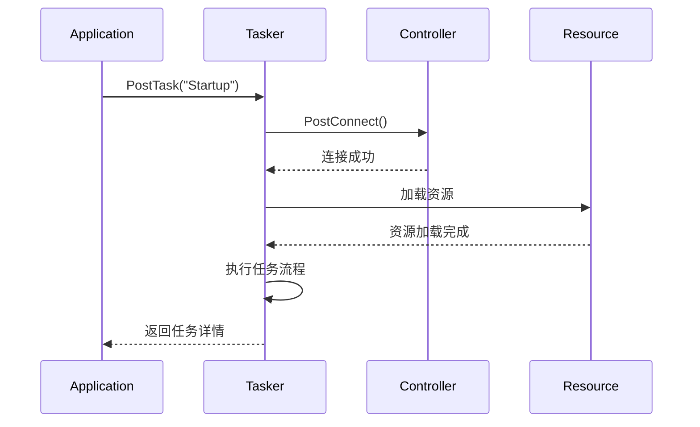
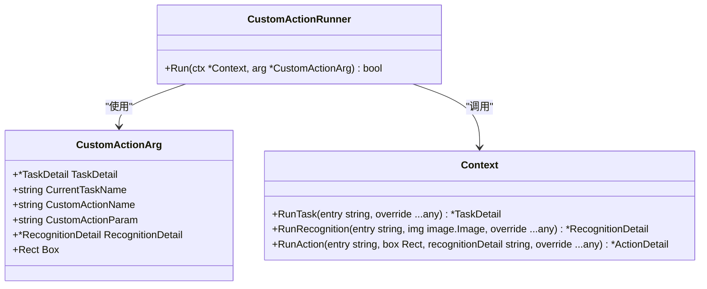
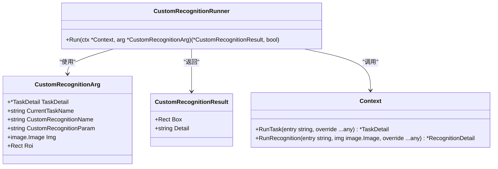
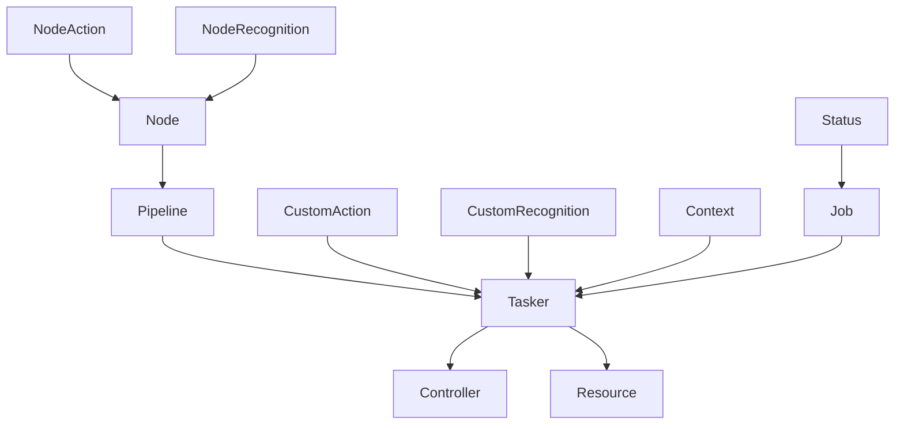

# 基于节点的流水线系统

<cite>
**本文档中引用的文件**   
- [node.go](file://node.go)
- [node_action.go](file://node_action.go)
- [node_recognition.go](file://node_recognition.go)
- [pipeline.go](file://pipeline.go)
- [job.go](file://job.go)
- [context.go](file://context.go)
- [tasker.go](file://tasker.go)
- [controller.go](file://controller.go)
- [resource.go](file://resource.go)
- [custom_action.go](file://custom_action.go)
- [custom_recognition.go](file://custom_recognition.go)
- [examples/quick-start/main.go](file://examples/quick-start/main.go)
- [examples/custom-action/main.go](file://examples/custom-action/main.go)
- [examples/custom-recognition/main.go](file://examples/custom-recognition/main.go)
- [examples/quick-start/resource/pipeline/pipeline.json](file://examples/quick-start/resource/pipeline/pipeline.json)
- [README.md](file://README.md)
</cite>

## 更新摘要
**变更内容**   
- 新增完整的节点动作系统详细说明，包括所有8种动作类型及其参数配置
- 新增完整的节点识别系统详细说明，包括所有10种识别算法及其参数配置
- 更新节点组件分析，重点介绍NodeAction和NodeRecognition的完整功能
- 添加动作和识别类型的详细参数说明和使用示例
- 完善架构图和组件关系图，反映新的动作识别系统

## 目录
1. [简介](#简介)
2. [项目结构](#项目结构)
3. [核心组件](#核心组件)
4. [架构概述](#架构概述)
5. [详细组件分析](#详细组件分析)
6. [依赖分析](#依赖分析)
7. [性能考虑](#性能考虑)
8. [故障排除指南](#故障排除指南)
9. [结论](#结论)

## 简介
该文档详细介绍了基于节点的流水线系统，这是一个用于自动化测试的跨平台框架，基于图像识别技术。系统采用声明式任务流与JSON配置相结合的方式，支持自定义识别算法和动作逻辑。通过Go语言绑定，实现了对MaaFramework的高效调用，无需CGO即可运行。

**更新** 新增了完整的节点动作系统和节点识别系统的详细说明，涵盖所有支持的动作类型和识别算法。

## 项目结构
该项目采用模块化设计，主要分为控制器、示例、内部组件、测试和核心功能模块。核心功能包括节点管理、流水线处理、任务调度、资源管理和自定义动作/识别等。示例代码展示了快速启动、自定义动作和识别的实现方式。

**Diagram sources**
- [node.go](file://node.go#L1-L549)
- [node_action.go](file://node_action.go#L1-L864)
- [node_recognition.go](file://node_recognition.go#L1-L861)
- [pipeline.go](file://pipeline.go#L1-L42)
- [job.go](file://job.go#L1-L96)
- [context.go](file://context.go#L1-L249)
- [tasker.go](file://tasker.go#L1-L590)
- [controller.go](file://controller.go#L1-L359)
- [resource.go](file://resource.go#L1-L425)
- [custom_action.go](file://custom_action.go#L1-L97)
- [custom_recognition.go](file://custom_recognition.go#L1-L108)

**Section sources**
- [node.go](file://node.go#L1-L549)
- [node_action.go](file://node_action.go#L1-L864)
- [node_recognition.go](file://node_recognition.go#L1-L861)
- [pipeline.go](file://pipeline.go#L1-L42)
- [job.go](file://job.go#L1-L96)
- [context.go](file://context.go#L1-L249)
- [tasker.go](file://tasker.go#L1-L590)
- [controller.go](file://controller.go#L1-L359)
- [resource.go](file://resource.go#L1-L425)
- [custom_action.go](file://custom_action.go#L1-L97)
- [custom_recognition.go](file://custom_recognition.go#L1-L108)

## 核心组件

系统的核心组件包括节点（Node）、节点动作（NodeAction）、节点识别（NodeRecognition）、流水线（Pipeline）、任务器（Tasker）、上下文（Context）、控制器（Controller）和资源（Resource）。这些组件协同工作，实现了自动化任务的定义、调度和执行。

**更新** 新增了节点动作和节点识别两个核心组件，它们是节点执行的基础。

**Section sources**
- [node.go](file://node.go#L1-L549)
- [node_action.go](file://node_action.go#L1-L864)
- [node_recognition.go](file://node_recognition.go#L1-L861)
- [pipeline.go](file://pipeline.go#L1-L42)
- [tasker.go](file://tasker.go#L1-L590)
- [context.go](file://context.go#L1-L249)

## 架构概述

该系统采用分层架构设计，从底层的控制器到上层的任务调度，形成了完整的自动化测试解决方案。任务器作为核心协调者，连接控制器和资源，管理任务的生命周期。节点动作和节点识别系统为每个节点提供了丰富的执行能力。

**Diagram sources**
- [tasker.go](file://tasker.go#L1-L590)
- [context.go](file://context.go#L1-L249)
- [pipeline.go](file://pipeline.go#L1-L42)
- [node.go](file://node.go#L1-L549)
- [node_action.go](file://node_action.go#L1-L864)
- [node_recognition.go](file://node_recognition.go#L1-L861)
- [resource.go](file://resource.go#L1-L425)
- [controller.go](file://controller.go#L1-L359)

## 详细组件分析

### 节点组件分析
节点是流水线中的基本执行单元，包含识别、动作、跳转逻辑等配置。每个节点可以定义识别方式、执行动作、成功后的下一个节点以及错误处理机制。

**Diagram sources**
- [node.go](file://node.go#L8-L51)
- [node_recognition.go](file://node_recognition.go#L9-L15)
- [node_action.go](file://node_action.go#L10-L16)

**更新** 节点现在包含NodeAction和NodeRecognition两个核心子组件，它们分别负责动作执行和识别逻辑。

### 节点动作系统分析
节点动作系统提供了8种不同类型的动作，每种动作都有其特定的参数配置和使用场景。

```mermaid
classDiagram
class NodeAction {
+NodeActionType Type
+NodeActionParam Param
}
class NodeActionType {
<<enumeration>>
DoNothing
Click
LongPress
Swipe
MultiSwipe
TouchDown
TouchMove
TouchUp
ClickKey
LongPressKey
KeyDown
KeyUp
InputText
StartApp
StopApp
StopTask
Scroll
Command
Shell
Custom
}
class NodeDoNothingParam {
}
class NodeClickParam {
+Target Target
+TargetOffset Rect
+int Contact
}
class NodeLongPressParam {
+Target Target
+TargetOffset Rect
+int64 Duration
+int Contact
}
class NodeSwipeParam {
+Target Begin
+TargetEnd []Target
+Rect BeginOffset
+[]Rect EndOffset
+[]int64 Duration
+[]int64 EndHold
+bool OnlyHover
+int Contact
}
class NodeMultiSwipeParam {
+[]NodeMultiSwipeItem Swipes
}
class NodeMultiSwipeItem {
+int64 Starting
+Target Begin
+TargetEnd []Target
+Rect BeginOffset
+[]Rect EndOffset
+[]int64 Duration
+[]int64 EndHold
+bool OnlyHover
+int Contact
}
class NodeTouchDownParam {
+Target Target
+TargetOffset Rect
+int Pressure
+int Contact
}
class NodeTouchMoveParam {
+Target Target
+TargetOffset Rect
+int Pressure
+int Contact
}
class NodeTouchUpParam {
+int Contact
}
class NodeClickKeyParam {
+[]int Key
}
class NodeLongPressKeyParam {
+[]int Key
+int64 Duration
}
class NodeKeyDownParam {
+int Key
}
class NodeKeyUpParam {
+int Key
}
class NodeInputTextParam {
+string InputText
}
class NodeStartAppParam {
+string Package
}
class NodeStopAppParam {
+string Package
}
class NodeStopTaskParam {
}
class NodeScrollParam {
+Target Target
+TargetOffset Rect
+int Dx
+int Dy
}
class NodeCommandParam {
+string Exec
+[]string Args
+bool Detach
}
class NodeShellParam {
+string Cmd
}
class NodeCustomActionParam {
+Target Target
+TargetOffset Rect
+string CustomAction
+any CustomActionParam
}
NodeAction --> NodeActionType : "包含"
NodeAction --> NodeActionParam : "包含"
NodeActionParam <|-- NodeDoNothingParam
NodeActionParam <|-- NodeClickParam
NodeActionParam <|-- NodeLongPressParam
NodeActionParam <|-- NodeSwipeParam
NodeActionParam <|-- NodeMultiSwipeParam
NodeActionParam <|-- NodeTouchDownParam
NodeActionParam <|-- NodeTouchMoveParam
NodeActionParam <|-- NodeTouchUpParam
NodeActionParam <|-- NodeClickKeyParam
NodeActionParam <|-- NodeLongPressKeyParam
NodeActionParam <|-- NodeKeyDownParam
NodeActionParam <|-- NodeKeyUpParam
NodeActionParam <|-- NodeInputTextParam
NodeActionParam <|-- NodeStartAppParam
NodeActionParam <|-- NodeStopAppParam
NodeActionParam <|-- NodeStopTaskParam
NodeActionParam <|-- NodeScrollParam
NodeActionParam <|-- NodeCommandParam
NodeActionParam <|-- NodeShellParam
NodeActionParam <|-- NodeCustomActionParam
```

**Diagram sources**
- [node_action.go](file://node_action.go#L88-L112)
- [node_action.go](file://node_action.go#L114-L864)

**更新** 完整新增了节点动作系统的详细分析，包括所有8种动作类型及其对应的参数配置。

### 节点识别系统分析
节点识别系统提供了10种不同类型的识别算法，每种算法都有其特定的应用场景和参数配置。

```mermaid
classDiagram
class NodeRecognition {
+NodeRecognitionType Type
+NodeRecognitionParam Param
}
class NodeRecognitionType {
<<enumeration>>
DirectHit
TemplateMatch
FeatureMatch
ColorMatch
OCR
NeuralNetworkClassify
NeuralNetworkDetect
And
Or
Custom
}
class NodeDirectHitParam {
}
class NodeTemplateMatchParam {
+Target ROI
+Rect ROIOffset
+[]string Template
+[]float64 Threshold
+NodeTemplateMatchOrderBy OrderBy
+int Index
+NodeTemplateMatchMethod Method
+bool GreenMask
}
class NodeTemplateMatchOrderBy {
<<enumeration>>
Horizontal
Vertical
Score
Random
}
class NodeTemplateMatchMethod {
<<enumeration>>
SQDIFF_NORMED_Inverted
CCORR_NORMED
CCOEFF_NORMED
}
class NodeFeatureMatchParam {
+Target ROI
+Rect ROIOffset
+[]string Template
+int Count
+NodeFeatureMatchOrderBy OrderBy
+int Index
+bool GreenMask
+NodeFeatureMatchDetector Detector
+float64 Ratio
}
class NodeFeatureMatchOrderBy {
<<enumeration>>
Horizontal
Vertical
Score
Area
Random
}
class NodeFeatureMatchDetector {
<<enumeration>>
SIFT
KAZE
AKAZE
BRISK
ORB
}
class NodeColorMatchParam {
+Target ROI
+Rect ROIOffset
+NodeColorMatchMethod Method
+[][]int Lower
+[][]int Upper
+int Count
+NodeColorMatchOrderBy OrderBy
+int Index
+bool Connected
}
class NodeColorMatchMethod {
<<enumeration>>
RGB
HSV
GRAY
}
class NodeColorMatchOrderBy {
<<enumeration>>
Horizontal
Vertical
Score
Area
Random
}
class NodeOCRParam {
+Target ROI
+Rect ROIOffset
+[]string Expected
+float64 Threshold
+[][2]string Replace
+NodeOCROrderBy OrderBy
+int Index
+bool OnlyRec
+string Model
}
class NodeOCROrderBy {
<<enumeration>>
Horizontal
Vertical
Area
Length
Random
}
class NodeNeuralNetworkClassifyParam {
+Target ROI
+Rect ROIOffset
+[]string Labels
+string Model
+[]int Expected
+NodeNeuralNetworkClassifyOrderBy OrderBy
+int Index
}
class NodeNeuralNetworkClassifyOrderBy {
<<enumeration>>
Horizontal
Vertical
Score
Random
}
class NodeNeuralNetworkDetectParam {
+Target ROI
+Rect ROIOffset
+[]string Labels
+string Model
+[]int Expected
+NodeNeuralNetworkDetectOrderBy OrderBy
+int Index
}
class NodeNeuralNetworkDetectOrderBy {
<<enumeration>>
Horizontal
Vertical
Score
Area
Random
}
class NodeAndRecognitionParam {
+[]NodeAndRecognitionItem AllOf
+int BoxIndex
}
class NodeAndRecognitionItem {
+string SubName
+*NodeRecognition Recognition
}
class NodeOrRecognitionParam {
+[]*NodeRecognition AnyOf
}
class NodeCustomRecognitionParam {
+Target ROI
+Rect ROIOffset
+string CustomRecognition
+any CustomRecognitionParam
}
NodeRecognition --> NodeRecognitionType : "包含"
NodeRecognition --> NodeRecognitionParam : "包含"
NodeRecognitionParam <|-- NodeDirectHitParam
NodeRecognitionParam <|-- NodeTemplateMatchParam
NodeRecognitionParam <|-- NodeFeatureMatchParam
NodeRecognitionParam <|-- NodeColorMatchParam
NodeRecognitionParam <|-- NodeOCRParam
NodeRecognitionParam <|-- NodeNeuralNetworkClassifyParam
NodeRecognitionParam <|-- NodeNeuralNetworkDetectParam
NodeRecognitionParam <|-- NodeAndRecognitionParam
NodeRecognitionParam <|-- NodeOrRecognitionParam
NodeRecognitionParam <|-- NodeCustomRecognitionParam
```

**Diagram sources**
- [node_recognition.go](file://node_recognition.go#L67-L81)
- [node_recognition.go](file://node_recognition.go#L83-L861)

**更新** 完整新增了节点识别系统的详细分析，包括所有10种识别算法及其对应的参数配置。

### 流水线组件分析
流水线是节点的集合，定义了任务的完整流程。通过JSON序列化支持配置文件的加载和保存。

**Diagram sources**
- [pipeline.go](file://pipeline.go#L21-L42)

### 任务器组件分析
任务器负责任务的调度和执行，提供异步作业管理、状态跟踪和事件回调等功能。

**Diagram sources**
- [tasker.go](file://tasker.go#L13-L164)

### 自定义动作分析
支持用户注册自定义动作，扩展框架功能。通过接口实现灵活的业务逻辑定制。

**Diagram sources**
- [custom_action.go](file://custom_action.go#L46-L53)
- [context.go](file://context.go#L44-L131)

### 自定义识别分析
支持用户注册自定义识别算法，提供图像处理和结果返回的接口。

**Diagram sources**
- [custom_recognition.go](file://custom_recognition.go#L52-L54)
- [context.go](file://context.go#L44-L87)

## 依赖分析

系统各组件之间存在明确的依赖关系，形成了稳定的调用链。任务器依赖于控制器和资源，节点和流水线构成任务的基本单元，节点动作和节点识别扩展了节点的功能，自定义动作和识别扩展了框架的功能。

**Diagram sources**
- [node.go](file://node.go#L1-L549)
- [node_action.go](file://node_action.go#L1-L864)
- [node_recognition.go](file://node_recognition.go#L1-L861)
- [pipeline.go](file://pipeline.go#L1-L42)
- [tasker.go](file://tasker.go#L1-L590)
- [controller.go](file://controller.go#L1-L359)
- [resource.go](file://resource.go#L1-L425)
- [custom_action.go](file://custom_action.go#L1-L97)
- [custom_recognition.go](file://custom_recognition.go#L1-L108)
- [context.go](file://context.go#L1-L249)
- [job.go](file://job.go#L1-L96)

**Section sources**
- [node.go](file://node.go#L1-L549)
- [node_action.go](file://node_action.go#L1-L864)
- [node_recognition.go](file://node_recognition.go#L1-L861)
- [pipeline.go](file://pipeline.go#L1-L42)
- [tasker.go](file://tasker.go#L1-L590)
- [controller.go](file://controller.go#L1-L359)
- [resource.go](file://resource.go#L1-L425)
- [custom_action.go](file://custom_action.go#L1-L97)
- [custom_recognition.go](file://custom_recognition.go#L1-L108)
- [context.go](file://context.go#L1-L249)
- [job.go](file://job.go#L1-L96)

## 性能考虑
系统在设计时考虑了性能优化，通过异步任务处理、资源缓存和高效的图像处理算法来保证运行效率。任务器的异步作业机制允许并发执行多个任务，提高整体处理速度。

**更新** 新的动作和识别系统在设计时也考虑了性能优化，提供了多种算法选择以适应不同的性能需求。

## 故障排除指南
当遇到问题时，可以通过以下步骤进行排查：
1. 检查MaaFramework动态库是否正确配置
2. 验证控制器连接状态
3. 确认资源文件路径正确
4. 检查任务配置的JSON格式
5. 查看系统日志获取详细错误信息

**Section sources**
- [controller.go](file://controller.go#L283-L286)
- [resource.go](file://resource.go#L306-L309)
- [tasker.go](file://tasker.go#L60-L63)

## 结论
基于节点的流水线系统提供了一个强大而灵活的自动化测试框架。通过模块化设计和清晰的接口定义，使得系统易于扩展和维护。支持自定义动作和识别算法，满足了复杂场景下的自动化需求。

**更新** 新增的完整节点动作系统和节点识别系统进一步增强了框架的功能性，为用户提供了更丰富的自动化操作能力和识别算法选择，使得系统能够适应更多样化的应用场景。