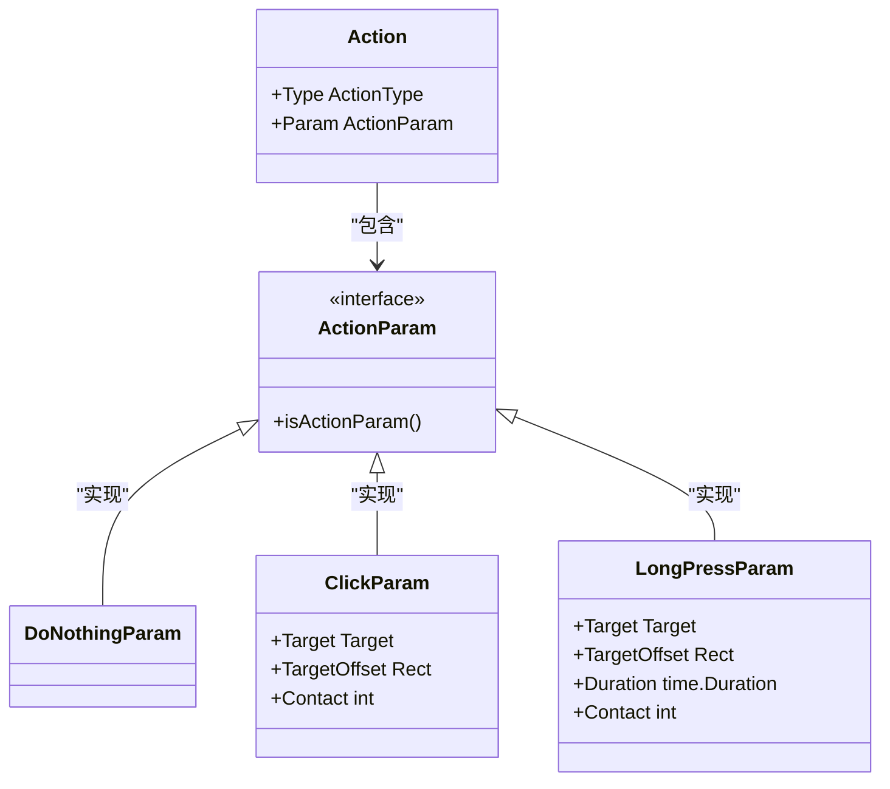
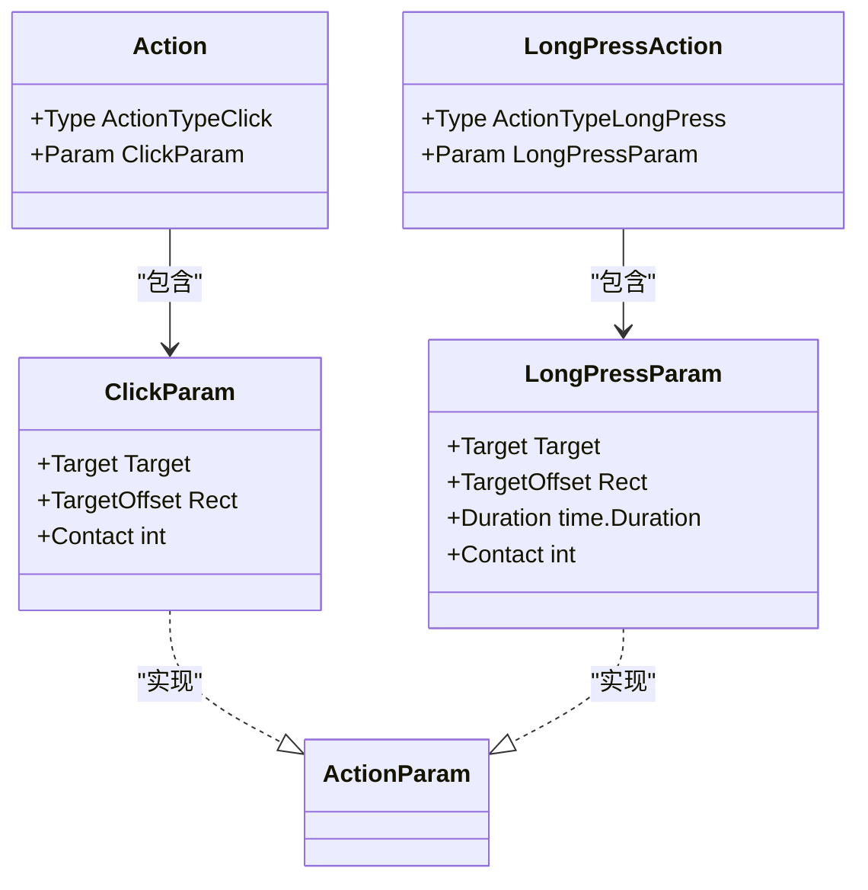
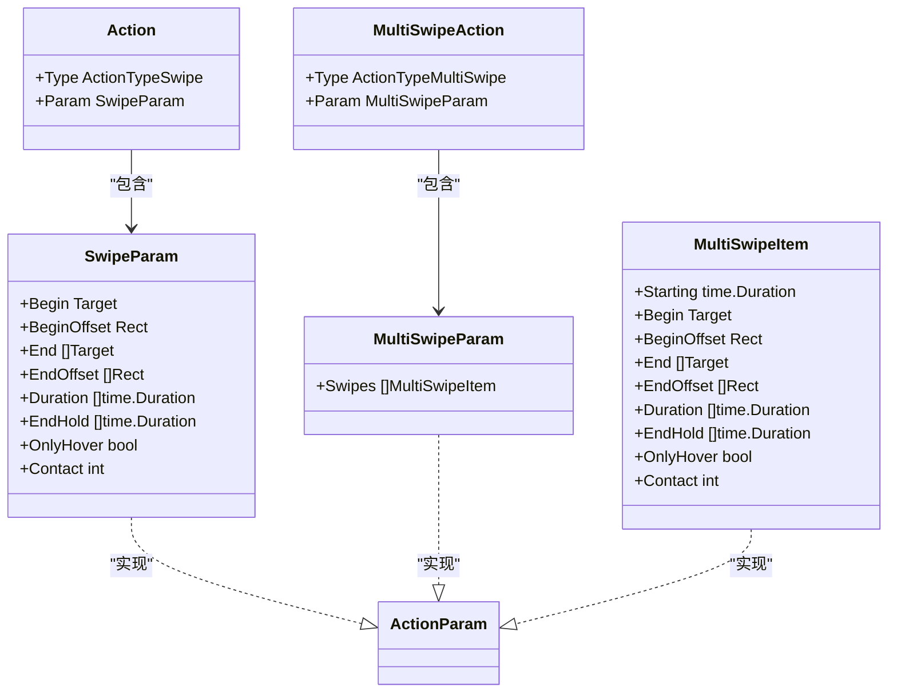
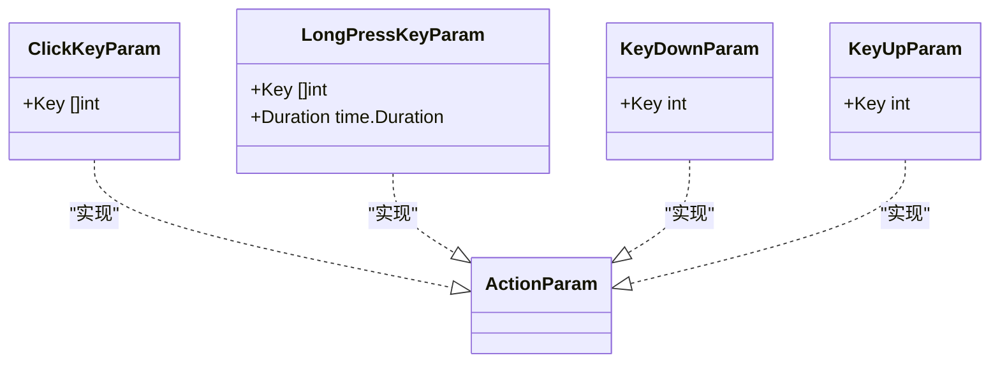
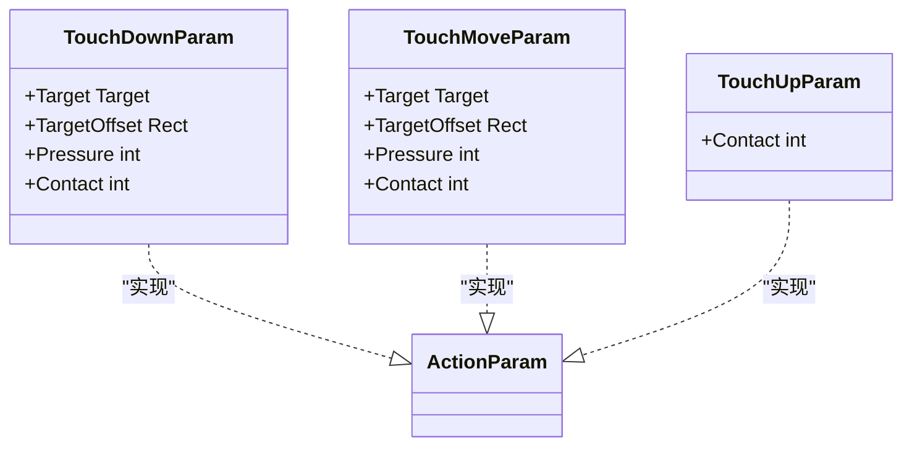
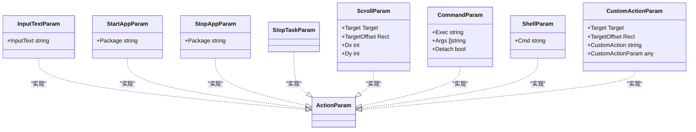
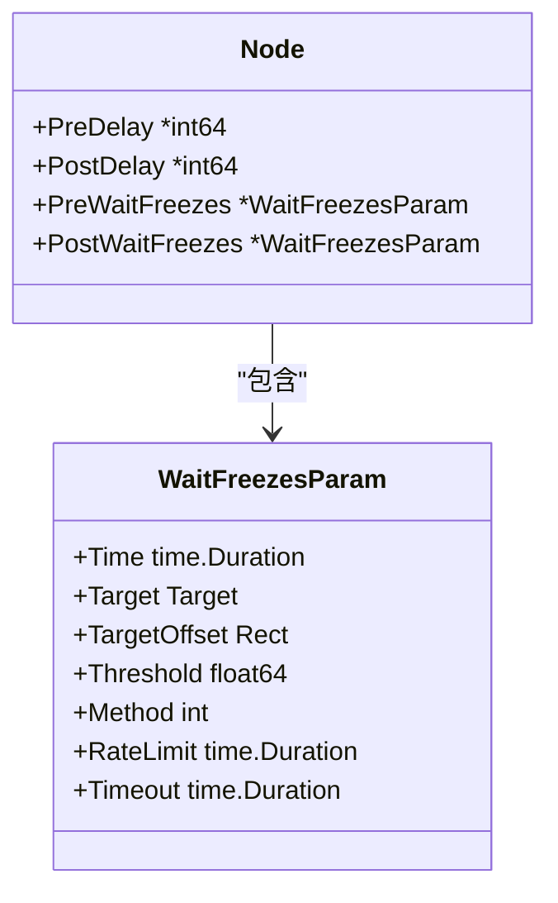
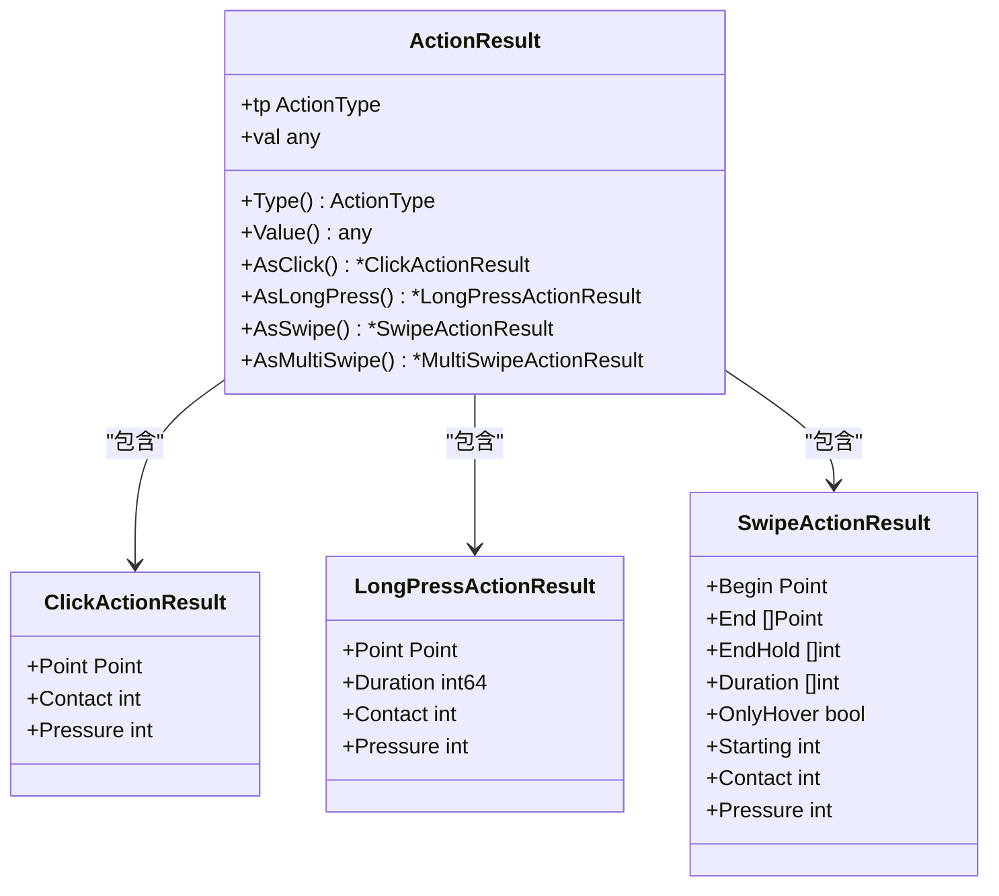

# 动作配置详解

<cite>
**本文档引用文件**   
- [action.go](file://action.go)
- [node.go](file://node.go)
- [wait_freezes.go](file://wait_freezes.go)
- [action_result.go](file://action_result.go)
- [context_test.go](file://context_test.go)
</cite>

## 更新摘要
**变更内容**   
- 新的动作系统已重构，引入了全新的Action/ActionParam架构
- 完全移除了旧的NodeAction/NodeActionParam模式，采用简洁的直接参数构造方式
- 所有动作类型现在通过专用的参数结构体实现，不再使用函数式选项模式
- 新增了完整的动作结果解析和验证机制
- 更新了所有动作类型的构造函数和参数结构

## 目录
1. [Action结构体与ActionParam接口](#action结构体与actionparam接口)
2. [动作类型与专用参数结构](#动作类型与专用参数结构)
3. [点击类动作实现机制](#点击类动作实现机制)
4. [滑动类动作实现机制](#滑动类动作实现机制)
5. [按键类动作实现机制](#按键类动作实现机制)
6. [触摸类动作实现机制](#触摸类动作实现机制)
7. [其他动作类型](#其他动作类型)
8. [控制参数机制](#控制参数机制)
9. [动作结果解析](#动作结果解析)
10. [典型使用场景示例](#典型使用场景示例)

## Action结构体与ActionParam接口

新的动作系统采用简洁的Action结构体设计，通过ActionParam接口统一管理所有动作参数。Action结构体包含两个核心字段：Type字段指定动作类型，Param字段携带对应类型的参数数据。

ActionParam接口是一个空接口，通过内部方法实现类型标识，确保所有动作参数都实现了正确的接口。系统在反序列化时根据动作类型自动创建对应的参数实例，实现了类型安全的参数配置。

**图表来源**   
- [action.go](file://action.go#L10-L16)
- [action.go](file://action.go#L112-L120)
- [action.go](file://action.go#L130-L138)
- [action.go](file://action.go#L148-L159)

**章节来源**   
- [action.go](file://action.go#L10-L16)
- [action.go](file://action.go#L112-L120)

## 动作类型与专用参数结构

系统支持21种不同的动作类型，每种类型都有对应的专用参数结构体。所有参数结构体都实现了ActionParam接口，确保类型安全和统一的参数管理。

动作类型枚举包括：DoNothing、Click、LongPress、Swipe、MultiSwipe、TouchDown、TouchMove、TouchUp、ClickKey、LongPressKey、KeyDown、KeyUp、InputText、StartApp、StopApp、StopTask、Scroll、Command、Shell、Custom等。

每种参数结构体都包含详细的字段注释，说明各个参数的作用和默认值。系统还提供了专门的构造函数（如ActClick、ActLongPress等）来简化动作创建过程，采用直接参数构造方式替代了旧的函数式选项模式。

**章节来源**   
- [action.go](file://action.go#L86-L110)
- [action.go](file://action.go#L112-L120)

## 点击类动作实现机制

点击类动作包括普通点击(Click)和长按(LongPress)两种基本操作。Click动作通过ClickParam结构体配置点击位置和触控点标识，支持指定目标区域和偏移量。LongPress动作在Click的基础上增加了持续时间参数，用于模拟长按操作。

所有参数结构体都支持JSON序列化和反序列化，Duration字段通过自定义的MarshalJSON和UnmarshalJSON方法实现毫秒级精度的时间表示。系统提供了专门的构造函数来简化动作创建，采用直接参数传递的方式，避免了复杂的参数配置。

**图表来源**   
- [action.go](file://action.go#L130-L138)
- [action.go](file://action.go#L148-L159)
- [action.go](file://action.go#L185-L189)

**章节来源**   
- [action.go](file://action.go#L130-L138)
- [action.go](file://action.go#L148-L159)
- [action.go](file://action.go#L185-L189)

## 滑动类动作实现机制

滑动类动作提供了从简单滑动到复杂多指手势的完整支持。Swipe动作通过SwipeParam定义滑动的起点、终点、持续时间和结束保持时间等参数，支持配置多个终点位置实现复杂路径。MultiSwipe动作则支持多指协同操作，通过MultiSwipeParam和MultiSwipeItem定义每个手指的独立滑动参数。

系统采用深度复制策略确保参数不共享内存，避免了并发访问问题。Starting字段允许精确控制多指操作中各手指的启动时机，实现复杂的协同手势。所有时间相关的字段都支持毫秒级精度的JSON序列化。

**图表来源**   
- [action.go](file://action.go#L191-L211)
- [action.go](file://action.go#L308-L312)
- [action.go](file://action.go#L250-L273)

**章节来源**   
- [action.go](file://action.go#L191-L211)
- [action.go](file://action.go#L308-L312)
- [action.go](file://action.go#L250-L273)

## 按键类动作实现机制

按键类动作系统提供了完整的键盘输入支持，包括单次点击(ClickKey)、长按(LongPressKey)、按下(KeyDown)、释放(KeyUp)等操作。ClickKey和LongPressKey适用于短时按键操作，而KeyDown/KeyUp组合则支持持续按下的场景，如游戏中的方向键控制。

所有按键参数结构体都支持JSON序列化，Duration字段通过自定义方法实现毫秒级精度。系统提供了专门的构造函数来简化按键操作的创建，支持传入整数数组实现组合键操作。

**图表来源**   
- [action.go](file://action.go#L399-L403)
- [action.go](file://action.go#L415-L422)
- [action.go](file://action.go#L455-L459)
- [action.go](file://action.go#L471-L475)

**章节来源**   
- [action.go](file://action.go#L399-L403)
- [action.go](file://action.go#L415-L422)
- [action.go](file://action.go#L455-L459)
- [action.go](file://action.go#L471-L475)

## 触摸类动作实现机制

触摸类动作提供了底层的触控操作支持，包括触摸按下(TouchDown)、触摸移动(TouchMove)、触摸抬起(TouchUp)三种基本操作。这些动作直接映射到底层控制器的触控接口，支持压力控制和多点触控。

TouchDownParam支持压力参数配置，Pressure字段范围取决于具体的控制器实现。Contact参数支持多指触控，ADB控制器使用手指索引，Win32控制器使用鼠标按钮标识。TouchUp动作相对简单，主要通过Contact参数指定要抬起的手指或按钮。

**图表来源**   
- [action.go](file://action.go#L346-L356)
- [action.go](file://action.go#L366-L376)
- [action.go](file://action.go#L386-L390)

**章节来源**   
- [action.go](file://action.go#L346-L356)
- [action.go](file://action.go#L366-L376)
- [action.go](file://action.go#L386-L390)

## 其他动作类型

系统还提供了多种实用的动作类型：InputText用于文本输入，StartApp/StopApp用于应用管理，StopTask用于终止任务流程，Scroll用于滚轮操作，Command用于执行外部命令，Shell用于执行Shell命令，Custom用于扩展自定义操作。

Command动作支持运行时占位符替换，可以动态传递任务上下文信息到外部程序。Shell动作仅适用于ADB控制器，可以获取命令输出结果。Custom动作通过注册机制支持用户自定义动作处理器。

**图表来源**   
- [action.go](file://action.go#L487-L491)
- [action.go](file://action.go#L503-L507)
- [action.go](file://action.go#L519-L523)
- [action.go](file://action.go#L535-L537)
- [action.go](file://action.go#L549-L559)
- [action.go](file://action.go#L569-L580)
- [action.go](file://action.go#L591-L594)
- [action.go](file://action.go#L605-L615)

**章节来源**   
- [action.go](file://action.go#L487-L491)
- [action.go](file://action.go#L503-L507)
- [action.go](file://action.go#L519-L523)
- [action.go](file://action.go#L535-L537)
- [action.go](file://action.go#L549-L559)
- [action.go](file://action.go#L569-L580)
- [action.go](file://action.go#L591-L594)
- [action.go](file://action.go#L605-L615)

## 控制参数机制

动作执行的控制参数包括PreDelay/PostDelay和PreWaitFreezes/PostWaitFreezes。PreDelay和PostDelay分别设置动作执行前后的固定延迟时间，用于控制操作节奏。WaitFreezes机制则更加智能，通过监控画面变化来判断操作时机。

WaitFreezesParam结构体配置了画面稳定等待的各项参数，包括稳定持续时间、监控区域、变化检测阈值等。系统通过模板匹配算法检测画面变化，当连续指定时间无显著变化时认为画面已稳定。这种机制特别适用于等待动画结束或加载完成的场景。

**图表来源**   
- [node.go](file://node.go#L34-L47)
- [wait_freezes.go](file://wait_freezes.go#L8-L28)

**章节来源**   
- [node.go](file://node.go#L34-L47)
- [wait_freezes.go](file://wait_freezes.go#L8-L28)

## 动作结果解析

系统提供了完整的动作结果解析机制，通过ActionResult结构体包装解析后的动作详情。每个动作类型都有对应的结果结构体，如ClickActionResult、LongPressActionResult、SwipeActionResult等。

ActionResult提供了类型安全的结果访问方法，如AsClick()、AsLongPress()、AsSwipe()等，确保只有匹配的动作类型才能获取对应的结果。系统还支持JSON序列化和反序列化，便于结果的持久化和传输。

**图表来源**   
- [action_result.go](file://action_result.go#L48-L62)
- [action_result.go](file://action_result.go#L152-L157)
- [action_result.go](file://action_result.go#L159-L165)
- [action_result.go](file://action_result.go#L167-L179)

**章节来源**   
- [action_result.go](file://action_result.go#L48-L62)
- [action_result.go](file://action_result.go#L152-L157)
- [action_result.go](file://action_result.go#L159-L165)
- [action_result.go](file://action_result.go#L167-L179)

## 典型使用场景示例

在实际应用中，新动作系统提供了更简洁的API使用体验。例如，在游戏自动化中，可以使用ActClick创建点击动作，使用ActLongPress创建长按动作，使用ActSwipe创建滑动动作。所有构造函数都支持直接参数传递，无需复杂的函数式选项配置。

对于需要精确时序控制的场景，可以直接设置WaitFreezesParam的各项参数，利用模板匹配算法确保操作时机准确。自定义动作类型允许开发者集成特定业务逻辑，通过CustomActionParam传递任意参数。

**章节来源**   
- [action.go](file://action.go#L122-L128)
- [action.go](file://action.go#L185-L189)
- [action.go](file://action.go#L240-L248)
- [action.go](file://action.go#L335-L344)
- [action.go](file://action.go#L619-L626)
- [context_test.go](file://context_test.go#L668-L707)
- [context_test.go](file://context_test.go#L744-L780)
- [context_test.go](file://context_test.go#L1086-L1110)